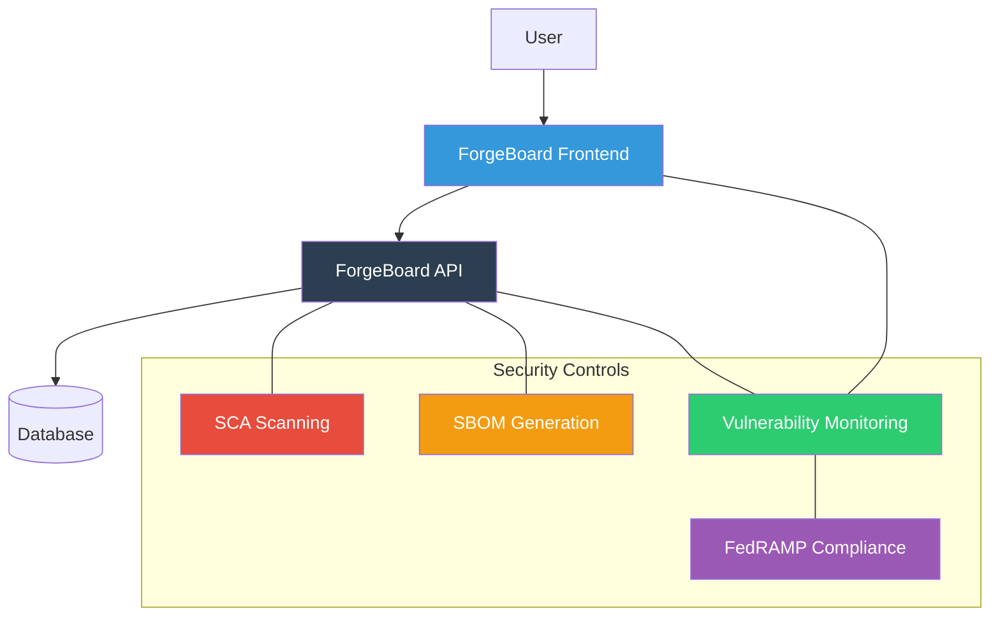

# 🛡️ ForgeBoard Security Policy

## 📋 Supported Versions

Currently supported versions of ForgeBoard applications with security updates:

| Application             | Latest Version | Supported |
| ----------------------- | -------------- | --------- |
| forge-board (workspace) | 0.0.1          | ✅        |
| forgeboard-frontend     | 0.0.1          | ✅        |
| forgeboard-api          | 0.0.1          | ✅        |
| shared-api-interfaces   | 0.0.1          | ✅        |

## 🔄 OSCAL Compliance

Our OSCAL implementation is compatible with:

| Component         | Version | Status |
| ----------------- | ------- | ------ |
| OSCAL Core        | 1.0.4   | ✅     |
| TrueNorth Profile | 1.0.0   | ✅     |

## 🔍 Security Architecture



## 🚨 Reporting a Vulnerability

We take the security of ForgeBoard seriously. If you believe you've found a security vulnerability, please follow these steps:

1. **Do not disclose the vulnerability publicly**
2. **Email us at** [security@truenorth.us](mailto:security@truenorth.us) with:
   - A description of the vulnerability
   - Steps to reproduce
   - Potential impact
   - If known, suggestions for mitigating or fixing

## ⏱️ Response Timeline

```mermaid
gantt
    title Vulnerability Response Timeline
    dateFormat  YYYY-MM-DD
    section Response
    Initial Acknowledgement    :a1, 0000-00-00, 3d
    Detailed Assessment       :a2, after a1, 7d
    Fix Development           :a3, after a2, 14d
    Validation & Testing      :a4, after a3, 7d
    Release                   :milestone, after a4, 0d
```

## 🛠️ Security Features

ForgeBoard includes several built-in security features:

- 🔍 Software Composition Analysis (SCA) scanning
- 📋 SBOM (Software Bill of Materials) generation
- 🏢 FedRAMP compliance capabilities
- 🔄 Continuous vulnerability monitoring

For more information about the security features, please refer to our [Security Dashboard documentation](../forgeboard-frontend/src/app/pages/security-dashboard/security.md).

## 🔄 Security Development Lifecycle

Our team follows secure coding practices and includes security considerations throughout the development lifecycle, including:

- Regular dependency updates
- Security code reviews
- Automated scanning in CI/CD pipeline
- Regular penetration testing

## 📞 Additional Resources

For more information about ForgeBoard security, please contact our team or refer to the product documentation.
