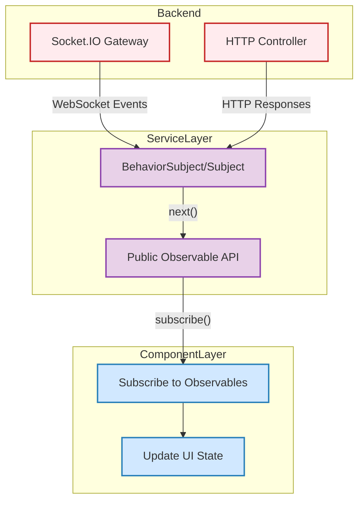
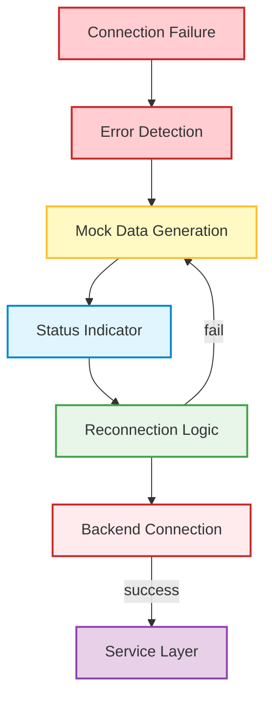
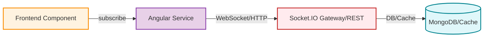

# ForgeBoard Coding Standards

This document defines the core architectural, coding, and workflow standards for the ForgeBoard project. All code, whether backend or frontend, should follow these principles for maintainability, clarity, and real-time robustness.

---

## Angular Architecture

### Smart & Presentational Components

```mermaid
flowchart LR
  Smart[Smart Component]:::smart -->|Inputs/Outputs| Presentational[Presentational Component]:::present
  Smart -->|Service Injection| Service[Service]:::service
  Presentational -->|@Input/@Output| Smart
  classDef smart fill:#E3F2FD,stroke:#1976D2,stroke-width:2px;
  classDef present fill:#FFF3E0,stroke:#FB8C00,stroke-width:2px;
  classDef service fill:#E8F5E9,stroke:#43A047,stroke-width:2px;
```

- **Smart components**: Handle data, inject services, manage state.
- **Presentational components**: Render UI, receive data via `@Input`, emit events via `@Output`.

### Service Design & State Management

```mermaid
flowchart TD
  Service[Service]:::service -->|BehaviorSubject/Subject| State[State Stream]:::state
  State -->|asObservable()| Component[Component]:::component
  Component -->|subscribe| State
  classDef service fill:#E8F5E9,stroke:#43A047,stroke-width:2px;
  classDef state fill:#E1F5FE,stroke:#0288D1,stroke-width:2px;
  classDef component fill:#FFF3E0,stroke:#FB8C00,stroke-width:2px;
```

- Use RxJS `BehaviorSubject` or `Subject` for service state.
- Expose state as `Observable` for components to subscribe.

---

## WebSockets & Real-Time Patterns

### Data Flow: Backend to UI



### Mock Data & Reconnection Strategy



---

## RxJS Guidelines

- Always clean up subscriptions (`ngOnDestroy`, `takeUntil`).
- Use `catchError`, `retry`, and `finalize` for robust error handling.
- Prefer `BehaviorSubject` for state with a current value, `Subject` for event streams.

---

## CSS/SCSS Standards

- **BEM-inspired naming** for all classes.
- **Color variables** for consistency and theme support.
- **Mobile-first** responsive design.

---

## Testing Guidelines

- **Component tests**: Use Angular TestBed, mock services, and DOM queries.
- **Service tests**: Use HttpClientTestingModule, test Observables and error handling.
- **E2E tests**: Use Playwright or Cypress for real user flows.

---

## Documentation & Git Workflow

- All public classes, interfaces, and services must have JSDoc comments.
- Use clear, descriptive commit messages:
  - `feat(scope): Add new feature`
  - `fix(scope): Fix bug`
  - `docs(scope): Update documentation`
- Branch naming: `feature/`, `bugfix/`, `chore/` prefixes.

---

## Summary Diagram: End-to-End Flow



---

For more details, see the API, Authentication, and Frontend-API-Architecture docs.
