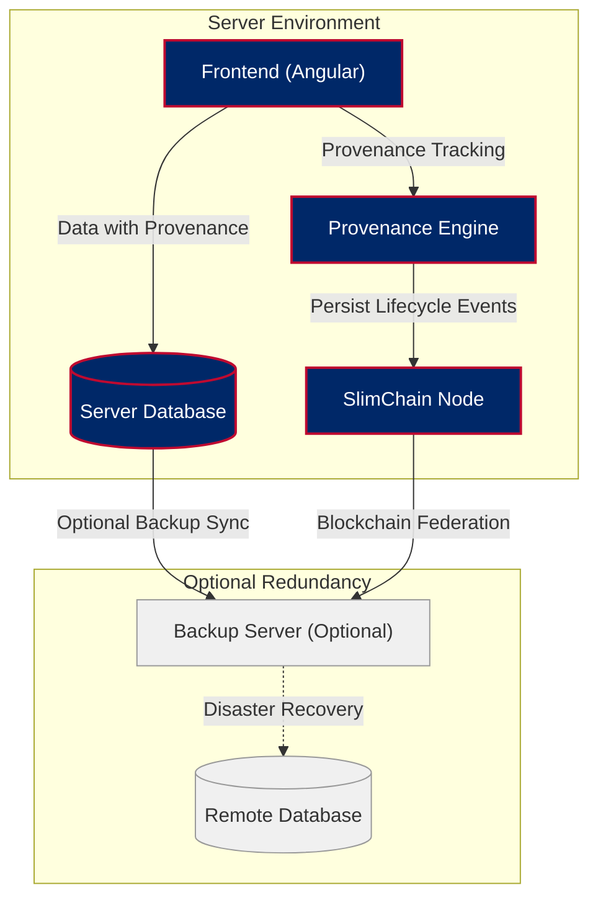

# ForgeBoard NX
*Last Updated: May 15, 2025*

A sovereign monitoring and management dashboard with comprehensive data provenance tracking, secure in-house data management, and blockchain persistence.

## Documentation

All project documentation is stored in the **assets/documentation** folder. This documentation is dynamically loaded and displayed in the application's Documentation page.

To add new documentation:
1. Add markdown (.md) files to the `forgeboard-frontend/src/assets/documentation` directory
2. Organize files in subdirectories to create documentation categories
3. The documentation will be automatically loaded and displayed in the Documentation page

For API-specific documentation, please see the Swagger UI at `/api` when the server is running.

## Features

- **Data Provenance Tracking**: Complete lifecycle tracking of all data from inception through disposal
- **Secure In-House Architecture**: Your server is the source of authority for all data
- **Blockchain Persistence**: Immutable, tamper-evident record of all changes
- **Real-Time Dashboards**: Live metrics, logs, and diagnostics
- **FedRAMP 20X Ready**: Built to exceed the latest federal security requirements

## System Architecture

ForgeBoard NX's architecture is built around maintaining complete data provenance:

