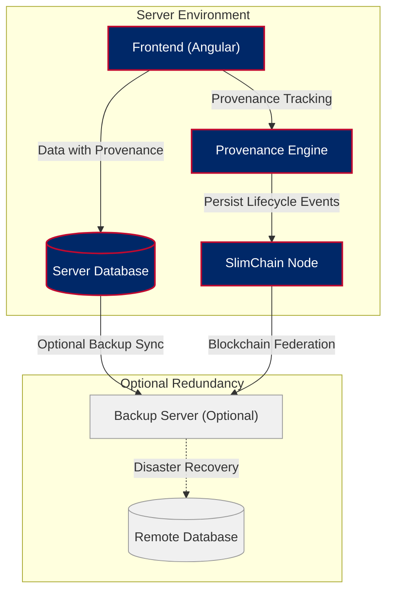

#  ForgeBoard

*A product of True North Insights, a division of True North*

*Last Updated: May 15, 2025*

A sovereign monitoring and management dashboard with comprehensive data provenance tracking, secure in-house data management, and blockchain persistence.

## Documentation

Welcome to the ForgeBoard documentation! This repository contains comprehensive guides, architecture references, API documentation, and project resources for the ForgeBoard platform.

### 📚 Documentation Index

- [API Documentation](./forgeboard-frontend/src/assets/documentation/API-DOCUMENTATION.md)
- [Frontend-API Architecture](./forgeboard-frontend/src/assets/documentation/FRONTEND-API-ARCHITECTURE.md)
- [Layout System](./forgeboard-frontend/src/assets/documentation/LAYOUT.md)
- [Visual Standards](./forgeboard-frontend/src/assets/documentation/VISUAL-STANDARDS.md)
- [Authentication](./forgeboard-frontend/src/assets/documentation/AUTHENTICATION.md)
- [Coding Standards](./forgeboard-frontend/src/assets/documentation/CODING-STANDARDS.md)
- [Test Patterns](./forgeboard-frontend/src/assets/documentation/TEST-PATTERNS.md)
- [Socket Client Usage](./forgeboard-frontend/src/assets/documentation/socket-client-usage.md)
- [Gateways](./forgeboard-frontend/src/assets/documentation/gateways.md)

### 📂 Documentation Directory

All documentation files are located in [`forgeboard-frontend/src/assets/documentation/`](./forgeboard-frontend/src/assets/documentation/).

You will find:

- **Architecture Guides**: System design, frontend-backend integration, and layout.
- **API References**: REST endpoints, WebSocket namespaces, and usage examples.
- **Security & Compliance**: Authentication, security dashboard, and FedRAMP documentation.
- **Development Standards**: Coding standards, test patterns, and visual guidelines.
- **Socket & Gateway Docs**: Guides for real-time communication and gateway architecture.
- **Business & Marketing**: Small business opportunities, benefits, and marketing materials.

### 📝 How to Use

- Browse the [documentation folder](./forgeboard-frontend/src/assets/documentation/) for all available guides.
- Each Markdown file covers a specific topic or feature.
- For a template to create new documentation, see [`_TEMPLATE.md`](./forgeboard-frontend/src/assets/documentation/_TEMPLATE.md).

### 🛠️ Contributing

To add or update documentation:

1. Copy the header and footer from [`_TEMPLATE.md`](./forgeboard-frontend/src/assets/documentation/_TEMPLATE.md).
2. Place new Markdown files in the documentation directory.
3. Link to new files from this README or the documentation index as appropriate.

---

For more information about ForgeBoard, visit the [project homepage](https://www.truenorthinsights.com) or contact [support@truenorthinsights.com](mailto:support@truenorthinsights.com).

## Features

- **Data Provenance Tracking**: Complete lifecycle tracking of all data from inception through disposal
- **Secure In-House Architecture**: Your server is the source of authority for all data
- **Flexible Database Configuration**: MongoDB with in-memory option for development and persistent storage for production
- **Blockchain Persistence**: Immutable, tamper-evident record of all changes
- **Real-Time Dashboards**: Live metrics, logs, and diagnostics
- **FedRAMP 20X Ready**: Built to exceed the latest federal security requirements

## System Architecture

ForgeBoard's architecture is built around maintaining complete data provenance:

```mermaid
flowchart TD
    subgraph "Server Environment"
        Frontend["Frontend (Angular)"]
        ServerDB[(Server Database)]
        LiteChain["SlimChain Node"]
        Provenance["Provenance Engine"]
    end
    
    subgraph "Optional Redundancy"
        BackupServer["Backup Server (Optional)"]
        RemoteDB[(Remote Database)]
    end
    
    Frontend -->|"Data with Provenance"| ServerDB
    Frontend -->|"Provenance Tracking"| Provenance
    Provenance -->|"Persist Lifecycle Events"| LiteChain
    ServerDB -->|"Optional Backup Sync"| BackupServer
    LiteChain -->|"Blockchain Federation"| BackupServer
    BackupServer -.->|"Disaster Recovery"| RemoteDB
    
    class Frontend,ServerDB,LiteChain,Provenance server;
    class BackupServer,RemoteDB backup;
    
    classDef server fill:#002868,color:#FFFFFF,stroke:#BF0A30,stroke-width:2px;
    classDef backup fill:#F0F0F0,color:#333333,stroke:#999999,stroke-width:1px;
```

## Getting Started

### Database Setup

ForgeBoard supports two database options:

1. **In-Memory MongoDB** (for development):
   - Set `USE_IN_MEMORY_MONGO=true` in your `.env` file
   - No MongoDB installation required
   - MongoDB URI is automatically generated and logged at startup
   - Data is reset when the application restarts

2. **Persistent MongoDB** (for production):
   - Set `MONGODB_URI=mongodb://localhost:27017/forgeboard` in your `.env` file
   - Requires MongoDB installation
   - Data persists across application restarts

---

  

    

      <strong>ForgeBoard</strong> 
      A product of True North Insights 
      &copy; 2025 True North. All rights reserved.
    

    

      <strong>Contact:</strong> 
      <a href="mailto:support@truenorthinsights.com">support@truenorthinsights.com</a> 
      <a href="https://www.truenorthinsights.com">www.truenorthinsights.com</a>
    

  

For detailed configuration information, see [DATABASE.md](forgeboard-frontend/src/assets/documentation/DATABASE.md).
