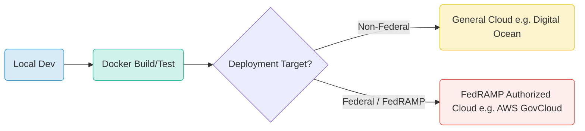

# 🇺🇸 ForgeBoard NX: Navigating FedRAMP & Deployment Environments
*Last Updated: 12MAY25 Jeffrey*

  

    <strong>Focus:</strong> Compliance & Cloud Strategy ☁️
  

  

    <strong>Standard:</strong> FedRAMP (NIST SP 800-53) 🛡️
  

  

    <strong>Goal:</strong> FedRAMP "Ready" Architecture 🎯
  

  

    <strong>Status:</strong> Informational 📖
  

ForgeBoard NX is committed to the highest standards of quality, security, and documentation, as exemplified by our <a href="../forgeboard-frontend/src/assets/documentation/VISUAL-STANDARDS.md">Visual Standards & Documentation Guide</a>. This commitment is a powerful asset when considering rigorous compliance frameworks like FedRAMP. This document clarifies how these internal standards support FedRAMP aspirations and how various deployment environments fit into this strategy.

## 1. The Power of Rigorous Internal Standards

Adherence to comprehensive internal standards, such as those for documentation, visual consistency, and coding practices, provides significant advantages:

*   **Enhanced Quality & Maintainability:** Consistent, well-documented code and systems are easier to understand, debug, and evolve.
*   **Professionalism & Trust:** High-quality presentation in all aspects of the project builds confidence with stakeholders and users.
*   **Efficiency in Audits:** When documentation is clear, up-to-date, and standardized, providing evidence for compliance audits (like those required for FedRAMP) becomes significantly more streamlined.
*   **Foundation for Compliance:** Mature internal processes and detailed records are foundational elements for meeting the stringent requirements of security frameworks.

  

While these internal standards are invaluable, they are one part of the broader FedRAMP compliance picture.

## 2. Understanding FedRAMP Authorization

FedRAMP (Federal Risk and Authorization Management Program) is a U.S. government-wide program providing a standardized approach to security assessment, authorization, and continuous monitoring for **cloud products and services**.

Key aspects include:
*   **Security Controls:** Based on NIST SP 800-53, tailored for cloud environments.
*   **3PAO Assessment:** An accredited Third Party Assessment Organization must audit the Cloud Service Offering (CSO).
*   **Authorization Boundary:** FedRAMP authorization applies to a clearly defined system boundary, including all components that process, store, or transmit federal information.
*   **Continuous Monitoring:** Ongoing security assessments and reporting are required to maintain authorization.

  <strong style="color: #BF0A30;">Crucial Point:</strong> FedRAMP authorization is granted to a specific Cloud Service Offering (CSO) operating within a FedRAMP authorized cloud environment. It is not a certification of software alone, nor does it automatically transfer if the software is moved to a non-authorized environment.

## 3. Deployment Environments in the FedRAMP Context

How different environments relate to a FedRAMP strategy:

| Environment Type                 | Role in Development Lifecycle        | FedRAMP Authorization Status for Gov Use | Notes                                                                                                                               |
|----------------------------------|--------------------------------------|------------------------------------------|-------------------------------------------------------------------------------------------------------------------------------------|
| **Local Development**            | Code creation, unit testing          | Not Applicable                           | Essential for developer productivity.                                                                                               |
| **Docker (Local/CI/CD)**         | Containerization, consistency, testing | Not Applicable (as an environment)       | Dockerized applications *can be deployed* to FedRAMP environments. Facilitates "build once, deploy anywhere" (within limits). |
| **General Purpose Cloud** (e.g., standard Digital Ocean, AWS Commercial) | Staging, broader testing, non-federal production | Generally Not Authorized                 | Excellent for many use cases, but typically not pre-authorized for U.S. federal agency data requiring FedRAMP.                |
| **FedRAMP Authorized Cloud** (e.g., AWS GovCloud, Azure Government) | Production for U.S. Federal Agencies | Required for FedRAMP CSO                 | These environments have undergone FedRAMP accreditation at the IaaS/PaaS level, providing a compliant foundation for CSOs. |

## 4. Bridging Internal Standards with FedRAMP Goals

Your rigorous internal standards are a significant enabler for a FedRAMP journey:

*   **Clear Documentation (`VISUAL-STANDARDS.MD`)**: Directly supports the extensive documentation requirements for FedRAMP (System Security Plan, control implementation details, policies, procedures).
*   **Consistent Development Practices**: Makes it easier to implement and demonstrate security controls consistently across the application.
*   **Mature Change Management**: Aligns with FedRAMP requirements for configuration management and change control.

However, achieving FedRAMP authorization requires more:
1.  **Specific Security Control Implementation**: Implementing the hundreds of technical, operational, and management controls from NIST SP 800-53.
2.  **FedRAMP Authorized Environment**: Deploying and operating within a cloud environment that meets FedRAMP infrastructure requirements.
3.  **Formal 3PAO Assessment**: Undergoing a rigorous audit by an accredited assessor.
4.  **Continuous Monitoring Program**: Establishing and executing a plan for ongoing security vigilance.

ForgeBoard NX – Building Securely, Documenting Meticulously, Aiming for Compliance.

*ForgeBoard NX — Own your data. Guard your freedom. Build Legendary.* 🦅✨
