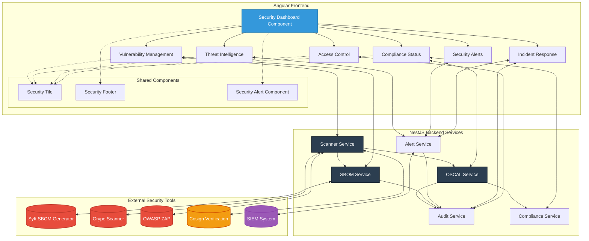
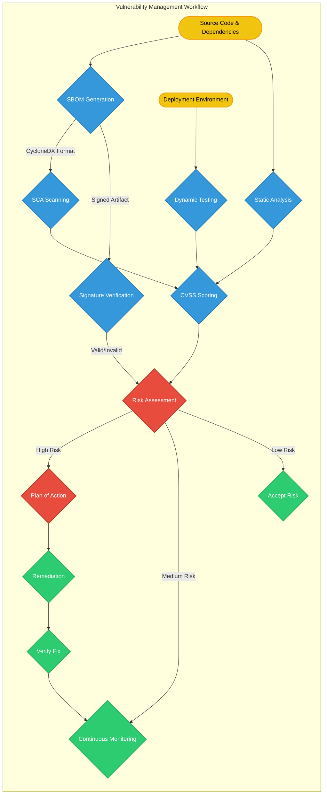
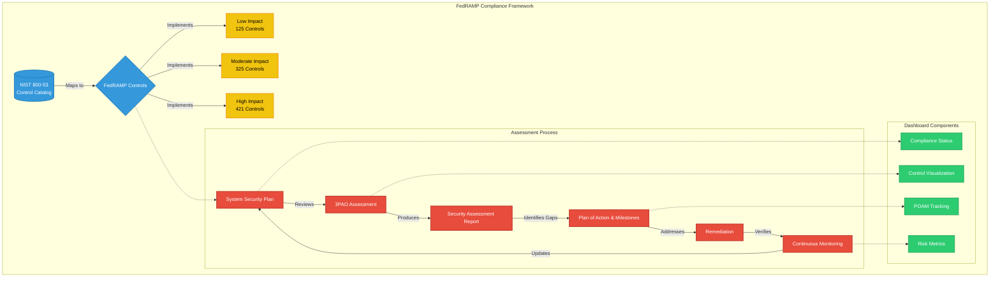
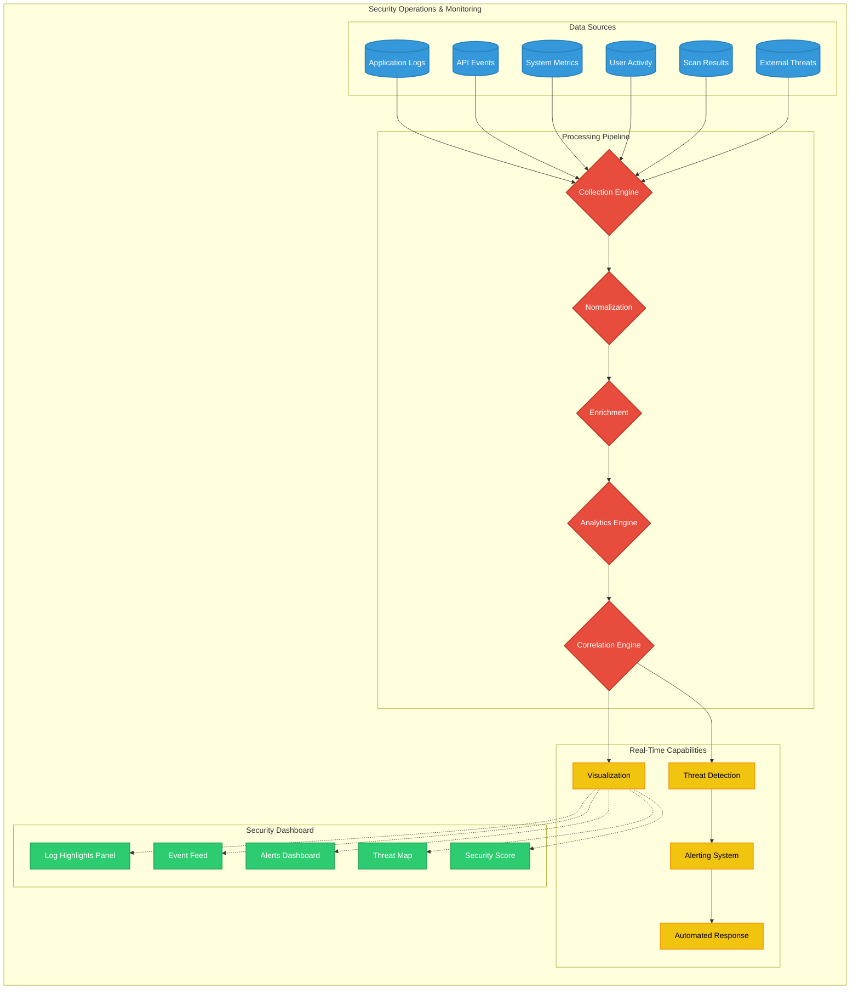
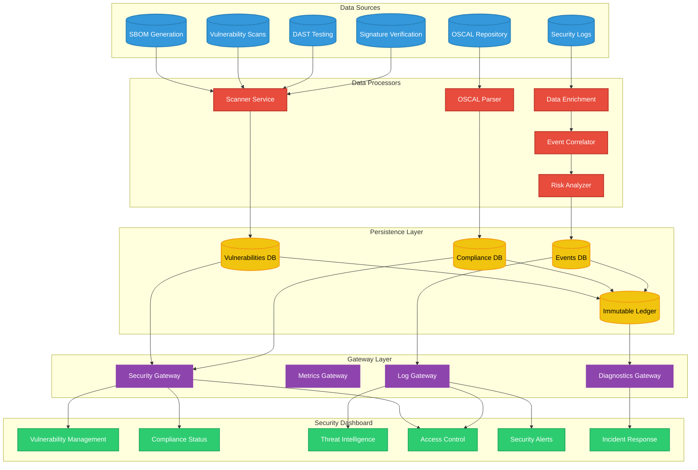
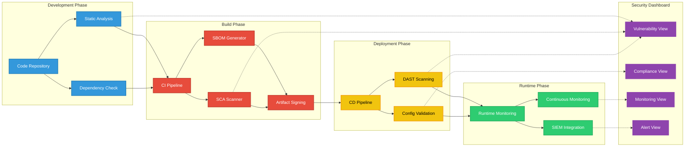
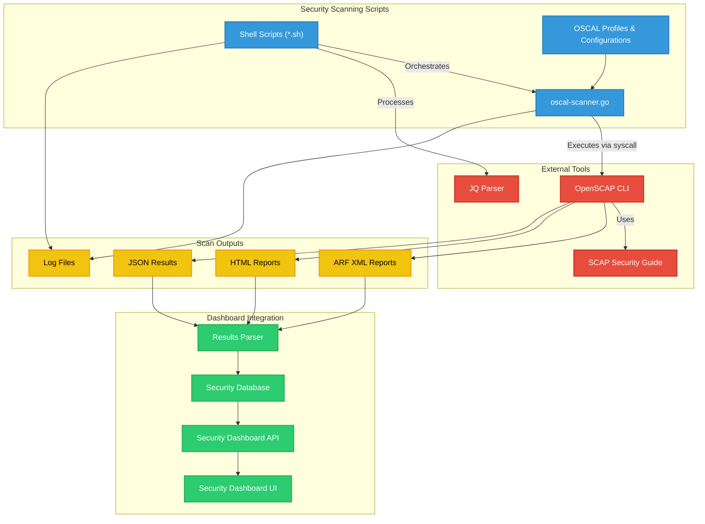
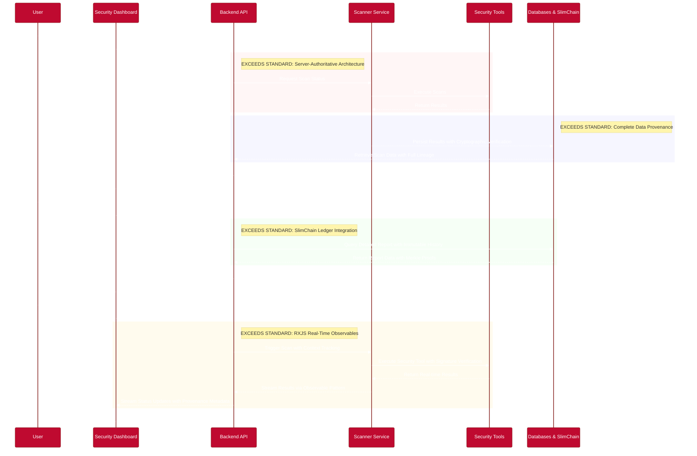

# Security Dashboard: Concepts and Practices

> **Note:** This file documents the ForgeBoard Security Dashboard's internal concepts and practices.  
> It is **not** a GitHub `SECURITY.md` profile file.
>
> If you are looking to set up a `SECURITY.md` for your repository on GitHub, see:  
> https://docs.github.com/en/code-security/policy-and-compliance/enabling-and-displaying-a-security-policy-for-your-repository
>
> GitHub's `SECURITY.md` is a static file for reporting vulnerabilities and outlining security policies.  
> It does **not** support real-time data or dynamic security controls.

**Last Updated: May 30, 2025**

## Introduction

This document outlines the key security concepts, tools, and practices integrated into the ForgeBoard Security Dashboard. The dashboard provides a centralized, real-time view of the application's security posture, enabling proactive threat management, compliance monitoring, and informed decision-making. Each tab and card within the dashboard represents a critical aspect of our comprehensive security strategy.

## Security Dashboard Architecture

## Core Security Pillars & Dashboard Sections

The Security Dashboard is organized around several core pillars of application and data security:

### 1. Threat & Vulnerability Management

This area focuses on identifying, assessing, and mitigating vulnerabilities within the application and its dependencies.

- **📦 SBOM (Software Bill of Materials) Status:**

  - **Concept:** An SBOM is a formal, machine-readable inventory of software components and dependencies, including their versions and relationships.
  - **Relevance to ForgeBoard:** Provides transparency into our software supply chain, helps identify outdated or vulnerable third-party libraries quickly, and aids in license compliance. Essential for understanding what's inside our application.

- **🐛 SCA (Software Composition Analysis) Scan Results:**

  - **Concept:** SCA tools automatically scan applications to identify open-source components and their known vulnerabilities.
  - **Relevance to ForgeBoard:** Proactively detects security risks in the libraries and frameworks ForgeBoard relies on. Results are categorized by severity, allowing prioritization of remediation efforts to reduce the application's attack surface.

- **⚡ DAST (Dynamic Application Security Testing) - OWASP ZAP Feedback:**
  - **Concept:** DAST tools test a running application by simulating external attacks to find vulnerabilities like XSS, SQL injection, etc., without needing source code access. OWASP ZAP is a popular open-source DAST tool.
  - **Relevance to ForgeBoard:** Identifies runtime vulnerabilities that might be exploitable by attackers. Helps ensure the application is resilient against common web attack vectors.

### 2. Compliance & Risk Posture

This pillar addresses adherence to regulatory requirements and the overall management of security risks.

- **🛡️ FedRAMP Compliance (including ConMon & RMF Insights):**

  - **Concept:** FedRAMP (Federal Risk and Authorization Management Program) is a U.S. government-wide program that provides a standardized approach to security assessment, authorization, and continuous monitoring for cloud products and services. The Risk Management Framework (RMF) by NIST provides a process that integrates security, privacy, and cyber supply chain risk management activities into the system development life cycle. Continuous Monitoring (ConMon) is a critical part of FedRAMP, requiring ongoing assessment of security controls.
  - **Relevance to ForgeBoard:** Essential if ForgeBoard is to be used by U.S. federal agencies. The dashboard tracks our alignment with FedRAMP controls, supports ConMon activities, and provides insights into the RMF process, demonstrating our commitment to meeting stringent federal security standards.

- **🚦 Real-time Security Control Status:**

  - **Concept:** Security controls are safeguards or countermeasures to avoid, detect, counteract, or minimize security risks. This includes technical controls (like encryption, access controls), operational controls (like incident response plans), and management controls (like security policies).
  - **Relevance to ForgeBoard:** The dashboard provides a live status of critical security controls (e.g., active/inactive, monitored, last checked). This allows for quick assessment of their effectiveness and operational state, which is fundamental to understanding the application's defense capabilities.

- **🎯 POA&M (Plan of Action & Milestones) Tracking:**

  - **Concept:** A POA&M is a document that identifies tasks that need to be accomplished to remediate security weaknesses. It details resources required, milestones, and completion dates.
  - **Relevance to ForgeBoard:** Provides a structured way to manage and track the remediation of vulnerabilities found through scans, audits, or assessments. Essential for FedRAMP and overall risk management, ensuring accountability and progress in security improvement.

- **⚙️ Configuration Compliance:**
  - **Concept:** Involves monitoring system and application configurations against established security baselines (e.g., CIS Benchmarks, DISA STIGs, or custom organizational policies).
  - **Relevance to ForgeBoard:** Helps prevent security weaknesses caused by misconfigurations. Ensures that servers, databases, and application components are hardened and maintained in a secure state, reducing the attack surface.

### 3. Security Operations & Monitoring

This area covers the ongoing activities related to detecting, responding to, and analyzing security events.

- **🔐 Supply Chain Signature Verification:**

  - **Concept:** Verifying the digital signatures of software artifacts, dependencies, and build outputs to ensure their integrity and authenticity.
  - **Relevance to ForgeBoard:** Protects against tampering and ensures that the code and components being used are from trusted sources and haven't been maliciously altered. Crucial for a secure software development lifecycle (SDLC) and DevSecOps.

- **📜 Security Log Highlights (SIEM Integration):**

  - **Concept:** Aggregating, correlating, and analyzing log data from various sources (servers, applications, network devices) using a Security Information and Event Management (SIEM) system.
  - **Relevance to ForgeBoard:** The dashboard shows key alerts and trends from the SIEM, providing an overview of potential security incidents, anomalous activities, or policy violations. Enables faster detection and response.

- **📰 Live Security Event Log Feed:**
  - **Concept:** A real-time stream of important security-related events as they occur.
  - **Relevance to ForgeBoard:** Offers immediate operational awareness of critical alerts, suspicious activities, or significant system status changes, complementing the summarized data from the SIEM.

## Data Flow Architecture

## Security Dashboard Integration with DevSecOps Pipeline

## Preliminary Notes on Security Scanning Scripts & Logs (ForgeBoard Context)

The ForgeBoard workspace includes security scanning capabilities, primarily within the `scripts/oscal/` directory. These scripts leverage tools like OpenSCAP for performing compliance scans against defined security profiles (e.g., FedRAMP baselines).

- **OSCAL (Open Security Controls Assessment Language) Scripts:**
  - Located in `c:\repos\forge-board\scripts\oscal\`.
  - Scripts like `oscal-scanner.go` (and its compiled executable) are designed to run `oscap` (OpenSCAP command-line tool) commands.
  - Shell scripts (`*.sh`) in this directory likely orchestrate these scans, potentially targeting specific SCAP (Security Content Automation Protocol) content like the `scap-security-guide`.
- **Log Generation (Preliminary):**
  - The `oscal-scanner.go` tool itself, when executing `oscap`, will produce output (e.g., ARF reports, HTML reports, XCCDF results). The `runOscapScan` function specifies output file paths.
  - Standard output and standard error from these scripts could be redirected to log files, though specific log file locations and formats from the shell scripts require further investigation.
  - The root `logs/` directory currently contains trace files (e.g., `Trace-20250529T113552.json`), which might be related to application performance or debugging rather than specific security scan outputs.
  - Further analysis of the `.sh` scripts in `scripts/oscal/` and any scripts in `scripts/security/` will be needed to determine definitive log output locations and formats for security scanning activities.

## Component Interaction Model

### Legend: ForgeBoard NX Security Excellence

  

    <strong>Security Dashboard:</strong> FedRAMP 20X-Ready UI
  

  

    <strong>Backend API:</strong> Server-Authoritative Architecture
  

  

    <strong>Scanner Service:</strong> Zero Trust Security Validation
  

  

    <strong>Security Tools:</strong> Continuous Assessment Pipeline
  

  

    <strong>Databases & SlimChain:</strong> Cryptographic Provenance
  

### ForgeBoard NX's Standards-Exceeding Capabilities

<table style="width:100%; border-collapse: collapse; margin: 20px 0; box-shadow: 0 2px 8px rgba(0,0,0,0.1);">
  <thead>
    <tr style="background-color: #002868; color: white;">
      <th style="padding: 10px; text-align: left; border: 1px solid #ddd;">Capability</th>
      <th style="padding: 10px; text-align: left; border: 1px solid #ddd;">FedRAMP Requirement</th>
      <th style="padding: 10px; text-align: left; border: 1px solid #ddd;">How ForgeBoard Exceeds</th>
    </tr>
  </thead>
  <tbody>
    <tr style="background-color: rgba(255, 225, 225, 0.3);">
      <td style="padding: 10px; border: 1px solid #ddd;"><strong>Server-Authoritative Architecture</strong></td>
      <td style="padding: 10px; border: 1px solid #ddd;">Basic client-server separation</td>
      <td style="padding: 10px; border: 1px solid #ddd;">Server as definitive source of truth with complete audit trails and cryptographically verified data flows</td>
    </tr>
    <tr style="background-color: rgba(225, 225, 255, 0.3);">
      <td style="padding: 10px; border: 1px solid #ddd;"><strong>Complete Data Provenance</strong></td>
      <td style="padding: 10px; border: 1px solid #ddd;">Limited data origin tracking</td>
      <td style="padding: 10px; border: 1px solid #ddd;">Full lifecycle tracking from origin through disposal with server-side cryptographic verification and non-repudiation</td>
    </tr>
    <tr style="background-color: rgba(225, 255, 225, 0.3);">
      <td style="padding: 10px; border: 1px solid #ddd;"><strong>SlimChain Ledger</strong></td>
      <td style="padding: 10px; border: 1px solid #ddd;">Standard database logging</td>
      <td style="padding: 10px; border: 1px solid #ddd;">Immutable, tamper-proof blockchain ledger with auto-compression and Merkle Proof exports</td>
    </tr>
    <tr style="background-color: rgba(255, 240, 200, 0.3);">
      <td style="padding: 10px; border: 1px solid #ddd;"><strong>RXJS Observables</strong></td>
      <td style="padding: 10px; border: 1px solid #ddd;">Basic event notifications</td>
      <td style="padding: 10px; border: 1px solid #ddd;">Real-time reactive data streams with server-originated provenance tracking operators and zero trust validation</td>
    </tr>
  </tbody>
</table>
