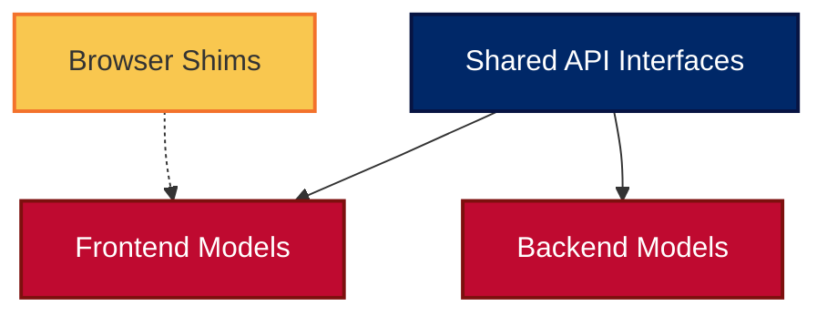

# 🚀 FORGE BOARD TYPE SYSTEM DOCUMENTATION 🚀

## 🌟 Introduction

Welcome to the **Forge Board Type System** documentation! This document provides a comprehensive overview of the type system used throughout the Forge Board application. Our type system is designed to ensure consistency, reliability, and maintainability across both frontend and backend components.

## 🔄 Reactive Programming with RxJS

Forge Board leverages RxJS's hot observables for reactive state management throughout the application. Key implementation details:

### 🔥 Hot Observables with BehaviorSubject

Services use `BehaviorSubject` to create hot observables that:
- Emit the current value upon subscription
- Multicasts to all subscribers
- Maintains state between emissions
- Ensures all subscribers get consistent data

### 📡 Observable Architecture

Our reactive architecture follows these patterns:

1. **State Management**: Services maintain state using `BehaviorSubject`
2. **Public API**: Expose data as `Observable` using `.asObservable()`
3. **Multicasting**: Use `shareReplay(1)` for consistent data across subscribers
4. **Cleanup**: Proper completion of subjects in `OnDestroy`/`OnModuleDestroy`

### 📊 Example Pattern

```typescript
@Injectable()
export class ExampleService implements OnDestroy {
  // Private BehaviorSubject for state management
  private dataSubject = new BehaviorSubject<DataType[]>([]);
  
  // Public hot observable API
  public data$ = this.dataSubject.asObservable().pipe(
    shareReplay(1)
  );
  
  // Update internal state
  updateData(newData: DataType[]): void {
    this.dataSubject.next(newData);
  }
  
  // Clean up
  ngOnDestroy(): void {
    this.dataSubject.complete();
  }
}
```

## 🔄 Shared Types

### 🔵 Core Data Types

#### `LogEntry`
The foundational type for all logging in the system.

```typescript
export interface LogEntry {
  id: string;
  timestamp: string;
  level: LogLevelEnum;
  message: string;
  source?: string;
  data?: Record<string, unknown>;
  
  // Extended properties for display
  displayMessage?: string;
  expanded?: boolean;
  rawData?: string;
  categories?: string[];
  
  // Group-related properties
  isCategory?: boolean;
  categoryName?: string;
  categoryLogs?: LogEntry[];
  categoryCount?: number;
  
  // Duplication tracking
  duplicates?: LogEntry[];
  duplicateCount?: number;
  
  // Loop detection flag
  isLoggingLoop?: boolean;
  
  // Correlation
  eventId?: string;
  details?: Record<string, unknown>;
  
  // Context information
  context?: string;
  stackTrace?: string;
  tags?: string[];
}
```

#### `LogFilter`
Standard filter interface for filtering log entries.

```typescript
export interface LogFilter {
  level?: LogLevelEnum | LogLevelEnum[];
  service?: string;
  startDate?: string;
  endDate?: string;
  search?: string;
  limit?: number;
  skip?: number;
  afterTimestamp?: string;
}
```

#### `ExtendedLogFilter`
Enhanced filter with additional properties for more advanced filtering capabilities.

```typescript
export interface ExtendedLogFilter extends LogFilter {
  contexts?: string[];
  sources?: string[];
  tags?: string[];
  startTime?: string;
  endTime?: string;
  offset?: number;
  loglevels?: LogLevelEnum[];
}
```

#### `LogLevelEnum`
Standardized log levels across the application.

```typescript
export enum LogLevelEnum {
  TRACE = 0,
  DEBUG = 1,
  INFO = 2,
  WARN = 3,
  ERROR = 4,
  FATAL = 5
}
```

### 🔴 Socket Communication Types

#### `SocketResponse<T>`
Generic wrapper for all socket responses, ensuring consistent format.

```typescript
export interface SocketResponse<T> {
  status: 'success' | 'error';
  message?: string;
  data: T;
  timestamp: string;
}
```

#### `LogSocketResponse<T>`
Specialized socket response for log-related operations.

```typescript
export interface LogSocketResponse<T> extends SocketResponse<T> {
  source: 'logger' | 'system';
  requestId?: string;
}
```

#### `LogStreamUpdate`
Updates sent over socket connections for real-time log streaming.

```typescript
export interface LogStreamUpdate {
  log?: LogEntry;
  logs?: LogEntry[];
  totalCount: number;
  append?: boolean;
  stats?: Record<string, number>;
}
```

## ⚡ Frontend-Specific Types

### 🟢 Logger Service Types

#### `LogMetadata`
Common structure for additional log information.

```typescript
export interface LogMetadata {
  service?: string;
  action?: string;
  [key: string]: unknown;
}
```

#### `LoggerConfig`
Configuration options for the logger.

```typescript
interface LoggerConfig {
  level: LogLevel;
  includeTimestamp: boolean;
  enableConsoleColors: boolean;
  enableConsoleOutput: boolean;
}
```

#### `LogResponse`
Response structure for log requests.

```typescript
export interface LogResponse {
  logs: LogEntry[];
  totalCount: number;
  filtered: boolean;
  status: boolean;
  total: number;
  timestamp: string;
}
```

### 🟣 Component-Specific Types

#### `LogQueryResponse`
Response structure for log queries in components.

```typescript
export interface LogQueryResponse {
  status: boolean;
  logs: LogEntry[];
  totalCount: number;
  filtered: boolean;
  timestamp: string;
}
```

#### `LogFetchResponse`
Extended query response for pagination support.

```typescript
export interface LogFetchResponse extends LogQueryResponse {
  total: number;
}
```

#### `SourceOption`
Option structure for service/source selection dropdowns.

```typescript
interface SourceOption {
  value: string;
  label: string;
}
```

## 🔥 Backend-Specific Types

### 🟡 Logger Service Types

#### `ExtendedLogEntry`
Backend-specific extension of LogEntry with additional context.

```typescript
interface ExtendedLogEntry extends LogEntry {
  context?: string;
  stackTrace?: string;
  tags?: string[];
}
```

#### `LogQueryOptions`
Options for querying logs from storage.

```typescript
interface LogQueryOptions {
  filter?: ExtendedLogFilter;
  pagination?: {
    skip: number;
    limit: number;
  };
  sort?: {
    field: string;
    direction: 'asc' | 'desc';
  };
}
```

## 🔧 Type Validation System

### 🧪 Validators

The Forge Board application implements a robust type validation system to ensure data integrity. Here's how it works:

#### `TypeValidator<T>`
Interface for type validators.

```typescript
export interface TypeValidator<T> {
  validate(value: unknown): value is T;
  getErrors(): ValidationError[];
}
```

#### `ValidationError`
Structure for validation errors.

```typescript
export interface ValidationError {
  path: string;
  message: string;
  value?: unknown;
  code: string;
}
```

#### `DiagnosticResult`
Result of diagnostic validation.

```typescript
export interface DiagnosticResult<T> {
  valid: boolean;
  value: T | null;
  errors: ValidationError[];
  warnings?: ValidationError[];
  metadata?: Record<string, unknown>;
}
```

## 🌐 Socket Registry System

### 🔌 Socket Management

#### `SocketRegistration`
Registered socket entry.

```typescript
interface SocketRegistration {
  namespace: string;
  socket: Socket;
  registeredAt: Date;
  lastActivity?: Date;
}
```

#### `SocketMetrics`
Metrics about socket usage.

```typescript
interface SocketMetrics {
  totalConnections: number;
  activeConnections: number;
  messageRate: number;
  bytesTransferred: number;
}
```

## 📊 Dashboard and Tile System

### 🧩 Tile Configuration

#### `TileConfig`
Configuration for a dashboard tile.

```typescript
export interface TileConfig {
  id: string;
  title: string;
  type: TileType;
  position: {
    x: number;
    y: number;
    width: number;
    height: number;
  };
  settings?: Record<string, unknown>;
  dataSource?: string;
  refreshInterval?: number;
}
```

#### `TileType`
Available tile types.

```typescript
export enum TileType {
  METRIC = 'metric',
  CHART = 'chart',
  TABLE = 'table',
  STATUS = 'status',
  LOGGER = 'logger',
  CUSTOM = 'custom'
}
```

#### `TileState`
Runtime state of a tile.

```typescript
export interface TileState {
  id: string;
  loading: boolean;
  error?: string;
  lastUpdated?: string;
  data?: unknown;
}
```

## 🎨 Best Practices

### Type Safety Patterns

1. **Always Use Shared Types**: When a type is used in both frontend and backend, define it in the shared library.

2. **Prefer Interfaces Over Types**: Use interfaces for object shapes to take advantage of declaration merging.

3. **Use Enums for Constants**: Prefer TypeScript enums for values that have a fixed set of options.

4. **Extend Base Types**: Rather than creating entirely new types, extend base types when appropriate.

### Type Validation Patterns

1. **Validate at Boundaries**: Always validate data at system boundaries (API endpoints, file imports, etc.).

2. **Runtime Type Checking**: For critical data, implement runtime type checking using the TypeValidator system.

3. **Document Validation Requirements**: Include validation requirements in type documentation.

## 🚩 Common Gotchas

1. **Type vs Interface**: Remember interfaces can be augmented later, types cannot.

2. **Union vs Intersection Types**: `A | B` means "either A or B", while `A & B` means "both A and B".

3. **Optional vs Nullable**: `property?: string` is different from `property: string | null`.

4. **Record vs Index Signature**: `Record<string, unknown>` is more explicit than `{ [key: string]: unknown }`.

5. **any vs unknown**: Prefer `unknown` over `any` when the type is truly unknown, then use type guards to narrow it.

## 🌈 Type Evolution

Our type system is designed to evolve with the application. When making changes:

1. **Backwards Compatibility**: Ensure changes don't break existing code.

2. **Migration Path**: Provide clear migration paths for breaking changes.

3. **Documentation**: Update this document with new types and patterns.

---

## 🔄 Type System Evolution & Recent Changes

### Logging Filter Evolution

Our logging filter system has evolved to provide more flexibility and consistency:

1. **Initial Design**: Started with a simple `LogFilter` interface for basic filtering operations.

2. **Extended Capabilities**: Added `ExtendedLogFilter` that extends the base filter with additional properties for advanced filtering:
   ```typescript
   export interface ExtendedLogFilter extends LogFilter {
     contexts?: string[];
     sources?: string[];
     tags?: string[];
     startTime?: string;
     endTime?: string;
     offset?: number;
     loglevels?: LogLevelEnum[];
   }
   ```

3. **Current Direction**: We're now standardizing on `ExtendedLogFilter` throughout the codebase for consistency and to leverage its advanced capabilities.

### Key Benefits of Current Approach

1. **Backward Compatibility**: The base `LogFilter` type is still available for simpler use cases and legacy code.

2. **Type Flexibility**: By extending the base filter, we maintain a clean inheritance hierarchy.

3. **Unified Filtering Logic**: Using `ExtendedLogFilter` consistently allows us to implement unified filtering logic across the system.

4. **Reduced Type Confusion**: Standardizing on one primary filter type reduces the confusion between similar filter types.

### Implementation Guidelines

When working with log filters:

1. **Prefer ExtendedLogFilter**: Use `ExtendedLogFilter` for all new code and when refactoring existing code.

2. **Type Narrowing**: If only basic filtering is needed, you can type-narrow to the base properties:
   ```typescript
   function simpleFilter(filter: Pick<LogFilter, 'level' | 'service'>) { ... }
   ```

3. **Documenting Filter Usage**: When implementing filtering logic, document which filter properties are supported.

---

## 🏆 Contribute

The type system is a living part of our codebase. If you identify new patterns or improvements:

1. Document them in this file
2. Implement consistent usage across the codebase
3. Add appropriate validation where necessary

---

_"Type safety isn't just a compile-time concern; it's a design philosophy that leads to more robust, maintainable code."_

**Last Updated**: May 7, 2025

## Core Type Philosophy

Forge Board follows these key principles in its type system:

1. **Strong Typing Everywhere**: No implicit `any` types allowed
2. **Shared Types**: Core interfaces defined in shared libraries
3. **Browser-Server Compatibility**: Special handling for Node.js modules in browser
4. **Provenance Tracking**: Data origin is always traceable

## Type Architecture



## Browser Shims Type System

Our application provides typed browser shims for Node.js built-in modules. These shims:

1. **Match Node.js API**: Follow same method signatures and return types
2. **Implement Browser Alternatives**: Use Web APIs under the hood
3. **Track Usage**: Log when shim methods are called
4. **Indicate Source**: Clearly identify data that comes from shims

Example of properly typed shim usage:

```typescript
// Service layer with strong typing
import { Observable, of, catchError } from 'rxjs';
import * as cryptoShim from '../shims/crypto';

export interface HashResult {
  algorithm: string;
  hash: string;
  timestamp: string;
  isShimData?: boolean;
}

// Strongly-typed method with backend/shim switching
generateHash(data: string, algorithm = 'sha256'): Observable<HashResult> {
  return this.http.get<HashResult>('/api/hash', { params: { data, algorithm } }).pipe(
    catchError(() => {
      // Fallback to shim with proper typing
      const hash = cryptoShim.createHash(algorithm);
      hash.update(data);
      return of({
        algorithm,
        hash: hash.digest('hex') as string,
        timestamp: new Date().toISOString(),
        isShimData: true
      });
    })
  );
}
```

## Key Type Interfaces

### System Module Types

```typescript
// System information interface
export interface SystemInfo {
  platform: string;
  arch: string;
  hostname: string;
  cpus: CpuInfo[];
  memory: {
    total: number;
    free: number;
    used: number;
    percentUsed: number;
  };
  uptime: number;
  network: Record<string, NetworkInterfaceInfo[]>;
}

// Hash result interface
export interface HashResult {
  algorithm: string;
  hash: string;
  timestamp: string;
}

// Path result interface
export interface PathResult {
  original: string | string[];
  result: string;
  timestamp: string;
}
```

### Status Tracking Types

```typescript
// Gateway status interface
export interface GatewayStatus {
  name: string;
  connected: boolean;
  usingMockData: boolean;
}

// Backend status summary
export interface BackendStatusSummary {
  gateways: GatewayStatus[];
  allConnected: boolean;
  anyMockData: boolean;
}
```

### Security Event Types

```typescript
// Security event types
export type SecurityEventType = 'sbom' | 'sca' | 'zap' | 'supplyChain' | 'fedramp';

// Security event interface
export interface SecurityEvent {
  id: string;
  type: SecurityEventType; 
  severity: 'low' | 'medium' | 'high' | 'critical';
  title: string;
  description: string;
  timestamp: string;
  data: Record<string, unknown>;
  source: string;
  verified: boolean;
}
```

## Best Practices

1. **Use Shared Interfaces**: Import from `@forge-board/shared/api-interfaces`
2. **Explicit Types**: Declare param/return types for all functions and methods
3. **No Implicit Any**: Configure `tsconfig.json` with `"noImplicitAny": true`
4. **Use Generics**: Especially for service methods and observables

With this type system, we maintain consistency and type safety across our entire application, even when dealing with the complexities of Node.js modules in a browser environment.