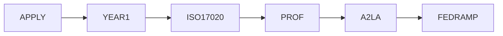
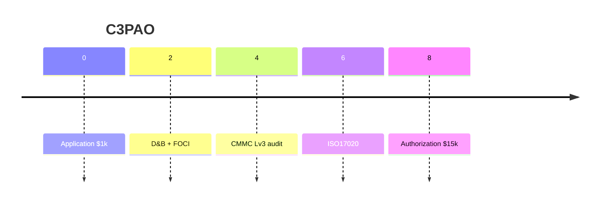
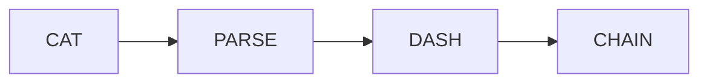

# 🛡️ True North Insights — 3PAO Ascension Playbook

### *Blending Oracle Heritage, SlimChain Evidence, and FedRAMP Automation*

> **Key‑Takeaway:** True North can join the elite club of ~50 FedRAMP‑approved 3PAOs by 2026, capturing a slice of an estimated **$350 M annual assessment market** — while using ForgeBoard + SlimChain to slash evidence‑collection overhead.

---

## 🎨 Color Tokens

| Token      | Hex     | Role                |
| ---------- | ------- | ------------------- |
|  `Navy`    | #002868 | Oracle legacy rails |
|  `Crimson` | #BF0A30 | SlimChain evidence  |
|  `Purple`  | #8E44AD | 3PAO milestones     |
|  `Gold`    | #F9C74F | FedRAMP controls    |
|  `Mint`    | #90BE6D | Success KPIs        |

---

## 1️⃣ Market Reality

- FedRAMP Marketplace lists **≈55 accredited 3PAOs** as of May 2025.
- A2LA handles accreditation; updated R311 tightened ISO 17020 & proficiency demands.
- Analysts peg FedRAMP assessment services at **≈USD 350 M** yearly by 2025, growing ~9 % CAGR.
- Demand surge expected as agencies migrate to Rev‑5 baselines & JAB Fast‑Track.

> **Opportunity:** Even a 2 % share ≈ **$7 M ARR** with modest headcount.

---

## 2️⃣ Strategic Fit for True North

| True North Asset                  | 3PAO Requirement                | Strategic Leverage |
| --------------------------------- | ------------------------------- | ------------------- |
| **ForgeBoard Security Dashboard** | Centralized evidence collection | Live control‑status feeds map directly to OSCAL controls |
| **SlimChain Ledger**              | Immutable assessment artifacts  | Cryptographic proof for AU‑9 & CP‑9 controls |
| **Oracle Backbone**               | Legacy COBOL finance data       | Satisfies segregation-of-duties test cases |
| **DevSecOps Guild**               | Senior + junior assessors       | Rapid upskill to FedRAMP/CMMC assessor roles |

---

## 3️⃣ Organizational Path to Accreditation

### FedRAMP (via **A2LA**)

* Hands‑on proficiency test at Baltimore Cyber Range.
* Annual A2LA review; biennial reassessment.

### CMMC (via **Cyber‑AB**)

* ≥1 CMMC Assessor & Professional.
* Carry liability & cyber insurance.

---

## 4️⃣ Individual Career Tracks

| Role | Years XP | Must‑Have Certs | Annual CPE |
|------|---------|-----------------|------------|
| Senior Assessor | 5–7 | CISSP / CISA | 40 |
| Junior Assessor | 2–3 | Security+ / SSCP | 40 |
| Pen‑Tester | 3–5 | OSCP / CEH | 16 |
| CMMC CCA | 3 | CCA | 20 |

---

## 5️⃣ FedRAMP Catalog Integration

* Catalog `fedramp_catalog_rev5.json` + baseline profiles drive dashboard mapping.

---

## 6️⃣ Financial Model

| Bucket | Yr1 | Yr2+ |
|--------|-----|------|
| A2LA fees | 25k | 10k |
| Proficiency | 8k | 8k |
| Cyber‑AB fees | 24k | 3k |
| Insurance | 12k | 12k |
| Staff (4 FTE) | 640k | 640k |
| **Total** | **709k** | **673k** |

Break‑even at 8 assessments @ $90k.

---

## 7️⃣ ForgeBoard Automation Edge

| Manual Now | ForgeBoard Auto | Gain |
|------------|----------------|------|
| Copy control IDs | OSCAL merge | 80% time |
| Zip + checksum | Ledger hash | No error |
| SharePoint docs | IPFS portal | Immutable |

---

## 8️⃣ Timeline & Milestones

| Quarter | Org | Tech | People |
|---------|-----|------|--------|
| Q3 2025 | A2LA app | Catalog parser PoC | pick senior assessor |
| Q4 2025 | finish inspection year | SlimChain MVP | train CISSP/CCA |
| Q2 2026 | A2LA audit | OSCAL export | hire pen‑tester |
| Q3 2026 | FedRAMP listing | start revenue | |

---

## 9️⃣ Risks & Mitigations

| Risk | Likelihood | Mitigation |
|------|-----------|-----------|
| Staff churn | Med | cross‑train |
| Rev‑6 drift | High | OSCAL diff pipeline |
| Conflict of interest | Med | separate lines |

---

## 🔟 Call to Action
1. Approve A2LA app by 15 Jul 2025.
2. Allocate $150k for automation tools.
3. Fund staff training this fiscal.

> **True North + ForgeBoard + SlimChain = Legendary Assurance.**