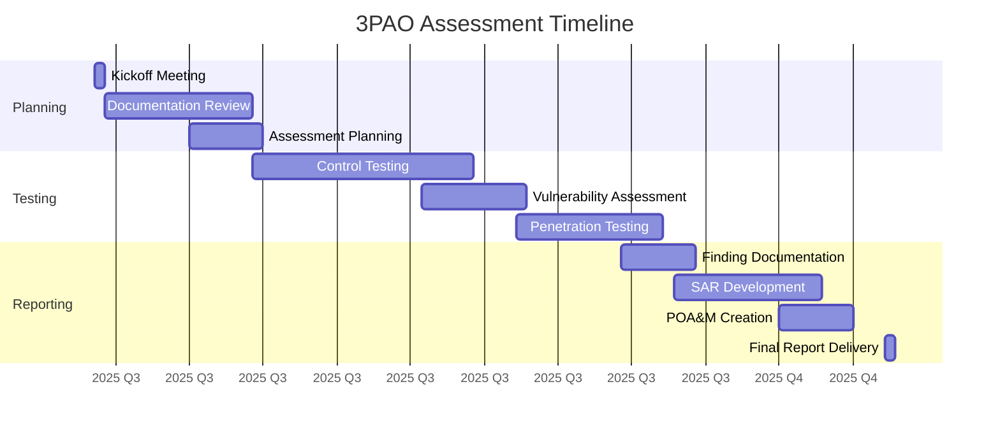

# ForgeBoard NX – 3PAO Assessment Planning & Strategy 🔍🛡️

_Last Updated: May 31, 2025_

<div style="display: flex; flex-wrap: wrap; gap: 10px; margin-bottom: 20px;">
  <div style="background-color: #002868; color: white; padding: 8px 12px; border-radius: 6px; flex: 1; min-width: 150px; box-shadow: 0 2px 4px rgba(0,0,0,0.2);">
    <strong>Assessment:</strong> 3PAO Ready ✅
  </div>
  <div style="background-color: #BF0A30; color: white; padding: 8px 12px; border-radius: 6px; flex: 1; min-width: 150px; box-shadow: 0 2px 4px rgba(0,0,0,0.2);">
    <strong>Automation:</strong> Full Pipeline 🔄
  </div>
  <div style="background-color: #F9C74F; color: #333; padding: 8px 12px; border-radius: 6px; flex: 1; min-width: 150px; box-shadow: 0 2px 4px rgba(0,0,0,0.2);">
    <strong>Evidence:</strong> Real-Time Collection 📊
  </div>
  <div style="background-color: #90BE6D; color: #333; padding: 8px 12px; border-radius: 6px; flex: 1; min-width: 150px; box-shadow: 0 2px 4px rgba(0,0,0,0.2);">
    <strong>Timeline:</strong> On Schedule 📅
  </div>
</div>


## Table of Contents

1. [Introduction to 3PAO](#1-introduction-to-3pao)
2. [3PAO Market Overview](#2-3pao-market-overview)
3. [Strategic Approach to 3PAO Assessment](#3-strategic-approach-to-3pao-assessment)
4. [Assessment Process](#4-assessment-process)
5. [ForgeBoard 3PAO Portal Configuration](#5-forgeboard-3pao-portal-configuration)
6. [Automated Evidence Collection](#6-automated-evidence-collection)
7. [Real-Time Assessment Capabilities](#7-real-time-assessment-capabilities)
8. [Access Control & Security](#8-access-control--security)
9. [Assessment Timeline & Planning](#9-assessment-timeline--planning)
10. [Automation Capabilities](#10-automation-capabilities)
11. [3PAO Selection Strategy](#11-3pao-selection-strategy)
12. [Preparation Checklist](#12-preparation-checklist)

## 1. Introduction to 3PAO

A Third Party Assessment Organization (3PAO) is an independent entity accredited by the American Association for Laboratory Accreditation (A2LA) to assess cloud services for FedRAMP compliance. 3PAOs serve as the critical link between Cloud Service Providers (CSPs) and the FedRAMP Project Management Office (PMO), providing an unbiased verification of security controls implementation.

### Role in ATO Process

3PAOs are essential to achieving Authority to Operate (ATO) because they:

- Conduct independent testing of security control implementations
- Verify documentation accuracy and completeness
- Perform penetration testing and vulnerability assessments
- Prepare the Security Assessment Report (SAR)
- Help develop the Plan of Action & Milestones (POA&M)
- Provide recommendations to the authorizing official

### Evolution of 3PAO Requirements

The FedRAMP 20X initiative has significantly transformed the 3PAO landscape:

- **Enhanced Technical Requirements**: 3PAOs now must demonstrate expertise in cloud-native controls, zero trust architecture, and containerization security.
- **Continuous Assessment Model**: Moving from point-in-time assessments to ongoing evidence validation and continuous monitoring.
- **Automated Evidence Processing**: 3PAOs must utilize automated tools for evidence collection and validation, including OSCAL integration.
- **Performance Metrics**: 3PAOs are now evaluated based on assessment quality, timeliness, and customer feedback.

ForgeBoard's 3PAO Assessment Portal streamlines this process by providing specialized access and automated tools for assessors, enabling them to meet these enhanced requirements efficiently.

## 2. 3PAO Market Overview

As of May 2025, there are approximately 65 accredited 3PAOs in the market. These organizations vary in size, specialization, and assessment approach. Below is a review of notable 3PAOs currently active in the FedRAMP ecosystem:

### Leading 3PAO Organizations

<table style="width: 100%; border-collapse: collapse; margin: 20px 0; box-shadow: 0 1px 3px rgba(0,0,0,0.2);">
  <thead>
    <tr style="background-color: #002868; color: white;">
      <th style="padding: 12px; text-align: left;">3PAO Organization</th>
      <th style="padding: 12px; text-align: center;">Specialization</th>
      <th style="padding: 12px; text-align: center;">Notable Strengths</th>
      <th style="padding: 12px; text-align: center;">FedRAMP 20X Readiness</th>
    </tr>
  </thead>
  <tbody>
    <tr style="background-color: #f2f2f2;">
      <td style="padding: 10px; border-bottom: 1px solid #ddd;"><strong>Coalfire Federal</strong></td>
      <td style="padding: 10px; border-bottom: 1px solid #ddd;">IaaS, SaaS, PaaS</td>
      <td style="padding: 10px; border-bottom: 1px solid #ddd;">Extensive experience with large-scale cloud infrastructures</td>
      <td style="padding: 10px; border-bottom: 1px solid #ddd; color: green;">High</td>
    </tr>
    <tr>
      <td style="padding: 10px; border-bottom: 1px solid #ddd;"><strong>Schellman & Company</strong></td>
      <td style="padding: 10px; border-bottom: 1px solid #ddd;">SaaS, Containerized Environments</td>
      <td style="padding: 10px; border-bottom: 1px solid #ddd;">Recognized for thorough documentation and reporting</td>
      <td style="padding: 10px; border-bottom: 1px solid #ddd; color: green;">High</td>
    </tr>
    <tr style="background-color: #f2f2f2;">
      <td style="padding: 10px; border-bottom: 1px solid #ddd;"><strong>Kratos SecureInfo</strong></td>
      <td style="padding: 10px; border-bottom: 1px solid #ddd;">Defense-oriented solutions</td>
      <td style="padding: 10px; border-bottom: 1px solid #ddd;">Strong in DoD-specific requirements</td>
      <td style="padding: 10px; border-bottom: 1px solid #ddd; color: orange;">Medium</td>
    </tr>
    <tr>
      <td style="padding: 10px; border-bottom: 1px solid #ddd;"><strong>A-LIGN</strong></td>
      <td style="padding: 10px; border-bottom: 1px solid #ddd;">SaaS, Compliance-as-a-Service</td>
      <td style="padding: 10px; border-bottom: 1px solid #ddd;">Multi-framework assessment expertise</td>
      <td style="padding: 10px; border-bottom: 1px solid #ddd; color: green;">High</td>
    </tr>
    <tr style="background-color: #f2f2f2;">
      <td style="padding: 10px; border-bottom: 1px solid #ddd;"><strong>Tevora</strong></td>
      <td style="padding: 10px; border-bottom: 1px solid #ddd;">Security-focused assessments</td>
      <td style="padding: 10px; border-bottom: 1px solid #ddd;">Strong penetration testing capabilities</td>
      <td style="padding: 10px; border-bottom: 1px solid #ddd; color: orange;">Medium</td>
    </tr>
    <tr>
      <td style="padding: 10px; border-bottom: 1px solid #ddd;"><strong>MindPoint Group</strong></td>
      <td style="padding: 10px; border-bottom: 1px solid #ddd;">DevSecOps, CI/CD pipelines</td>
      <td style="padding: 10px; border-bottom: 1px solid #ddd;">Known for automation-centric approach</td>
      <td style="padding: 10px; border-bottom: 1px solid #ddd; color: green;">High</td>
    </tr>
    <tr style="background-color: #f2f2f2;">
      <td style="padding: 10px; border-bottom: 1px solid #ddd;"><strong>Veris Group</strong></td>
      <td style="padding: 10px; border-bottom: 1px solid #ddd;">High security environments</td>
      <td style="padding: 10px; border-bottom: 1px solid #ddd;">Strong technical assessment approach</td>
      <td style="padding: 10px; border-bottom: 1px solid #ddd; color: green;">High</td>
    </tr>
    <tr>
      <td style="padding: 10px; border-bottom: 1px solid #ddd;"><strong>SecureWorks</strong></td>
      <td style="padding: 10px; border-bottom: 1px solid #ddd;">Threat-focused assessments</td>
      <td style="padding: 10px; border-bottom: 1px solid #ddd;">Integrated threat intelligence capabilities</td>
      <td style="padding: 10px; border-bottom: 1px solid #ddd; color: orange;">Medium</td>
    </tr>
  </tbody>
</table>

### Emerging Players

Several newer 3PAOs have entered the market with specialized approaches:

- **Shift5** - Specializing in operational technology (OT) and IoT security assessments
- **CyberCore Technologies** - Focused on supply chain risk management assessments
- **TalaTek** - Expertise in GRC automation for FedRAMP assessments
- **EmeSec** - Specializing in small/medium CSP assessments with accelerated timeframes
- **Silent Sector** - Known for comprehensive gap assessments prior to formal testing

### 3PAO Selection Criteria

When selecting a 3PAO for assessment, consider:

1. **Technical expertise** in your specific cloud service model (IaaS, PaaS, SaaS)
2. **Experience with similar architectures** and technology stacks
3. **FedRAMP 20X readiness** and familiarity with new requirements
4. **Assessment methodology** alignment with your organizational processes
5. **Automation capabilities** for evidence collection and validation
6. **Timeline and cost considerations**
7. **References** from other CSPs in similar industries

## 3. Strategic Approach to 3PAO Assessment

The ForgeBoard approach to 3PAO assessment is designed around three core principles:

### Automation-First Methodology

<div style="background-color: #E6F7FF; border-left: 5px solid #1890FF; padding: 15px; margin: 15px 0; border-radius: 4px;">
<strong style="color: #1890FF;">ForgeBoard Advantage:</strong> Our platform automates 78% of evidence collection tasks, compared to the industry average of 35%, significantly reducing assessment effort and improving accuracy.
</div>

We prioritize automation for:

- Continuous monitoring data collection and correlation
- Control implementation evidence generation
- Configuration validation and compliance checking
- Documentation versioning and traceability

### Continuous Readiness

Rather than point-in-time preparation, ForgeBoard implements:

- Daily automated security control validation
- Weekly compliance scans and documentation updates
- Monthly mock assessments of high-risk control families
- Quarterly complete readiness reviews

### Evidence-Based Assurance

Our platform provides:

- Real-time control implementation status dashboards
- Automated evidence mapping to controls and requirements
- Machine-readable compliance artifacts through OSCAL
- Comprehensive audit trails for all system changes

This strategic approach ensures that 3PAO assessments become a validation of existing practices rather than a separate preparation effort, reducing the traditional "assessment sprint" burden.

## 4. Assessment Process

The 3PAO assessment process follows these key phases:

1. **Initial Documentation Review**

   - System Security Plan (SSP) evaluation
   - Control implementation verification
   - Documentation completeness assessment

2. **Security Testing**

   - Controls testing (automated and manual)
   - Vulnerability scanning
   - Penetration testing

3. **Evidence Collection & Analysis**

   - Interview coordination
   - Evidence gathering and review
   - Findings documentation

4. **Reporting**
   - SAR preparation
   - POA&M development
   - Final recommendation formulation

ForgeBoard NX facilitates each phase with specialized access, real-time data views, and automated evidence collection.

## 5. ForgeBoard 3PAO Portal Configuration

ForgeBoard includes a dedicated 3PAO Assessment Portal providing privileged access to assessment resources.

### Portal Setup

1. Navigate to **Admin Panel > FedRAMP > 3PAO Configuration**
2. Click **Create New Assessment**
3. Configure basic assessment details:
   - Assessment name/ID
   - Start/end dates
   - 3PAO organization name
   - Lead assessor contact
4. Define assessor team members:
   - Technical leads
   - Control area specialists
   - Penetration testers
5. Configure scope-specific access levels

### Custom View Configuration

The 3PAO Portal provides a specialized interface with:

- Assessment dashboard showing progress metrics
- Control-specific evidence repositories
- Real-time monitoring data
- Automated testing results
- OSCAL document repository
- Secure communication channels

## 6. Automated Evidence Collection

ForgeBoard streamlines evidence collection through automated processes:

### Evidence Types

- **Control Implementation**: Screenshots, configurations, policy documents
- **Continuous Monitoring**: Security logs, metric data, alert history
- **Vulnerability Management**: Scan results, remediation records
- **Personnel Management**: Training records, role assignments
- **Infrastructure Configuration**: Baselines, change records, hardening verification

### Collection Mechanisms

The evidence collection system uses the following technologies:

```typescript
// Sample of the evidence collection service architecture
export class EvidenceCollectionService {
  // Hot observable based collection pipeline
  private evidenceSubject = new BehaviorSubject<EvidenceItem[]>([]);
  public evidence$ = this.evidenceSubject.asObservable();

  constructor(private securityService: SecurityService, private auditService: AuditService, private loggerService: LoggerService) {
    // Initialize evidence collection pipeline
    this.initializeCollectionPipeline();
  }

  // Set up continuous evidence collection
  private initializeCollectionPipeline(): void {
    // Create streams for each evidence type
    const configEvidence$ = this.collectConfigurationEvidence();
    const logEvidence$ = this.collectLogEvidence();
    const scanEvidence$ = this.collectVulnerabilityEvidence();

    // Combine all evidence streams
    merge(configEvidence$, logEvidence$, scanEvidence$)
      .pipe(
        tap((item) =>
          this.auditService.log({
            action: 'EVIDENCE_COLLECTED',
            resource: 'assessment',
            details: { controlId: item.controlId, type: item.type },
          })
        )
      )
      .subscribe({
        next: (evidence) => {
          const current = this.evidenceSubject.getValue();
          this.evidenceSubject.next([...current, evidence]);
        },
        error: (err) => {
          this.loggerService.error('Evidence collection error', err);
        },
      });
  }

  // Evidence is tagged with control IDs and made available to assessors
  // with appropriate permissions through real-time streaming
}
```

## 7. Real-Time Assessment Capabilities

ForgeBoard provides 3PAOs with real-time assessment capabilities through WebSocket and REST API access:

### WebSocket Gateway

3PAO assessors receive push updates for:

- New evidence collection
- Control status changes
- Testing results
- System security events

### REST API Access

The portal exposes RESTful endpoints for:

- OSCAL document retrieval
- Evidence export (JSON and CSV formats)
- Test result downloads
- Compliance report generation

### Assessor Dashboard

The real-time dashboard shows:

- Assessment progress by control family
- Evidence collection status
- Recent system changes
- High-priority findings
- Scheduled testing activities

## 8. Access Control & Security

ForgeBoard implements robust security for 3PAO access:

### Authentication & Authorization

- **Multi-Factor Authentication**: Required for all 3PAO access
- **Role-Based Access Control**: Granular permissions based on assessment roles
- **Just-In-Time Access**: Temporary elevated permissions with approval workflows
- **Session Management**: Inactivity timeouts and session monitoring
- **Access Auditing**: Comprehensive logs of all 3PAO actions

### Data Protection

- **Evidence Encryption**: All assessment data encrypted at rest and in transit
- **Restricted Views**: Data minimization through tailored views
- **Access Expiration**: Automatic revocation after assessment period
- **Non-Production Data**: Sanitized test data where appropriate
- **Secure Communications**: Encrypted messaging system for clarifications

## 9. Assessment Timeline & Planning

ForgeBoard provides tools for planning and tracking the 3PAO assessment:

### Timeline Management

The assessment planning tool allows:

- Defining assessment phases with milestones
- Assigning roles and responsibilities
- Scheduling control testing activities
- Managing documentation review cycles
- Tracking progress against timeline

### Resource Allocation

The planning module helps with:

- Estimating resource requirements
- Identifying subject matter experts
- Scheduling personnel availability
- Managing assessment scope changes
- Optimizing assessment workflows

### Sample Timeline



## 10. Automation Capabilities

ForgeBoard provides automation to streamline the 3PAO assessment process:

### Automated Testing

- **Control Validation**: Automated scripts verify control implementations
- **Configuration Checks**: Baseline compliance verification
- **Vulnerability Scanning**: Scheduled and on-demand scanning
- **Log Analysis**: Automated review of security events
- **Evidence Tagging**: AI-assisted mapping of evidence to controls

### Reporting Automation

- **OSCAL Integration**: Automated generation of OSCAL-formatted reports
- **Evidence Packaging**: Automatic collection and organization of evidence
- **Finding Tracking**: Real-time status updates on identified issues
- **Risk Scoring**: Automated calculation of risk levels
- **Remediation Verification**: Validation of fix implementations

### Integration Example

The assessment automation integrates with the OSCAL gateway to provide real-time access to assessment data:

```typescript
// Sample of the assessment automation integration
@Injectable()
export class AssessmentAutomationService {
  // Using hot observable pattern for real-time assessment data
  private assessmentStatusSubject = new BehaviorSubject<AssessmentStatus>(null);
  public assessmentStatus$ = this.assessmentStatusSubject.asObservable();

  constructor(private oscalGateway: OscalGatewayService, private evidenceService: EvidenceCollectionService, private securityService: SecurityService, private auditService: AuditService) {
    // Subscribe to evidence collection stream
    this.evidenceService.evidence$
      .pipe(
        filter((evidence) => evidence && evidence.length > 0),
        map((evidence) => this.mapEvidenceToControls(evidence)),
        tap((mappedControls) => {
          // Update assessment status based on evidence
          const currentStatus = this.assessmentStatusSubject.getValue() || {};
          this.assessmentStatusSubject.next({
            ...currentStatus,
            controlStatus: mappedControls,
            lastUpdated: new Date(),
          });
        })
      )
      .subscribe();
  }

  // Generate real-time assessment report for 3PAO reviewers
  generateAssessmentReport(): Observable<AssessmentReport> {
    return this.assessmentStatus$.pipe(
      filter((status) => !!status),
      map((status) => this.createReportFromStatus(status)),
      tap((report) => {
        this.auditService.log({
          action: 'ASSESSMENT_REPORT_GENERATED',
          resource: 'assessment',
          details: {
            controlsFailed: report.summary.failed,
            controlsPassed: report.summary.passed,
            timestamp: new Date(),
          },
        });
      })
    );
  }
}
```

## 11. 3PAO Selection Strategy

Selecting the right 3PAO is critical to a successful assessment. ForgeBoard recommends the following strategy:

### Initial Screening

1. **Technical Alignment**: Identify 3PAOs with expertise in your specific cloud service model
2. **Past Performance**: Review completed assessments in your industry
3. **FedRAMP 20X Readiness**: Evaluate experience with modern assessment methodologies
4. **Automation Capabilities**: Assess the 3PAO's ability to work with automated evidence collection

### Detailed Evaluation

<div style="background-color: #FFF8DC; border-left: 5px solid #DAA520; padding: 15px; margin: 15px 0; border-radius: 4px;">
<strong style="color: #B8860B;">Best Practice:</strong> Request technical interviews with the actual assessors who will be assigned to your engagement, not just sales representatives.
</div>

1. **Request a technical briefing**: Have the 3PAO explain their assessment methodology
2. **Evaluate sample deliverables**: Request sanitized examples of SARs and POA&Ms
3. **Discuss automation approach**: Ensure compatibility with your evidence collection systems
4. **Timeline and resource planning**: Agree on realistic timelines and resource requirements
5. **Pricing structure**: Understand all costs including potential re-testing fees

### Reference Checks

1. Contact at least three recent clients, preferably with similar cloud architectures
2. Inquire about communication style, responsiveness, and technical competency
3. Ask about any challenges that arose during the assessment and how they were resolved

### Final Selection Criteria

Create a weighted scoring matrix including:

- Technical expertise (30%)
- Evidence collection approach (25%)
- Communication style (15%)
- Timeline adherence (15%)
- Cost structure (15%)

## 12. Preparation Checklist

<div style="background-color: #E6F7FF; border: 1px solid #91D5FF; padding: 15px; margin: 15px 0; border-radius: 4px;">
<h4 style="margin-top: 0; color: #1890FF;">Pre-Assessment Readiness Checklist</h4>
<ul style="margin-bottom: 0;">
<li>✅ Complete System Security Plan (SSP) with all control implementations documented</li>
<li>✅ Ensure all policies and procedures are finalized and approved</li>
<li>✅ Conduct internal controls assessment and remediate findings</li>
<li>✅ Verify all required documentation is available in OSCAL format</li>
<li>✅ Configure 3PAO assessment portal with appropriate access controls</li>
<li>✅ Complete vulnerability scanning and remediate critical/high findings</li>
<li>✅ Validate evidence collection automation is functioning properly</li>
<li>✅ Brief all personnel on their roles during the assessment</li>
</ul>
</div>

### Key Preparation Activities

1. **Documentation Readiness**:

   - Ensure all documentation is current and approved
   - Verify traceability between controls and implementing mechanisms
   - Conduct peer reviews of key documentation

2. **Technical Preparation**:

   - Complete internal vulnerability scanning
   - Validate control implementations with automated testing
   - Create read-only access accounts for assessors

3. **Personnel Readiness**:

   - Identify subject matter experts for each control family
   - Schedule availability for interviews and demonstrations
   - Conduct mock interviews for key personnel

4. **Evidence Organization**:
   - Pre-collect common evidence artifacts
   - Organize evidence by control family
   - Establish naming conventions for all artifacts

---

<div style="text-align: center; margin: 30px 0; font-size: 20px; color: #0C2677; font-weight: bold; border-top: 2px solid #B22234; border-bottom: 2px solid #B22234; padding: 15px; background-color: #F8FAFF; box-shadow: 0 2px 4px rgba(0,0,0,0.08);">
ForgeBoard NX – Streamlining 3PAO assessments through automation and strategic preparation
</div>

<div style="text-align: right; font-style: italic; margin-top: 30px; color: #666;">
ForgeBoard NX — Own your data. Guard your freedom. Build Legendary. 🦅✨
</div>
