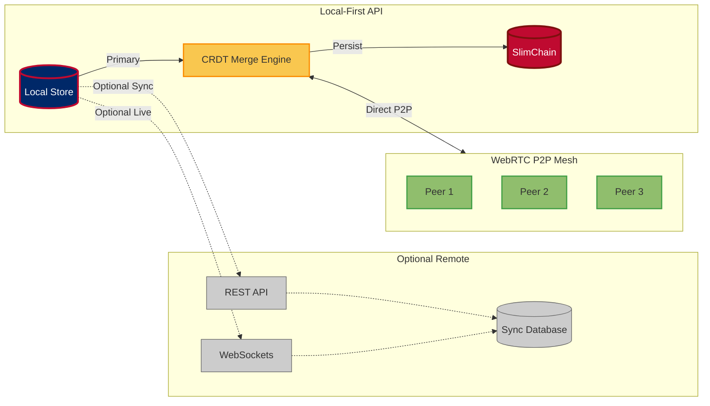

# 🔌 ForgeBoard NX API Documentation
*Last Updated: May 7, 2025*

<div style="display: flex; flex-wrap: wrap; gap: 10px; margin-bottom: 20px;">
  <div style="background-color: #002868; color: white; padding: 8px 12px; border-radius: 6px; flex: 1; min-width: 150px; box-shadow: 0 2px 4px rgba(0,0,0,0.2);">
    <strong>API Status:</strong> Stable ✅
  </div>
  <div style="background-color: #BF0A30; color: white; padding: 8px 12px; border-radius: 6px; flex: 1; min-width: 150px; box-shadow: 0 2px 4px rgba(0,0,0,0.2);">
    <strong>Version:</strong> 3.2.0 🚀
  </div>
  <div style="background-color: #F9C74F; color: #333; padding: 8px 12px; border-radius: 6px; flex: 1; min-width: 150px; box-shadow: 0 2px 4px rgba(0,0,0,0.2);">
    <strong>WebSockets:</strong> Active 📶
  </div>
  <div style="background-color: #90BE6D; color: #333; padding: 8px 12px; border-radius: 6px; flex: 1; min-width: 150px; box-shadow: 0 2px 4px rgba(0,0,0,0.2);">
    <strong>Local-First:</strong> Enabled 🔄
  </div>
</div>

## Local-First API Architecture Overview



## API Philosophy

ForgeBoard NX implements a Local-First architecture where:

1. **Device is the Source of Authority**: Your data lives on your device, not in a remote cloud
2. **P2P Communication First**: WebRTC direct connections are attempted before fallback to server
3. **CRDT for Conflict Resolution**: All data structures use conflict-free replicated data types
4. **Blockchain Immutability**: Critical data is stored in a tamper-proof blockchain

## API Layers

### Layer 1: Local Store (Primary)

All interactions in ForgeBoard NX first go through the local store, which acts as the source of authority for all data.

### Layer 2: WebRTC P2P Mesh (Synchronization)

Direct peer-to-peer communication for team collaboration without server dependency.

### Layer 3: Remote Services (Optional Fallback)

Traditional REST and WebSocket endpoints that serve as optional fallbacks when P2P is unavailable.

## API Overview

ForgeBoard uses a combination of REST APIs and WebSocket connections for real-time data exchange. This document describes both API types.

## Base URLs

- REST API: `http://localhost:3000/api`
- WebSocket: `http://localhost:3000`

## Authentication

Authentication is not yet implemented in the current version.

## WebSocket Namespaces

### Metrics Namespace

**Endpoint**: `/metrics`

This namespace provides real-time system performance metrics.

#### Events

**Server → Client (through Socket.IO namespace events):**

| Event | Description | Data Structure |
|-------|-------------|----------------|
| `system-metrics` | Real-time system metrics update | `MetricData` |

**Client → Server:**

| Event | Description | Expected Response |
|-------|-------------|-------------------|
| `subscribe-metrics` | Start receiving metric updates | Stream of `system-metrics` events |
| `set-interval` | Set the metrics update interval | Acknowledgment |

### Diagnostics Namespace

**Endpoint**: `/diagnostics`

This namespace provides system diagnostic information.

#### Events

**Server → Client (through Socket.IO namespace events):**

| Event | Description | Data Structure |
|-------|-------------|----------------|
| `socket-status` | Current status of socket connections | `SocketStatusUpdate` |
| `socket-logs` | Socket connection events log | `SocketLogEvent[]` |
| `health-update` | System health information | `HealthData` |

**Client → Server:**

| Event | Description | Expected Response |
|-------|-------------|-------------------|
| `get-socket-status` | Request current socket status | `socket-status` event |
| `get-socket-logs` | Request socket log history | `socket-logs` event |
| `get-health` | Request system health data | `health-update` event |

### Kablan Namespace

**Endpoint**: `/kablan`

This namespace provides project board data and interactions.

#### Events

**Server → Client (through Socket.IO namespace events):**

| Event | Description | Data Structure |
|-------|-------------|----------------|
| `boards-update` | Current state of all boards | `KablanBoard[]` |

**Client → Server:**

| Event | Description | Expected Response |
|-------|-------------|-------------------|
| `get-boards` | Request all available boards | `boards-update` event |
| `move-card` | Move a card to a new position | Acknowledgment + `boards-update` |

## REST API Endpoints

### Status Endpoints

#### GET /api/status

Check API availability and health status.

**Response:**
```json
{
  "status": "ok",
  "timestamp": "2023-07-15T12:34:56Z",
  "version": "1.0.0",
  "services": {
    "metrics": { "available": true, "status": "online" },
    "diagnostics": { "available": true, "status": "online" }
  }
}
```

#### GET /api/status/service/:name

Check status of a specific service.

**Response:**
```json
{
  "available": true,
  "status": "online",
  "lastUpdated": "2023-07-15T12:34:56Z"
}
```

### Metrics Endpoints

#### GET /api/metrics/status

Check metrics service health.

**Response:**
```json
{
  "status": "online",
  "timestamp": "2023-07-15T12:34:56Z"
}
```

#### GET /api/metrics/set-interval

Set the interval for metrics updates.

**Query Parameters:**
- `interval`: Update interval in milliseconds

**Response:**
```json
{
  "success": true,
  "message": "Interval updated",
  "data": { "interval": 500 },
  "timestamp": "2023-07-15T12:34:56Z"
}
```

#### POST /api/metrics/register

Register new metrics data.

**Request Body:**
```json
{
  "cpu": 45.2,
  "memory": 62.8,
  "disk": 55.1,
  "network": 32.5,
  "time": "2023-07-15T12:34:56Z"
}
```

**Response:**
```json
{
  "success": true,
  "message": "Metrics registered",
  "data": null,
  "timestamp": "2023-07-15T12:34:56Z"
}
```

### Diagnostics Endpoints

#### GET /api/diagnostics/health

Get system health information.

**Response:**
```json
{
  "status": "healthy",
  "uptime": 3600,
  "timestamp": "2023-07-15T12:34:56Z",
  "details": {
    "past": "Server started 3600 seconds ago. Initial status was 'healthy'.",
    "present": "Server is currently 'healthy' with uptime of 3600 seconds.",
    "future": "If current trends continue, the server is expected to remain 'healthy' and stable."
  }
}
```

#### GET /api/diagnostics/sockets

Get information about socket connections.

**Response:**
```json
{
  "activeSockets": [
    {
      "id": "socket123",
      "namespace": "/metrics",
      "clientIp": "127.0.0.1",
      "userAgent": "Mozilla/5.0...",
      "connectTime": "2023-07-15T12:30:00Z",
      "lastActivity": "2023-07-15T12:34:56Z"
    }
  ],
  "metrics": {
    "totalConnections": 5,
    "activeConnections": 1,
    "disconnections": 4,
    "errors": 0,
    "messagesSent": 120,
    "messagesReceived": 30
  }
}
```

### Logs Endpoints

#### GET /api/logs

Get log entries with optional filtering.

**Query Parameters:**
- `level`: Filter by log level (debug, info, warning, error)
- `source`: Filter by log source
- `from`: Filter by start date/time
- `to`: Filter by end date/time
- `limit`: Maximum number of logs to return

**Response:**
```json
{
  "logs": [
    {
      "id": "log123",
      "level": "info",
      "message": "Server started",
      "source": "app",
      "timestamp": "2023-07-15T12:30:00Z",
      "data": { "pid": 1234 }
    }
  ],
  "totalCount": 150,
  "filtered": true,
  "status": true,
  "timestamp": "2023-07-15T12:34:56Z"
}
```

#### POST /api/logs/batch

Send multiple log entries in a batch.

**Request Body:**
```json
{
  "logs": [
    {
      "level": "info",
      "message": "User login",
      "source": "auth",
      "timestamp": "2023-07-15T12:34:56Z",
      "data": { "userId": "user123" }
    },
    {
      "level": "error",
      "message": "API error",
      "source": "api",
      "timestamp": "2023-07-15T12:34:58Z",
      "data": { "status": 500, "path": "/api/users" }
    }
  ]
}
```

**Response:**
```json
{
  "success": true,
  "count": 2,
  "timestamp": "2023-07-15T12:34:59Z"
}
```

### Tiles Endpoints

#### GET /api/tiles/:userId/order

Get the tile order for a user's dashboard.

**Response:**
```json
{
  "userId": "user123",
  "order": ["metrics", "connection", "logs", "uptime", "activity"],
  "visibility": {
    "metrics": true,
    "connection": true,
    "logs": true,
    "uptime": true,
    "activity": true
  },
  "lastModified": "2023-07-15T12:34:56Z",
  "success": true
}
```

#### POST /api/tiles/:userId/order

Update the tile order for a user's dashboard.

**Request Body:**
```json
{
  "order": ["connection", "metrics", "logs", "activity", "uptime"]
}
```

**Response:**
```json
{
  "userId": "user123",
  "order": ["connection", "metrics", "logs", "activity", "uptime"],
  "visibility": {
    "metrics": true,
    "connection": true,
    "logs": true,
    "uptime": true,
    "activity": true
  },
  "lastModified": "2023-07-15T12:35:00Z",
  "success": true
}
```

## Shared API Interfaces Library

The `@forge-board/shared/api-interfaces` package provides shared TypeScript types and helper functions for both frontend and backend:

### Installation
```bash
npm install @forge-board/shared/api-interfaces
```

### Exported Types
- ApiResponse<T>         — Base REST response type
- SuccessResponse<T>     — REST success wrapper
- SocketResponse<T>      — WebSocket response wrapper
- SocketEvent            — Basic socket event shape
- SocketInfo             — Connection metadata record
- SocketMetrics          — Connection metrics counters
- SocketStatusUpdate     — Combined socket info + metrics
- SocketConnectionError  — Error payload for socket streams
- AuthCredentials        — Login request payload
- AuthTokenResponse      — JWT token response shape
- User                   — Application user record
- UserRole               — `'admin' | 'user' | 'guest'`
- JwtPayload             — JWT claims interface
- AuthState              — In‑memory auth state (user, token)
- MetricData             — System metric item
- MetricResponse         — Metric REST response wrapper
- MetricFilter           — Metric query parameters
- MetricUpdate           — Metric batch format
- DiagnosticEvent        — Diagnostic event record
- HealthData             — System health snapshot
- LogEntry               — Log record
- LogFilter              — Log query parameters
- LogQueryResponse       — Log query result wrapper
- LogBatchResponse       — Batched log POST response
- TileType               — Dashboard tile identifiers

### Runtime Helpers
- createSocketResponse(event, data)
- createSocketErrorResponse(message, data)
- __apiResponse (marker for response module)

Refer to the library's [README](libs/shared/api-interfaces/README.md) for full API, examples, and integration guidance.

## Type Definitions

Below are the core shared types used by both frontend and backend (from `@forge-board/shared/api-interfaces`):

```typescript
interface MetricData {
  cpu: number;      // CPU usage percentage
  memory: number;   // Memory usage percentage
  disk?: number;    // Optional disk usage percentage
  network?: number; // Optional network usage percentage
  time: string;     // ISO timestamp
}

interface SocketInfo {
  id: string;
  namespace: string;
  clientIp: string;
  userAgent: string;
  connectTime: string | Date;
  disconnectTime?: string | Date;
  lastActivity: string | Date;
  events: {
    type: string;
    timestamp: string | Date;
    data?: any;
  }[];
}

interface SocketMetrics {
  totalConnections: number;
  activeConnections: number;
  disconnections: number;
  errors: number;
  messagesSent: number;
  messagesReceived: number;
}

interface HealthData {
  status: string;
  uptime: number;
  timestamp: string;
  details: {
    past?: string;
    present?: string;
    future?: string;
    [key: string]: string | undefined;
  };
}

interface KablanBoard {
  id: string;
  name: string;
  columns: KablanColumn[];
  currentPhase: ProjectPhase;
  phases: {
    [key in ProjectPhase]: {
      active: boolean;
      startDate?: string;
      completionDate?: string;
    }
  };
  createdAt: string;
  updatedAt: string;
}

interface LogEntry {
  id: string;
  level: 'debug' | 'info' | 'warning' | 'error';
  message: string;
  source: string;
  timestamp: string;
  data?: Record<string, unknown>;
}

// TileType used by the UI to identify dashboard tiles
type TileType = 'metrics' | 'connection' | 'logs' | 'uptime' | 'activity' | 'kablan';
```

## Local-First & Blockchain APIs

### SlimChain API

The SlimChain API provides blockchain persistence for immutable data storage.

#### BlockchainAdapter

```typescript
// Core interface for the blockchain adapter
interface BlockchainAdapter {
  // Store data in the blockchain
  persistData<T>(data: T, metadata?: BlockMetadata): Observable<TxReceipt>;
  
  // Verify data against the blockchain
  verifyData<T>(data: T, txId: string): Observable<VerificationResult>;
  
  // Generate Merkle proof for audit purposes
  generateProof(txId: string): Observable<MerkleProof>;
  
  // Get transaction history with optional pruning
  getHistory(options?: HistoryOptions): Observable<BlockchainTransaction[]>;
  
  // Get blockchain stats (size, block count, etc.)
  getStats(): Observable<BlockchainStats>;
}

// Transaction receipt returned after successful storage
interface TxReceipt {
  txId: string;
  blockId: string;
  timestamp: string;
  success: boolean;
  hash: string;
}

// Verification result for data integrity checks
interface VerificationResult {
  verified: boolean;
  originalHash: string;
  currentHash: string;
  timestamp: string;
  modification?: BlockchainModification;
}

// Merkle proof for external audits
interface MerkleProof {
  txId: string;
  blockId: string;
  proof: string[];
  rootHash: string;
  verificationEndpoint?: string;
  qrCode?: string;
}
```

### CRDT Merge Engine

The CRDT Merge Engine handles conflict-free replicated data types for synchronization.

```typescript
// Core interface for CRDT operations
interface CRDTAdapter<T> {
  // Merge local changes with remote changes
  merge(local: T, remote: T): T;
  
  // Apply a patch to the current state
  applyPatch(current: T, patch: CRDTPatch): T;
  
  // Generate a patch from two states
  generatePatch(from: T, to: T): CRDTPatch;
  
  // Check if states can be merged without conflicts
  canMerge(local: T, remote: T): boolean;
}

// Specialized adapters for different data types
interface YjsTextAdapter extends CRDTAdapter<YjsText> {}
interface YjsMapAdapter extends CRDTAdapter<YjsMap> {}
interface YjsArrayAdapter extends CRDTAdapter<YjsArray> {}
```

### WebRTC P2P Mesh API

The WebRTC P2P Mesh API enables direct peer-to-peer communication between devices.

```typescript
// Core interface for P2P connections
interface P2PMeshService {
  // Initialize the mesh network
  initialize(): Observable<P2PStatus>;
  
  // Connect to a specific peer
  connectToPeer(peerId: string): Observable<P2PConnection>;
  
  // Broadcast data to all connected peers
  broadcast<T>(data: T): Observable<P2PDeliveryReport>;
  
  // Send data to a specific peer
  sendToPeer<T>(peerId: string, data: T): Observable<P2PDeliveryReport>;
  
  // Listen for data from any peer
  onData<T>(): Observable<P2PDataEvent<T>>;
  
  // Get connected peers
  getPeers(): Observable<P2PPeer[]>;
}

// Status of the P2P mesh network
interface P2PStatus {
  active: boolean;
  peerId: string;
  connectedPeerCount: number;
  networkLatency?: number;
}

// Connection to a specific peer
interface P2PConnection {
  peerId: string;
  connection: RTCPeerConnection;
  dataChannel: RTCDataChannel;
  status: 'connecting' | 'connected' | 'disconnected' | 'failed';
  metadata?: Record<string, unknown>;
}

// Information about data delivery
interface P2PDeliveryReport {
  success: boolean;
  deliveredTo: string[];
  failed: string[];
  timestamp: string;
}
```

## Extended Type Definitions

The following new types have been added to support Local-First architecture and blockchain persistence:

```typescript
// Blockchain-specific types
interface BlockchainTransaction {
  txId: string;
  blockId: string;
  timestamp: string;
  data: any;
  hash: string;
  signature: string;
  previousHash: string;
}

interface BlockchainStats {
  totalBlocks: number;
  totalTransactions: number;
  storageSize: number;
  lastBlockTimestamp: string;
  pruningStatus: {
    enabled: boolean;
    lastPruneDate?: string;
    prunedBlocks?: number;
  }
}

interface BlockchainModification {
  detectedAt: string;
  originalData: any;
  currentData: any;
  severity: 'low' | 'medium' | 'high' | 'critical';
}

// Local-First specific types
interface LocalFirstService<T> {
  // Get the current state from local storage
  getLocalState(): Observable<T>;
  
  // Update the local state and optionally persist to blockchain
  updateLocalState(newState: Partial<T>, persistToChain?: boolean): Observable<T>;
  
  // Sync with remote or P2P peers
  syncState(options?: SyncOptions): Observable<SyncResult<T>>;
  
  // Get blockchain-backed history of state changes
  getStateHistory(options?: HistoryOptions): Observable<StateHistoryEntry<T>[]>;
}

interface SyncOptions {
  preferP2P: boolean;
  syncTarget?: 'peer' | 'server' | 'all';
  conflictResolution?: 'local-wins' | 'remote-wins' | 'merge';
  peerIds?: string[];
}

interface SyncResult<T> {
  success: boolean;
  syncedWith: ('local' | 'peer' | 'server')[];
  conflicts: number;
  resolved: number;
  finalState: T;
}

interface StateHistoryEntry<T> {
  timestamp: string;
  state: T;
  txId?: string;
  actor?: string;
  verified: boolean;
}
```

## Patriotic Color Palette

ForgeBoard NX uses a distinctive American-inspired color palette that embodies data sovereignty:

```css
:root {
  /* Primary Colors */
  --primary-blue: #002868;    /* Deep blue representing data sovereignty */
  --primary-red: #BF0A30;     /* Vibrant red for blockchain immutability */
  --primary-white: #FFFFFF;   /* Clean white for interface clarity */
  
  /* Accent Colors */
  --accent-gold: #F9C74F;     /* Gold for highlighting important actions */
  --accent-green: #90BE6D;    /* Victory green for success states */
  
  /* Status Colors */
  --status-success: var(--accent-green);
  --status-warning: var(--accent-gold);
  --status-error: var(--primary-red);
  --status-info: var(--primary-blue);
}
```

*ForgeBoard NX — Own your data. Guard your freedom. Build Legendary.* 🦅✨
