# 🔗 ForgeBoard NX: Blockchain-Persistent Architecture
*Last Updated: May 7, 2025*

<div style="display: flex; flex-wrap: wrap; gap: 10px; margin-bottom: 20px;">
  <div style="background-color: #002868; color: white; padding: 8px 12px; border-radius: 6px; flex: 1; min-width: 150px; box-shadow: 0 2px 4px rgba(0,0,0,0.2);">
    <strong>Architecture:</strong> Local-First 🏠
  </div>
  <div style="background-color: #BF0A30; color: white; padding: 8px 12px; border-radius: 6px; flex: 1; min-width: 150px; box-shadow: 0 2px 4px rgba(0,0,0,0.2);">
    <strong>Blockchain:</strong> SlimChain 🔗
  </div>
  <div style="background-color: #F9C74F; color: #333; padding: 8px 12px; border-radius: 6px; flex: 1; min-width: 150px; box-shadow: 0 2px 4px rgba(0,0,0,0.2);">
    <strong>Implementation:</strong> Complete ✅
  </div>
  <div style="background-color: #90BE6D; color: #333; padding: 8px 12px; border-radius: 6px; flex: 1; min-width: 150px; box-shadow: 0 2px 4px rgba(0,0,0,0.2);">
    <strong>Data Sovereignty:</strong> 100% 🛡️
  </div>
</div>

> **Mission:** Fuse Local‑First sovereignty with an immutable, storage‑efficient blockchain ledger spanning **frontend**, **libs**, & **backend**.

---

## 1️⃣ Layer Map

```mermaid
flowchart TD
    subgraph Frontend (Angular 19)
        A1(UI){{Security Dashboard}}
        A2(StateSvc){{ObservableStore & ODS}}
    end

    subgraph Shared Libs (libs/blockchain)
        B1(Adapter)[BlockchainAdapter]
        B2(Models)[Typed DTOs]
        B3(Ops)[RxJS Operators]
    end

    subgraph Backend (NestJS)
        C1(Gateway){{BlockchainGateway}}
        C2(Worker)[SlimChain Worker]
        C3(Storage)[Embedded Litechain Node]
    end

    A1 --RxJS--> A2
    A2 --persistToChain$()--> B1
    B1 --DTO--> B2
    B1 --hash/sign--> C1
    C1 --enqueue--> C2
    C2 --append block--> C3
    C3 --txReceipt--> C1-->B1-->A2
```

---

## 2️⃣ Library Highlights (`libs/blockchain`)

| File | Responsibility |
|---|---|
| `blockchain.adapter.ts` | Connects RxJS streams to Litechain SDK |
| `slimchain.config.ts` | Epoch size, compression, pruning thresholds |
| `operators/persist-to-chain.ts` | `tap`, `bufferTime`, `mergeMap` → commit |
| `models/block-tx.dto.ts` | Strongly‑typed, schema‑enforced transactions |

---

## 3️⃣ Frontend Workflow


---

## 4️⃣ Backend SlimChain Worker

```mermaid
sequenceDiagram
    autonumber
    participant GW as BlockchainGateway
    participant WK as Worker
    participant DB as Litechain Node
    GW->>WK: enqueue(tx)
    WK->>WK: compress+sign
    WK->>DB: appendBlock()
    DB-->>WK: receipt
    WK-->>GW: ack
```



---

## 5️⃣ Storage‑Efficiency Cheatsheet

| Setting | Default | Effect |
|---|---|---|
| `EPOCH_SIZE` | 10 000 tx | Snapshot & prune interval |
| `COMPRESSION` | Zstd level 3 | 75 % shrink |
| `LOCAL_RETENTION_MB` | 512 | Keeps chain ≤ 512 MB |
| `ARCHIVE_TARGET` | `~/ForgeBoard/archive` | Auto‑move old epochs |

---

## 6️⃣ Dev‑Ops Commands

```bash
# libs/blockchain/scripts
pnpm run litechain:init        # create local node
pnpm run litechain:prune       # manual prune
nx serve backend --blockchain  # launch NestJS with GW
nx serve frontend              # hot‑reload Angular
```

---

## 7️⃣ Roadmap

1. **Merkle‑Proof Export** for external auditors (PDF w/ QR).  
2. **WebRTC‑Mesh Sync** to enable LAN peer redundancy.  
3. **Zero‑Knowledge Roll‑ups** for FedRAMP evidence without raw data leaks.

---

**Legendary Outcome:** A fully auditable, tamper‑proof security ledger that scales from developer laptop to air‑gapped datacenter—all while preserving true Local‑First data ownership.
