# 🔗 ForgeBoard NX: Blockchain-Persistent Architecture
*Last Updated: May 15, 2025*

<div style="display: flex; flex-wrap: wrap; gap: 10px; margin-bottom: 20px;">
  <div style="background-color: #002868; color: white; padding: 8px 12px; border-radius: 6px; flex: 1; min-width: 150px; box-shadow: 0 2px 4px rgba(0,0,0,0.2);">
    <strong>Architecture:</strong> Server-Authoritative 🛡️
  </div>
  <div style="background-color: #BF0A30; color: white; padding: 8px 12px; border-radius: 6px; flex: 1; min-width: 150px; box-shadow: 0 2px 4px rgba(0,0,0,0.2);">
    <strong>Blockchain:</strong> SlimChain (Server-Managed) 🔗
  </div>
  <div style="background-color: #F9C74F; color: #333; padding: 8px 12px; border-radius: 6px; flex: 1; min-width: 150px; box-shadow: 0 2px 4px rgba(0,0,0,0.2);">
    <strong>Implementation:</strong> Complete ✅
  </div>
  <div style="background-color: #90BE6D; color: #333; padding: 8px 12px; border-radius: 6px; flex: 1; min-width: 150px; box-shadow: 0 2px 4px rgba(0,0,0,0.2);">
    <strong>Data Provenance:</strong> Server-Managed & 100% 🛡️
  </div>
</div>

> **Mission:** Provide unbroken data provenance through an immutable, server-managed, storage‑efficient blockchain ledger that verifies the complete lifecycle of all data from inception through disposal.

## 1️⃣ Data Provenance Architecture (Server-Centric)

ForgeBoard's blockchain architecture, managed on the server, serves as the cryptographic foundation for complete data provenance tracking across the entire data lifecycle:

```mermaid
flowchart TD
    subgraph Frontend (Angular 19)
        A1(UI){{Security Dashboard}}
        A2(StateSvc){{ProvenanceStore & ODS}}
        A3(Crypto){{SignatureService}}
    end

    subgraph Shared Libs (libs/blockchain)
        B1(Adapter)[ProvenanceAdapter]
        B2(Models)[ProvenanceChain DTOs]
        B3(Ops)[RxJS Provenance Operators]
    end

    subgraph Backend (NestJS)
        C1(Gateway){{ProvenanceGateway}}
        C2(Worker)[ProvenanceWorker]
        C3(Storage)[Immutable Ledger]
    end

    A1 --"View Data Lineage"--> A2
    A3 --"Sign Transitions"--> A2
    A2 --"persistProvenance$()"--> B1
    B1 --"Data Lifecycle DTOs"--> B2
    B1 --"Verify & Hash"--> C1
    C1 --"Enqueue Transition"--> C2
    C2 --"Tamper-Proof Append"--> C3
    C3 --"Proof Receipt"--> A2
```

## 2️⃣ Library Highlights: Data Provenance Focus

| File | Data Provenance Responsibility |
|---|---|
| `provenance.adapter.ts` | Connects data lifecycle events to verifiable blockchain records |
| `provenance.config.ts` | Controls retention periods, verification methods, and proof generation |
| `operators/track-provenance.ts` | RxJS operators for tracking complete data lineage |
| `models/provenance-record.dto.ts` | Strongly‑typed, schema‑enforced data lifecycle transitions |
| `services/merkle-proof.service.ts` | Generates cryptographic proofs of data existence and integrity |

## 3️⃣ Data Lifecycle Tracking

```mermaid
gantt
    title Complete Data Lifecycle Tracking
    dateFormat  X
    section Provenance Chain
    Data inception         : 0, 1
    External query         : 1, 1
    Response received      : 2, 1
    Verification complete  : 3, 1
    Storage committed      : 4, 1
    Processing event       : 5, 1
    Optional sync          : 6, 1
    Disposal verified      : 7, 1
```



---

## 4️⃣ Backend SlimChain Worker

```mermaid
sequenceDiagram
    autonumber
    participant GW as BlockchainGateway
    participant WK as Worker
    participant DB as Litechain Node
    GW->>WK: enqueue(tx)
    WK->>WK: compress+sign
    WK->>DB: appendBlock()
    DB-->>WK: receipt
    WK-->>GW: ack
```



---

## 5️⃣ Data Provenance Guarantees

ForgeBoard's SlimChain architecture provides these key data provenance guarantees:

| Provenance Guarantee | Implementation | Benefit |
|---|---|---|
| **Origin Verification** | Digital signatures on inception records | Cryptographic proof of data source |
| **Chain of Custody** | Unbroken hash chain of all transitions | Complete visibility into who accessed data and when |
| **Transition Proofs** | Signed state transitions with purpose binding | Every transformation is justified and attributable |
| **Tamper Evidence** | Merkle tree proof generation | Impossible to modify data without detection |
| **Temporal Proof** | RFC 3161 compliant trusted timestamps | Legally admissible proof of when events occurred |
| **Disposal Verification** | Cryptographic disposal certificates | Proof that data was properly destroyed when required |

## 6️⃣ Dev‑Ops Commands for Provenance Verification

```bash
# libs/blockchain/scripts
pnpm run provenance:verify      # verify data chain integrity
pnpm run provenance:export      # export provenance chain to PDF
pnpm run provenance:track       # show complete data lifecycle
pnpm run provenance:audit       # generate FedRAMP-ready audit report
```

## 7️⃣ Future Data Provenance Roadmap

1. **Zero-Knowledge Proofs** for privacy-preserving provenance verification (Q4 2025)  
2. **Cross-Chain Attestations** for multi-system provenance tracking (Q1 2026)  
3. **Quantum-Resistant Signatures** to future-proof provenance chains (Q2 2026)  

---

**Legendary Outcome:** Complete cryptographic tracking of data from birth to grave—ensuring unmodified, verified data with full accountability at every step of its lifecycle.
