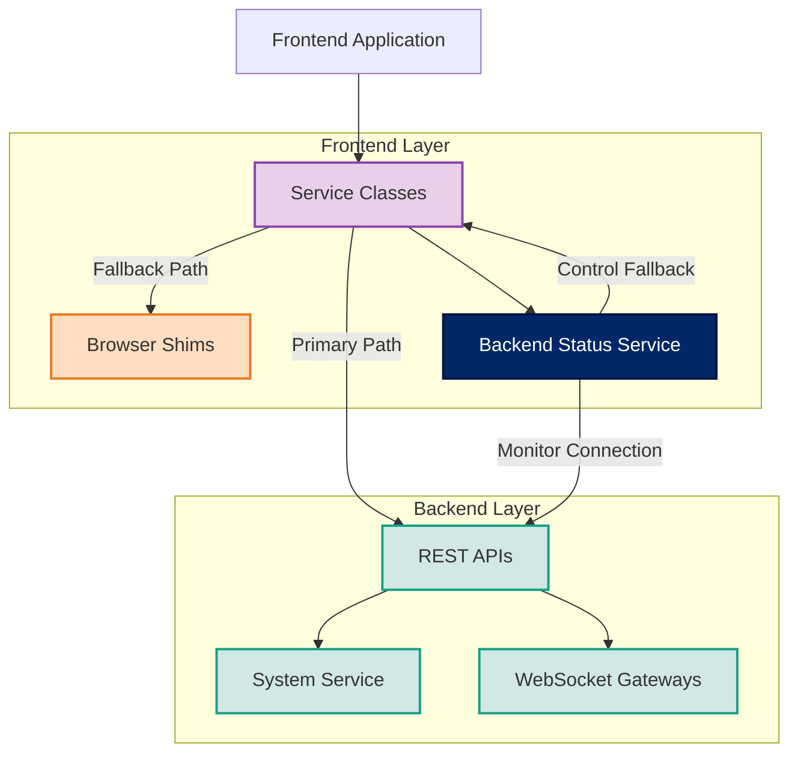

# 🌟 FORGE BOARD BROWSER SHIMS ARCHITECTURE 🌟

<div style="display: flex; flex-wrap: wrap; gap: 10px; margin-bottom: 20px;">
  <div style="background-color: #002868; color: white; padding: 8px 12px; border-radius: 6px; flex: 1; min-width: 150px; box-shadow: 0 2px 4px rgba(0,0,0,0.2);">
    <strong>Architecture:</strong> Hybrid API-First ✓
  </div>
  <div style="background-color: #BF0A30; color: white; padding: 8px 12px; border-radius: 6px; flex: 1; min-width: 150px; box-shadow: 0 2px 4px rgba(0,0,0,0.2);">
    <strong>Offline Support:</strong> Fallback Shims ✓
  </div>
  <div style="background-color: #F9C74F; color: #333; padding: 8px 12px; border-radius: 6px; flex: 1; min-width: 150px; box-shadow: 0 2px 4px rgba(0,0,0,0.2);">
    <strong>Security Level:</strong> Backend Preferred 🔒
  </div>
  <div style="background-color: #90BE6D; color: #333; padding: 8px 12px; border-radius: 6px; flex: 1; min-width: 150px; box-shadow: 0 2px 4px rgba(0,0,0,0.2);">
    <strong>Status:</strong> Production-Ready 🚀
  </div>
</div>

## 🔍 Overview

Forge Board implements a **hybrid approach** to browser compatibility:

1. **API-First Architecture**: All core operations are implemented in backend APIs
2. **Browser Shims for Offline Use**: Fallback implementations when backend is unavailable
3. **Clear UX Indicators**: Visual feedback when using offline/fallback implementations
4. **Strong Typing**: Every interaction with shims is fully typed for developer safety

## 📐 Architecture Diagram



## ⚙️ Core Components

### 1. Browser Shims

Provide minimal implementations of Node.js modules in the browser:

```typescript
// Example: Crypto shim
export function createHash(algorithm = 'sha256'): Hash {
  console.log(`[Shim] Crypto.createHash called with algorithm: ${algorithm}`);
  return new Hash(algorithm);
}

// Used when backend unavailable:
const hash = cryptoShim.createHash('sha256');
hash.update(data);
const digest = hash.digest('hex');
```

### 2. Backend Status Service

Tracks connection status to all backend services:

```typescript
// Component using backend status
this.backendStatusService.getStatus().subscribe(status => {
  this.usingMockData = status.anyMockData;
  
  // Update UI to indicate data source
  this.dataSourceClass = this.usingMockData ? 'mock-data' : 'live-data';
});
```

### 3. Service Wrappers

Each service tries backend APIs first, falling back to shims when needed:

```typescript
createHash(algorithm: string, data: string): Observable<string> {
  return this.http.post<HashResponse>('/api/crypto/hash', { algorithm, data }).pipe(
    map(response => response.hash),
    catchError(error => {
      console.warn('Server unavailable, using shim');
      this.backendStatusService.updateGatewayStatus('crypto', false, true);
      
      // Fallback to shim
      const hash = cryptoShim.createHash(algorithm);
      hash.update(data);
      return of(hash.digest('hex') as string);
    })
  );
}
```

## 🛠 Implemented Shims

| Module | Primary Use | Security Level | Fallback Implementation |
|--------|-------------|----------------|-------------------------|
| crypto | Hash & random values | High (use backend) | Web Crypto API |
| path | Path manipulation | Low | Pure JS implementation |
| os | System information | Medium | Browser UA detection |
| stream | Data streaming | Medium | Custom implementation |
| perf-hooks | Performance metrics | Low | Performance API |

## 🔄 Usage Flow

1. **Service Call**: Component calls service method (e.g., `generateHash()`)
2. **API Attempt**: Service attempts to call backend API
3. **Status Check**: BackendStatusService monitors connection result
4. **Fallback Logic**:
   - If API succeeds: Return result
   - If API fails: Use shim, update status, display indicator

## 🎯 Best Practices

### Always Use Service Wrappers

✅ **DO**: Use service wrappers for all Node.js-like functionality:
```typescript
// CORRECT: Use service wrapper
this.cryptoService.createHash('sha256', password).subscribe(hash => {...});
```

❌ **DON'T**: Import shims directly in components:
```typescript
// WRONG: Direct shim import in component 
import * as crypto from '../shims/crypto';
const hash = crypto.createHash('sha256').update(password).digest('hex');
```

### Clearly Indicate Fallback Mode

✅ **DO**: Show clear indicators when using fallback mode:
```html
<div class="data-status-indicator" [ngClass]="usingMockData ? 'mock-mode' : 'online-mode'">
  <mat-icon>{{ usingMockData ? 'cloud_off' : 'cloud_done' }}</mat-icon>
  {{ usingMockData ? 'Using local data' : 'Connected to backend' }}
</div>
```

### Security-Sensitive Operations

✅ **DO**: Move security-sensitive operations to backend:
```typescript
// CORRECT: Server-side encryption
this.http.post<EncryptionResponse>('/api/crypto/encrypt', {
  data: sensitiveData, 
  publicKey: publicKeyId
});
```

❌ **DON'T**: Perform sensitive crypto in browser:
```typescript
// WRONG: Client-side encryption of sensitive data
const encrypted = cryptoShim.publicEncrypt(publicKey, Buffer.from(sensitiveData));
```

## 🚀 Future Roadmap

1. **Service Worker Integration**: Cache API responses for improved offline experience
2. **IndexedDB Storage**: Store and sync data during offline operation
3. **Progressive Enhancement**: Enable more features when backend is available
4. **Selective Endpoint Fallbacks**: More granular fallback strategies per endpoint

---

<div align="center" style="background-color: #002868; color: white; padding: 10px; border-radius: 6px; margin-top: 20px;">
  <div style="font-size:24px;">★ FORGE BOARD ★</div>
  <div style="color: #BF0A30; background: white; padding: 4px; border-radius: 4px; margin-top: 4px;">BROWSER SHIMS ARCHITECTURE</div>
</div>
