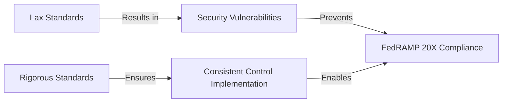
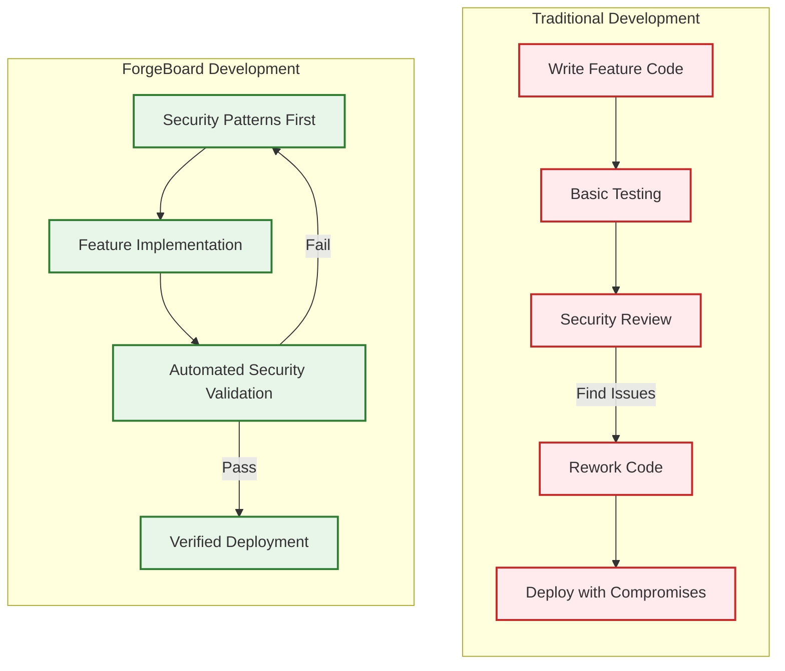

# ForgeBoard NX: The Philosophy Behind Our Rigorous Coding Standards

*Last Updated: May 7, 2025*

  

    <strong>Standards:</strong> Non-Negotiable ✓
  

  

    <strong>Compliance:</strong> FedRAMP 20X 🔒
  

  

    <strong>Architecture:</strong> Local-First 🏠
  

  

    <strong>Purpose:</strong> Data Sovereignty 🛡️
  

## Why Our Coding Standards Are Necessarily Rigorous

At first glance, ForgeBoard NX's coding standards may appear unusually strict or "draconian." However, these standards aren't arbitrary restrictions—they are the essential foundation that enables us to meet our extraordinary commitments to **data sovereignty**, **security compliance**, and **true Local-First architecture**.

### 1. FedRAMP 20X Compliance Demands Precision

ForgeBoard operates in environments where compliance isn't optional—it's mandatory. The FedRAMP 20X framework (released July 2025) introduces the most stringent security requirements yet for federal cloud systems:

- Our coding patterns must create **verifiable security controls** that map directly to NIST SP 800-53 Rev 5 requirements
- The **blockchain-based auditing** requires specific persistence patterns that cannot be modified ad-hoc
- **SBOM (Software Bill of Materials)** generation demands consistent, traceable code structures
- **Zero Trust Architecture** principles must be embedded in every data access pattern

These aren't merely "best practices"—they're legal requirements with potential penalties for non-compliance.

### 2. True Local-First Architecture Requires Discipline

Unlike most applications that merely cache data locally, ForgeBoard NX implements <b>true Local-First architecture</b> where your device is the authoritative source of truth. This fundamental inversion of the traditional client-server model requires rigorously consistent patterns.

Our Local-First approach delivers unmatched benefits:

- Complete data ownership and sovereignty
- Offline-first operation with no degraded experience
- Peer-to-peer collaboration without central servers
- Cryptographically verifiable audit trails

However, these benefits come with architectural constraints that cannot be compromised:

- **ObservableStore Pattern**: Enforcing immutable state management prevents data corruption during sync
- **CRDT Data Types**: Requiring specific Conflict-free Replicated Data Types ensures deterministic merges across devices
- **WebRTC Communication**: Our connection strategies must follow explicit patterns to maintain security during P2P operations
- **Blockchain Persistence**: Data integrity depends on consistent hashing and signing patterns

### 3. Security at the Core, Not as an Afterthought

In ForgeBoard NX, security isn't a layer added later—it's the fundamental architecture:

- **Shared DTOs**: Our strict typing system means data validation happens consistently across all layers
- **RxJS Patterns**: Required cleanup and error handling prevents memory leaks and unhandled promises
- **Persistence Operators**: Standardized blockchain operations ensure tamper-evident audit trails
- **Presentation Components**: UI patterns that separate smart vs. dumb components prevent accidental data exposure

### 4. Maintainability at Scale Requires Consistency

ForgeBoard NX is designed for large, distributed teams working on critical infrastructure. The rigid standards create an environment where:

- New developers can quickly understand code patterns regardless of which team wrote them
- Automated testing can rely on consistent structures
- Security scanning tools can validate compliance across the entire codebase
- Cross-team collaboration works seamlessly

### 5. Our Patriotic Mission and Visual Identity

<table style="border-collapse: collapse; width: 100%; border: 2px solid #0C2677; box-shadow: 0 2px 5px rgba(0,0,0,0.1);">
  <thead>
    <tr style="background-color: #0C2677; color: white;">
      <th style="border: 1px solid #071442; padding: 10px; font-weight: bold;">Color</th>
      <th style="border: 1px solid #071442; padding: 10px; font-weight: bold;">Hex Code</th>
      <th style="border: 1px solid #071442; padding: 10px; font-weight: bold;">Represents</th>
    </tr>
  </thead>
  <tbody>
    <tr style="background-color: #F0F4FF;">
      <td style="border: 1px solid #AAB6D3; padding: 10px;"><b>Deep Blue</b></td>
      <td style="border: 1px solid #AAB6D3; padding: 10px; font-family: monospace;">#002868</td>
      <td style="border: 1px solid #AAB6D3; padding: 10px;">Data sovereignty, trust, and stability</td>
    </tr>
    <tr style="background-color: #FFE8E8;">
      <td style="border: 1px solid #AAB6D3; padding: 10px;"><b>Vibrant Red</b></td>
      <td style="border: 1px solid #AAB6D3; padding: 10px; font-family: monospace;">#BF0A30</td>
      <td style="border: 1px solid #AAB6D3; padding: 10px;">Strength, security, and immutable blockchain</td>
    </tr>
    <tr style="background-color: #F0F4FF;">
      <td style="border: 1px solid #AAB6D3; padding: 10px;"><b>Clean White</b></td>
      <td style="border: 1px solid #AAB6D3; padding: 10px; font-family: monospace;">#FFFFFF</td>
      <td style="border: 1px solid #AAB6D3; padding: 10px;">Transparency, clarity, and integrity</td>
    </tr>
    <tr style="background-color: #FFE8E8;">
      <td style="border: 1px solid #AAB6D3; padding: 10px;"><b>Gold Accent</b></td>
      <td style="border: 1px solid #AAB6D3; padding: 10px; font-family: monospace;">#F9C74F</td>
      <td style="border: 1px solid #AAB6D3; padding: 10px;">Value, excellence, and highlighted actions</td>
    </tr>
    <tr style="background-color: #F0F4FF;">
      <td style="border: 1px solid #AAB6D3; padding: 10px;"><b>Victory Green</b></td>
      <td style="border: 1px solid #AAB6D3; padding: 10px; font-family: monospace;">#90BE6D</td>
      <td style="border: 1px solid #AAB6D3; padding: 10px;">Success, achievement, and positive status</td>
    </tr>
  </tbody>
</table>

Our patriotic color scheme isn't just aesthetic—it reflects our mission to restore data sovereignty to American enterprises and government agencies. Our visual identity reinforces this mission across all UI elements, documentation, and code comments.

## Embracing the Standards

Rather than viewing these standards as restrictions, we encourage developers to see them as the framework that enables ForgeBoard NX to deliver its revolutionary capabilities. When you follow these patterns, you're not just writing code—you're:

- Ensuring FedRAMP 20X compliance for critical systems
- Protecting sensitive government data from unauthorized access
- Delivering true data sovereignty to organizations
- Building a system that respects user freedom and privacy
- Contributing to a more secure, sovereign digital infrastructure

## Tools to Help You Succeed

We provide comprehensive tooling to help developers meet these standards:

- **ESLint Rules**: Custom rules that enforce security patterns automatically
- **Code Generators**: NX generators that scaffold components following our patterns
- **CI/CD Validation**: Pipeline checks that prevent non-compliant code from merging
- **Documentation**: Extensive examples and explanations of each pattern
- **Pair Programming**: Regular sessions with security architects

## Conclusion

Our coding standards aren't rigid for rigidity's sake—they're precise because the mission demands precision. When federal systems, sensitive data, and user sovereignty are at stake, "good enough" simply isn't good enough. 

These standards are the foundation that allows ForgeBoard NX to deliver its revolutionary promise: a fully-compliant, truly Local-First, cryptographically secure platform that puts data back in the hands of its rightful owners.

*ForgeBoard NX — Own your data. Guard your freedom. Build Legendary.* 🦅✨
