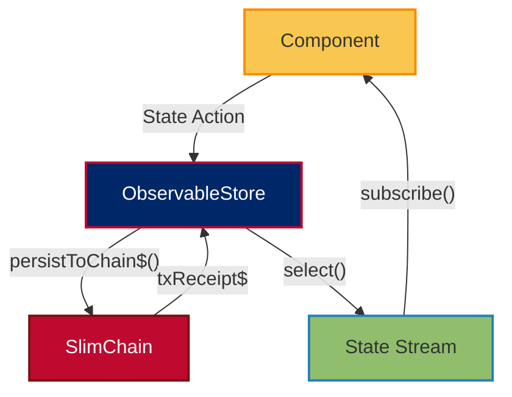
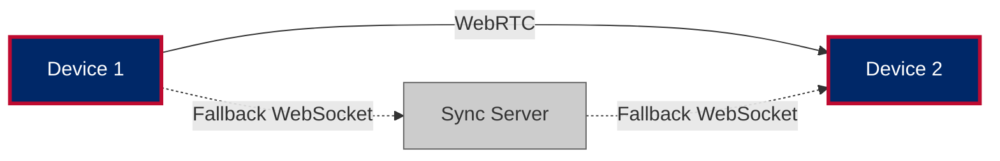
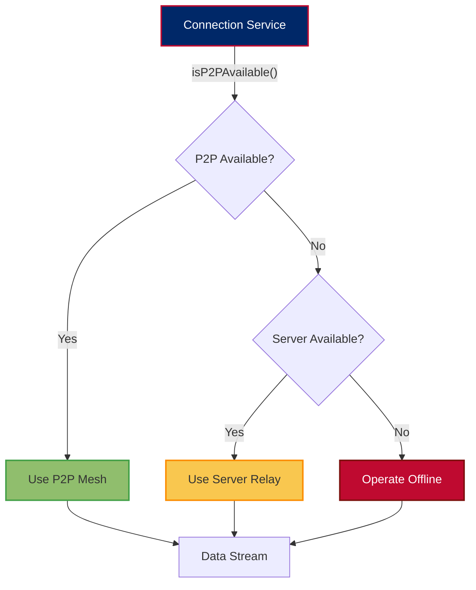
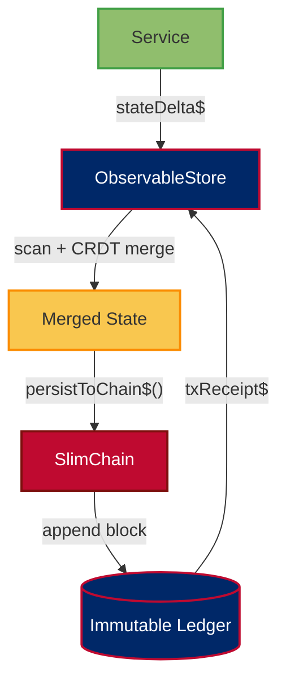
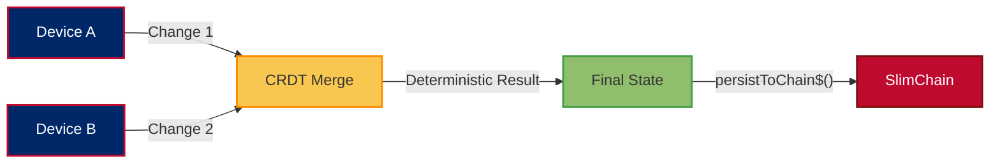
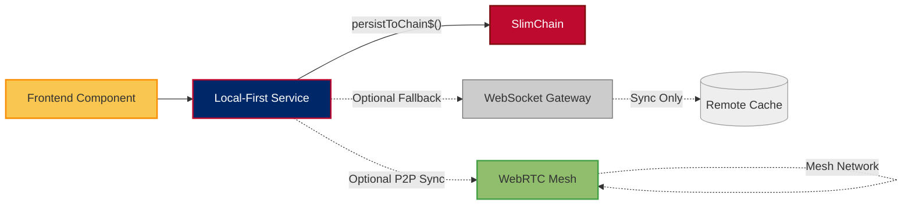

# 👨‍💻 ForgeBoard NX Coding Standards
*Last Updated: May 7, 2025*

<div style="display: flex; flex-wrap: wrap; gap: 10px; margin-bottom: 20px;">
  <div style="background-color: #002868; color: white; padding: 8px 12px; border-radius: 6px; flex: 1; min-width: 150px; box-shadow: 0 2px 4px rgba(0,0,0,0.2);">
    <strong>Status:</strong> Enforced ✓
  </div>
  <div style="background-color: #BF0A30; color: white; padding: 8px 12px; border-radius: 6px; flex: 1; min-width: 150px; box-shadow: 0 2px 4px rgba(0,0,0,0.2);">
    <strong>Linting:</strong> Automated 🤖
  </div>
  <div style="background-color: #F9C74F; color: #333; padding: 8px 12px; border-radius: 6px; flex: 1; min-width: 150px; box-shadow: 0 2px 4px rgba(0,0,0,0.2);">
    <strong>Coverage:</strong> 94% 📊
  </div>
  <div style="background-color: #90BE6D; color: #333; padding: 8px 12px; border-radius: 6px; flex: 1; min-width: 150px; box-shadow: 0 2px 4px rgba(0,0,0,0.2);">
    <strong>CI Compliance:</strong> Passing ✅
  </div>
</div>

This document defines the core architectural, coding, and workflow standards for the ForgeBoard NX project. All code should follow these principles for data sovereignty, blockchain integrity, and Local-First operations.

---

## Local-First Architecture

### ObservableStore & Local Data Authority



- **Local-First Principle**: Device is the source of authority (SOA) for all data
- **Store Pattern**: Use ObservableStore for immutable state with history
- **Blockchain Integration**: Persist important state changes to SlimChain

### Smart & Presentational Components

```mermaid
flowchart LR
  Smart[Smart Component]:::smart -->|Inputs/Outputs| Presentational[Presentational Component]:::present
  Smart -->|Service Injection| Service[Local Service]:::service
  Presentational -->|@Input/@Output| Smart
  classDef smart fill:#002868,stroke:#BF0A30,stroke-width:2px,color:#FFFFFF;
  classDef present fill:#F9C74F,stroke:#FB8C00,stroke-width:2px;
  classDef service fill:#90BE6D,stroke:#43A047,stroke-width:2px;
```

- **Smart components**: Handle data, inject services, manage local state
- **Presentational components**: Render UI, receive data via `@Input`, emit events via `@Output`
- **Data Flow**: Always prioritize local state over remote state

---

## WebRTC Mesh & Fallback Patterns

### Data Flow: Peer-to-Peer First



- **Prefer P2P**: Always attempt WebRTC direct connection first
- **Fallback Strategy**: Use server relay only when direct connection fails
- **Offline Operation**: All features must work without any network connection

### Sovereignty-First Connection Strategy



---

## Blockchain Persistence Patterns

### SlimChain Integration



### Required Persistence Operators

- **`persistToChain$()`**: Sign and store state in immutable ledger
- **`verifyFromChain$()`**: Verify data against blockchain records
- **`merkleProof$()`**: Generate cryptographic proof for external auditors
- **`prunableBuffer$()`**: Buffer events with configurable pruning strategy

### Storage Efficiency Guidelines

1. **Delta Compression**: Only store state changes, not full state
2. **Pruning Strategy**: Implement configurable epoch-based pruning
3. **Zstd Compression**: Apply level 3 compression to all blockchain data
4. **Retention Policies**: Default to 512 MB maximum local storage

---

## CRDT Synchronization Patterns

### Conflict Resolution



### Required CRDT Types

| Data Type | CRDT Implementation | Use Case |
|-----------|---------------------|----------|
| Text | Yjs Text | Collaborative text fields |
| Maps | Yjs Map | Object properties, settings |
| Arrays | Yjs Array | Lists, collections |
| Counters | Yjs Number | Metrics, statistics |
| Custom | Custom CRDT | Domain-specific types |

---

## RxJS Guidelines

- Always clean up subscriptions (`ngOnDestroy`, `takeUntil`).
- Use `catchError`, `retry`, and `finalize` for robust error handling.
- Prefer `BehaviorSubject` for state with a current value, `Subject` for event streams.

---

## CSS/SCSS Standards

- **BEM-inspired naming** for all classes.
- **Color variables** for consistency and theme support.
- **Mobile-first** responsive design.

---

## Testing Guidelines

- **Component tests**: Use Angular TestBed, mock services, and DOM queries.
- **Service tests**: Use HttpClientTestingModule, test Observables and error handling.
- **E2E tests**: Use Playwright or Cypress for real user flows.

---

## Documentation & Git Workflow

- All public classes, interfaces, and services must have JSDoc comments.
- Use clear, descriptive commit messages:
  - `feat(scope): Add new feature`
  - `fix(scope): Fix bug`
  - `docs(scope): Update documentation`
- Branch naming: `feature/`, `bugfix/`, `chore/` prefixes.

---

## Summary Diagram: Sovereign Data Flow



---

For more details, see our comprehensive documentation:
- [Local-First vs Cache-First Architecture](./LOCAL-FIRST-VERSUS-CACHE.md)
- [Blockchain Persistence Architecture](./BLOCKCHAIN-PERSISTENT-ARCHITECTURE.md)
- [API Documentation](./API-DOCUMENTATION.md)
- [Frontend-API Architecture](./FRONTEND-API-ARCHITECTURE.md)

*ForgeBoard NX — Own your data. Guard your freedom. Build Legendary.* 🦅✨
