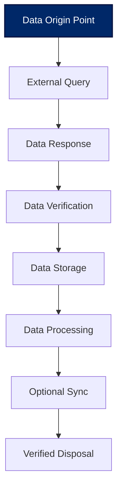
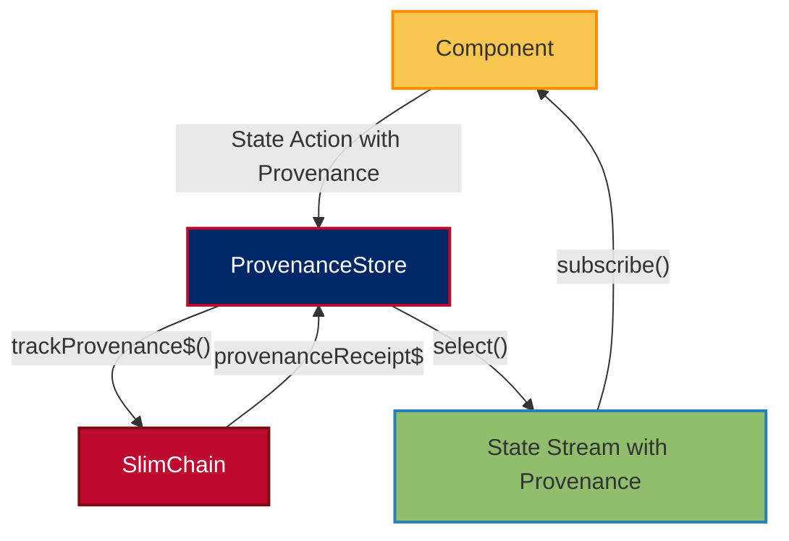
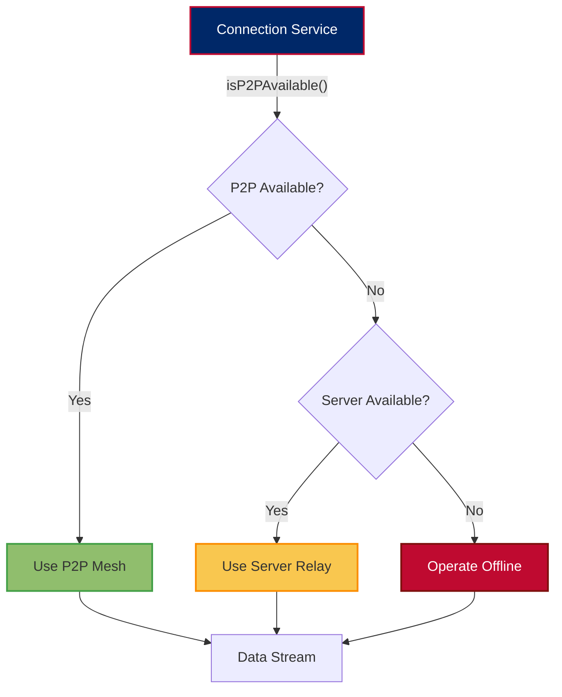
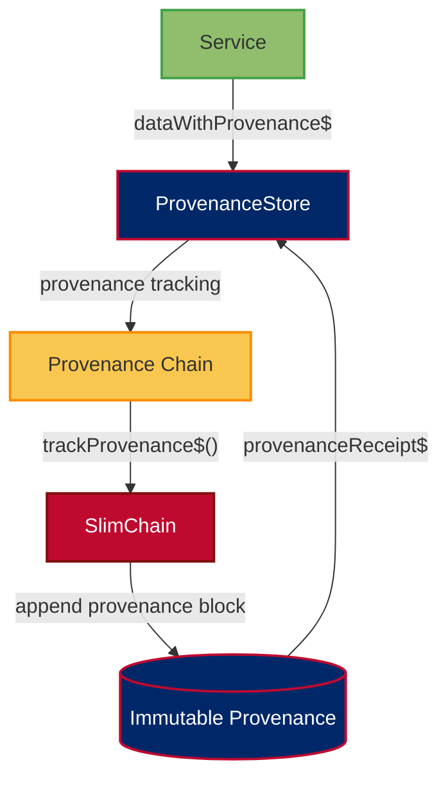
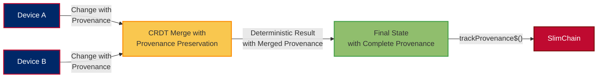
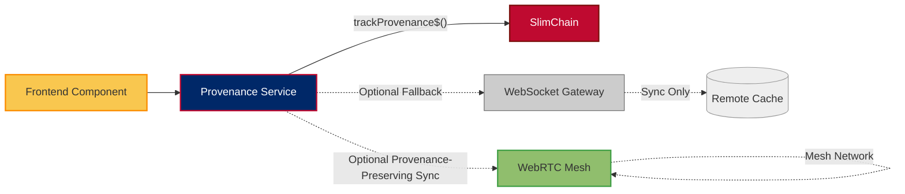

# 👨‍💻 ForgeBoard NX Coding Standards

*Last Updated: May 15, 2025*

  

    <strong>Code:</strong> TypeScript ✨
  

  

    <strong>Architecture:</strong> Local-First 🏠
  

  

    <strong>Standard:</strong> SonarQube A+ 🥇
  

  

    <strong>Data Provenance:</strong> Complete 🔄
  

## Data Provenance Patterns

### Complete Lifecycle Tracking

- **Data Provenance Principle**: Every data element must have a complete, verifiable lifecycle
- **Lifecycle Transitions**: All state changes must include provenance metadata
- **Verification Requirements**: Every data transition must be cryptographically verifiable
- **Attribution**: All data operations must have clear, non-repudiable attribution

### Required Provenance Operators

- **`trackProvenance$()`**: Capture complete data provenance for all data operations
- **`verifyProvenance$()`**: Verify the integrity of provenance chains
- **`transitionStage$()`**: Move data to next lifecycle stage with appropriate metadata
- **`generateProvenanceReport$()`**: Create audit-ready provenance documentation

## Local-First Architecture

### ProvenanceStore & Data Authority

- **Local-First Principle**: Device is the source of authority (SOA) for all data
- **Store Pattern**: Use ProvenanceStore for immutable state with complete provenance history
- **Blockchain Integration**: Persist provenance chains to SlimChain for verification
- **Provenance Requirements**: All state transitions must include complete provenance metadata

---

## WebRTC Mesh & Fallback Patterns

### Data Flow: Peer-to-Peer First

- **Prefer P2P**: Always attempt WebRTC direct connection first
- **Fallback Strategy**: Use server relay only when direct connection fails
- **Offline Operation**: All features must work without any network connection

### Sovereignty-First Connection Strategy

---

## Blockchain Persistence Patterns

### SlimChain Integration for Provenance

### Required Provenance Operators

- **`trackProvenance$()`**: Capture and verify data origin, transitions, and handling
- **`verifyProvenanceChain$()`**: Verify complete data lineage against blockchain records
- **`provenanceMerkleProof$()`**: Generate cryptographic proof for provenance validation
- **`provenanceRetention$()`**: Apply configurable retention policies with disposal verification

### Storage Efficiency Guidelines

1. **Provenance Delta Compression**: Only store provenance transitions, not full state
2. **Pruning Strategy**: Implement configurable lifecycle-based pruning
3. **Zstd Compression**: Apply level 3 compression to all provenance data
4. **Retention Policies**: Default to 512 MB maximum local provenance storage

---

## CRDT Synchronization Patterns

### Conflict Resolution with Provenance Preservation

### Required CRDT Types

| Data Type | CRDT Implementation | Use Case |
|-----------|---------------------|----------|
| Text | Yjs Text | Collaborative text fields |
| Maps | Yjs Map | Object properties, settings |
| Arrays | Yjs Array | Lists, collections |
| Counters | Yjs Number | Metrics, statistics |
| Custom | Custom CRDT | Domain-specific types |

---

## RxJS Guidelines

- Always clean up subscriptions (`ngOnDestroy`, `takeUntil`).
- Use `catchError`, `retry`, and `finalize` for robust error handling.
- Prefer `BehaviorSubject` for state with a current value, `Subject` for event streams.

---

## CSS/SCSS Standards

- **BEM-inspired naming** for all classes.
- **Color variables** for consistency and theme support.
- **Mobile-first** responsive design.

---

## Testing Guidelines

- **Component tests**: Use Angular TestBed, mock services, and DOM queries.
- **Service tests**: Use HttpClientTestingModule, test Observables and error handling.
- **E2E tests**: Use Playwright or Cypress for real user flows.

---

## Documentation & Git Workflow

- All public classes, interfaces, and services must have JSDoc comments.
- Use clear, descriptive commit messages:
  - `feat(scope): Add new feature`
  - `fix(scope): Fix bug`
  - `docs(scope): Update documentation`
- Branch naming: `feature/`, `bugfix/`, `chore/` prefixes.

---

## Summary Diagram: Data Provenance Flow

---

For more details, see our comprehensive documentation:
- [Local-First Data Provenance](./LOCAL-FIRST-DATA-PROVENANCE.md)
- [Local-First vs Cache-First Architecture](./LOCAL-FIRST-VERSUS-CACHE.md)
- [Blockchain Persistence Architecture](./BLOCKCHAIN-PERSISTENT-ARCHITECTURE.md)
- [API Documentation](./API-DOCUMENTATION.md)
- [Frontend-API Architecture](./FRONTEND-API-ARCHITECTURE.md)

*ForgeBoard NX — Own your data. Guard your freedom. Build Legendary.* 🦅✨
