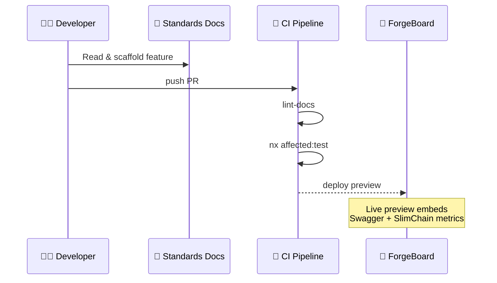

# ⭐️ ForgeBoard **EXCEEDING‑STANDARDS** Playbook

_Last Updated: May 15, 2025_

This playbook highlights specific capabilities where ForgeBoard exceeds industry standards. Rather than merely meet expectations, we set new benchmarks—especially in <strong style="color:#BF0A30;">comprehensive data provenance (server-managed)</strong>, security, and controlled data access. For detailed explanations, see the <a href="fedramp/PILLAR_MATRIX_DECONSTRUCTED.md">Pillar Matrix Deconstructed</a> document.

## 1️⃣ Where We Exceed Expectations

1. **Data Provenance**: Complete lifecycle tracking from inception through disposal with server-side cryptographic verification.
2. **Server-Authoritative Architecture**: Server is the definitive source of truth, ensuring data integrity and controlled access, with comprehensive provenance tracking.
3. **SlimChain Ledger**: Immutable, tamper-proof record keeping on the server with provenance verification.
4. **Strong Typing**: Shared DTOs across the entire stack, including provenance metadata.
5. **RXJS‑Only Reactivity**: Observable streams for efficient client-server communication, with server-originated provenance tracking operators.
6. **FedRAMP 20X Prep**: Exceeding federal security standards with complete, server-managed data lineage.
7. **Disk‑Growth Guardrails**: Efficient server-side provenance storage with compression and pruning.
8. **Patriotic UX**: American-made software with values built in.

## 2️⃣ Pillar‑to‑Doc Matrix

| 🚩 **Pillar**                        | ✨ **How We Exceed**                                                                     | 📄 **Primary Doc**                                         | 🔗 **Cross‑Refs**                                                                        |
| ------------------------------------ | ---------------------------------------------------------------------------------------- | ---------------------------------------------------------- | ---------------------------------------------------------------------------------------- |
| **Data Provenance (Server-Managed)** | Complete lifecycle tracking with server-side cryptographic verification                  | SERVER-SIDE-DATA-PROVENANCE.md (New or Updated Doc Needed) | BLOCKCHAIN-PERSISTENT-ARCHITECTURE, API-DOCUMENTATION, FRONTEND-API-ARCHITECTURE         |
| **Server-Authoritative SOA**         | Server as the single source of truth with robust access controls and provenance tracking | FRONTEND-API-ARCHITECTURE.md                               | CODING-STANDARDS.md, API-DOCUMENTATION.md                                                |
| **SlimChain Ledger**                 | Immutable, auto‑compressing blockchain store on the server with provenance verification  | BLOCKCHAIN-PERSISTENT-ARCHITECTURE.md                      | API-DOCUMENTATION (txReceipt endpoint), AUTHENTICATION (server keys)                     |
| **Strong Typing**                    | Shared DTOs across Mongoose + Litechain, including provenance metadata                   | CODING-STANDARDS.md                                        | API-DOCUMENTATION (Schema section)                                                       |
| **RXJS‑Only Reactivity**             | ObservableStore + ODS patterns for client state, with server-driven provenance tracking  | FRONTEND-API-ARCHITECTURE.md                               | CODING-STANDARDS.md                                                                      |
| **FedRAMP 20X Prep**                 | Merkle Proof exports & ZK roll‑ups for complete server-managed provenance verification   | BLOCKCHAIN-PERSISTENT-ARCHITECTURE.md                      | API-DOCUMENTATION (Evidence endpoint TODO), fedramp/FEDRAMP_DEPLOYMENT_CONSIDERATIONS.md |
| **Disk‑Growth Guardrails (Server)**  | Delta+Zstd, epochs, rotation with efficient server-side provenance storage               | BLOCKCHAIN-PERSISTENT-ARCHITECTURE.md                      | SERVER-INFRASTRUCTURE.md (New or Updated Doc Needed)                                     |
| **Patriotic UX**                     | Red‑white‑blue theme & blueprint visuals                                                 | LAYOUT.md                                                  | VISUAL-STANDARDS.md, FRONTEND-API-ARCHITECTURE                                           |

---

## 3️⃣ Standards → Practice Pipeline

_Exceeding means:_ **Docs are executable**—CI enforces that every DTO, API, and ledger op referenced here is type‑safe and covered by tests.

---

## 4️⃣ How To Grow This Playbook

1. **Add a new spec?** → Drop it in the main documentation folder (`forgeboard-frontend/src/assets/documentation/`) and update the Pillar Matrix.
2. **Update an API?** → Modify API-DOCUMENTATION.md; reference it here under the pillar it supports.
3. **Architecture drift?** → Raise an _Exceeding-Gap_ issue; CI will block merge until this file tracks the change.
4. **Need graphics?** → Use Mermaid in‑doc; diagrams auto‑render in Storybook site.

---

## 5️⃣ Next Milestones

| Target                            | ETA          | Owner          | Notes                                          |
| --------------------------------- | ------------ | -------------- | ---------------------------------------------- |
| FedRAMP Control ↔ Evidence Matrix | **Aug 2025** | Security Guild | Link as FEDRAMP-MAP.md                         |
| Key‑Rotation CLI Doc              | **Jul 2025** | Backend Guild  | Will extend BLOCKCHAIN-PERSISTENT-ARCHITECTURE |
| Mock‑Data Design Tokens Guide     | **Sep 2025** | Frontend Guild | Bridges blueprint UI & patriotic theme         |

---

> **Legendary Word:** This playbook is the north‑star that guarantees every line of ForgeBoard code pushes _beyond_ compliance into the realm of **excellence**. 🇺🇸
