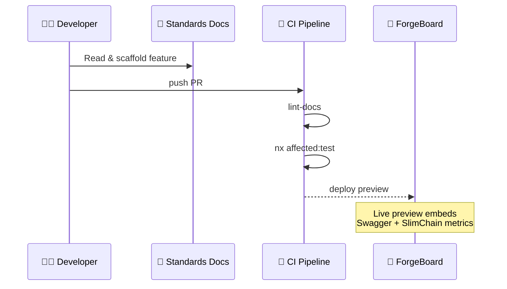

# ⭐️ ForgeBoard **EXCEEDING‑STANDARDS** Playbook 
*Last Updated: May 15, 2025*

This playbook highlights specific capabilities where ForgeBoard exceeds industry standards. Rather than merely meet expectations, we set new benchmarks—especially in <strong style="color:#BF0A30;">comprehensive data provenance</strong>, security, and sovereign control.

## 1️⃣ Where We Exceed Expectations

1. **Data Provenance**: Complete lifecycle tracking from inception through disposal with cryptographic verification
2. **Local‑First Architecture**: Device-resident authority with complete provenance tracking
3. **SlimChain Ledger**: Immutable, tamper-proof record keeping with provenance verification
4. **Strong Typing**: Shared DTOs across the entire stack, including provenance metadata
5. **RXJS‑Only Reactivity**: Observable streams with provenance tracking operators
6. **FedRAMP 20X Prep**: Exceeding federal security standards with complete data lineage
7. **Disk‑Growth Guardrails**: Efficient provenance storage with compression and pruning
8. **Patriotic UX**: American-made software with values built in

## 2️⃣ Pillar‑to‑Doc Matrix

| 🚩 **Pillar** | ✨ **How We Exceed** | 📄 **Primary Doc** | 🔗 **Cross‑Refs** |
|---|---|---|---|
| **Data Provenance** | Complete lifecycle tracking with cryptographic verification | LOCAL-FIRST-DATA-PROVENANCE.md | BLOCKCHAIN-PERSISTENT-ARCHITECTURE, API-DOCUMENTATION, FRONTEND-API-ARCHITECTURE |
| **Local‑First SOA** | Device‑resident authority with provenance tracking | LOCAL-FIRST-VERSUS-CACHE.md | Frontend-API-Architecture, Coding-Standards |
| **SlimChain Ledger** | Immutable, auto‑compressing blockchain store with provenance verification | BLOCKCHAIN-PERSISTENT-ARCHITECTURE.md | API-DOCUMENTATION (txReceipt endpoint), AUTHENTICATION (device keys) |
| **Strong Typing** | Shared DTOs across Mongoose + Litechain, including provenance metadata | Coding-Standards.md | API-DOCUMENTATION (Schema section) |
| **RXJS‑Only Reactivity** | ObservableStore + ODS patterns with provenance tracking | LOCAL-FIRST-VERSUS-CACHE.md | Frontend-API-Architecture |
| **FedRAMP 20X Prep** | Merkle Proof exports & ZK roll‑ups for complete provenance verification | BLOCKCHAIN-PERSISTENT-ARCHITECTURE.md | API-DOCUMENTATION (Evidence endpoint TODO) |
| **Disk‑Growth Guardrails** | Delta+Zstd, epochs, rotation with efficient provenance storage | LOCAL-FIRST-VERSUS-CACHE.md | BLOCKCHAIN-PERSISTENT-ARCHITECTURE |
| **Patriotic UX** | Red‑white‑blue theme & blueprint visuals | LAYOUT.md | Frontend-API-Architecture |

---

## 3️⃣ Standards → Practice Pipeline

*Exceeding means:* **Docs are executable**—CI enforces that every DTO, API, and ledger op referenced here is type‑safe and covered by tests.

---

## 4️⃣ How To Grow This Playbook

1. **Add a new spec?** → Drop it in `/docs/` and update the Pillar Matrix.  
2. **Update an API?** → Modify API-DOCUMENTATION.md; reference it here under the pillar it supports.  
3. **Architecture drift?** → Raise an *Exceeding-Gap* issue; CI will block merge until this file tracks the change.  
4. **Need graphics?** → Use Mermaid in‑doc; diagrams auto‑render in Storybook site.

---

## 5️⃣ Next Milestones

| Target | ETA | Owner | Notes |
|---|---|---|---|
| FedRAMP Control ↔ Evidence Matrix | **Aug 2025** | Security Guild | Link as FEDRAMP-MAP.md |
| Key‑Rotation CLI Doc | **Jul 2025** | Backend Guild | Will extend BLOCKCHAIN-PERSISTENT-ARCHITECTURE |
| Mock‑Data Design Tokens Guide | **Sep 2025** | Frontend Guild | Bridges blueprint UI & patriotic theme |

---

> **Legendary Word:** This playbook is the north‑star that guarantees every line of ForgeBoard code pushes *beyond* compliance into the realm of **excellence**. 🇺🇸
