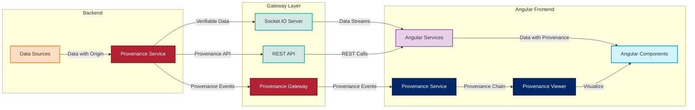
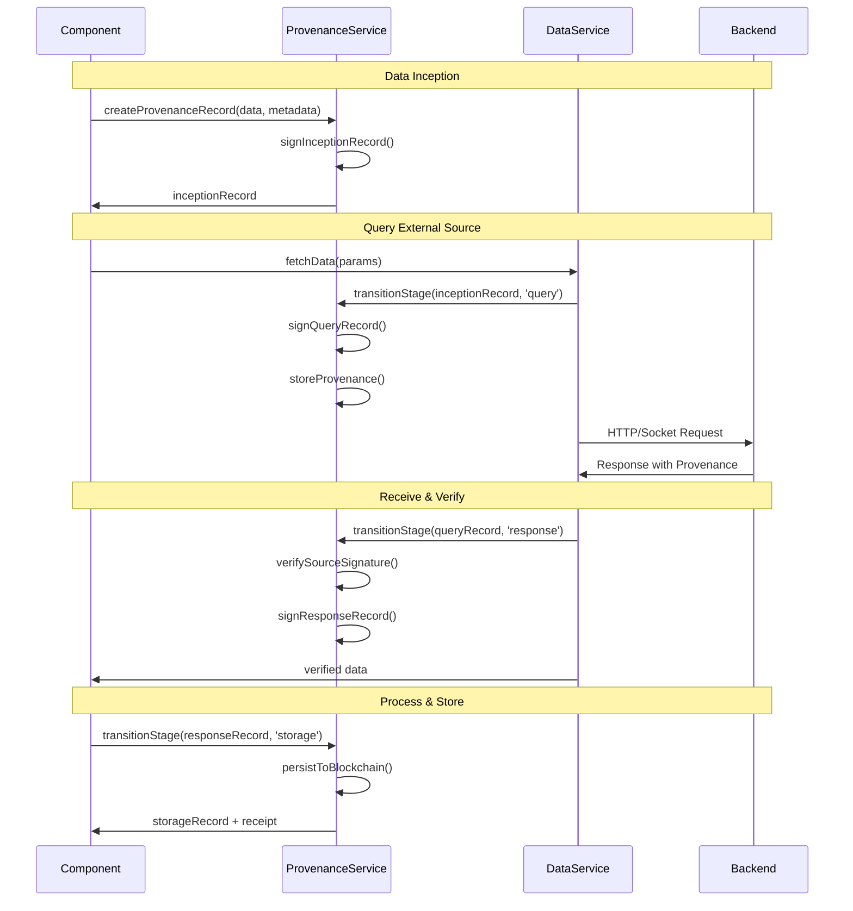
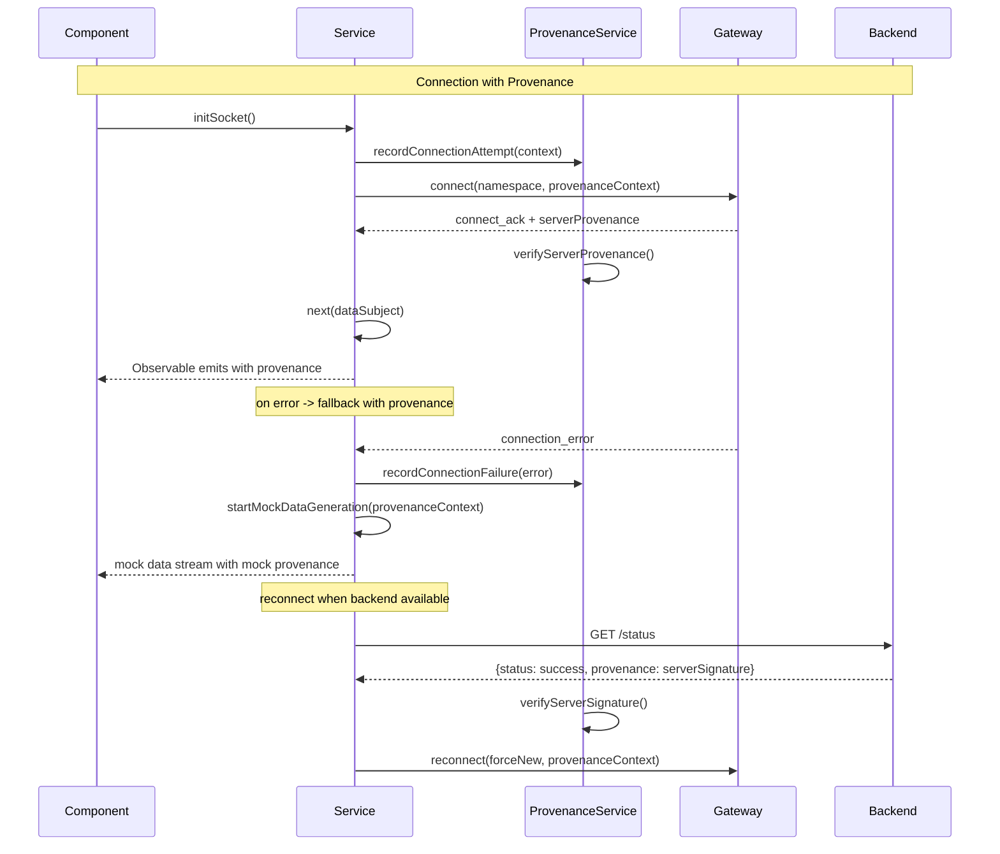
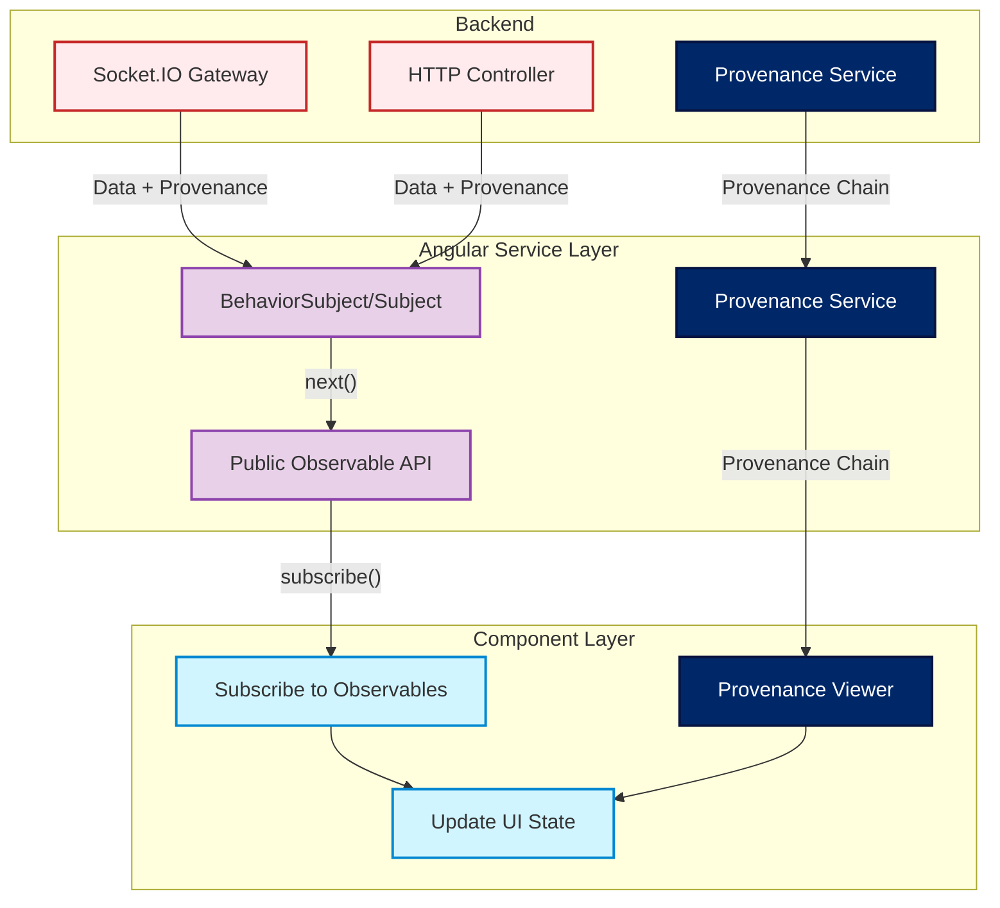
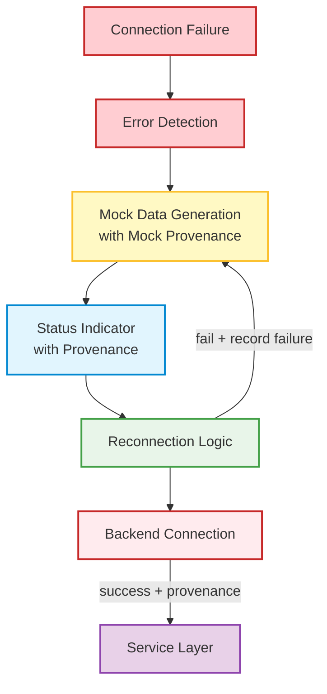

# ForgeBoard: Frontend-API Architecture Documentation
*Last Updated: May 15, 2025*

  

    <strong>Architecture:</strong> Local-First ✅
  

  

    <strong>Data Provenance:</strong> Complete Lifecycle 🔄
  

  

    <strong>Pattern:</strong> ProvenanceStore 📊
  

  

    <strong>Status:</strong> Production-Ready 🚀
  

## Architecture Overview

ForgeBoard implements a modern, reactive architecture with comprehensive data provenance tracking:

## Key Components

- **ProvenanceService**: Tracks complete data lifecycle, maintains provenance chains, and ensures cryptographic verification
- **MetricsService**: Manages real-time system metrics with provenance tracking for data origin and transformations
- **KablanService**: Handles Kanban board state via WebSockets, supports optimistic updates with full provenance history
- **DiagnosticsService**: Tracks health data with source provenance for verification and compliance evidence
- **LoggerService**: Collects, filters, and exports logs in real time with data provenance for each event
- **BackendStatusService**: Monitors gateway states with provenance tracking for connection events

### Data Provenance Architecture

ForgeBoard implements a comprehensive data provenance system that tracks the complete data lifecycle:

### Socket Connection Management with Provenance

Socket connections maintain complete data provenance for real-time streams:

## Module Structure

### Metrics Module with Data Provenance

Provides real-time system performance monitoring with complete data provenance:

- Live metric charts with cryptographically verifiable data origin
- Origin attestation for all metrics data from external providers
- Signature verification for all metric sources
- Provenance-aware visualization with source highlighting

### Kablan Board Module with Task Provenance

Implements a Kanban-style project management system with task provenance tracking:

- Complete history of all task transitions with actor attribution
- Cryptographic verification of task update authority
- Task ownership provenance with delegation tracking
- Immutable audit trail of all board changes

### Diagnostics Module with System Provenance

Offers comprehensive system monitoring tools with complete provenance tracking:

- Health timeline with cryptographically verifiable state transitions
- Socket connection metrics with verified endpoint attestations
- Event logging with tamper-evident provenance chain
- Status indicators with verification status visualization

### Logger Module with Log Provenance

Provides detailed logging functionality with complete log provenance:

- Source attribution for all log entries with cryptographic verification
- Log chain integrity verification with tamper detection
- Event correlation with provenance linking
- Export capabilities with verifiable log bundles

## Data Flow Patterns

### Provenance Service Pattern

**Explanation:**
- The backend emits events with source provenance metadata
- The Angular service layer receives data and verifies provenance
- Components subscribe to data with verified provenance chains
- The Provenance Viewer provides visualization of data lineage

### Provenance-Aware Mock Data & Reconnection Strategy

**Explanation:**
- On connection failure, the service detects the error and starts mock data generation with mock provenance
- Mock data is clearly identified in the provenance chain as simulated data
- Reconnection logic periodically checks backend availability with provenance verification
- On successful reconnection with verified server provenance, the service resumes real data

## Provenance-First Development Principles

1. **Complete Data Lifecycle Tracking**: Every piece of data must have a tracked lifecycle from inception to disposal
2. **Verifiable Source Attribution**: All data must have cryptographically verifiable source information
3. **Immutable Transition Records**: Every data state change must be recorded with attribution and purpose
4. **Cryptographic Verification**: All data transitions must be cryptographically signed and verified
5. **Transparent Processing**: All transformations must be recorded with justification and attribution
6. **Purpose Binding**: Every data request must have a documented and verifiable purpose
7. **Chain of Custody**: Complete visibility into who accessed data and when

---

**Legend:**
- 🔵 **Data Provenance** - Complete tracking of data from inception through disposal
- 🔴 **Cryptographic Verification** - Tamper-evident guarantees through digital signatures
- 🟡 **Local-First Authority** - Device maintains authoritative provenance records
- 🟢 **Privacy-Preserving Verification** - Zero-knowledge proofs for selective disclosure

