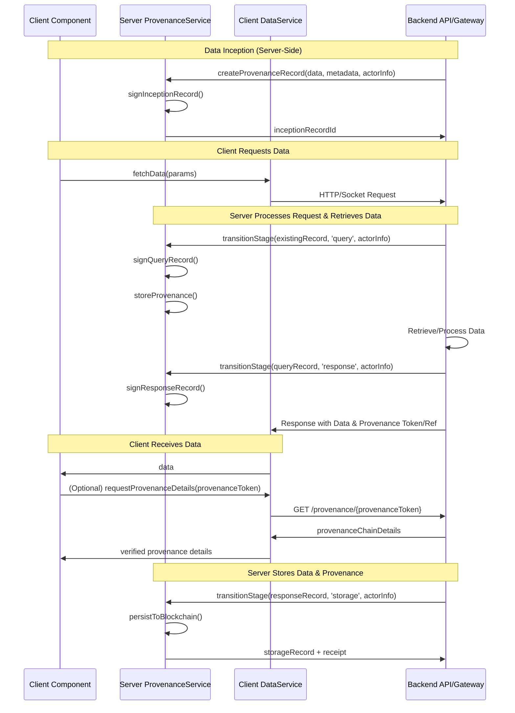
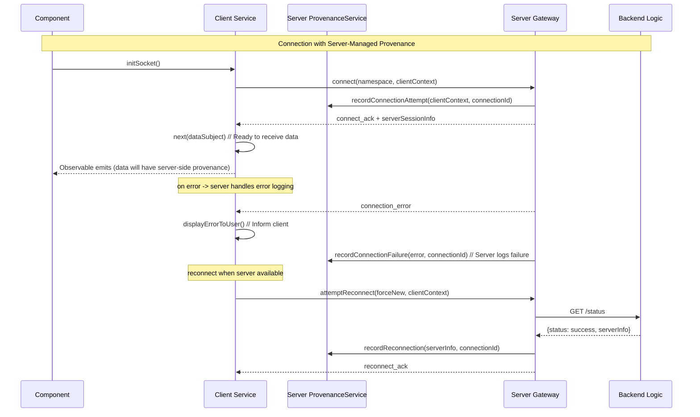
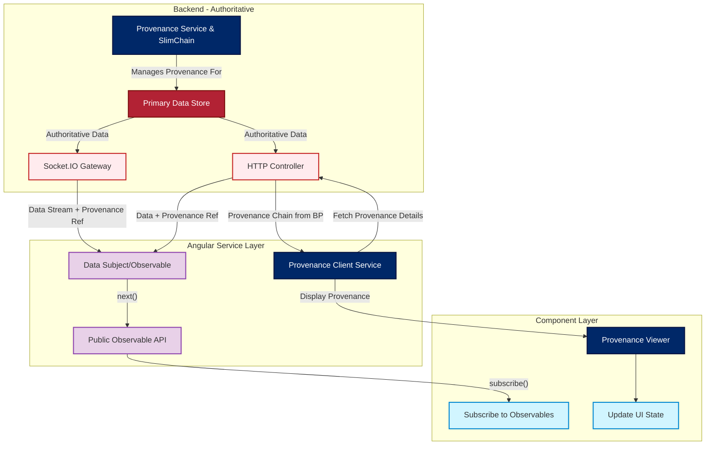

# ForgeBoard: Frontend-API Architecture Documentation
*Last Updated: May 15, 2025*

<div style="display: flex; flex-wrap: wrap; gap: 10px; margin-bottom: 20px;">
  <div style="background-color: #002868; color: white; padding: 8px 12px; border-radius: 6px; flex: 1; min-width: 150px; box-shadow: 0 2px 4px rgba(0,0,0,0.2);">
    <strong>Architecture:</strong> Server-Authoritative ✅
  </div>
  <div style="background-color: #BF0A30; color: white; padding: 8px 12px; border-radius: 6px; flex: 1; min-width: 150px; box-shadow: 0 2px 4px rgba(0,0,0,0.2);">
    <strong>Data Provenance:</strong> Complete Lifecycle 🔄
  </div>
  <div style="background-color: #F9C74F; color: #333; padding: 8px 12px; border-radius: 6px; flex: 1; min-width: 150px; box-shadow: 0 2px 4px rgba(0,0,0,0.2);">
    <strong>Pattern:</strong> ProvenanceStore (Server-Side) 📊
  </div>
  <div style="background-color: #90BE6D; color: #333; padding: 8px 12px; border-radius: 6px; flex: 1; min-width: 150px; box-shadow: 0 2px 4px rgba(0,0,0,0.2);">
    <strong>Status:</strong> Production-Ready 🚀
  </div>
</div>

## Architecture Overview

ForgeBoard implements a modern, reactive architecture with comprehensive data provenance tracking, where the server is the authoritative source of data.

```mermaid
flowchart LR
  subgraph Backend [Backend - Authoritative Source]
    direction TB
    BE[Data Sources]
    PROV[Provenance Service & SlimChain]
    STORE[Primary Data Store]
    AUTH[Auth Service]
  end
  subgraph Gateway [Gateway Layer]
    direction TB
    GW[Socket.IO Server]
    REST[REST API]
    PROVGW[Provenance Gateway]
  end
  subgraph Frontend [Angular Frontend]
    direction TB
    PRSVC[Provenance Client Service]
    AS[Angular Services]
    AC[Angular Components]
    PV[Provenance Viewer]
  end

  BE -->|"Data with Origin"| STORE
  STORE -->|"Data for Processing"| PROV
  PROV -->|"Verifiable Data & Provenance"| GW
  PROV -->|"Provenance API"| REST
  PROV -->|"Provenance Events"| PROVGW
  AUTH -->|"AuthN/AuthZ"| GW
  AUTH -->|"AuthN/AuthZ"| REST
  
  GW -->|"Data Streams"| AS
  REST -->|"REST Calls"| AS
  PROVGW -->|"Provenance Events"| PRSVC
  
  AS -->|"Data with Provenance"| AC
  PRSVC -->|"Provenance Chain"| PV
  PV -->|"Visualize"| AC

  style BE fill:#FFDDC1,stroke:#E67E22,stroke-width:2px
  style STORE fill:#B22234,stroke:#7D100E,stroke-width:2px,color:#fff
  style PROV fill:#B22234,stroke:#7D100E,stroke-width:2px,color:#fff
  style AUTH fill:#002868,stroke:#071442,stroke-width:2px,color:#fff
  style GW fill:#D1E8E4,stroke:#16A085,stroke-width:2px
  style REST fill:#D1E8E4,stroke:#16A085,stroke-width:2px
  style PROVGW fill:#B22234,stroke:#7D100E,stroke-width:2px,color:#fff
  style AS fill:#E8D1E8,stroke:#8E44AD,stroke-width:2px
  style AC fill:#D1F5FF,stroke:#0288D1,stroke-width:2px
  style PRSVC fill:#002868,stroke:#071442,stroke-width:2px,color:#fff
  style PV fill:#002868,stroke:#071442,stroke-width:2px,color:#fff
```



## Key Components

- **ProvenanceService (Backend)**: Tracks complete data lifecycle, maintains provenance chains on the server, and ensures cryptographic verification. Authoritative source for provenance.
- **MetricsService**: Manages real-time system metrics with server-side provenance tracking for data origin and transformations.
- **KablanService**: Handles Kanban board state via WebSockets, with the server managing state and provenance history.
- **DiagnosticsService**: Tracks health data with server-side source provenance for verification and compliance evidence.
- **LoggerService**: Collects, filters, and exports logs in real time with server-managed data provenance for each event.
- **BackendStatusService**: Monitors gateway states with server-side provenance tracking for connection events.

### Data Provenance Architecture

ForgeBoard implements a comprehensive data provenance system, managed by the server, that tracks the complete data lifecycle:



### Socket Connection Management with Provenance

Socket connections are established with the server, which manages and provides provenance for real-time streams:



## Module Structure

### Metrics Module with Data Provenance

Provides real-time system performance monitoring with complete data provenance, managed and verified by the server.

- Live metric charts with data streamed from the server.
- Server attestation for all metrics data from external providers.
- Server-side signature verification for all metric sources.
- Provenance-aware visualization based on server-provided provenance chains.

### Kablan Board Module with Task Provenance

Implements a Kanban-style project management system with server-managed task provenance tracking.

- Complete history of all task transitions with actor attribution, stored on the server.
- Server-side cryptographic verification of task update authority.
- Task ownership provenance with delegation tracking, managed by the server.
- Immutable audit trail of all board changes, maintained by the server.

### Diagnostics Module with System Provenance

Offers comprehensive system monitoring tools with complete server-managed provenance tracking.

- Health timeline with cryptographically verifiable state transitions, recorded by the server.
- Socket connection metrics with server-verified endpoint attestations.
- Event logging with tamper-evident provenance chain, managed by the server.
- Status indicators with verification status visualization based on server data.

### Logger Module with Log Provenance

Provides detailed logging functionality with complete server-managed log provenance.

- Server-side source attribution for all log entries with cryptographic verification.
- Log chain integrity verification with tamper detection, performed by the server.
- Event correlation with server-managed provenance linking.
- Export capabilities with verifiable log bundles generated by the server.

## Data Flow Patterns

### Provenance Service Pattern (Server-Centric)



**Explanation:**
- The backend is the authoritative source for data and its provenance.
- The backend emits data events (via WebSockets or REST) to the client, potentially with a reference to the full provenance chain.
- The Angular service layer receives data. The `ProvenanceClientService` can fetch detailed provenance from the backend if needed.
- Components subscribe to data. The `ProvenanceViewer` displays lineage information fetched from the server.

### Server-Driven Mock Data & Reconnection Strategy

```mermaid
flowchart TD
  CF[Connection Failure]:::error --> ED[Client Error Detection]:::error --> UIUpdate[Update UI: Offline/Reconnecting]:::status
  UIUpdate --> RL[Client Reconnection Logic]:::reconnect
  RL --> BC[Attempt Backend Connection]:::backend
  BC -- "success + server_status" --> SVC[Service Layer Receives Data]:::service
  BC -- "fail" --> RL
  
  subgraph ServerSide [Server During Client Outage]
    direction TB
    SS_Error[Client Disconnect Event] --> SS_Log[Log Disconnection]
    SS_Log --> SS_Queue[Queue Outgoing Data (Optional)]
  end

  classDef error fill:#FFCDD2,stroke:#C62828,stroke-width:2px;
  classDef status fill:#E1F5FE,stroke:#0288D1,stroke-width:2px;
  classDef reconnect fill:#E8F5E9,stroke:#43A047,stroke-width:2px;
  classDef backend fill:#FFEBEE,stroke:#C62828,stroke-width:2px;
  classDef service fill:#E8D1E8,stroke:#8E44AD,stroke-width:2px;
```

**Explanation:**
- On connection failure, the client detects the error and updates the UI.
- Mock data, if used, would be a client-side fallback for UI continuity, not an authoritative state.
- Reconnection logic periodically attempts to connect to the backend.
- The server manages data consistency and provenance centrally.

## Server-Authoritative Development Principles

1. **Server is the Source of Truth**: All authoritative data and its complete lifecycle are managed by the server.
2. **Verifiable Source Attribution (Server-Side)**: All data has cryptographically verifiable source information, asserted by the server.
3. **Immutable Transition Records (Server-Side)**: Every data state change is recorded on the server with attribution and purpose.
4. **Cryptographic Verification (Server-Side)**: All data transitions are cryptographically signed and verified by the server.
5. **Transparent Processing (Server-Side)**: All transformations are recorded on the server with justification and attribution.
6. **Purpose Binding (Server-Side)**: Every data request's purpose is documented and verifiable through server logs and provenance.
7. **Chain of Custody (Server-Managed)**: Complete visibility into who accessed data and when, tracked by the server.

