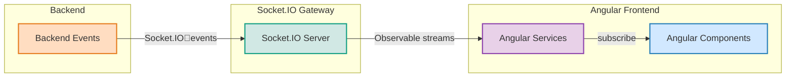
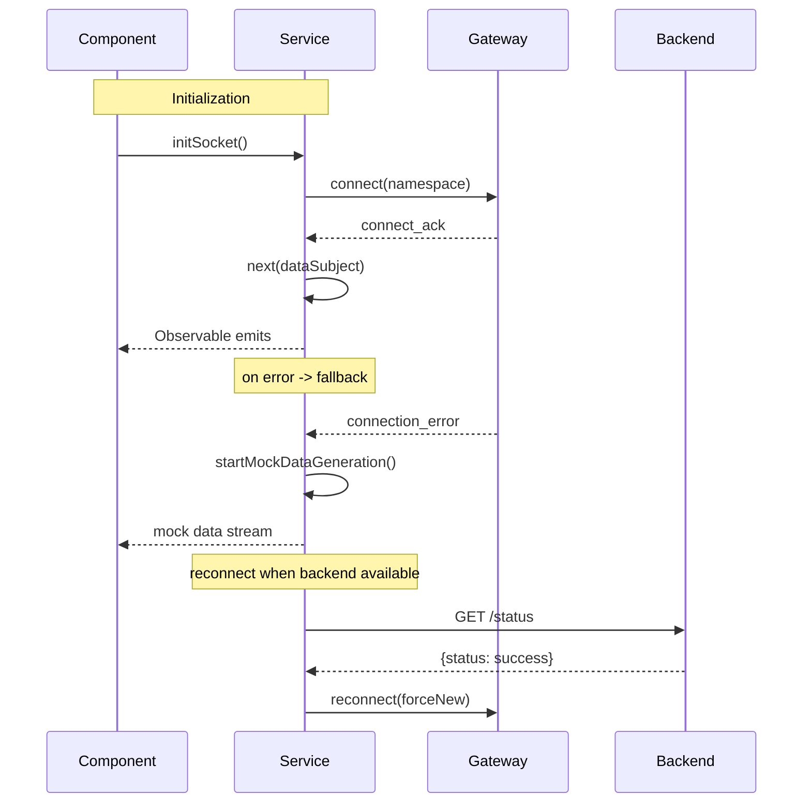
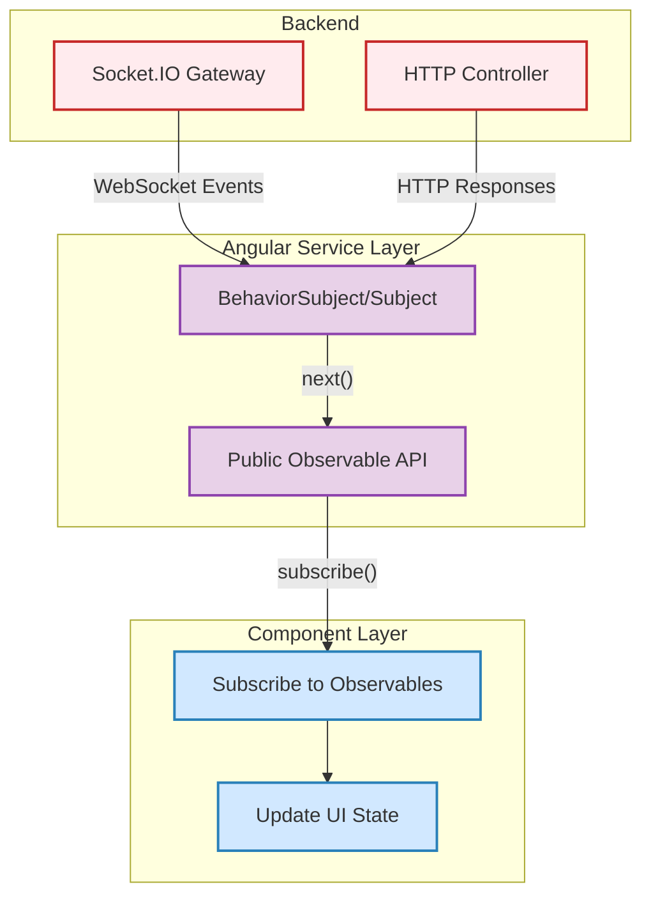
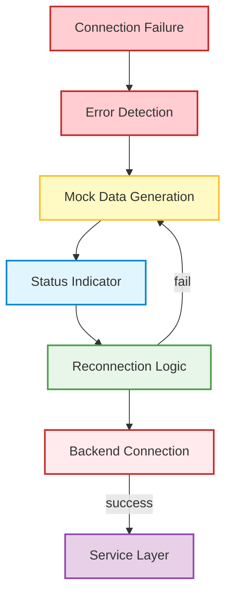

# ForgeBoard: Frontend-API Architecture Documentation

## Architecture Overview

ForgeBoard implements a modern, real-time reactive architecture:

## Key Components

- **MetricsService**: Manages real-time system metrics with live charts, mock fallback, automatic reconnection.
- **KablanService**: Handles Kanban board state via WebSockets, supports optimistic updates and phase workflows.
- **DiagnosticsService**: Tracks health data and socket metrics, surfaces timeline, error logs, and connection stats.
- **LoggerService**: Collects, filters, and exports logs in real time, with CSV export capability.
- **BackendStatusService**: Monitors gateway states, coordinates reconnection, and signals UI indicators.

### Socket Connection Management

### Mock Data & Reconnection

Elegant fallback to simulated data ensures the UI remains vibrant even if the backend is offline. Seamless transition back to real data occurs automatically upon reconnection.

## Module Structure

### Metrics Module

Provides real-time system performance monitoring with:

- Live metric charts for CPU, memory, disk, and network
- Customizable refresh rates
- Automatic fallback to simulated data
- Visual indicators for connection status

### Kablan Board Module

Implements a Kanban-style project management system with:

- Phase-based workflow visualization
- Drag-and-drop card management
- Visual indicators for task priority
- Timeline-based phase progression

### Diagnostics Module

Offers comprehensive system monitoring tools:

- Health timeline with past, present, and future status
- Socket connection metrics and active session monitoring
- Event logging with filtering capabilities
- Status indicators with visual differentiation

### Logger Module

Provides detailed logging functionality:

- Log collection and categorization
- Filtering by level, source, and content
- Statistics and visualization
- CSV export capability

## Data Flow Patterns

### Service Pattern

**Explanation:**
- The backend emits events via Socket.IO and responds to HTTP requests.
- The Angular service layer receives both, updates its BehaviorSubject/Subject, and exposes a public Observable API.
- Components subscribe to these Observables and update their UI state reactively.

### Mock Data & Reconnection Strategy

**Explanation:**
- On connection failure, the service detects the error and starts mock data generation.
- A status indicator is updated for the UI.
- Reconnection logic periodically checks backend availability.
- On successful reconnection, the service resumes real data; otherwise, mock data continues.

## API Integration

### Socket Namespaces

- `/metrics`: Real-time system performance metrics
- `/diagnostics`: System health and connection monitoring
- `/kablan`: Project management board updates and interactions
- `/logger`: Log events and statistics

### REST Endpoints

- `/api/metrics`: Configuration and initial metrics
- `/api/diagnostics`: System diagnostics and health checks
- `/api/kablan`: Board configuration and card management
- `/api/logs`: Log retrieval, filtering, and management
- `/api/status`: System status and availability checks

