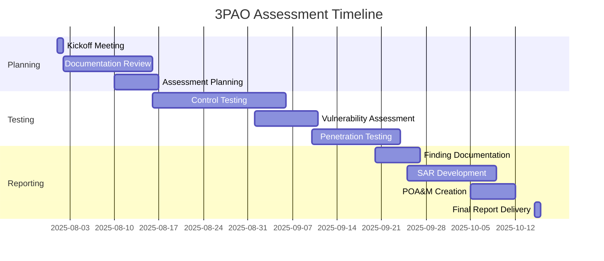

# ForgeBoard NX – 3PAO Assessment Planning & Automation 🔍🔐

*Last Updated: June 15, 2025*


## Table of Contents

1. [3PAO Overview](#1-3pao-overview)
2. [Assessment Process](#2-assessment-process)
3. [3PAO Portal Configuration](#3-3pao-portal-configuration)
4. [Automated Evidence Collection](#4-automated-evidence-collection)
5. [Real-Time Assessment Capabilities](#5-real-time-assessment-capabilities)
6. [Access Control & Security](#6-access-control--security)
7. [Assessment Timeline & Planning](#7-assessment-timeline--planning)
8. [Automation Capabilities](#8-automation-capabilities)

## 1. 3PAO Overview

A Third Party Assessment Organization (3PAO) is an independent entity accredited by the American Association for Laboratory Accreditation (A2LA) to assess cloud services for FedRAMP compliance. 3PAOs serve as the critical link between Cloud Service Providers (CSPs) and the FedRAMP Project Management Office (PMO), providing an unbiased verification of security controls implementation.

### Role in ATO Process

3PAOs are essential to achieving Authority to Operate (ATO) because they:

- Conduct independent testing of security control implementations
- Verify documentation accuracy and completeness
- Perform penetration testing and vulnerability assessments
- Prepare the Security Assessment Report (SAR)
- Help develop the Plan of Action & Milestones (POA&M)
- Provide recommendations to the authorizing official

ForgeBoard's 3PAO Assessment Portal streamlines this process by providing specialized access and automated tools for assessors.

## 2. Assessment Process

The 3PAO assessment process follows these key phases:

1. **Initial Documentation Review**
   - System Security Plan (SSP) evaluation
   - Control implementation verification
   - Documentation completeness assessment

2. **Security Testing**
   - Controls testing (automated and manual)
   - Vulnerability scanning
   - Penetration testing

3. **Evidence Collection & Analysis**
   - Interview coordination
   - Evidence gathering and review
   - Findings documentation

4. **Reporting**
   - SAR preparation
   - POA&M development
   - Final recommendation formulation

ForgeBoard NX facilitates each phase with specialized access, real-time data views, and automated evidence collection.

## 3. 3PAO Portal Configuration

ForgeBoard includes a dedicated 3PAO Assessment Portal providing privileged access to assessment resources.

### Portal Setup

1. Navigate to **Admin Panel > FedRAMP > 3PAO Configuration**
2. Click **Create New Assessment**
3. Configure basic assessment details:
   - Assessment name/ID
   - Start/end dates
   - 3PAO organization name
   - Lead assessor contact
4. Define assessor team members:
   - Technical leads
   - Control area specialists
   - Penetration testers
5. Configure scope-specific access levels

### Custom View Configuration

The 3PAO Portal provides a specialized interface with:

- Assessment dashboard showing progress metrics
- Control-specific evidence repositories
- Real-time monitoring data
- Automated testing results
- OSCAL document repository
- Secure communication channels

## 4. Automated Evidence Collection

ForgeBoard streamlines evidence collection through automated processes:

### Evidence Types

- **Control Implementation**: Screenshots, configurations, policy documents
- **Continuous Monitoring**: Security logs, metric data, alert history
- **Vulnerability Management**: Scan results, remediation records
- **Personnel Management**: Training records, role assignments
- **Infrastructure Configuration**: Baselines, change records, hardening verification

### Collection Mechanisms

The evidence collection system uses the following technologies:

```typescript
// Sample of the evidence collection service architecture
export class EvidenceCollectionService {
  // Hot observable based collection pipeline
  private evidenceSubject = new BehaviorSubject<EvidenceItem[]>([]);
  public evidence$ = this.evidenceSubject.asObservable();
  
  constructor(
    private securityService: SecurityService,
    private auditService: AuditService,
    private loggerService: LoggerService
  ) {
    // Initialize evidence collection pipeline
    this.initializeCollectionPipeline();
  }
  
  // Set up continuous evidence collection
  private initializeCollectionPipeline(): void {
    // Create streams for each evidence type
    const configEvidence$ = this.collectConfigurationEvidence();
    const logEvidence$ = this.collectLogEvidence();
    const scanEvidence$ = this.collectVulnerabilityEvidence();
    
    // Combine all evidence streams
    merge(
      configEvidence$,
      logEvidence$,
      scanEvidence$
    ).pipe(
      tap(item => this.auditService.log({
        action: 'EVIDENCE_COLLECTED',
        resource: 'assessment',
        details: { controlId: item.controlId, type: item.type }
      })),
    ).subscribe({
      next: evidence => {
        const current = this.evidenceSubject.getValue();
        this.evidenceSubject.next([...current, evidence]);
      },
      error: err => {
        this.loggerService.error('Evidence collection error', err);
      }
    });
  }
  
  // Evidence is tagged with control IDs and made available to assessors
  // with appropriate permissions through real-time streaming
}
```

## 5. Real-Time Assessment Capabilities

ForgeBoard provides 3PAOs with real-time assessment capabilities through WebSocket and REST API access:

### WebSocket Gateway

3PAO assessors receive push updates for:
- New evidence collection
- Control status changes
- Testing results
- System security events

### REST API Access

The portal exposes RESTful endpoints for:
- OSCAL document retrieval
- Evidence export (JSON and CSV formats)
- Test result downloads
- Compliance report generation

### Assessor Dashboard

The real-time dashboard shows:
- Assessment progress by control family
- Evidence collection status
- Recent system changes
- High-priority findings
- Scheduled testing activities

## 6. Access Control & Security

ForgeBoard implements robust security for 3PAO access:

### Authentication & Authorization

- **Multi-Factor Authentication**: Required for all 3PAO access
- **Role-Based Access Control**: Granular permissions based on assessment roles
- **Just-In-Time Access**: Temporary elevated permissions with approval workflows
- **Session Management**: Inactivity timeouts and session monitoring
- **Access Auditing**: Comprehensive logs of all 3PAO actions

### Data Protection

- **Evidence Encryption**: All assessment data encrypted at rest and in transit
- **Restricted Views**: Data minimization through tailored views
- **Access Expiration**: Automatic revocation after assessment period
- **Non-Production Data**: Sanitized test data where appropriate
- **Secure Communications**: Encrypted messaging system for clarifications

## 7. Assessment Timeline & Planning

ForgeBoard provides tools for planning and tracking the 3PAO assessment:

### Timeline Management

The assessment planning tool allows:
- Defining assessment phases with milestones
- Assigning roles and responsibilities
- Scheduling control testing activities
- Managing documentation review cycles
- Tracking progress against timeline

### Resource Allocation

The planning module helps with:
- Estimating resource requirements
- Identifying subject matter experts
- Scheduling personnel availability
- Managing assessment scope changes
- Optimizing assessment workflows

### Sample Timeline



## 8. Automation Capabilities

ForgeBoard provides automation to streamline the 3PAO assessment process:

### Automated Testing

- **Control Validation**: Automated scripts verify control implementations
- **Configuration Checks**: Baseline compliance verification
- **Vulnerability Scanning**: Scheduled and on-demand scanning
- **Log Analysis**: Automated review of security events
- **Evidence Tagging**: AI-assisted mapping of evidence to controls

### Reporting Automation

- **OSCAL Integration**: Automated generation of OSCAL-formatted reports
- **Evidence Packaging**: Automatic collection and organization of evidence
- **Finding Tracking**: Real-time status updates on identified issues
- **Risk Scoring**: Automated calculation of risk levels
- **Remediation Verification**: Validation of fix implementations

### Integration Example

The assessment automation integrates with the OSCAL gateway to provide real-time access to assessment data:

```typescript
// Sample of the assessment automation integration
@Injectable()
export class AssessmentAutomationService {
  // Using hot observable pattern for real-time assessment data
  private assessmentStatusSubject = new BehaviorSubject<AssessmentStatus>(null);
  public assessmentStatus$ = this.assessmentStatusSubject.asObservable();
  
  constructor(
    private oscalGateway: OscalGatewayService,
    private evidenceService: EvidenceCollectionService,
    private securityService: SecurityService,
    private auditService: AuditService
  ) {
    // Subscribe to evidence collection stream
    this.evidenceService.evidence$.pipe(
      filter(evidence => evidence && evidence.length > 0),
      map(evidence => this.mapEvidenceToControls(evidence)),
      tap(mappedControls => {
        // Update assessment status based on evidence
        const currentStatus = this.assessmentStatusSubject.getValue() || {};
        this.assessmentStatusSubject.next({
          ...currentStatus,
          controlStatus: mappedControls,
          lastUpdated: new Date()
        });
      })
    ).subscribe();
  }
  
  // Generate real-time assessment report for 3PAO reviewers
  generateAssessmentReport(): Observable<AssessmentReport> {
    return this.assessmentStatus$.pipe(
      filter(status => !!status),
      map(status => this.createReportFromStatus(status)),
      tap(report => {
        this.auditService.log({
          action: 'ASSESSMENT_REPORT_GENERATED',
          resource: 'assessment',
          details: { 
            controlsFailed: report.summary.failed,
            controlsPassed: report.summary.passed,
            timestamp: new Date()
          }
        });
      })
    );
  }
  
  // Other methods for automated testing, evidence collection,
  // and assessment facilitation
}
```

---

<div style="text-align: center; margin: 30px 0; font-size: 20px; color: #0C2677; font-weight: bold; border-top: 2px solid #B22234; border-bottom: 2px solid #B22234; padding: 15px; background-color: #F8FAFF; box-shadow: 0 2px 4px rgba(0,0,0,0.08);">
ForgeBoard NX – Streamlining 3PAO assessments through automation and real-time data access
</div>
