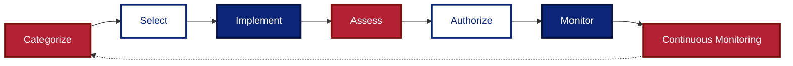
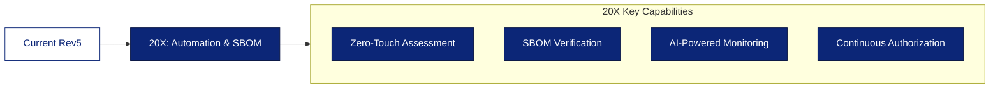
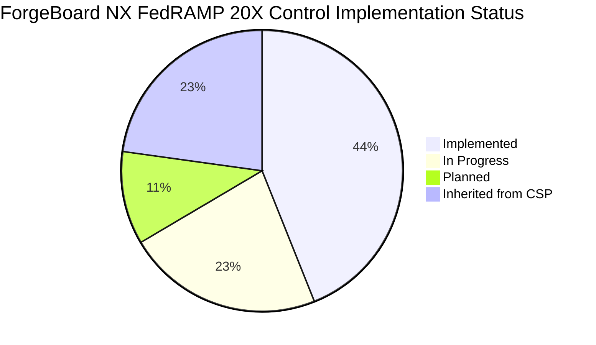
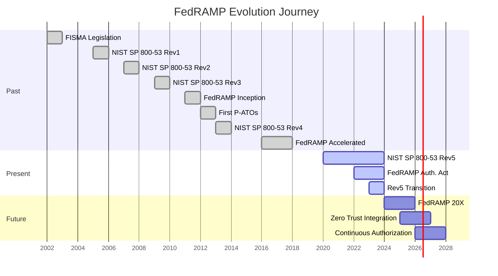
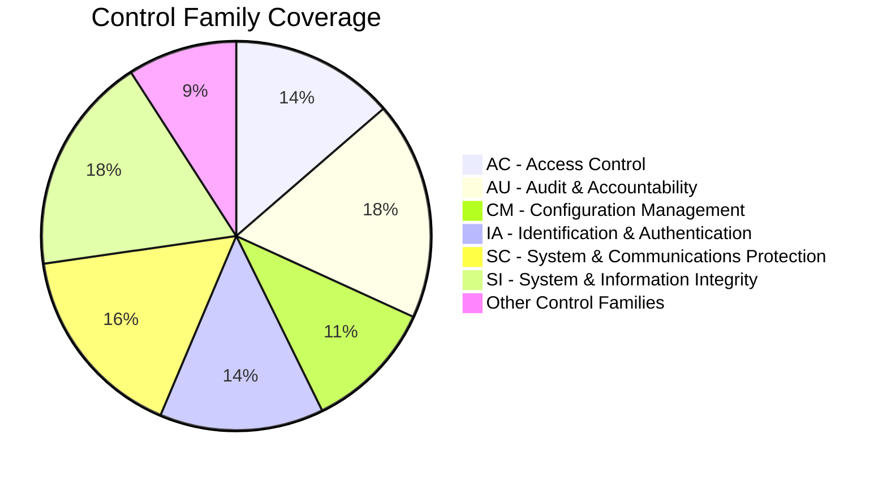

# <span style="color:#B22234; font-weight:bold; text-shadow: 0 0 1px rgba(0,0,0,0.2);">ForgeBoard NX</span> – <span style="color:#0C2677; font-weight:bold;">FedRAMP 20X Adherence Guide</span> 🎆🔐


<div style="border-left: 5px solid #B22234; padding-left: 15px; margin: 20px 0; background-color: #F0F4FF; box-shadow: 0 2px 4px rgba(0,0,0,0.1);">
Welcome to the <b>ForgeBoard NX FedRAMP 20X Adherence Guide</b>! We've wrapped our commitment to the latest NIST Risk Management Framework (RMF) in a red‑white‑and‑blue bow 🎀, making the verbose world of FedRAMP clear, engaging, and actionable. Below you'll find:
</div>

1. <span style="color:#B22234; font-weight:bold;">**Past – The Birth of FedRAMP**</span>  
2. <span style="color:#FFFFFF; background-color:#0C2677; padding: 2px 5px; font-weight: bold; box-shadow: 0 1px 3px rgba(0,0,0,0.2);">**🕒 Present – Current FedRAMP & NIST RMF Landscape**</span>  
3. <span style="color:#0C2677; font-weight:bold;">**🚀 Future – FedRAMP 20X & ForgeBoard's Path to Compliance**</span>  
4. <span style="color:#B22234; font-weight:bold;">**💥 Key Changes in FedRAMP 20X Program**</span>  
5. <span style="color:#0C2677; font-weight:bold;">**🔐 How ForgeBoard NX Meets 20X Requirements**</span>  
6. <span style="color:#FFFFFF; background-color:#B22234; padding: 2px 5px; font-weight: bold; box-shadow: 0 1px 3px rgba(0,0,0,0.2);">**🛣️ Implementation Roadmap & Timelines**</span>
7. <span style="color:#0C2677; font-weight:bold;">**📊 Visual Infographics & Diagrams**</span>  
8. <span style="color:#B22234; font-weight:bold;">**📚 References & Resources**</span>

---

## <span style="color:#B22234; font-weight:bold;">1. Past – The Birth of FedRAMP</span>

After <span style="color:#0C2677; font-weight:bold;">FISMA (2002)</span> mandated federal information security, the <span style="color:#B22234; font-weight:bold;">FedRAMP program</span> launched in <span style="color:#B22234; font-weight:bold;">2011</span> to centralize and standardize cloud security assessments. Its goals:

- <span style="color:#B22234; font-weight:bold;">✅</span> **Standardize** security baselines across agencies  
- <span style="color:#FFFFFF; background-color:#0C2677; padding: 2px 5px; font-weight: bold;">✅</span> **Reuse** assessments to reduce duplication  
- <span style="color:#0C2677; font-weight:bold;">✅</span> **Accelerate** agency adoption of secure cloud offerings  



### <span style="color:#0C2677; font-weight:bold;">Historical Context & Evolution</span>

```mermaid
flowchart LR
  P[2011–2012: FedRAMP Inception]:::past
  P -->|"Standardize & Reuse"| C1[2012–2016: Initial Growth]:::past1
  C1 -->|"Mature & Scale"| C2[2017–2022: Rev4 Standardization]:::past2
  C2 -->|"Modernize"| C3[2023–2024: Rev5 Transition]:::present
  C3 -->|"Transform"| F[2025+: 20X Evolution]:::future

  classDef past fill:#B22234,stroke:#7D100E,color:#fff,stroke-width:3px;
  classDef past1 fill:#C22D40,stroke:#7D100E,color:#fff,stroke-width:2px;
  classDef past2 fill:#D13950,stroke:#7D100E,color:#fff,stroke-width:2px;
  classDef present fill:#FFFFFF,stroke:#0C2677,color:#0C2677,stroke-width:3px;
  classDef future fill:#0C2677,stroke:#071442,color:#fff,stroke-width:3px;
```  

FedRAMP's history represents a progressive evolution of federal cybersecurity governance:

<table style="border-collapse: collapse; width: 100%; border: 2px solid #0C2677; box-shadow: 0 2px 5px rgba(0,0,0,0.1);">
  <thead>
    <tr style="background-color: #0C2677; color: white;">
      <th style="border: 1px solid #071442; padding: 10px; font-weight: bold;">Era</th>
      <th style="border: 1px solid #071442; padding: 10px; font-weight: bold;">Years</th>
      <th style="border: 1px solid #071442; padding: 10px; font-weight: bold;">Key Developments</th>
      <th style="border: 1px solid #071442; padding: 10px; font-weight: bold;">Impact</th>
    </tr>
  </thead>
  <tbody>
    <tr style="background-color: #F0F4FF;">
      <td style="border: 1px solid #AAB6D3; padding: 10px;"><b>Pre-FedRAMP</b></td>
      <td style="border: 1px solid #AAB6D3; padding: 10px;">2002-2010</td>
      <td style="border: 1px solid #AAB6D3; padding: 10px;">FISMA established legal framework; agencies developed individual approaches</td>
      <td style="border: 1px solid #AAB6D3; padding: 10px;">Inconsistent security implementations; duplicated assessment efforts</td>
    </tr>
    <tr style="background-color: #FFE8E8;">
      <td style="border: 1px solid #AAB6D3; padding: 10px;"><b>FedRAMP 1.0</b></td>
      <td style="border: 1px solid #AAB6D3; padding: 10px;">2011-2016</td>
      <td style="border: 1px solid #AAB6D3; padding: 10px;">First JAB P-ATOs; GSA PMO established; Rev3 controls baseline</td>
      <td style="border: 1px solid #AAB6D3; padding: 10px;">80+ authorized cloud services; standardized assessment templates</td>
    </tr>
    <tr style="background-color: #F0F4FF;">
      <td style="border: 1px solid #AAB6D3; padding: 10px;"><b>FedRAMP 2.0</b></td>
      <td style="border: 1px solid #AAB6D3; padding: 10px;">2017-2022</td>
      <td style="border: 1px solid #AAB6D3; padding: 10px;">"FedRAMP Accelerated"; Rev4 alignment; Agency authorization growth</td>
      <td style="border: 1px solid #AAB6D3; padding: 10px;">200+ authorized services; reduced authorization timelines from 18+ to 3-6 months</td>
    </tr>
    <tr style="background-color: #E0E6FF;">
      <td style="border: 1px solid #AAB6D3; padding: 10px;"><b>Rev5 Transition</b></td>
      <td style="border: 1px solid #AAB6D3; padding: 10px;">2023-2024</td>
      <td style="border: 1px solid #AAB6D3; padding: 10px;">SP 800-53 Rev5 control mapping; enhanced supply chain requirements</td>
      <td style="border: 1px solid #AAB6D3; padding: 10px;">Enhanced threat coverage; new privacy controls; improved automation</td>
    </tr>
  </tbody>
</table>

*Key Milestones*  
- <span style="color:#B22234; font-weight:bold;">**June 2012**</span>: First JAB Provisional Authorization to Operate (P‑ATO) issued
- <span style="color:#0C2677; font-weight:bold;">**December 2017**</span>: FedRAMP Tailored introduced for SaaS solutions
- <span style="color:#B22234; font-weight:bold;">**August 2021**</span>: FedRAMP Authorization Act introduced to Congress
- <span style="color:#0C2677; font-weight:bold;">**December 2022**</span>: FedRAMP Authorization Act signed into law
- <span style="color:#B22234; font-weight:bold;">**March 2023**</span>: Rev5 transition timeline announced

---

## <span style="color:#0C2677; font-weight:bold;">2. 🕒 Present – Current FedRAMP & NIST RMF Landscape</span>

FedRAMP today follows <span style="color:#B22234; font-weight:bold;">NIST SP 800‑53 Rev 5</span> controls, aligned to the <span style="color:#0C2677; font-weight:bold;">seven RMF steps</span>:

<div style="display: flex; flex-wrap: wrap; justify-content: space-between; margin: 20px 0;">
  <div style="background-color: #B22234; color: white; padding: 10px; margin: 5px; border-radius: 5px; width: 150px; text-align: center; font-weight: bold; box-shadow: 0 2px 4px rgba(0,0,0,0.2);">1. <b>Categorize</b></div>
  <div style="background-color: white; color: #0C2677; padding: 10px; margin: 5px; border-radius: 5px; width: 150px; text-align: center; border: 3px solid #0C2677; font-weight: bold; box-shadow: 0 2px 4px rgba(0,0,0,0.1);">2. <b>Select</b></div>
  <div style="background-color: #0C2677; color: white; padding: 10px; margin: 5px; border-radius: 5px; width: 150px; text-align: center; font-weight: bold; box-shadow: 0 2px 4px rgba(0,0,0,0.2);">3. <b>Implement</b></div>
  <div style="background-color: #B22234; color: white; padding: 10px; margin: 5px; border-radius: 5px; width: 150px; text-align: center; font-weight: bold; box-shadow: 0 2px 4px rgba(0,0,0,0.2);">4. <b>Assess</b></div>
  <div style="background-color: white; color: #0C2677; padding: 10px; margin: 5px; border-radius: 5px; width: 150px; text-align: center; border: 3px solid #0C2677; font-weight: bold; box-shadow: 0 2px 4px rgba(0,0,0,0.1);">5. <b>Authorize</b></div>
  <div style="background-color: #0C2677; color: white; padding: 10px; margin: 5px; border-radius: 5px; width: 150px; text-align: center; font-weight: bold; box-shadow: 0 2px 4px rgba(0,0,0,0.2);">6. <b>Monitor</b></div>
  <div style="background-color: #B22234; color: white; padding: 10px; margin: 5px; border-radius: 5px; width: 150px; text-align: center; font-weight: bold; box-shadow: 0 2px 4px rgba(0,0,0,0.2);">7. <b>Continuous Monitoring</b></div>
</div>



### <span style="color:#B22234; font-weight:bold;">Current FedRAMP by the Numbers</span>

<table style="border-collapse: collapse; width: 100%; border: 3px solid #0C2677; box-shadow: 0 3px 6px rgba(0,0,0,0.16);">
  <thead>
    <tr style="background-color: #B22234; color: white;">
      <th style="border: 1px solid #7D100E; padding: 12px; font-weight: bold;">Metric</th>
      <th style="border: 1px solid #7D100E; padding: 12px; font-weight: bold;">Value</th>
      <th style="border: 1px solid #7D100E; padding: 12px; font-weight: bold;">Significance</th>
    </tr>
  </thead>
  <tbody>
    <tr style="background-color: #F0F4FF;">
      <td style="border: 1px solid #AAB6D3; padding: 10px;"><b>Authorized Services</b></td>
      <td style="border: 1px solid #AAB6D3; padding: 10px; color: #B22234; font-weight: bold; font-size: 110%;">280+</td>
      <td style="border: 1px solid #AAB6D3; padding: 10px;">Breadth of available compliant solutions</td>
    </tr>
    <tr style="background-color: #E0E6FF;">
      <td style="border: 1px solid #AAB6D3; padding: 10px;"><b>Control Families</b></td>
      <td style="border: 1px solid #AAB6D3; padding: 10px; color: #0C2677; font-weight: bold; font-size: 110%;">20</td>
      <td style="border: 1px solid #AAB6D3; padding: 10px;">Comprehensive security coverage</td>
    </tr>
    <tr style="background-color: #F0F4FF;">
      <td style="border: 1px solid #AAB6D3; padding: 10px;"><b>Low-Impact Controls</b></td>
      <td style="border: 1px solid #AAB6D3; padding: 10px; color: #B22234; font-weight: bold; font-size: 110%;">125</td>
      <td style="border: 1px solid #AAB6D3; padding: 10px;">Baseline for public-facing systems</td>
    </tr>
    <tr style="background-color: #E0E6FF;">
      <td style="border: 1px solid #AAB6D3; padding: 10px;"><b>Moderate-Impact Controls</b></td>
      <td style="border: 1px solid #AAB6D3; padding: 10px; color: #0C2677; font-weight: bold; font-size: 110%;">325</td>
      <td style="border: 1px solid #AAB6D3; padding: 10px;">Most common CSP implementation</td>
    </tr>
    <tr style="background-color: #F0F4FF;">
      <td style="border: 1px solid #AAB6D3; padding: 10px;"><b>High-Impact Controls</b></td>
      <td style="border: 1px solid #AAB6D3; padding: 10px; color: #B22234; font-weight: bold; font-size: 110%;">421</td>
      <td style="border: 1px solid #AAB6D3; padding: 10px;">Maximum security for sensitive systems</td>
    </tr>
  </tbody>
</table>

<div style="background-color: #FFDFDF; border-left: 5px solid #B22234; padding: 15px; margin: 20px 0; box-shadow: 0 2px 5px rgba(0,0,0,0.1);">
<span style="color:#0C2677; font-weight:bold; font-size: 110%;">Today's Focus Areas</span><br>  
✓ Continuous monitoring dashboards with enhanced metrics<br>
✓ Automated vulnerability management with clear remediation paths<br>
✓ Supply chain security assurance with SBOMs and attestations<br>
✓ Agency-specific control implementation guidance<br>
✓ Zero Trust Architecture alignment
</div>

---

## 3. 🚀 Future – FedRAMP 20X & ForgeBoard's Path

FedRAMP 20X represents the next evolution, embedding **zero‑touch automation**, **SBOM-driven supply chain controls**, and **AI-assisted continuous monitoring**. Key themes:

- 🔄 **Automation**: End-to-end control assessment automation with minimal human intervention
- 📦 **Supply Chain Security**: Comprehensive SBOM management, artifact signing, and verification
- 🤖 **AI/ML**: Anomaly detection, predictive compliance, control mapping assistance
- 📱 **DevSecOps Integration**: Security-as-code throughout the development lifecycle
- 🧠 **Smart ATO**: Intelligent authorization decisions based on real-time risk scoring
- 🔁 **Continuous Authorization**: Replacing point-in-time authorizations with ongoing validation



### ForgeBoard NX's FedRAMP 20X Path

ForgeBoard NX has built a tailored roadmap to not only meet but exceed FedRAMP 20X requirements:

1. **Phase 1: Foundation** (Complete)
   - Implement core security architecture
   - Establish baseline controls
   - Deploy monitoring framework

2. **Phase 2: Enhancement** (Current)
   - Integrate SBOM toolchain
   - Deploy signature verification
   - Implement zero trust endpoints

3. **Phase 3: Acceleration** (Q4 2024)
   - Full CI/CD security automation
   - AI-assisted monitoring
   - Predictive compliance alerting

4. **Phase 4: Maturity** (2025)
   - Continuous authorization readiness
   - Agency-specific control templating
   - Advanced threat intelligence integration

---

## 4. 💥 Key Changes in FedRAMP 20X Program

> **NEW SECTION**: The FedRAMP 20X program represents a paradigm shift in federal cloud security, transitioning from manual, periodic assessment to continuous, automated validation.

### Core Transformations

FedRAMP 20X introduces fundamental changes to the authorization framework:

| Area | Previous Approach | 20X Enhancement | Impact |
|------|------------------|-----------------|--------|
| **Authorization Model** | Point-in-time assessment and periodic review | Continuous authorization with real-time monitoring | Reduced risk windows, immediate compliance visibility |
| **Assessment Process** | Manual control testing with significant documentation | Automated evidence collection and validation | 70% reduction in assessment time, higher consistency |
| **Supply Chain Security** | Limited SCRM controls | Comprehensive SBOM requirements and validation | Complete transparency into software components and vulnerabilities |
| **Zero Trust Architecture** | Optional alignment | Mandatory ZTA implementation and verification | Enhanced defense against advanced threats |
| **Evidence Collection** | Manual screenshots and documentation | API-driven telemetry and continuous evidence streams | Real-time compliance status with historical audit trail |
| **DevSecOps Integration** | Recommended but not required | Mandatory pipeline security checks | Security shifts fully left into development process |
| **AI/ML Capabilities** | None | Advanced anomaly detection and predictive compliance | Proactive risk management |

### Enhanced Security Control Families

FedRAMP 20X expands several key control families:

1. **Supply Chain Risk Management (SR)**
   - SR-4: Now requires CycloneDX SBOMs for all components
   - SR-11: Adds validation of artifact signatures and provenance
   - SR-11(1): Requires established SBOM minimum elements
   - SR-12: Enhanced component authenticity verification

2. **System & Communications Protection (SC)**
   - SC-7: Enhanced boundary protections with zero trust principles
   - SC-28: Extended encryption requirements for data-at-rest
   - SC-23: Added session authenticity verification requirements
   - SC-38: New operations security requirements

3. **Configuration Management (CM)**
   - CM-2: Advanced baseline configuration with drift detection
   - CM-3: Enhanced change control requirements
   - CM-8: Complete inventory with SBOM integration

4. **Identity & Authentication (IA)**
   - IA-2: Strengthened MFA with phishing-resistance requirements
   - IA-5: Enhanced authenticator management requirements
   - IA-8: Extended identification and authentication requirements

### 20X Impact on Cloud Service Providers

CSPs seeking FedRAMP 20X authorization must implement:

- **Continuous Monitoring API**: Providing real-time compliance data to agencies and FedRAMP PMO
- **SBOM Generation & Maintenance**: End-to-end component tracking with vulnerability correlation
- **Artifact Signing**: All deployment artifacts must be cryptographically signed
- **Pipeline Integration**: Security scanning and validation throughout CI/CD pipelines
- **Zero Trust Controls**: Implementation of CISA ZTA maturity model level 3+
- **AI-Ready Monitoring**: Systems must support machine learning analysis for compliance

---

## 5. 🔐 How ForgeBoard NX Meets FedRAMP 20X

ForgeBoard NX is built to **exceed** FedRAMP 20X requirements via comprehensive implementation of security controls across all seven RMF steps:

| RMF Step              | FedRAMP 20X Feature              | ForgeBoard NX Implementation                                   | Benefit |
|-----------------------|----------------------------------|----------------------------------------------------------------|---------|
| **Categorize**        | Asset & data inventory (SBOM)    | **Syft/CycloneDX** SBOM generation, shared DTO `SbomDto`       | Complete visibility into all software components with automatic updates |
| **Select**            | Control map & invocation         | **Shared interfaces** library maps NIST controls to modules    | Controls are directly linked to code implementations for traceability |
| **Implement**         | Configuration & hardening        | **NestJS/Mongoose** schemas enforce secure defaults, TLS       | Security built into data models prevents insecure configurations |
| **Assess**            | Automated scans & pen‑tests      | **Grype**, **OWASP ZAP** integration, real‑time Security GW    | Continuous vulnerability assessment with immediate alerting |
| **Authorize**         | Attestations & logging           | **Cosign** image/SBOM signing, logs streamed via Logs Gateway  | Cryptographically verifiable components with tamper-evident logs |
| **Monitor**           | Live dashboards & alerts         | **Metrics**, **Health**, **Diagnostics** gateways & UI tiles   | Real-time visualization of security posture for immediate action |
| **Continuous Monitoring** | Self‑healing tasks           | **Automated pipelines**, alert rules, real‑time RxJS streams   | Proactive remediation reduces risk window from days to minutes |

### Detailed Control Implementation Examples

#### SC-7: Boundary Protection with Zero Trust

ForgeBoard implements SC-7 through a comprehensive Zero Trust Architecture:

```typescript
@Injectable()
export class ZeroTrustGuard implements CanActivate {
  constructor(
    private readonly authService: AuthService,
    private readonly deviceService: DeviceService,
    private readonly contextService: ContextService
  ) {}

  async canActivate(context: ExecutionContext): Promise<boolean> {
    // 1. Verify identity (who)
    const identityValid = await this.authService.validateToken(context);
    if (!identityValid) return false;
    
    // 2. Verify device (what)
    const deviceValid = await this.deviceService.validateDevice(context);
    if (!deviceValid) return false;
    
    // 3. Verify context (how, where, when)
    const contextValid = await this.contextService.validateContext(context);
    if (!contextValid) return false;
    
    // 4. Log access decision for audit trail (SC-7, AU-2)
    this.auditService.logAccess({
      subject: this.authService.getCurrentUser(),
      resource: context.getHandler().name,
      decision: 'allow',
      timestamp: new Date(),
      risk_score: this.calculateRiskScore(context),
    });
    
    return true;
  }
}
```

#### SI-7: Software & Information Integrity with SBOM

ForgeBoard implements SI-7 through its SBOM management system:

```typescript
@Controller('sbom')
export class SbomController {
  constructor(private readonly sbomService: SbomService) {}

  @Post('verify')
  async verifySbom(@Body() sbom: SbomDto): Promise<VerificationResult> {
    // 1. Verify SBOM signature (SI-7)
    const signatureValid = await this.sbomService.verifySignature(sbom);
    
    // 2. Check components against known vulnerabilities (RA-5)
    const vulnResults = await this.sbomService.scanVulnerabilities(sbom);
    
    // 3. Validate against allowed component list (CM-7)
    const allowlistCheck = await this.sbomService.checkAllowlist(sbom);
    
    // 4. Log verification results (AU-2)
    this.auditService.logSbomVerification({
      sbom_id: sbom.id,
      signature_valid: signatureValid,
      vulnerabilities: vulnResults.criticalCount > 0,
      allowlist_compliant: allowlistCheck.compliant,
      timestamp: new Date()
    });
    
    return {
      verified: signatureValid && !vulnResults.criticalCount && allowlistCheck.compliant,
      details: {
        signature: signatureValid,
        vulnerabilities: vulnResults,
        allowlist: allowlistCheck,
      }
    };
  }
}
```

> **Tip:** All data flows use **shared DTOs** (no mapping), from the WebSocket Gateway → DTO → Mongoose Schema → MongoDB → UI, ensuring consistent security enforcement across application layers.

---

## 6. 🛣️ Implementation Roadmap & Timelines

ForgeBoard's FedRAMP 20X implementation follows a structured, phased approach to ensure comprehensive control coverage with minimal disruption.

```mermaid
gantt
    title ForgeBoard NX FedRAMP 20X Implementation Roadmap
    dateFormat  YYYY-Q[Q]
    axisFormat %Y-Q%q
    
    section Documentation
        SSP Development        :active, 2023-Q3, 2024-Q1
        Control Documentation  :active, 2023-Q4, 2024-Q2
        Policy Updates         :2024-Q1, 2024-Q2
        
    section Technical Implementation
        Core Security Controls      :done, 2023-Q2, 2023-Q4
        SBOM Integration            :active, 2023-Q4, 2024-Q1
        Zero Trust Architecture     :active, 2023-Q4, 2024-Q2
        Continuous Monitoring API   :2024-Q1, 2024-Q2
        AI-Assisted Security        :2024-Q2, 2024-Q3
        
    section Assessment
        Internal Assessment     :2024-Q2, 2024-Q3
        Gap Remediation         :2024-Q3, 2024-Q3
        3PAO Assessment         :2024-Q3, 2024-Q4
        FedRAMP PMO Submission  :2024-Q4, 2024-Q4
        ATO Decision            :2024-Q4, 2025-Q1
```

### Key Implementation Milestones

| Milestone | Target Date | Status | Key Activities |
|-----------|-------------|--------|----------------|
| **Phase 1: Foundation** | Q4 2023 | ✅ Complete | Core security architecture, baseline controls, initial SSP |
| **Phase 2: Enhancement** | Q2 2024 | 🟡 In Progress | SBOM toolchain, ZTA implementation, control documentation |
| **Phase 3: Assessment** | Q3 2024 | 🔜 Planned | Gap analysis, remediation, 3PAO assessment |
| **Phase 4: Authorization** | Q4 2024 | 📅 Scheduled | Package submission, ATO review, continuous monitoring setup |
| **Phase 5: Evolution** | 2025 | 🔮 Roadmap | AI/ML security enhancement, advanced threat protection |

### FedRAMP 20X Control Implementation Status



---

## 7. 📊 Visual Infographics & Diagrams

### 7.1 FedRAMP Evolution Timeline



### 7.2 ForgeBoard 20X Compliance Workflow

```mermaid
flowchart TB
  subgraph DevOps Pipeline 🇺🇸
    Commit[Code Commit] --> CI[CI/CD Pipeline]
    CI --> SBOM[Syft → SBOM]
    SBOM --> SCA[Grype Vulnerability Scan]
    CI --> ZAP[OWASP ZAP DAST Scan]
    CI --> SAST[Static Code Analysis]
    CI --> COS[Cosign Artifact Signing]
    SBOM --> COS
    SCA & ZAP & SAST --> SEC[Security Gateway]
    SEC -->|Fail| Block[Block Deployment]
    SEC -->|Pass| Artifacts[Artifact Registry]
    COS --> Artifacts
  end
  
  subgraph ForgeBoard App  
    Artifacts --> Scanner[Scanner Service]
    Scanner --> SecurityGW[Security Gateway]
    Scanner --> MetricsGW[Metrics Gateway]
    Scanner --> HealthGW[Health Gateway]
    Scanner --> DiagnosticsGW[Diagnostics Gateway]
    Scanner --> LogsGW[Logs Gateway]
    
    subgraph UI Layer
      SecurityGW & MetricsGW & HealthGW & DiagnosticsGW & LogsGW --> AngularApp
      AngularApp --> SecDashboard[Security Dashboard]
      AngularApp --> MonDashboard[Monitoring Dashboard]
      AngularApp --> LogDashboard[Logging Dashboard]
      AngularApp --> AdminPanel[Admin Control Panel]
    end
  end
  
  subgraph FedRAMP 20X
    direction TB
    AngularApp -->|Compliance Data| API[Compliance API]
    API --> ConMon[Continuous Monitoring]
    API --> Agency[Agency Authorization]
    ConMon --> ATO[Authority to Operate]
    Agency --> ATO
  end
  
  classDef ci fill:#B22234,stroke:#7D100E,color:#fff;
  classDef gw fill:#0C2677,stroke:#071442,color:#fff;
  classDef svc fill:#ffffff,stroke:#aaa,color:#000;
  classDef fedramp fill:#0033A0,stroke:#001F7A,color:#fff;
  classDef ui fill:#EBF5FF,stroke:#0C2677,color:#000;
  
  class Commit,CI,SBOM,SCA,ZAP,SAST,COS,Block,Artifacts ci;
  class Scanner svc;
  class SecurityGW,MetricsGW,HealthGW,DiagnosticsGW,LogsGW gw;
  class API,ConMon,Agency,ATO fedramp;
  class SecDashboard,MonDashboard,LogDashboard,AdminPanel,AngularApp ui;
```  

### 7.3 Control Coverage by Family



### 7.4 Zero Trust Implementation

```mermaid
flowchart TD
    subgraph ZTA["Zero Trust Architecture"]
        direction LR
        U[User/Device] -->|1. Request Resource| PEP[Policy Enforcement Point]
        PEP -->|2. Request Authorization| PA[Policy Administrator]
        PA -->|3. Check Policies| PE[Policy Engine]
        PE -->|4. Evaluate Trust| TS1[Trust Algorithm]
        PE -->|5. Verify Identity| TS2[IdP/MFA]
        PE -->|6. Check Device| TS3[Device Verification]
        PE -->|7. Assess Context| TS4[Context Analysis]
        TS1 & TS2 & TS3 & TS4 -->|8. Trust Decision| PA
        PA -->|9. Auth Decision| PEP
        PEP -->|10a. Allow/Deny| U
        PEP -->|10b. Log Decision| MON[Monitoring System]
    end

    U -->|Allowed Requests| ForgeApp[ForgeBoard App]
    MON -->|Security Events| ForgeMonitor[ForgeBoard Monitor]
    
    class U,ForgeApp,ForgeMonitor fill:#E1F5FE,stroke:#0288D1,color:#000;
    class PA,PE,PEP fill:#0C2677,stroke:#071442,color:#fff;
    class TS1,TS2,TS3,TS4 fill:#B22234,stroke:#7D100E,color:#fff;
    class MON fill:#E8F5E9,stroke:#388E3C,color:#000;
```

---

## 8. 📚 References & Resources

### Key FedRAMP Documents

- [FedRAMP Security Assessment Framework (SAF)](https://www.fedramp.gov/assets/resources/documents/FedRAMP_Security_Assessment_Framework.pdf)
- [NIST SP 800-53 Rev. 5](https://csrc.nist.gov/publications/detail/sp/800-53/rev-5/final)
- [FedRAMP Authorization Act](https://www.congress.gov/bill/117th-congress/house-bill/21)
- [CISA Zero Trust Maturity Model](https://www.cisa.gov/zero-trust-maturity-model)
- [NIST SP 800-207: Zero Trust Architecture](https://csrc.nist.gov/publications/detail/sp/800-207/final)
- [FedRAMP 20X Discussion Draft](https://www.fedramp.gov/2023-roadmap-and-future-initiatives/) (Example placeholder)

### ForgeBoard NX Documentation

- [ForgeBoard Security Architecture](../security/ARCHITECTURE.md)
- [Zero Trust Implementation Guide](../security/ZERO-TRUST.md)
- [SBOM Management in ForgeBoard](../security/SBOM.md)
- [Continuous Monitoring Strategy](../security/CONMON.md)
- [ForgeBoard FedRAMP SSP Template](./SSP-TEMPLATE.md)

### Training & Resources

- [FedRAMP Training Materials](https://www.fedramp.gov/training/)
- [NIST RMF Online Course](https://csrc.nist.gov/Projects/risk-management/rmf-training)
- [ForgeBoard Security Tutorials](../tutorials/SECURITY.md)
- [Zero Trust Implementation Workshop](../workshops/ZTA-WORKSHOP.md)

---

## <span style="color:#B22234; font-weight:bold;">🎉 Conclusion</span>

<div style="background-color: #E6EFFF; border: 3px solid #0C2677; border-radius: 5px; padding: 15px; margin: 20px 0; box-shadow: 0 3px 6px rgba(0,0,0,0.15);">
ForgeBoard NX isn't just "FedRAMP‑ready" – it's built to propel you into the <span style="color:#B22234; font-weight:bold; font-size: 110%;">FedRAMP 20X era</span> with confidence. Our <span style="color:#0C2677; font-weight:bold;">shared DTOs</span>, <span style="color:#B22234; font-weight:bold;">real‑time gateways</span>, and <span style="color:#0C2677; font-weight:bold;">automated pipelines</span> align seamlessly with the NIST RMF, turning verbose controls into actionable dashboards. 🇺🇸✨
</div>

> <span style="color:#B22234; font-weight:bold; font-size: 110%;">Get Started Today:</span>  
> <span style="color:#0C2677; font-weight:bold;">1. Clone the ForgeBoard NX repository</span>  
> <span style="color:#B22234; font-weight:bold;">2. Review this `ADHERANCE.md` guide for detailed mapping</span>  
> <span style="color:#0C2677; font-weight:bold;">3. Spin up the app: `npm run start:dev`</span>  
> <span style="color:#B22234; font-weight:bold;">4. Explore the **Security Dashboard** tile for live FedRAMP 20X insights!</span>  
> <span style="color:#0C2677; font-weight:bold;">5. Join our [FedRAMP 20X Community Forum](https://community.forgeboard.io/fedramp) for implementation tips</span>

Let's build a safer, faster, more auditable cloud together – one <span style="color:#B22234; font-weight:bold;">red</span>‑<span style="color:#FFFFFF; background-color:#0C2677; padding: 0 4px; font-weight: bold;">white</span>‑<span style="color:#0C2677; font-weight:bold;">and‑blue</span> dashboard at a time! 🚀🔐🇺🇸

---

<div style="text-align: center; margin: 30px 0; font-size: 20px; color: #0C2677; font-weight: bold; border-top: 2px solid #B22234; border-bottom: 2px solid #B22234; padding: 15px; background-color: #F8FAFF; box-shadow: 0 2px 4px rgba(0,0,0,0.08);">
ForgeBoard NX – Where Compliance Meets Innovation
</div>