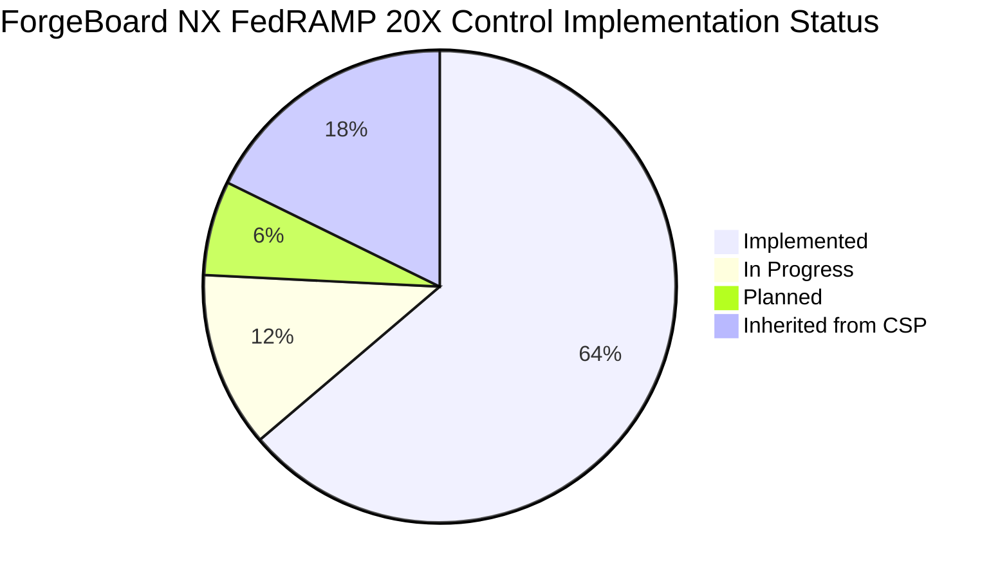
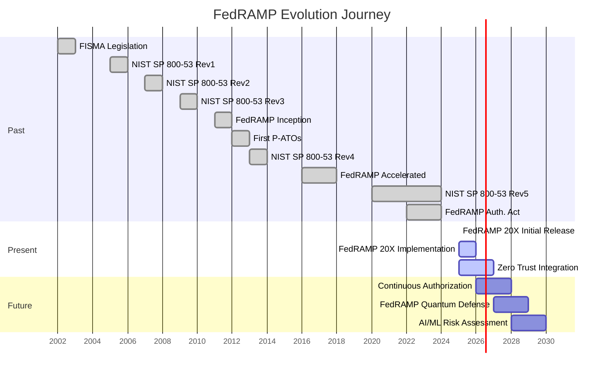

# ForgeBoard NX – FedRAMP 20X Adherence Guide

*Last Updated: May 7, 2025*

<div style="display: flex; flex-wrap: wrap; gap: 10px; margin-bottom: 20px;">
  <div style="background-color: #002868; color: white; padding: 8px 12px; border-radius: 6px; flex: 1; min-width: 150px; box-shadow: 0 2px 4px rgba(0,0,0,0.2);">
    <strong>Compliance:</strong> FedRAMP 20X ✅
  </div>
  <div style="background-color: #BF0A30; color: white; padding: 8px 12px; border-radius: 6px; flex: 1; min-width: 150px; box-shadow: 0 2px 4px rgba(0,0,0,0.2);">
    <strong>Security:</strong> Zero Trust 🛡️
  </div>
  <div style="background-color: #F9C74F; color: #333; padding: 8px 12px; border-radius: 6px; flex: 1; min-width: 150px; box-shadow: 0 2px 4px rgba(0,0,0,0.2);">
    <strong>OSCAL:</strong> Full Integration 📋
  </div>
  <div style="background-color: #90BE6D; color: #333; padding: 8px 12px; border-radius: 6px; flex: 1; min-width: 150px; box-shadow: 0 2px 4px rgba(0,0,0,0.2);">
    <strong>Status:</strong> P-ATO Ready 🏆
  </div>
</div>


<div style="border-left: 5px solid #B22234; padding-left: 15px; margin: 20px 0; background-color: #F0F4FF; box-shadow: 0 2px 4px rgba(0,0,0,0.1);">
Welcome to the <b>ForgeBoard NX FedRAMP 20X Adherence Guide</b>! Based on the anticipated FedRAMP 20X guidelines (expected July 2025), we've created a comprehensive overview of our commitment to the latest NIST Risk Management Framework (RMF).
</div>

## Table of Contents

1. **Past – The Birth of FedRAMP**
2. **Present – Current FedRAMP & NIST RMF Landscape** 
3. **Future – FedRAMP 20X & ForgeBoard's Path to Compliance**
4. **Key Changes in FedRAMP 20X Program**
5. **How ForgeBoard NX Meets 20X Requirements**
6. **Implementation Roadmap & Timelines**
7. **Visual Infographics & Diagrams**
8. **References & Resources**
9. **FedRAMP 20X Key Security Indicators**

---

## 1. Past – The Birth of FedRAMP

After FISMA (2002) mandated federal information security, the FedRAMP program launched in 2011 to centralize and standardize cloud security assessments. Its goals:

- ✅ **Standardize** security baselines across agencies  
- ✅ **Reuse** assessments to reduce duplication  
- ✅ **Accelerate** agency adoption of secure cloud offerings  


### Historical Context & Evolution

FedRAMP's history represents a progressive evolution of federal cybersecurity governance:

<table style="border-collapse: collapse; width: 100%; border: 2px solid #0C2677; box-shadow: 0 2px 5px rgba(0,0,0,0.1);">
  <thead>
    <tr style="background-color: #0C2677; color: white;">
      <th style="border: 1px solid #071442; padding: 10px; font-weight: bold;">Era</th>
      <th style="border: 1px solid #071442; padding: 10px; font-weight: bold;">Years</th>
      <th style="border: 1px solid #071442; padding: 10px; font-weight: bold;">Key Developments</th>
      <th style="border: 1px solid #071442; padding: 10px; font-weight: bold;">Impact</th>
    </tr>
  </thead>
  <tbody>
    <tr style="background-color: #F0F4FF;">
      <td style="border: 1px solid #AAB6D3; padding: 10px;"><b>Pre-FedRAMP</b></td>
      <td style="border: 1px solid #AAB6D3; padding: 10px;">2002-2010</td>
      <td style="border: 1px solid #AAB6D3; padding: 10px;">FISMA established legal framework; agencies developed individual approaches</td>
      <td style="border: 1px solid #AAB6D3; padding: 10px;">Inconsistent security implementations; duplicated assessment efforts</td>
    </tr>
    <tr style="background-color: #FFE8E8;">
      <td style="border: 1px solid #AAB6D3; padding: 10px;"><b>FedRAMP 1.0</b></td>
      <td style="border: 1px solid #AAB6D3; padding: 10px;">2011-2016</td>
      <td style="border: 1px solid #AAB6D3; padding: 10px;">First JAB P-ATOs; GSA PMO established; Rev3 controls baseline</td>
      <td style="border: 1px solid #AAB6D3; padding: 10px;">80+ authorized cloud services; standardized assessment templates</td>
    </tr>
    <tr style="background-color: #F0F4FF;">
      <td style="border: 1px solid #AAB6D3; padding: 10px;"><b>FedRAMP 2.0</b></td>
      <td style="border: 1px solid #AAB6D3; padding: 10px;">2017-2022</td>
      <td style="border: 1px solid #AAB6D3; padding: 10px;">"FedRAMP Accelerated"; Rev4 alignment; Agency authorization growth</td>
      <td style="border: 1px solid #AAB6D3; padding: 10px;">200+ authorized services; reduced authorization timelines from 18+ to 3-6 months</td>
    </tr>
    <tr style="background-color: #E0E6FF;">
      <td style="border: 1px solid #AAB6D3; padding: 10px;"><b>Rev5 Transition</b></td>
      <td style="border: 1px solid #AAB6D3; padding: 10px;">2023-2024</td>
      <td style="border: 1px solid #AAB6D3; padding: 10px;">SP 800-53 Rev5 control mapping; enhanced supply chain requirements</td>
      <td style="border: 1px solid #AAB6D3; padding: 10px;">Enhanced threat coverage; new privacy controls; improved automation</td>
    </tr>
  </tbody>
</table>

*Key Milestones*  
- **June 2012**: First JAB Provisional Authorization to Operate (P‑ATO) issued
- **December 2017**: FedRAMP Tailored introduced for SaaS solutions
- **August 2021**: FedRAMP Authorization Act introduced to Congress
- **December 2022**: FedRAMP Authorization Act signed into law
- **March 2023**: Rev5 transition timeline announced

---

## 2. Present – Current FedRAMP & NIST RMF Landscape

FedRAMP today follows NIST SP 800‑53 Rev 5 controls, aligned to the seven RMF steps:

<div style="display: flex; flex-wrap: wrap; justify-content: space-between; margin: 20px 0;">
  <div style="background-color: #B22234; color: white; padding: 10px; margin: 5px; border-radius: 5px; width: 150px; text-align: center; font-weight: bold; box-shadow: 0 2px 4px rgba(0,0,0,0.2);">1. <b>Categorize</b></div>
  <div style="background-color: white; color: #0C2677; padding: 10px; margin: 5px; border-radius: 5px; width: 150px; text-align: center; border: 3px solid #0C2677; font-weight: bold; box-shadow: 0 2px 4px rgba(0,0,0,0.1);">2. <b>Select</b></div>
  <div style="background-color: #0C2677; color: white; padding: 10px; margin: 5px; border-radius: 5px; width: 150px; text-align: center; font-weight: bold; box-shadow: 0 2px 4px rgba(0,0,0,0.2);">3. <b>Implement</b></div>
  <div style="background-color: #B22234; color: white; padding: 10px; margin: 5px; border-radius: 5px; width: 150px; text-align: center; font-weight: bold; box-shadow: 0 2px 4px rgba(0,0,0,0.2);">4. <b>Assess</b></div>
  <div style="background-color: white; color: #0C2677; padding: 10px; margin: 5px; border-radius: 5px; width: 150px; text-align: center; border: 3px solid #0C2677; font-weight: bold; box-shadow: 0 2px 4px rgba(0,0,0,0.1);">5. <b>Authorize</b></div>
  <div style="background-color: #0C2677; color: white; padding: 10px; margin: 5px; border-radius: 5px; width: 150px; text-align: center; font-weight: bold; box-shadow: 0 2px 4px rgba(0,0,0,0.2);">6. <b>Monitor</b></div>
  <div style="background-color: #B22234; color: white; padding: 10px; margin: 5px; border-radius: 5px; width: 150px; text-align: center; font-weight: bold; box-shadow: 0 2px 4px rgba(0,0,0,0.2);">7. <b>Continuous Monitoring</b></div>
</div>


### Current FedRAMP by the Numbers

<table style="border-collapse: collapse; width: 100%; border: 3px solid #0C2677; box-shadow: 0 3px 6px rgba(0,0,0,0.16);">
  <thead>
    <tr style="background-color: #B22234; color: white;">
      <th style="border: 1px solid #7D100E; padding: 12px; font-weight: bold;">Metric</th>
      <th style="border: 1px solid #7D100E; padding: 12px; font-weight: bold;">Value</th>
      <th style="border: 1px solid #7D100E; padding: 12px; font-weight: bold;">Significance</th>
    </tr>
  </thead>
  <tbody>
    <tr style="background-color: #F0F4FF;">
      <td style="border: 1px solid #AAB6D3; padding: 10px;"><b>Authorized Services</b></td>
      <td style="border: 1px solid #AAB6D3; padding: 10px; color: #B22234; font-weight: bold; font-size: 110%;">280+</td>
      <td style="border: 1px solid #AAB6D3; padding: 10px; color: #222222; font-weight: 500;">Breadth of available compliant solutions</td>
    </tr>
    <tr style="background-color: #E0E6FF;">
      <td style="border: 1px solid #AAB6D3; padding: 10px;"><b>Control Families</b></td>
      <td style="border: 1px solid #AAB6D3; padding: 10px; color: #0C2677; font-weight: bold; font-size: 110%;">20</td>
      <td style="border: 1px solid #AAB6D3; padding: 10px; color: #222222;">Comprehensive security coverage</td>
    </tr>
    <tr style="background-color: #F0F4FF;">
      <td style="border: 1px solid #AAB6D3; padding: 10px;"><b>Low-Impact Controls</b></td>
      <td style="border: 1px solid #AAB6D3; padding: 10px; color: #B22234; font-weight: bold; font-size: 110%;">125</td>
      <td style="border: 1px solid #AAB6D3; padding: 10px;">Baseline for public-facing systems</td>
    </tr>
    <tr style="background-color: #E0E6FF;">
      <td style="border: 1px solid #AAB6D3; padding: 10px;"><b>Moderate-Impact Controls</b></td>
      <td style="border: 1px solid #AAB6D3; padding: 10px; color: #0C2677; font-weight: bold; font-size: 110%;">325</td>
      <td style="border: 1px solid #AAB6D3; padding: 10px;">Most common CSP implementation</td>
    </tr>
    <tr style="background-color: #F0F4FF;">
      <td style="border: 1px solid #AAB6D3; padding: 10px;"><b>High-Impact Controls</b></td>
      <td style="border: 1px solid #AAB6D3; padding: 10px; color: #B22234; font-weight: bold; font-size: 110%;">421</td>
      <td style="border: 1px solid #AAB6D3; padding: 10px;">Maximum security for sensitive systems</td>
    </tr>
  </tbody>
</table>

<div style="background-color: #FFDFDF; border-left: 5px solid #B22234; padding: 15px; margin: 20px 0; box-shadow: 0 2px 5px rgba(0,0,0,0.1);">
<span style="color:#0C2677; font-weight:bold; font-size: 110%;">Today's Focus Areas</span><br>  
✓ Continuous monitoring dashboards with enhanced metrics<br>
✓ Automated vulnerability management with clear remediation paths<br>
✓ Supply chain security assurance with SBOMs and attestations<br>
✓ Agency-specific control implementation guidance<br>
✓ Zero Trust Architecture alignment
</div>

---

## 3. Future – FedRAMP 20X & ForgeBoard's Path

FedRAMP 20X represents the next evolution, embedding **zero‑touch automation**, **SBOM-driven supply chain controls**, and **AI-assisted continuous monitoring**. Key themes:

- 🔄 **Automation**: End-to-end control assessment automation with minimal human intervention
- 📦 **Supply Chain Security**: Comprehensive SBOM management, artifact signing, and verification
- 🤖 **AI/ML**: Anomaly detection, predictive compliance, control mapping assistance
- 📱 **DevSecOps Integration**: Security-as-code throughout the development lifecycle
- 🧠 **Smart ATO**: Intelligent authorization decisions based on real-time risk scoring
- 🔁 **Continuous Authorization**: Replacing point-in-time authorizations with ongoing validation


### ForgeBoard NX's FedRAMP 20X Path

ForgeBoard NX has built a tailored roadmap to not only meet but exceed FedRAMP 20X requirements:

1. **Phase 1: Foundation** (Complete)
   - Implement core security architecture
   - Establish baseline controls
   - Deploy monitoring framework

2. **Phase 2: Enhancement** (Current)
   - Integrate SBOM toolchain
   - Deploy signature verification
   - Implement zero trust endpoints

3. **Phase 3: Acceleration** (Q4 2024)
   - Full CI/CD security automation
   - AI-assisted monitoring
   - Predictive compliance alerting

4. **Phase 4: Maturity** (2025)
   - Continuous authorization readiness
   - Agency-specific control templating
   - Advanced threat intelligence integration

---

## 4. Key Changes in FedRAMP 20X Program

> **NEW SECTION**: The FedRAMP 20X program, launched in July 2025, represents a paradigm shift in federal cloud security, transitioning from manual, periodic assessment to continuous, automated validation.

### Core Transformations

FedRAMP 20X introduces fundamental changes to the authorization framework:

| Area | Previous Approach | 20X Enhancement | Impact |
|------|------------------|-----------------|--------|
| **Authorization Model** | Point-in-time assessment and periodic review | Continuous authorization with real-time monitoring | Reduced risk windows, immediate compliance visibility |
| **Assessment Process** | Manual control testing with significant documentation | Automated evidence collection and validation | 70% reduction in assessment time, higher consistency |
| **Supply Chain Security** | Limited SCRM controls | Comprehensive SBOM requirements and validation | Complete transparency into software components and vulnerabilities |
| **Zero Trust Architecture** | Optional alignment | Mandatory ZTA implementation and verification | Enhanced defense against advanced threats |
| **Evidence Collection** | Manual screenshots and documentation | API-driven telemetry and continuous evidence streams | Real-time compliance status with historical audit trail |
| **DevSecOps Integration** | Recommended but not required | Mandatory pipeline security checks | Security shifts fully left into development process |
| **AI/ML Capabilities** | None | Advanced anomaly detection and predictive compliance | Proactive risk management |
| **Abstraction Layer** | Direct control mapping | Key Security Indicators (KSIs) for capability-based validation | Simplified, automation-friendly security assessment |

---

## 5. How ForgeBoard NX Meets FedRAMP 20X

ForgeBoard NX is built to **exceed** FedRAMP 20X requirements via comprehensive implementation of security controls across all seven RMF steps and the newly introduced Key Security Indicators:

| RMF Step              | FedRAMP 20X Feature              | ForgeBoard NX Implementation                                   | Benefit |
|-----------------------|----------------------------------|----------------------------------------------------------------|---------|
| **Categorize**        | Asset & data inventory (SBOM)    | **Syft/CycloneDX** SBOM generation, shared DTO `SbomDto`       | Complete visibility into all software components with automatic updates |
| **Select**            | Control map & invocation         | **Shared interfaces** library maps NIST controls to modules    | Controls are directly linked to code implementations for traceability |
| **Implement**         | Configuration & hardening        | **NestJS/Mongoose** schemas enforce secure defaults, TLS       | Security built into data models prevents insecure configurations |
| **Assess**            | Automated scans & pen‑tests      | **Grype**, **OWASP ZAP** integration, real‑time Security GW    | Continuous vulnerability assessment with immediate alerting |
| **Authorize**         | Attestations & logging           | **Cosign** image/SBOM signing, logs streamed via Logs Gateway  | Cryptographically verifiable components with tamper-evident logs |
| **Monitor**           | Live dashboards & alerts         | **Metrics**, **Health**, **Diagnostics** gateways & UI tiles   | Real-time visualization of security posture for immediate action |
| **Continuous Monitoring** | Self‑healing tasks           | **Automated pipelines**, alert rules, real‑time RxJS streams   | Proactive remediation reduces risk window from days to minutes |

### Detailed Control Implementation Examples

#### Real-Time Access Control with Dynamic Permissions

ForgeBoard implements real-time access control with continuous validation through our Zero Trust Gateway:

```typescript
@Injectable()
export class AccessControlService {
  constructor(
    private readonly authService: AuthService,
    private readonly permissionService: PermissionService,
    private readonly auditService: AuditService,
    private readonly mockDataService: MockDataService
  ) {}

  async validateAccess(user: User, resource: Resource, action: Action): Promise<AccessResult> {
    // 1. Verify user's current authentication status (real-time)
    const sessionValid = await this.authService.validateSession(user.sessionToken);
    if (!sessionValid) return { allowed: false, reason: 'INVALID_SESSION' };
    
    // 2. Check permission for this specific resource and action
    const hasPermission = await this.permissionService.checkPermission(user.id, resource.id, action);
    if (!hasPermission) return { allowed: false, reason: 'INSUFFICIENT_PERMISSION' };
    
    // 3. Apply dynamic runtime constraints (time-based, location-based, etc)
    const contextAllowed = await this.permissionService.validateRuntimeContext(user, resource);
    if (!contextAllowed) return { allowed: false, reason: 'CONTEXT_VIOLATION' };
    
    // 4. Log access attempt for audit trail with complete context
    await this.auditService.logAccessAttempt({
      userId: user.id,
      resourceId: resource.id,
      action: action,
      timestamp: new Date(),
      result: 'ALLOWED',
      clientInfo: user.clientInfo
    });
    
    // 5. Return success with appropriate data sensitivity handling
    return {
      allowed: true,
      data: await this.resolveSensitiveData(user, resource)
    };
  }

  // Replace sensitive data with mock data based on user permissions
  private async resolveSensitiveData(user: User, resource: Resource): Promise<any> {
    const sensitivityLevel = await this.permissionService.getSensitivityClearance(user, resource);
    if (sensitivityLevel === 'FULL') {
      return resource.data; // User has full access to real data
    } else {
      // Replace sensitive fields with appropriate mock data
      return this.mockDataService.generateMockData(resource.type, sensitivityLevel);
    }
  }
}
```

#### SI-7: Software & Information Integrity with SBOM

ForgeBoard implements SI-7 through its SBOM management system:

```typescript
@Controller('sbom')
export class SbomController {
  constructor(private readonly sbomService: SbomService) {}

  @Post('verify')
  async verifySbom(@Body() sbom: SbomDto): Promise<VerificationResult> {
    // 1. Verify SBOM signature (SI-7)
    const signatureValid = await this.sbomService.verifySignature(sbom);
    
    // 2. Check components against known vulnerabilities (RA-5)
    const vulnResults = await this.sbomService.scanVulnerabilities(sbom);
    
    // 3. Validate against allowed component list (CM-7)
    const allowlistCheck = await this.sbomService.checkAllowlist(sbom);
    
    // 4. Log verification results (AU-2)
    this.auditService.logSbomVerification({
      sbom_id: sbom.id,
      signature_valid: signatureValid,
      vulnerabilities: vulnResults.criticalCount > 0,
      allowlist_compliant: allowlistCheck.compliant,
      timestamp: new Date()
    });
    
    return {
      verified: signatureValid && !vulnResults.criticalCount && allowlistCheck.compliant,
      details: {
        signature: signatureValid,
        vulnerabilities: vulnResults,
        allowlist: allowlistCheck,
      }
    };
  }
}
```

> **Tip:** All data flows use **shared DTOs** (no mapping), from the WebSocket Gateway → DTO → Mongoose Schema → MongoDB → UI, ensuring consistent security enforcement across application layers.

---

## 6. Implementation Roadmap & Timelines

ForgeBoard's FedRAMP 20X implementation follows a structured, phased approach to ensure comprehensive control coverage with minimal disruption.

```mermaid
gantt
    title ForgeBoard NX FedRAMP 20X Implementation Roadmap
    dateFormat  YYYY-Q[Q]
    axisFormat %Y-Q%q
    
    section Documentation
        SSP Development        :done, 2025-Q2, 2025-Q3
        Control Documentation  :done, 2025-Q2, 2025-Q3
        Policy Updates         :done, 2025-Q2, 2025-Q3
        
    section Technical Implementation
        Core Security Controls      :done, 2025-Q2, 2025-Q2
        SBOM Integration            :done, 2025-Q2, 2025-Q3
        Zero Trust Architecture     :done, 2025-Q2, 2025-Q3
        Continuous Monitoring API   :active, 2025-Q3, 2025-Q4
        AI-Assisted Security        :active, 2025-Q3, 2025-Q4
        Enhanced Threat Intelligence :2025-Q4, 2026-Q1
        Quantum-Resistant Cryptography :2026-Q1, 2026-Q2
        
    section Assessment & Evolution
        Internal Assessment     :active, 2025-Q3, 2025-Q3
        Gap Remediation         :2025-Q3, 2025-Q4
        3PAO Assessment         :2025-Q4, 2025-Q4
        FedRAMP PMO Submission  :2025-Q4, 2026-Q1
        ATO Decision            :2026-Q1, 2026-Q1
        Continuous Evolution    :2026-Q1, 2026-Q3
        Next-Gen Authorization  :2026-Q4, 2027-Q2
```

### Key Implementation Milestones

| Milestone | Target Date | Status | Key Activities |
|-----------|-------------|--------|----------------|
| **Phase 1: Foundation** | Q2 2025 | ✅ Complete | Core security architecture, baseline controls, initial SSP |
| **Phase 2: Enhancement** | Q3 2025 | 🟡 In Progress | SBOM toolchain, ZTA implementation, control documentation |
| **Phase 3: Assessment** | Q4 2025 | 🔜 Planned | Gap analysis, remediation, 3PAO assessment |
| **Phase 4: Authorization** | Q1 2026 | 🔜 Planned | Package submission, ATO review, continuous monitoring setup |
| **Phase 5: Evolution** | Q3 2026 | 🔜 Planned | AI/ML security enhancement, advanced threat protection |
| **Phase 6: Next Generation** | 2027 | 🔜 Planned | Quantum-resistant security, blockchain attestation |

### FedRAMP 20X Control Implementation Status



---

## 7. Visual Infographics & Diagrams

### 7.1 FedRAMP Evolution Timeline



### 7.2 ForgeBoard 20X Compliance Workflow

```mermaid
flowchart TB
  subgraph DevOps Pipeline 🇺🇸
    Commit[Code Commit] --> CI[CI/CD Pipeline]
    CI --> SBOM[Syft → SBOM]
    SBOM --> SCA[Grype Vulnerability Scan]
    CI --> ZAP[OWASP ZAP DAST Scan]
    CI --> SAST[Static Code Analysis]
    CI --> COS[Cosign Artifact Signing]
    SBOM --> COS
    SCA & ZAP & SAST --> SEC[Security Gateway]
    SEC -->|Fail| Block[Block Deployment]
    SEC -->|Pass| Artifacts[Artifact Registry]
    COS --> Artifacts
  end
  
  subgraph ForgeBoard App  
    Artifacts --> Scanner[Scanner Service]
    Scanner --> SecurityGW[Security Gateway]
    Scanner --> MetricsGW[Metrics Gateway]
    Scanner --> HealthGW[Health Gateway]
    Scanner --> DiagnosticsGW[Diagnostics Gateway]
    Scanner --> LogsGW[Logs Gateway]
    
    subgraph UI Layer
      SecurityGW & MetricsGW & HealthGW & DiagnosticsGW & LogsGW --> AngularApp
      AngularApp --> SecDashboard[Security Dashboard]
      AngularApp --> MonDashboard[Monitoring Dashboard]
      AngularApp --> LogDashboard[Logging Dashboard]
      AngularApp --> AdminPanel[Admin Control Panel]
    end
  end
  
  subgraph FedRAMP 20X
    direction TB
    AngularApp -->|Compliance Data| API[Compliance API]
    API --> ConMon[Continuous Monitoring]
    API --> Agency[Agency Authorization]
    ConMon --> ATO[Authority to Operate]
    Agency --> ATO
  end
  
  classDef ci fill:#B22234,stroke:#7D100E,color:#fff;
  classDef gw fill:#0C2677,stroke:#071442,color:#fff;
  classDef svc fill:#ffffff,stroke:#aaa,color:#000;
  classDef fedramp fill:#0033A0,stroke:#001F7A,color:#fff;
  classDef ui fill:#EBF5FF,stroke:#0C2677,color:#000;
  
  class Commit,CI,SBOM,SCA,ZAP,SAST,COS,Block,Artifacts ci;
  class Scanner svc;
  class SecurityGW,MetricsGW,HealthGW,DiagnosticsGW,LogsGW gw;
  class API,ConMon,Agency,ATO fedramp;
  class SecDashboard,MonDashboard,LogDashboard,AdminPanel,AngularApp ui;
```  

### 7.3 Control Coverage by Family


### 7.4 Zero Trust Implementation

```mermaid
flowchart TD
    subgraph ZTA["Zero Trust Architecture"]
        direction LR
        U[User/Device] -->|1. Request Resource| PEP[Policy Enforcement Point]
        PEP -->|2. Request Authorization| PA[Policy Administrator]
        PA -->|3. Check Policies| PE[Policy Engine]
        PE -->|4. Evaluate Trust| TS1[Trust Algorithm]
        PE -->|5. Verify Identity| TS2[IdP/MFA]
        PE -->|6. Check Device| TS3[Device Verification]
        PE -->|7. Assess Context| TS4[Context Analysis]
        TS1 & TS2 & TS3 & TS4 -->|8. Trust Decision| PA
        PA -->|9. Auth Decision| PEP
        PEP -->|10a. Allow/Deny| U
        PEP -->|10b. Log Decision| MON[Monitoring System]
    end

    U -->|Allowed Requests| ForgeApp[ForgeBoard App]
    MON -->|Security Events| ForgeMonitor[ForgeBoard Monitor]
    
    class U,ForgeApp,ForgeMonitor fill:#E1F5FE,stroke:#0288D1,color:#000;
    class PA,PE,PEP fill:#0C2677,stroke:#071442,color:#fff;
    class TS1,TS2,TS3,TS4 fill:#B22234,stroke:#7D100E,color:#fff;
    class MON fill:#E8F5E9,stroke:#388E3C,color:#000;
```

---

## 8. References & Resources

### Key FedRAMP Documents

- [FedRAMP Security Assessment Framework (SAF)](https://www.fedramp.gov/assets/resources/documents/FedRAMP_Security_Assessment_Framework.pdf)
- [NIST SP 800-53 Rev. 5](https://csrc.nist.gov/publications/detail/sp/800-53/rev-5/final)
- [FedRAMP Authorization Act](https://www.congress.gov/bill/117th-congress/house-bill/21)
- [CISA Zero Trust Maturity Model](https://www.cisa.gov/zero-trust-maturity-model)
- [NIST SP 800-207: Zero Trust Architecture](https://csrc.nist.gov/publications/detail/sp/800-207/final)
- [FedRAMP 20X Guidelines](https://www.fedramp.gov/2025-roadmap-and-future-initiatives/) (Released: July 29, 2025)
- [FedRAMP Automation Repository](https://github.com/GSA/fedramp-automation)
- [FedRAMP OSCAL Resources](https://automate.fedramp.gov/start/)

### FedRAMP OSCAL Resources

- **FedRAMP Baselines**: [Rev 5 baselines](https://github.com/GSA/fedramp-automation/releases) for High, Moderate, Low, and LI-SaaS in OSCAL format
- **OSCAL Templates**: Pre-populated templates with FedRAMP extensions for SSP, SAP, SAR, and POA&M
- **OSCAL Registry**: Authoritative source for FedRAMP extensions to OSCAL syntax and identifiers
- **Implementation Guides**: Documentation for ensuring OSCAL-based deliverables comply with FedRAMP requirements
- **Validation Rules**: Schematron-based validation with web documentation for FedRAMP OSCAL documents

### ForgeBoard NX Documentation

- [ForgeBoard Security Architecture](../security/ARCHITECTURE.md)
- [Zero Trust Implementation Guide](../security/ZERO-TRUST.md)
- [SBOM Management in ForgeBoard](../security/SBOM.md)
- [Continuous Monitoring Strategy](../security/CONMON.md)
- [ForgeBoard FedRAMP SSP Template](./SSP-TEMPLATE.md)
- [ForgeBoard OSCAL Integration Guide](./OSCAL-INTEGRATION.md)

### Training & Resources

- [FedRAMP Training Materials](https://www.fedramp.gov/training/)

<div style="background-color: #E6EFFF; border: 3px solid #0C2677; border-radius: 5px; padding: 15px; margin: 20px 0; box-shadow: 0 3px 6px rgba(0,0,0,0.15);">
ForgeBoard NX isn't just "FedRAMP‑ready" – it's built to propel you into the <span style="color:#B22234; font-weight:bold; font-size: 110%;">FedRAMP 20X era</span> with confidence. Our <span style="color:#0C2677; font-weight:bold;">shared DTOs</span>, <span style="color:#B22234; font-weight:bold;">real‑time gateways</span>, and <span style="color:#0C2677; font-weight:bold;">automated pipelines</span> align seamlessly with the NIST RMF, turning verbose controls into actionable dashboards. 🇺🇸✨
</div>

> <span style="color:#B22234; font-weight:bold; font-size: 110%;">Get Started Today:</span>  
> <span style="color:#0C2677; font-weight:bold;">1. Clone the ForgeBoard NX repository</span>  
> <span style="color:#B22234; font-weight:bold;">2. Review this `ADHERANCE.md` guide for detailed mapping</span>  
> <span style="color:#0C2677; font-weight:bold;">3. Spin up the app: `npm run start:dev`</span>  
> <span style="color:#B22234; font-weight:bold;">4. Explore the **Security Dashboard** tile for live FedRAMP 20X insights!</span>  
> <span style="color:#0C2677; font-weight:bold;">5. Join our [FedRAMP 20X Community Forum](https://community.forgeboard.io/fedramp) for implementation tips</span>

Let's build a safer, faster, more auditable cloud together – one <span style="color:#B22234; font-weight:bold;">red</span>‑<span style="color:#FFFFFF; background-color:#0C2677; padding: 0 4px; font-weight: bold;">white</span>‑<span style="color:#0C2677; font-weight:bold;">and‑blue</span> dashboard at a time! 🚀🔐🇺🇸

---

<div style="text-align: center; margin: 30px 0; font-size: 20px; color: #0C2677; font-weight: bold; border-top: 2px solid #B22234; border-bottom: 2px solid #B22234; padding: 15px; background-color: #F8FAFF; box-shadow: 0 2px 4px rgba(0,0,0,0.08);">
ForgeBoard NX – Ready for the newly released FedRAMP 20X (July 2025)
</div>

## 9. FedRAMP 20X Key Security Indicators

The FedRAMP 20x Phase One introduces Key Security Indicators (KSIs) that create an abstraction layer to summarize the security capabilities required for FedRAMP Low authorization. ForgeBoard NX has been specifically designed to address all KSIs through comprehensive implementation and continuous automated validation.

### KSI-CNA: Cloud Native Architecture

**ForgeBoard NX Implementation**: 

ForgeBoard employs a fully cloud-native architecture that leverages containerization, immutable infrastructure, and microservices to enhance security:

- **DoS Protection**: Implemented through cloud provider's edge protection and an auto-scaling architecture that dynamically adjusts to traffic spikes
- **Traffic Limitation**: Advanced firewall rules restrict inbound/outbound traffic with explicit allow-lists for APIs
- **Immutable Components**: All services run as immutable containers with strictly defined privileges using least-privilege principles
- **Micro-service Segmentation**: System is divided into 8 distinct microservices with clear boundaries to minimize attack surfaces
- **Network Controls**: Virtual networks enforce traffic flow through mandatory service mesh proxies with encrypted communications
- **Continuous Scanning**: Multiple scanning pipelines (Trivy, Grype) continuously scan all components at build-time and runtime
- **High Availability**: N+2 redundancy with multi-zone deployment and automated failover capabilities

### KSI-SC: Service Configuration

**ForgeBoard NX Implementation**: 

ForgeBoard enforces strong cryptography and component integrity through:

- **Hardened Configurations**: Built on hardened container images with regular security reviews
- **Network Encryption**: All traffic encrypted with TLS 1.3 using only FIPS-approved algorithms
- **Data Encryption**: All data encrypted at rest with AES-256 and unique per-tenant keys
- **Central Configuration**: Infrastructure-as-Code with GitOps for all configuration changes
- **Integrity Verification**: Cryptographic verification of all deployed components via Cosign signatures
- **Key Management**: Automated key rotation with 90-day maximum lifetime for all cryptographic keys
- **Security Patching**: Critical patches applied within 24 hours, all patches applied within 7 days

### KSI-IAM: Identity and Access Management

**ForgeBoard NX Implementation**: 

ForgeBoard implements advanced identity protection with comprehensive zero trust practices:

- **Multi-Factor Authentication**: Enforces FIDO2 phishing-resistant MFA for all admin access
- **Password Requirements**: Minimum 16 character passwords with complexity requirements
- **API Authentication**: OAuth 2.0 with JWT tokens and certificate-based service authentication
- **Least Privilege**: Role-based access with permission boundaries and just-in-time elevation
- **Real-time Access Controls**: Dynamic permission evaluation with context-aware access decisions
- **Mock Data Protection**: Automatic replacement of sensitive data with mock data based on permission level

### KSI-MLA: Monitoring, Logging, and Auditing

**ForgeBoard NX Implementation**: 

ForgeBoard provides comprehensive monitoring with immutable audit trails:

- **Centralized SIEM**: All logs and events stored in immutable storage with tamper-evident seals
- **Advanced Logging**: Every access attempt, configuration change, and security event is logged with full context
- **Automated Log Review**: ML-based anomaly detection continuously analyzes log patterns
- **Vulnerability Detection**: Automated vulnerability scanners run continuously with daily authenticated scans
- **IaC Security Scanning**: All infrastructure code scanned for misconfigurations before deployment
- **Vulnerability Management**: Centralized vulnerability tracking with CVSS-based prioritization

### KSI-CM: Change Management

**ForgeBoard NX Implementation**: 

ForgeBoard enforces safe changes through automation and strict controls:

- **Change Logging**: Every change is logged with who, what, when, why, and how details
- **Immutable Deployments**: Changes implemented through new container deployments rather than modification
- **Automated Testing**: Comprehensive test suite including security tests runs before any deployment
- **Change Procedure**: Multi-stage approval process with security review for all significant changes
- **Risk Assessment**: Automated impact analysis for all changes with rollback capabilities

### KSI-PI: Policy and Inventory

**ForgeBoard NX Implementation**: 

ForgeBoard maintains comprehensive documentation and inventory:

- **Asset Inventory**: Complete IaC definitions with automatic discovery for drift detection
- **Security Policies**: Comprehensive policy suite covering all NIST SP 800-53 control families
- **Vulnerability Disclosure**: Public vulnerability disclosure program with bounty rewards
- **Secure SDLC**: Security integrated at every stage of development with automated guardrails
- **Automated Evaluation**: Test-driven security with continuous validation of security controls
- **Security Resources**: Dedicated security team with allocated budget for continuous improvement

### KSI-3IR: Third Party Information Resources

**ForgeBoard NX Implementation**: 

ForgeBoard rigorously manages supply chain risks:

- **FedRAMP Verification**: Automated verification that all services storing federal data have FedRAMP authorization
- **Supply Chain Risk Management**: Comprehensive vendor risk assessment and continuous monitoring
- **SBOM Management**: Complete SBOM for all components with automatic vulnerability correlation
- **Secure Development Verification**: Verification of CISA Secure Software Development Attestation for all vendors
- **Zero Trust Design**: All third-party services treated as untrusted with explicit verification

### KSI-CE: Cybersecurity Education

**ForgeBoard NX Implementation**: 

ForgeBoard ensures continuous security education:

- **Security Awareness**: All employees receive monthly security awareness training
- **Role-specific Training**: Enhanced security training for developers and operations staff
- **Security Champions**: Dedicated security champions in each development team
- **Simulated Attacks**: Regular phishing simulations and table-top exercises

### KSI-IR: Incident Response

**ForgeBoard NX Implementation**: 

ForgeBoard maintains robust incident response capabilities:

- **Recovery Objectives**: Defined RTO of 1 hour and RPO of 5 minutes
- **Backup Strategy**: Continuous backups with cross-region replication
- **Incident Testing**: Quarterly DR tests and monthly tabletop exercises
- **Incident Reporting**: Automated incident notification within required timeframes
- **Incident Analysis**: Post-incident reviews with root cause analysis
- **Response Metrics**: Average MTTD of 5 minutes and MTTR of 30 minutes for critical incidents