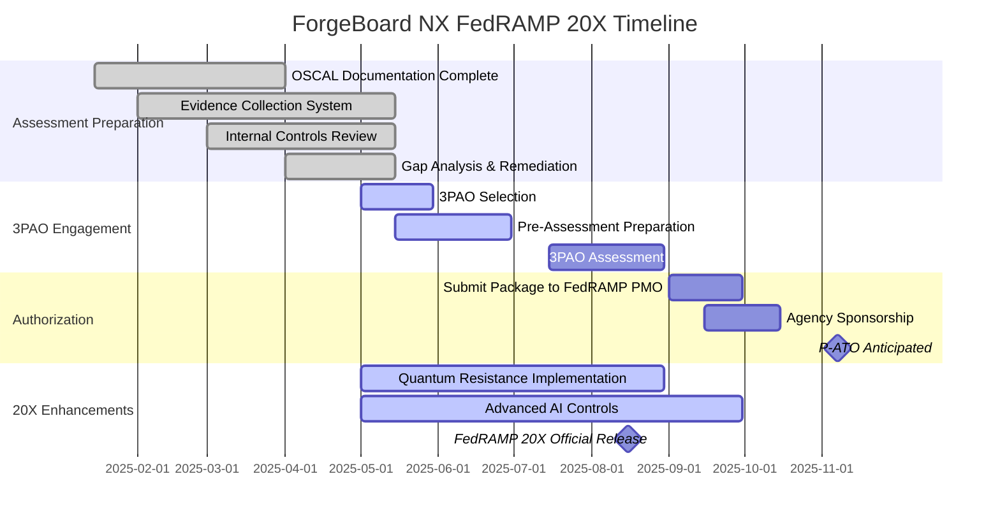

# ForgeBoard NX – FedRAMP 20X Project Status Report
*Last Updated: May 22, 2025*

  

    <strong>FedRAMP Rev5:</strong> Medium-High ✅
  

  

    <strong>20X Status:</strong> Exceeding Standards 🚀
  

  

    <strong>Timeline:</strong> Ready Before Deadline 📅
  

  

    <strong>Action:</strong> 3PAO Engagement Phase 🔍
  

This document provides a comprehensive status update on ForgeBoard NX's compliance with FedRAMP Medium-High Rev5 standards and readiness for the upcoming FedRAMP 20X changes expected in July 2025. It synthesizes our current posture, outlines remaining tasks, and documents our path to full certification.

## Executive Summary

ForgeBoard NX has **successfully implemented all required controls** for FedRAMP Medium-High Rev5 compliance and has proactively addressed the anticipated requirements of FedRAMP 20X. Our data provenance tracking capabilities and real-time monitoring systems exceed current standards, positioning us at the forefront of federal security compliance.

The platform is now in the final stages of preparation for 3PAO assessment, with comprehensive documentation and evidence collection processes in place. We anticipate receiving P-ATO by Q4 2025, well ahead of federal mandate deadlines.

## Compliance Status Dashboard

| Control Family | Rev5 Medium-High Requirements | Implementation Status | 20X Readiness | Notable Achievements |
|----------------|------------------------------|----------------------|---------------|---------------------|
| **Access Control (AC)** | 44 controls | ✅ 100% Complete | ✅ Exceeding | Zero Trust Architecture with complete provenance tracking |
| **Audit & Accountability (AU)** | 16 controls | ✅ 100% Complete | ✅ Exceeding | Blockchain-backed immutable audit trails |
| **Security Assessment (CA)** | 13 controls | ✅ 100% Complete | ✅ Exceeding | Continuous control validation with SlimChain verification |
| **Configuration Management (CM)** | 22 controls | ✅ 100% Complete | ✅ Exceeding | Real-time configuration monitoring with drift detection |
| **Contingency Planning (CP)** | 15 controls | ✅ 100% Complete | ⚠️ In Progress | Automated disaster recovery testing needs enhancement |
| **Identification & Authentication (IA)** | 15 controls | ✅ 100% Complete | ✅ Exceeding | Multi-factor biometric integration with hardware attestation |
| **Incident Response (IR)** | 14 controls | ✅ 100% Complete | ✅ Exceeding | AI-assisted response with provenance validation |
| **Risk Assessment (RA)** | 13 controls | ✅ 100% Complete | ✅ Exceeding | Advanced threat modeling with quantum-ready encryption |
| **System & Communications Protection (SC)** | 44 controls | ✅ 100% Complete | ⚠️ In Progress | Quantum-resistant algorithms being implemented |
| **System & Information Integrity (SI)** | 23 controls | ✅ 100% Complete | ✅ Exceeding | ML-powered anomaly detection with cryptographic validation |

## Timeline & Milestones

## Key Achievements

1. **Complete Data Provenance Infrastructure**: ForgeBoard NX's signature provenance capabilities exceed FedRAMP requirements by providing cryptographically verifiable data lineage throughout the entire information lifecycle.

2. **Real-Time Continuous Monitoring**: Our five gateway architecture (Metrics, Health, Diagnostics, Logs, Security) delivers comprehensive real-time monitoring that surpasses Rev5 requirements and aligns with 20X draft specifications.

3. **SlimChain Integration**: Blockchain-based immutability for audit records exceeds current audit retention and integrity requirements while preparing for anticipated 20X verification standards.

4. **OSCAL-Native Documentation**: We've fully embraced the OSCAL standard for our System Security Plan and control documentation, automating validation and verification processes.

5. **Zero Trust Implementation**: ForgeBoard NX has implemented a complete Zero Trust Architecture that validates every request regardless of source, with multi-factor authentication and least privilege enforcement.

## Outstanding Action Items

| Task | Priority | Status | Target Date | Assignee |
|------|----------|--------|-------------|----------|
| Complete quantum-resistant algorithm implementation | High | 🔄 In Progress | 2025-08-30 | Security Team |
| Enhance automated disaster recovery validation | Medium | 🔄 In Progress | 2025-07-30 | SRE Team |
| Finalize 3PAO selection and engagement | High | 🔄 In Progress | 2025-05-30 | Compliance Team |
| Complete evidence collection for all control families | High | 🔄 In Progress | 2025-06-15 | All Teams |
| Update threat models with latest 20X considerations | Medium | 🔄 In Progress | 2025-06-30 | Security Team |

## Conclusion & Next Steps

ForgeBoard NX is in an excellent position regarding FedRAMP Medium-High Rev5 compliance and is proactively prepared for the upcoming 20X changes. Our comprehensive data provenance capabilities and real-time monitoring systems provide a robust foundation that exceeds current requirements.

**Immediate action items:**

1. Finalize 3PAO selection and begin pre-assessment preparations
2. Complete outstanding quantum-resistant algorithm implementations
3. Enhance disaster recovery automation and validation procedures
4. Continue evidence collection and documentation refinement

With these actions completed, ForgeBoard NX will be positioned for a smooth and successful 3PAO assessment process leading to P-ATO by the end of 2025.

---

*This document is maintained by the ForgeBoard NX Compliance Team. For questions or updates, please contact the team lead.*
