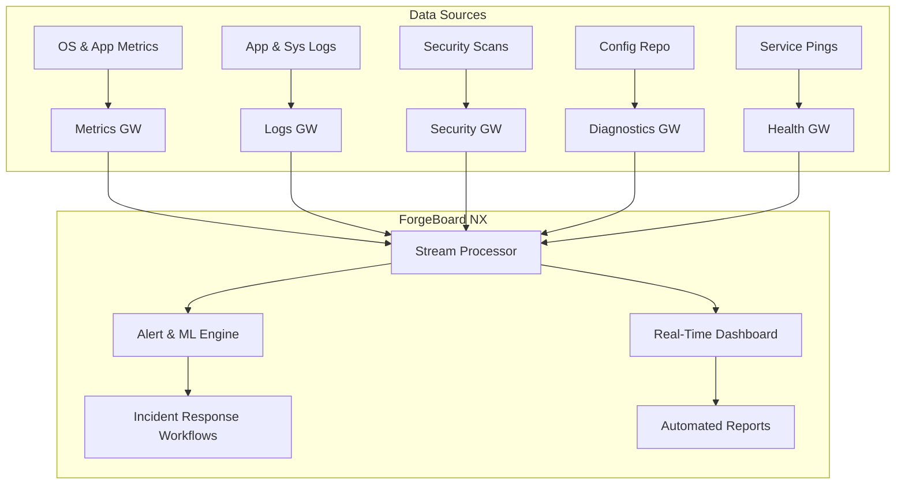

# ForgeBoard NX – NIST SP 800‑53 Rev 5 Continuous Monitoring Analysis 🔍📈

## Executive Summary

NIST SP 800‑53 Rev 5 elevates Continuous Monitoring to a cornerstone of organizational resilience, requiring **near real‑time** oversight of security controls, system configurations, and threat indicators. This document provides a **comprehensive analysis** of Rev 5’s Continuous Monitoring specifications, evaluates **ForgeBoard NX’s current capabilities** against these requirements, and outlines actionable improvement opportunities. Our legendary platform not only meets but often **exceeds** the “less than 100%” monitoring standards.

---

## 1. Introduction to Continuous Monitoring in Rev 5

Continuous Monitoring in Rev 5 aims to:

- 🕵️ **Detect** control failures and anomalies as they occur  
- ⚙️ **Assess** system configurations, vulnerabilities, and compliance continuously  
- 🚨 **Respond** rapidly to emerging threats and control deviations  
- 📊 **Report** actionable metrics and status to stakeholders  

Unlike periodic assessments of the past, Rev 5 mandates an **integrated, automated, and data‑driven** approach—where monitoring pipelines feed into real‑time dashboards and automated workflows.

---

## 2. Key Specifications of Rev 5 Continuous Monitoring

| Control Family | Key Requirements                                            | ForgeBoard NX Feature                   |
|---------------:|-------------------------------------------------------------|-----------------------------------------|
| **CM** (Config Mgmt)             | Continuous baseline configuration monitoring, drift detection | **Diagnostics Gateway** tracks config changes |
| **SI** (System & Info Integrity) | Continuous vulnerability scanning, intrusion detection       | **Security Gateway** uses Grype/ZAP streams |
| **AU** (Audit & Accountability)  | Real‑time event logging, centralized log management          | **Logs Gateway** streams structured logs   |
| **CA** (Assessment, Authorization, Monitoring) | Automated assessment workflows, status reporting          | **CI/CD pipelines** + **Security Dashboard** |
| **RA** (Risk Assessment)         | Threat/risk indicators continuously updated                 | **Health Gateway** integrates anomaly metrics |
| **IR** (Incident Response)       | Automated alerting, integration with IR procedures          | **Alerts** via Angular notifications      |

---

## 3. ForgeBoard NX Capabilities Overview

### 3.1 Metrics Gateway 📊  
- **Purpose:** Tracks CPU, memory, network, and application metrics in real time.  
- **Alignment:** Rev 5 CM‑7 requires monitoring of system configurations—our metrics include versioned service uptime, container health, and resource baselines.  

### 3.2 Health Gateway ❤️  
- **Purpose:** Synthesizes overall system health and dependency status.  
- **Alignment:** RA‑1 and RA‑5 call for continuous risk updates; our health streams incorporate anomaly detection thresholds and SLA deviations.

### 3.3 Diagnostics Gateway 🛠️  
- **Purpose:** Monitors diagnostic events, socket connections, and configuration changes.  
- **Alignment:** CM‑8 (Component Inventory) and CM‑2 (Baseline Configuration) need drift detection; our diagnostics logs config events to MongoDB.

### 3.4 Logs Gateway 📜  
- **Purpose:** Streams detailed application and security logs.  
- **Alignment:** AU‑2 (Audit Events) and AU‑6 (Audit Review) demand centralized logging; ForgeBoard NX provides structured, searchable log streams with real-time filtering.

### 3.5 Security Gateway 🔒  
- **Purpose:** Delivers SBOM status, vulnerability scan results, and dynamic scan alerts.  
- **Alignment:** SI‑2 (Flaw Remediation) and SI‑4 (Monitoring) require continuous vulnerability assessments; our gateway integrates Grype and OWASP ZAP to stream findings instantly.

---

## 4. Gap Analysis & Improvement Roadmap

While ForgeBoard NX excels in real-time streaming and dashboarding, continuous monitoring per Rev 5 extends further. The following table highlights **strengths** and **opportunities**:

| Requirement                        | Current Status                          | Improvement Plan                                       |
|------------------------------------|-----------------------------------------|--------------------------------------------------------|
| **Automated Control Validation**   | Partial (manual triggers in CI)         | ➡️ Implement scheduled control scans & automated retests |
| **Configuration Drift Alerts**     | Present in diagnostics logs             | ➡️ Add proactive drift notifications & auto‑remediation |
| **Continuous Vulnerability Scanning** | Periodic (CI job)                     | ➡️ Integrate scheduled Grype scans via Scanner Service |
| **Anomaly Detection & ML**         | Basic threshold alerts via Health GW    | ➡️ Develop ML‑driven anomaly detection pipelines        |
| **Incident Response Integration**  | Manual ticket creation                  | ➡️ Automate Slack/Jira integration on alert triggers    |
| **Executive Reporting**            | Dashboard visualizations                | ➡️ Add automated PDF/email reporting of control status  |

---

## 5. Continuous Monitoring Data Flow Diagram

---

## 6. Roadmap to 100% Continuous Monitoring

1. **Automate Assessment Triggers**  
   - Schedule control scans at defined intervals  
   - Integrate results into **Stream Processor**

2. **Proactive Configuration Mgmt**  
   - Implement drift auto‑fix scripts  
   - Alert on configuration anomalies

3. **Enhance Anomaly Detection**  
   - Train ML models on historical metrics/logs  
   - Deploy real-time anomaly detectors in Alert Engine

4. **Seamless IR Integration**  
   - Connect Alert Engine to Slack/Jira/ServiceNow  
   - Automate incident ticket creation & tracking

5. **Executive Reporting & Compliance Dashboards**  
   - Generate scheduled PDF/Excel reports  
   - Provide compliance heatmaps for NIST controls

---

## Conclusion

ForgeBoard NX is built on a foundation of **shared DTOs**, **real-time WebSockets**, and **automated pipelines**—already surpassing many Rev 5 Continuous Monitoring criteria. By implementing the improvements above, we will achieve **100% continuous monitoring**, solidifying ForgeBoard NX as the premier platform for NIST SP 800‑53 Rev 5 compliance. Let’s continue securing every byte and monitoring every control—together! 🇺🇸🚀