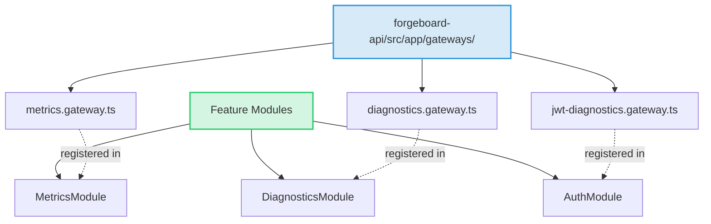
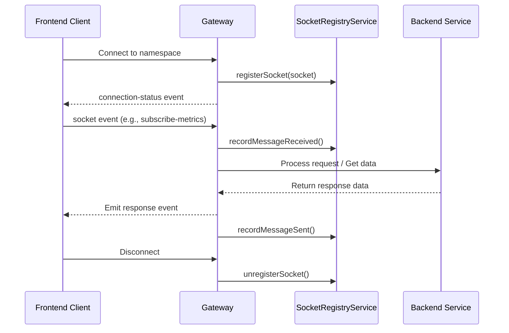

# 🔌 ForgeBoard NX: Gateway Architecture & Flow 🇺🇸
*Last Updated: 13MAY25 Jeffrey*

<div style="display: flex; flex-wrap: wrap; gap: 10px; margin-bottom: 20px;">
  <div style="background-color: #002868; color: white; padding: 8px 12px; border-radius: 6px; flex: 1; min-width: 150px; box-shadow: 0 2px 4px rgba(0,0,0,0.2);">
    <strong>Focus:</strong> System Architecture 🏗️
  </div>
  <div style="background-color: #BF0A30; color: white; padding: 8px 12px; border-radius: 6px; flex: 1; min-width: 150px; box-shadow: 0 2px 4px rgba(0,0,0,0.2);">
    <strong>Component:</strong> WebSocket Gateways ⚡
  </div>
  <div style="background-color: #F9C74F; color: #333; padding: 8px 12px; border-radius: 6px; flex: 1; min-width: 150px; box-shadow: 0 2px 4px rgba(0,0,0,0.2);">
    <strong>Status:</strong> Production Ready ✅
  </div>
  <div style="background-color: #90BE6D; color: #333; padding: 8px 12px; border-radius: 6px; flex: 1; min-width: 150px; box-shadow: 0 2px 4px rgba(0,0,0,0.2);">
    <strong>Pattern:</strong> Server-Authoritative ⚔️
  </div>
</div>

<div style="border-left: 5px solid #B22234; padding-left: 15px; margin: 20px 0; background-color: #F0F4FF; box-shadow: 0 2px 4px rgba(0,0,0,0.1);">
This document outlines the architecture, organization, and flow of WebSocket gateways within the ForgeBoard NX ecosystem. Gateways provide a vital communication layer between frontend clients and backend services, enabling real-time data exchange, event-driven interactions, and resilient state management using a consistently organized pattern.
</div>

## <span style="color:#B22234; font-weight:bold;">1. Gateway Organization & Structure</span>

All ForgeBoard NX gateways follow a standardized organization pattern:

1. **Location**: All gateway implementations reside in the designated `gateways` folder within the backend API structure:
   ```
   forgeboard-api/src/app/gateways/
   ```

2. **Naming Convention**: Gateway files use the `*.gateway.ts` naming pattern (e.g., `metrics.gateway.ts`, `diagnostics.gateway.ts`)

3. **Registration**: Gateways are registered and exported through their respective feature modules (e.g., `MetricsModule`, `DiagnosticsModule`)

4. **Implementation Pattern**: All gateways implement the core gateway lifecycle interfaces:
   - `OnGatewayInit` 
   - `OnGatewayConnection`
   - `OnGatewayDisconnect`

### Gateway Organization



## <span style="color:#0C2677; font-weight:bold;">2. Gateway Registry & Standardized Flow</span>

ForgeBoard gateways implement a **registry pattern** to maintain awareness of active connections and state. This pattern relies on the `SocketRegistryService` for connection management and metadata tracking.

### Registry Pattern

<table style="border-collapse: collapse; width: 100%; border: 2px solid #0C2677; box-shadow: 0 2px 5px rgba(0,0,0,0.1);">
  <thead>
    <tr style="background-color: #0C2677; color: white;">
      <th style="border: 1px solid #071442; padding: 10px; font-weight: bold;">Component</th>
      <th style="border: 1px solid #071442; padding: 10px; font-weight: bold;">Responsibilities</th>
      <th style="border: 1px solid #071442; padding: 10px; font-weight: bold;">Methods</th>
    </tr>
  </thead>
  <tbody>
    <tr style="background-color: #F0F4FF;">
      <td style="border: 1px solid #AAB6D3; padding: 10px;"><code>SocketRegistryService</code></td>
      <td style="border: 1px solid #AAB6D3; padding: 10px;">
        <ul>
          <li>Track active socket connections</li>
          <li>Maintain connection metadata</li>
          <li>Collect usage metrics</li>
          <li>Log socket events</li>
        </ul>
      </td>
      <td style="border: 1px solid #AAB6D3; padding: 10px;">
        <ul>
          <li><code>registerSocket()</code></li>
          <li><code>unregisterSocket()</code></li>
          <li><code>recordMessageReceived()</code></li>
          <li><code>recordMessageSent()</code></li>
          <li><code>getActiveSockets()</code></li>
          <li><code>getMetrics()</code></li>
        </ul>
      </td>
    </tr>
    <tr style="background-color: #FFE8E8;">
      <td style="border: 1px solid #AAB6D3; padding: 10px;"><code>Gateway Classes</code></td>
      <td style="border: 1px solid #AAB6D3; padding: 10px;">
        <ul>
          <li>Handle socket connections</li>
          <li>Process incoming events</li>
          <li>Emit outgoing events</li>
          <li>Register with SocketRegistry</li>
        </ul>
      </td>
      <td style="border: 1px solid #AAB6D3; padding: 10px;">
        <ul>
          <li><code>afterInit()</code></li>
          <li><code>handleConnection()</code></li>
          <li><code>handleDisconnect()</code></li>
          <li>Custom <code>@SubscribeMessage()</code> handlers</li>
        </ul>
      </td>
    </tr>
  </tbody>
</table>

### Standard Gateway Communication Flow



## <span style="color:#B22234; font-weight:bold;">3. Shared Library & Type Safety</span>

ForgeBoard gateways leverage the **shared API interfaces library** to ensure type consistency and maintain a single source of truth for data structures across frontend and backend:

<div style="background-color: #E6F0FF; border: 1px solid #002868; padding: 15px; margin: 20px 0; border-radius: 6px; box-shadow: 0 1px 3px rgba(0,0,0,0.1);">
  <strong style="color:#002868;">Library Path:</strong> <code>@forge-board/shared/api-interfaces</code>
  <p>This shared library contains interface definitions, type validators, and helper functions to maintain consistency between frontend and backend communications.</p>
</div>

Key shared elements used by gateways:

- **Data Type Interfaces**: Strongly-typed interfaces for all data exchanged with clients (e.g., `MetricData`, `HealthData`, `LogEntry`)
- **Response Wrappers**: Standardized response structures using `SocketResponse<T>` for consistent client handling
- **Helper Functions**: Utility functions like `createSocketResponse()` for standardized message formatting
- **Type Validators**: Runtime validation functions to ensure data integrity

### Example of Shared Library Implementation

```typescript
// From backend gateway:
import { createSocketResponse, MetricData } from '@forge-board/shared/api-interfaces';

@SubscribeMessage('subscribe-metrics')
handleSubscribeMetrics(client: Socket) {
  // Type safety enforced by shared interfaces
  const metrics: MetricData = {
    cpu: 45.2,
    memory: 62.8,
    timestamp: new Date().toISOString()
    // All required fields enforced by TypeScript
  };
  
  // Standard response format
  return { 
    event: 'metrics-data',
    data: createSocketResponse('metrics-data', metrics)
  };
}
```

```typescript
// From frontend service:
import { MetricData, SocketResponse } from '@forge-board/shared/api-interfaces';

socket.on('metrics-data', (response: SocketResponse<MetricData>) => {
  if (response.status === 'success') {
    // Type-safe access to metrics data
    this.currentCpu = response.data.cpu;
    this.currentMemory = response.data.memory;
  }
});
```

## <span style="color:#0C2677; font-weight:bold;">4. Gateway Registry</span>

ForgeBoard implements the following primary gateway namespaces:

| Namespace | Gateway Class | Responsibility | Key Events |
|-----------|--------------|----------------|------------|
| `/metrics` | `MetricsGateway` | Real-time system metrics streaming | `subscribe-metrics`, `set-interval`, `system-metrics` |
| `/diagnostics` | `DiagnosticsGateway` | System health monitoring and diagnostics | `health-update`, `get-socket-status`, `socket-status` |
| `/auth-diagnostics` | `JwtDiagnosticsGateway` | Authentication token diagnostics | `verify-token`, `get-auth-events`, `auth-stats` |
| `/logs` | `LogGateway` | Log event streaming and query | `subscribe-logs`, `update-filter`, `log-batch` |
| `/kanban` | `KanbanSocketGateway` | Kanban board real-time updates | `get-boards`, `move-card`, `boards-update` |
| `/security-stream` | `SecurityStreamGateway` | Security event streaming | `security-event`, `toggle-mock` |
| `/auth` | `AuthGateway` | Authentication and session management | `login`, `logout`, `auth-state` |
| `/oscal` | `OscalGatewayService` | OSCAL document management | `oscal:documents:list`, `oscal:document:get` |

## <span style="color:#B22234; font-weight:bold;">5. Gateway Usage in Frontend</span>

The frontend connects to these gateways through dedicated service classes that handle:

1. **Connection Management**: Establishing and maintaining WebSocket connections
2. **Resilience**: Implementing reconnection strategies, error handling, and fallback mechanisms
3. **Data Transformation**: Converting raw socket events to Observable streams
4. **Gateway Status Tracking**: Monitoring connection state and using the `BackendStatusService`

### Backend Status Registration Pattern

```typescript
@Injectable({
  providedIn: 'root',
})
export class MetricsService implements OnDestroy {
  constructor(
    private http: HttpClient,
    private backendStatusService: BackendStatusService,
    private refreshIntervalService: RefreshIntervalService
  ) {
    // Register the gateway with the BackendStatusService
    this.backendStatusService.registerGateway('metrics');
  }
}
```

### Connection Status Tracking

The frontend tracks gateway connection status through the `BackendStatusService`, which:

1. Maintains a registry of active gateways
2. Tracks connection state for each gateway
3. Provides observables for connection status updates
4. Enables automatic fallback to mock data when connections fail
5. Powers the `ConnectionStatusIndicator` component for user feedback

<div style="text-align: center; margin: 30px 0; font-size: 20px; color: #0C2677; font-weight: bold; border-top: 2px solid #B22234; border-bottom: 2px solid #B22234; padding: 15px; background-color: #F8FAFF; box-shadow: 0 2px 4px rgba(0,0,0,0.08);">
ForgeBoard NX – Real-time Communication with Type-Safe Assurance
</div>

*ForgeBoard NX — Own your data. Guard your freedom. Build Legendary.* 🦅✨
