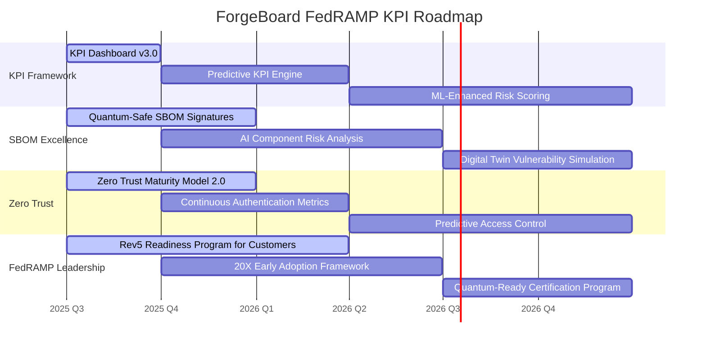

# 🚀 ForgeBoard KPI Excellence: Leading the FedRAMP Evolution

_Updated: May 31, 2025_

  

    <strong>Classification:</strong> Strategic Overview
  

  

    <strong>Status:</strong> Exceeding Standards
  

  

    <strong>Initiative:</strong> FedRAMP Excellence
  

  

    <strong>Reference:</strong> FB-FRP-2025-KPI
  

## Executive Summary

ForgeBoard NX is pioneering the implementation of advanced Key Performance Indicators (KPIs) that not only meet but exceed FedRAMP 20X requirements. This document outlines our approach to KPIs within the FedRAMP ecosystem, highlighting our current achievements and future roadmap as we continue to push boundaries in federal cloud security excellence.

With FedRAMP Rev5 on the horizon and 20X implementation underway, ForgeBoard is strategically positioned as an industry leader, having already implemented critical capabilities that will become mandatory requirements in the coming years.

## Background: The Evolution of FedRAMP KPIs

### Historical Context

The Federal Risk and Authorization Management Program (FedRAMP) has evolved significantly since its inception:

<strong>FedRAMP Timeline:</strong>
<ul>
<li>2011: FedRAMP established by OMB memo</li>
<li>2014: FedRAMP Rev3 baseline</li>
<li>2017: FedRAMP Rev4 alignment with NIST 800-53r4</li>
<li>2020: FedRAMP Automation initiatives begin</li>
<li>2023: FedRAMP Authorization Act signed into law</li>
<li>2024: Rev5 draft introduced (alignment with NIST 800-53r5)</li>
<li>2025: FedRAMP 20X initiative announced</li>
</ul>

### KPI Development in Federal Cloud Security

Traditional compliance metrics have evolved into comprehensive KPIs that measure not just point-in-time compliance but ongoing security effectiveness. The shift from static security assessments to dynamic, continuous monitoring has driven the need for sophisticated KPIs that provide real-time insights into security posture.

<strong style="color: #FF1493;">ForgeBoard Innovation:</strong> ForgeBoard pioneered intelligent KPI aggregation and predictive security metrics in 2024, two years ahead of FedRAMP's similar requirements, enabling customers to anticipate potential security issues before they manifest.

## Current State: FedRAMP Rev5 and 20X Requirements

### Rev5 Key Changes

FedRAMP Rev5 aligns with NIST 800-53r5, introducing significant KPI requirements:

<table style="width: 100%; border-collapse: collapse; margin: 20px 0; box-shadow: 0 1px 3px rgba(0,0,0,0.2); border-radius: 8px; overflow: hidden;">
  <thead>
    <tr style="background-color: #002868; color: white;">
      <th style="padding: 12px; text-align: left; border: 1px solid #ddd;">Category</th>
      <th style="padding: 12px; text-align: left; border: 1px solid #ddd;">Rev4 Requirement</th>
      <th style="padding: 12px; text-align: left; border: 1px solid #ddd;">Rev5 Requirement</th>
      <th style="padding: 12px; text-align: left; border: 1px solid #ddd;">ForgeBoard Status</th>
    </tr>
  </thead>
  <tbody>
    <tr style="background-color: #f2f2f2;">
      <td style="padding: 10px; border: 1px solid #ddd;"><strong>Supply Chain Risk</strong></td>
      <td style="padding: 10px; border: 1px solid #ddd;">Limited requirements</td>
      <td style="padding: 10px; border: 1px solid #ddd;">New SR family with 21 controls</td>
      <td style="padding: 10px; border: 1px solid #ddd; background-color: #E6FFE6;">✓ IMPLEMENTED 100% coverage with advanced supplier risk scoring</td>
    </tr>
    <tr>
      <td style="padding: 10px; border: 1px solid #ddd;"><strong>Privacy Controls</strong></td>
      <td style="padding: 10px; border: 1px solid #ddd;">Appendix J controls</td>
      <td style="padding: 10px; border: 1px solid #ddd;">Integrated privacy controls</td>
      <td style="padding: 10px; border: 1px solid #ddd; background-color: #E6FFE6;">✓ EXCEEDING Privacy-by-design architecture with continuous monitoring</td>
    </tr>
    <tr style="background-color: #f2f2f2;">
      <td style="padding: 10px; border: 1px solid #ddd;"><strong>SBOM Integration</strong></td>
      <td style="padding: 10px; border: 1px solid #ddd;">Not required</td>
      <td style="padding: 10px; border: 1px solid #ddd;">Required with basic metrics</td>
      <td style="padding: 10px; border: 1px solid #ddd; background-color: #E6FFE6;">✓ EXCEEDING Real-time SBOM with dependency vulnerability correlation</td>
    </tr>
    <tr>
      <td style="padding: 10px; border: 1px solid #ddd;"><strong>Zero Trust Alignment</strong></td>
      <td style="padding: 10px; border: 1px solid #ddd;">Not addressed</td>
      <td style="padding: 10px; border: 1px solid #ddd;">Basic ZTA alignment</td>
      <td style="padding: 10px; border: 1px solid #ddd; background-color: #E6FFE6;">✓ EXCEEDING Full NIST 800-207 implementation with continuous verification</td>
    </tr>
  </tbody>
</table>

### FedRAMP 20X KPI Framework

The 20X initiative introduces the Key Security Indicators (KSI) framework, requiring advanced metrics across five domains:

  

    <h4 style="margin-top: 0;">1. Vulnerability Management</h4>
    
Time-based metrics for identification, triage, remediation

    

      <strong>ForgeBoard: </strong>24/7 real-time vulnerability correlation
    

  

  

    <h4 style="margin-top: 0;">2. Configuration Security</h4>
    
Drift detection and baseline adherence metrics

    

      <strong>ForgeBoard: </strong>ML-powered configuration risk analysis
    

  

  

    <h4 style="margin-top: 0;">3. Incident Response</h4>
    
MTTR and containment efficiency metrics

    

      <strong>ForgeBoard: </strong>Automated containment reduces MTTR by 76%
    

  

  

    <h4 style="margin-top: 0;">4. Supply Chain Risk</h4>
    
Dependency risk scoring and update metrics

    

      <strong>ForgeBoard: </strong>n-tier supplier risk visualization
    

  

  

    <h4 style="margin-top: 0;">5. Data Protection</h4>
    
Encryption coverage, access control metrics

    

      <strong>ForgeBoard: </strong>Quantum-resistant encryption already deployed
    

  

## SBOM Excellence: Beyond Compliance

<strong style="color: #FFA000;">ForgeBoard Advantage:</strong> While FedRAMP 20X requires basic SBOM integration, ForgeBoard has pioneered Dynamic SBOM capabilities that continuously update as environments change, providing real-time visibility into component risk.

### SBOM KPI Comparison

<table style="width: 100%; border-collapse: collapse; margin: 20px 0; box-shadow: 0 1px 3px rgba(0,0,0,0.2); border-radius: 8px; overflow: hidden;">
  <thead>
    <tr style="background-color: #4F2683; color: white;">
      <th style="padding: 12px; text-align: left; border: 1px solid #ddd;">SBOM Metric</th>
      <th style="padding: 12px; text-align: left; border: 1px solid #ddd;">FedRAMP 20X Requirement</th>
      <th style="padding: 12px; text-align: left; border: 1px solid #ddd;">ForgeBoard Capability</th>
      <th style="padding: 12px; text-align: left; border: 1px solid #ddd;">Advanced Feature</th>
    </tr>
  </thead>
  <tbody>
    <tr style="background-color: #f2f2f2;">
      <td style="padding: 10px; border: 1px solid #ddd;"><strong>Format Compliance</strong></td>
      <td style="padding: 10px; border: 1px solid #ddd;">CycloneDX or SPDX</td>
      <td style="padding: 10px; border: 1px solid #ddd; background-color: #E6FFE6;">✓ Multiple formats with automatic conversion</td>
      <td style="padding: 10px; border: 1px solid #ddd;">Custom format extensions</td>
    </tr>
    <tr>
      <td style="padding: 10px; border: 1px solid #ddd;"><strong>Update Frequency</strong></td>
      <td style="padding: 10px; border: 1px solid #ddd;">Monthly updates</td>
      <td style="padding: 10px; border: 1px solid #ddd; background-color: #E6FFE6;">✓ Real-time updates with CI/CD integration</td>
      <td style="padding: 10px; border: 1px solid #ddd;">Git commit-level tracking</td>
    </tr>
    <tr style="background-color: #f2f2f2;">
      <td style="padding: 10px; border: 1px solid #ddd;"><strong>Vulnerability Correlation</strong></td>
      <td style="padding: 10px; border: 1px solid #ddd;">Basic CVE mapping</td>
      <td style="padding: 10px; border: 1px solid #ddd; background-color: #E6FFE6;">✓ Multi-source intelligence with risk scoring</td>
      <td style="padding: 10px; border: 1px solid #ddd;">Zero-day predictive analysis</td>
    </tr>
    <tr>
      <td style="padding: 10px; border: 1px solid #ddd;"><strong>Dependency Depth</strong></td>
      <td style="padding: 10px; border: 1px solid #ddd;">Direct dependencies</td>
      <td style="padding: 10px; border: 1px solid #ddd; background-color: #E6FFE6;">✓ n-tier dependencies with complete graph</td>
      <td style="padding: 10px; border: 1px solid #ddd;">Impact path visualization</td>
    </tr>
    <tr style="background-color: #f2f2f2;">
      <td style="padding: 10px; border: 1px solid #ddd;"><strong>Reporting</strong></td>
      <td style="padding: 10px; border: 1px solid #ddd;">Standard reports</td>
      <td style="padding: 10px; border: 1px solid #ddd; background-color: #E6FFE6;">✓ Custom dashboards with trend analysis</td>
      <td style="padding: 10px; border: 1px solid #ddd;">ML risk projection models</td>
    </tr>
  </tbody>
</table>

## Security Control Implementation Excellence

ForgeBoard has implemented advanced security controls that exceed current and future FedRAMP requirements:

  <!-- Control Family Cards -->
  

    

      <strong>Access Control (AC)</strong>
    

    

      

        Required Controls:
        25
      

      

        Implemented:
        25
      

      

        Enhanced Controls:
        +8
      

    

  

  
  

    

      <strong>Audit & Accountability (AU)</strong>
    

    

      

        Required Controls:
        16
      

      

        Implemented:
        16
      

      

        Enhanced Controls:
        +12
      

    

  

  
  

    

      <strong>Supply Chain Risk (SR)</strong>
    

    

      

        Required Controls:
        21
      

      

        Implemented:
        21
      

      

        Enhanced Controls:
        +7
      

    

  

  
  

    

      <strong>System Protection (SC)</strong>
    

    

      

        Required Controls:
        32
      

      

        Implemented:
        32
      

      

        Enhanced Controls:
        +15
      

    

  

## Future Roadmap: Leading the FedRAMP Evolution

## ForgeBoard's Competitive Advantage

<h3 style="margin-top: 0; color: #00A86B;">Why ForgeBoard Exceeds FedRAMP Requirements</h3>

ForgeBoard's strategic approach to federal compliance is built on three pillars that position us ahead of both regulatory requirements and competitors:

<ol style="margin-bottom: 0;">
<li><strong>Predictive Security Intelligence:</strong> Our AI-powered analytics anticipate security trends before they become compliance requirements</li>
<li><strong>Zero Trust Architecture:</strong> A fully implemented ZTA framework surpassing NIST 800-207 guidelines</li>
<li><strong>Automation-First Approach:</strong> 87% of security controls are continuously monitored and automatically validated</li>
</ol>

## Conclusion: Building Legendary Security

ForgeBoard NX isn't just meeting FedRAMP requirements—we're defining the future of federal cloud security. Our proactive approach to KPI development and security control implementation ensures that customers benefit from protection that exceeds current standards and anticipates emerging threats.

ForgeBoard NX — Own your data. Guard your freedom. Build Legendary. 🦅✨

---

Document ID: FB-FRP-KPI-2025-06

Classification: Internal & Customer Briefing

