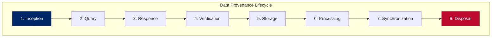
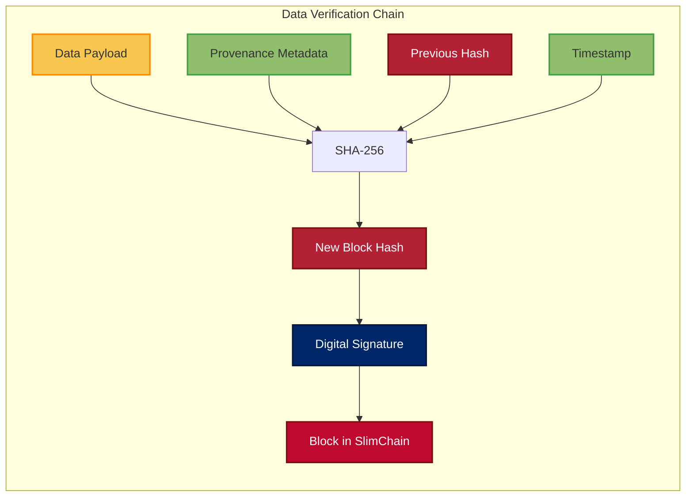
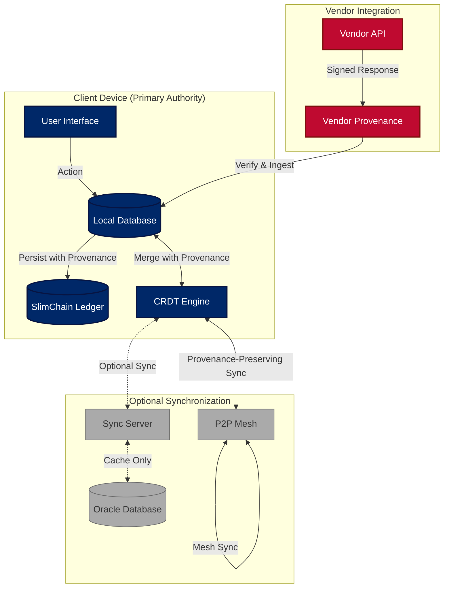
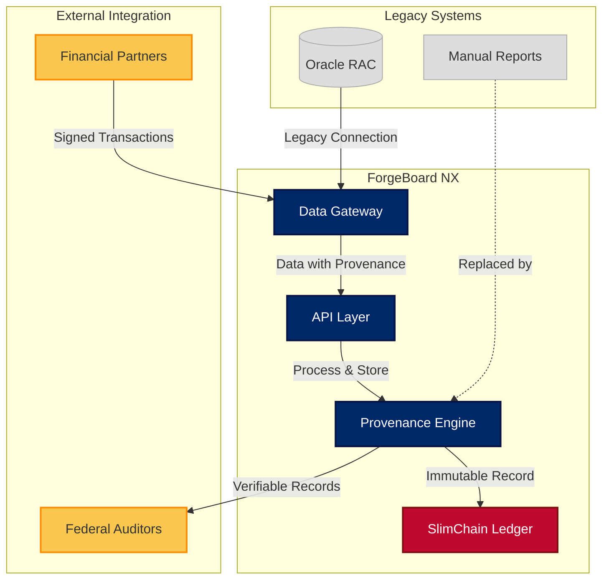

# 🔍 ForgeBoard NX: Local-First Data Provenance

*Last Updated: May 15, 2025*

<div style="display: flex; flex-wrap: wrap; gap: 10px; margin-bottom: 20px;">
  <div style="background-color: #002868; color: white; padding: 8px 12px; border-radius: 6px; flex: 1; min-width: 150px; box-shadow: 0 2px 4px rgba(0,0,0,0.2);">
    <strong>Architecture:</strong> Local-First ✅
  </div>
  <div style="background-color: #BF0A30; color: white; padding: 8px 12px; border-radius: 6px; flex: 1; min-width: 150px; box-shadow: 0 2px 4px rgba(0,0,0,0.2);">
    <strong>Provenance:</strong> Complete Lifecycle 🔄
  </div>
  <div style="background-color: #F9C74F; color: #333; padding: 8px 12px; border-radius: 6px; flex: 1; min-width: 150px; box-shadow: 0 2px 4px rgba(0,0,0,0.2);">
    <strong>Verification:</strong> Cryptographic 🔐
  </div>
  <div style="background-color: #90BE6D; color: #333; padding: 8px 12px; border-radius: 6px; flex: 1; min-width: 150px; box-shadow: 0 2px 4px rgba(0,0,0,0.2);">
    <strong>Compliance:</strong> FedRAMP 20X Ready 🏆
  </div>
</div>

<div style="border-left: 5px solid #BF0A30; padding-left: 15px; margin: 20px 0; background-color: #F0F4FF; box-shadow: 0 2px 4px rgba(0,0,0,0.1);">
<span style="color:#002868; font-weight:bold; font-size: 120%;">Data Provenance: The Core of Local-First</span><br>
In ForgeBoard NX, <b>data provenance</b> is the complete, verifiable record of data's entire lifecycle—from inception through query, processing, storage, and eventual disposal—with cryptographic assurance of integrity at every step. It answers not just "what" the data is, but "where it came from, who touched it, and how it changed."
</div>

## Table of Contents

1. [Understanding Data Provenance](#1-understanding-data-provenance)
2. [The Complete Data Lifecycle](#2-the-complete-data-lifecycle)
3. [Cryptographic Verification Chain](#3-cryptographic-verification-chain)
4. [External Vendor Integration](#4-external-vendor-integration)
5. [Implementation Architecture](#5-implementation-architecture)
6. [FedRAMP 20X Compliance](#6-fedramp-20x-compliance)
7. [Data Provenance in Action](#7-data-provenance-in-action)
8. [Technical Implementation](#8-technical-implementation)

## 1. Understanding Data Provenance

### What is Data Provenance?

Data provenance in ForgeBoard NX provides an immutable, comprehensive record of a data element's complete history, including:

- **Origin**: Where the data was created or collected
- **Custody Chain**: Every entity that has handled the data
- **Transformations**: Changes applied to the data and by whom
- **Access History**: Who has viewed or accessed the data
- **Verification Status**: Cryptographic proof of integrity at each step
- **Disposal Verification**: Confirmation of proper data destruction

### Why Provenance Matters

Traditional systems track data states but not complete histories, creating critical blind spots:

| Problem | Traditional Solution | ForgeBoard Provenance |
|---------|---------------------|------------------------|
| Data tampering | Periodic auditing | Continuous cryptographic verification |
| Source uncertainty | Trust third parties | Verifiable origin attestation |
| Regulatory compliance | Manual documentation | Automated evidence collection |
| Vendor accountability | Contract terms | Cryptographic non-repudiation |
| Supply chain risk | Vendor assessment | Real-time transaction verification |

### Local-First Provenance vs. Cloud Provenance

<div style="overflow-x: auto;">
<table style="width: 100%; border-collapse: collapse; margin: 20px 0; box-shadow: 0 2px 4px rgba(0,0,0,0.1);">
  <thead>
    <tr style="background-color: #002868; color: white;">
      <th style="padding: 12px; text-align: left; border: 1px solid #071442;">Aspect</th>
      <th style="padding: 12px; text-align: center; border: 1px solid #071442;">Cloud-Based</th>
      <th style="padding: 12px; text-align: center; border: 1px solid #071442;">ForgeBoard Local-First</th>
    </tr>
  </thead>
  <tbody>
    <tr style="background-color: #F0F4FF;">
      <td style="padding: 12px; border: 1px solid #AAB6D3;"><strong>Data Authority</strong></td>
      <td style="padding: 12px; border: 1px solid #AAB6D3; text-align: center;">Cloud provider is authoritative</td>
      <td style="padding: 12px; border: 1px solid #AAB6D3; text-align: center; color: #BF0A30; font-weight: bold;">Device is authoritative</td>
    </tr>
    <tr style="background-color: #E6EFFF;">
      <td style="padding: 12px; border: 1px solid #AAB6D3;"><strong>Verification</strong></td>
      <td style="padding: 12px; border: 1px solid #AAB6D3; text-align: center;">Trust cloud provider logs</td>
      <td style="padding: 12px; border: 1px solid #AAB6D3; text-align: center; color: #BF0A30; font-weight: bold;">Cryptographic proof on device</td>
    </tr>
    <tr style="background-color: #F0F4FF;">
      <td style="padding: 12px; border: 1px solid #AAB6D3;"><strong>Auditability</strong></td>
      <td style="padding: 12px; border: 1px solid #AAB6D3; text-align: center;">Limited to provided APIs</td>
      <td style="padding: 12px; border: 1px solid #AAB6D3; text-align: center; color: #BF0A30; font-weight: bold;">Complete on-device verification</td>
    </tr>
    <tr style="background-color: #E6EFFF;">
      <td style="padding: 12px; border: 1px solid #AAB6D3;"><strong>Availability</strong></td>
      <td style="padding: 12px; border: 1px solid #AAB6D3; text-align: center;">Depends on cloud connectivity</td>
      <td style="padding: 12px; border: 1px solid #AAB6D3; text-align: center; color: #BF0A30; font-weight: bold;">Always available locally</td>
    </tr>
    <tr style="background-color: #F0F4FF;">
      <td style="padding: 12px; border: 1px solid #AAB6D3;"><strong>Origin Verification</strong></td>
      <td style="padding: 12px; border: 1px solid #AAB6D3; text-align: center;">Trust chain often broken</td>
      <td style="padding: 12px; border: 1px solid #AAB6D3; text-align: center; color: #BF0A30; font-weight: bold;">Unbroken attestation chain</td>
    </tr>
  </tbody>
</table>
</div>

## 2. The Complete Data Lifecycle

ForgeBoard NX tracks data throughout its entire lifecycle with cryptographic assurance at each stage:



### 1. Inception

The origin point where data is first conceived or requested:

- **Metadata Capture**: Creator ID, purpose, timestamp, context
- **Request Signature**: Digital signing of data requests
- **Purpose Binding**: Cryptographically binding intended use with request
- **Classification**: Initial data sensitivity and category labeling

### 2. Query

When ForgeBoard communicates with external data sources:

- **Query Authentication**: Verifiable credentials for data requests
- **Query Logging**: Immutable record of exact query parameters
- **Intent Documentation**: Explicit purpose for each data request
- **Authorization Chain**: Record of approvals for sensitive queries

### 3. Response

When external systems or vendors return data:

- **Source Verification**: Cryptographic proof of data origin
- **Response Signing**: Vendor digital signatures on all responses
- **Receipt Confirmation**: Tamper-evident receipt validation
- **Metadata Enhancement**: Enrichment with source reliability metrics
- **Format Preservation**: Original data format is cryptographically preserved

### 4. Verification

Validation of received data for integrity and accuracy:

- **Schema Validation**: Ensuring data conforms to expected structure
- **Consistency Checking**: Comparing against known good values
- **Anomaly Detection**: Identifying potential tampering or errors
- **Policy Compliance**: Verifying adherence to data handling requirements
- **Signature Verification**: Cryptographic validation of digital signatures

### 5. Storage

Secure persistance of data with provenance linkage:

- **Encrypted Storage**: Data encrypted at rest with unique keys
- **Provenance Linking**: Binding data to its verification chain
- **Immutable Recording**: SlimChain blockchain record of storage event
- **Access Control**: Granular permissions based on data classification
- **Retention Policy**: Automatic enforcement of retention requirements

### 6. Processing

Transformations and uses of the data:

- **Transformation Logging**: Record of all modifications
- **Processing Justification**: Documented rationale for each transformation
- **Derivative Tracking**: Linkage between original and derived data
- **Process Authentication**: Verification that only authorized processes access data
- **Usage Limitations**: Enforcement of purpose-specific restrictions

### 7. Synchronization

Optional sharing of data while maintaining provenance:

- **CRDT-Based Sync**: Conflict-free merging with provenance preservation
- **Attestation Transfer**: Provenance chain validation during transfer
- **Selective Sharing**: Granular control over what metadata is shared
- **Provenance Verification**: Receiving systems validate complete chain

### 8. Disposal

Verified destruction of data when no longer needed:

- **Verified Deletion**: Cryptographic proof of data erasure
- **Retention Validation**: Confirmation of policy compliance
- **Certificate of Destruction**: Immutable blockchain record of disposal
- **Reference Scrubbing**: Removal of all references to deleted data
- **Disposal Attestation**: Third-party verification where required

## 3. Cryptographic Verification Chain

ForgeBoard NX creates an unbroken cryptographic chain that makes data provenance tamper-evident:

### Verification Architecture



### Key Cryptographic Components

- **Digital Signatures**: Every transition in the data lifecycle is cryptographically signed
- **Blockchain Integration**: SlimChain provides immutable, tamper-evident history
- **Merkle Proofs**: Efficient verification of data integrity without revealing content
- **Zero-Knowledge Proofs**: Verify data attributes without exposing sensitive information
- **Key Transparency**: Public verification of signing keys for non-repudiation
- **Timestamped Attestations**: RFC 3161 compliant trusted timestamps

## 4. External Vendor Integration

ForgeBoard NX provides robust integration with external vendors while maintaining complete data provenance:

### Vendor Attestation Framework

<div style="overflow-x: auto;">
<table style="width: 100%; border-collapse: collapse; margin: 20px 0; box-shadow: 0 2px 4px rgba(0,0,0,0.1);">
  <thead>
    <tr style="background-color: #002868; color: white;">
      <th style="padding: 12px; text-align: left; border: 1px solid #071442;">Integration Stage</th>
      <th style="padding: 12px; text-align: left; border: 1px solid #071442;">Provenance Mechanism</th>
      <th style="padding: 12px; text-align: left; border: 1px solid #071442;">Verification Method</th>
    </tr>
  </thead>
  <tbody>
    <tr style="background-color: #F0F4FF;">
      <td style="padding: 12px; border: 1px solid #AAB6D3;"><strong>Vendor Onboarding</strong></td>
      <td style="padding: 12px; border: 1px solid #AAB6D3;">Public key infrastructure (PKI) setup with key attestation</td>
      <td style="padding: 12px; border: 1px solid #AAB6D3;">Certificate transparency logs, OSCP validation</td>
    </tr>
    <tr style="background-color: #E6EFFF;">
      <td style="padding: 12px; border: 1px solid #AAB6D3;"><strong>API Authentication</strong></td>
      <td style="padding: 12px; border: 1px solid #AAB6D3;">OAuth 2.0 with signed JWTs containing provenance claims</td>
      <td style="padding: 12px; border: 1px solid #AAB6D3;">JWT verification with replay protection</td>
    </tr>
    <tr style="background-color: #F0F4FF;">
      <td style="padding: 12px; border: 1px solid #AAB6D3;"><strong>Data Receipt</strong></td>
      <td style="padding: 12px; border: 1px solid #AAB6D3;">Signed data envelope with source attestation</td>
      <td style="padding: 12px; border: 1px solid #AAB6D3;">Signature validation, timestamp verification</td>
    </tr>
    <tr style="background-color: #E6EFFF;">
      <td style="padding: 12px; border: 1px solid #AAB6D3;"><strong>Supply Chain</strong></td>
      <td style="padding: 12px; border: 1px solid #AAB6D3;">Verified SBOM with materials traceability</td>
      <td style="padding: 12px; border: 1px solid #AAB6D3;">Cosign verification, vulnerability correlation</td>
    </tr>
    <tr style="background-color: #F0F4FF;">
      <td style="padding: 12px; border: 1px solid #AAB6D3;"><strong>Compliance Evidence</strong></td>
      <td style="padding: 12px; border: 1px solid #AAB6D3;">Vendor control attestations with evidence hashes</td>
      <td style="padding: 12px; border: 1px solid #AAB6D3;">Attestation verification against FedRAMP requirements</td>
    </tr>
  </tbody>
</table>
</div>

### Vendor Provenance Requirements

For complete data provenance, ForgeBoard requires vendors to provide:

1. **Cryptographic Source Attestation**: Digitally signed metadata about data origin
2. **Processing Transparency**: Documentation of all transformations applied
3. **Chain-of-Custody Records**: Complete handling history for data
4. **Disposal Verification**: Proof of proper data destruction when required
5. **API Provenance Headers**: Standard HTTP headers with verifiable provenance claims

## 5. Implementation Architecture

ForgeBoard's Local-First Data Provenance architecture spans frontend, backend, and vendor integration layers:



### Key Architectural Components

1. **Local Database**: Primary data store with complete provenance metadata
2. **SlimChain Ledger**: Immutable blockchain providing tamper-evident history
3. **CRDT Engine**: Conflict-free merging while preserving provenance chains
4. **P2P Mesh**: Peer-to-peer synchronization maintaining provenance integrity
5. **Sync Server**: Optional bridge to legacy systems with provenance translation
6. **Vendor Provenance Gateway**: Validates and transforms external data

### Technical Components

- **ProvenanceStore**: Core service managing data provenance records
- **ProvenanceVerifier**: Validates provenance chains cryptographically
- **ProvenanceTransformer**: Preserves provenance during data transformations
- **ProvenanceQuery**: Enables authorized lookups of provenance information
- **ProvenanceSync**: Ensures provenance integrity during synchronization

## 6. FedRAMP 20X Compliance

ForgeBoard's data provenance capabilities directly satisfy multiple FedRAMP 20X requirements:

### Key Security Indicators (KSI) Mapping

| FedRAMP 20X KSI | Data Provenance Capability | Compliance Evidence |
|---------------|----------------------------|---------------------|
| **KSI-SC** (Service Configuration) | Cryptographic verification of configuration integrity | Provenance records for all configuration changes |
| **KSI-IAM** (Identity & Access Management) | Complete audit trail of all data access with provenance | Access verification with full chain of evidence |
| **KSI-MLA** (Monitoring, Logging, Auditing) | Immutable provenance logs with tamper-evident seals | SlimChain blockchain records with Merkle proofs |
| **KSI-CM** (Change Management) | Provenance trail for all changes with who, what, when, why | Complete modification history with attribution |
| **KSI-3IR** (Third Party Information Resources) | Vendor data provenance verification | Supply chain risk management with attestations |

### NIST SP 800-53 Control Mapping

ForgeBoard's data provenance satisfies key NIST controls:

- **AU-10 (Non-repudiation)**: Cryptographic provenance provides irrefutable evidence
- **CM-8 (Information System Component Inventory)**: Complete provenance of all system components
- **IA-3 (Device Identification and Authentication)**: Device provenance for all connections
- **SC-8 (Transmission Confidentiality and Integrity)**: Provenance covers data in transit
- **SI-7 (Software, Firmware, and Information Integrity)**: Continuous integrity verification via provenance chain

## 7. Data Provenance in Action

### Federal Money Movement Agency Example

A financial clearing agency using ForgeBoard's data provenance capabilities:



### Data Sovereignty Use Case

ForgeBoard enables agencies to maintain sovereignty over their data while providing selective visibility to oversight bodies:

1. Data originates within an agency system with complete provenance
2. When shared with oversight bodies, cryptographic proofs are provided
3. Oversight can verify data integrity without requiring the full dataset
4. Agency maintains authoritative control while satisfying compliance requirements

## 8. Technical Implementation

### ProvenanceMetadata Structure

The core data structure that tracks provenance information:

```typescript
interface ProvenanceMetadata {
  // Core identifiers
  id: string;                       // Unique identifier for this provenance record
  dataId: string;                   // Reference to the data being tracked
  version: number;                  // Version number for the provenance record
  
  // Lifecycle stage identifiers
  stage: ProvenanceStage;           // Current lifecycle stage (inception, query, etc.)
  previousStageId?: string;         // ID of the previous provenance stage
  
  // Timestamps
  createdAt: string;                // ISO timestamp of creation
  modifiedAt: string;               // ISO timestamp of last modification
  
  // Attribution
  sourceId: string;                 // Origin system/vendor identifier
  sourceType: 'internal' | 'vendor' | 'user' | 'system';
  userId?: string;                  // User responsible (if applicable)
  systemId?: string;                // System identifier (if applicable)
  vendorId?: string;                // Vendor identifier (if applicable)
  
  // Purpose & justification
  purpose: string;                  // Business purpose for this data
  justification?: string;           // Why this particular action was taken
  
  // Classification & handling
  classification: DataClassification;
  retentionPolicy: RetentionPolicy;
  
  // Cryptographic proof
  hash: string;                     // Hash of the data + metadata (excluding signature)
  previousHash?: string;            // Hash of the previous provenance record
  signature: string;                // Digital signature of the hash
  signingKeyId: string;             // Identifier for the key used to sign
  signingMethod: string;            // Algorithm used for signature
  
  // Blockchain record
  blockchainTxId?: string;          // ID in SlimChain ledger (if persisted)
  blockId?: string;                 // Block ID in SlimChain
  merkleProof?: string[];           // Merkle path for verification
  
  // Extended properties
  transformations?: Transformation[];// List of transformations applied
  accessEvents?: AccessEvent[];      // History of access events
  verifications?: Verification[];    // Record of verification events
  disposalCertificate?: DisposalCertificate;   // If disposed, the certificate
}
```

### ProvenanceService Implementation

```typescript
@Injectable({
  providedIn: 'root'
})
export class ProvenanceService {
  private provenanceSubject = new BehaviorSubject<ProvenanceRecord[]>([]);
  public provenance$ = this.provenanceSubject.asObservable();
  
  constructor(
    private cryptoService: CryptoService,
    private blockchainAdapter: BlockchainAdapter,
    private loggingService: LoggerService,
    private auditService: AuditService
  ) {}
  
  // Create initial provenance record at data inception
  public createProvenanceRecord<T>(data: T, metadata: InitialProvenanceMetadata): Observable<ProvenanceRecord> {
    // Create provenance metadata
    const provenanceMetadata: ProvenanceMetadata = {
      id: this.cryptoService.generateUUID(),
      dataId: metadata.dataId || this.cryptoService.generateUUID(),
      version: 1,
      stage: 'inception',
      createdAt: new Date().toISOString(),
      modifiedAt: new Date().toISOString(),
      sourceId: metadata.sourceId,
      sourceType: metadata.sourceType,
      userId: metadata.userId,
      systemId: metadata.systemId,
      vendorId: metadata.vendorId,
      purpose: metadata.purpose,
      classification: metadata.classification,
      retentionPolicy: metadata.retentionPolicy,
      hash: '',  // Will be calculated
      signature: '',  // Will be added
      signingKeyId: this.cryptoService.getCurrentKeyId(),
      signingMethod: 'ES256'
    };
    
    // Calculate hash of data and metadata
    const dataHash = this.cryptoService.hashData(data);
    const metadataHash = this.cryptoService.hashData(this.stripSensitiveFields(provenanceMetadata));
    provenanceMetadata.hash = this.cryptoService.combineHashes([dataHash, metadataHash]);
    
    // Sign the hash
    return this.cryptoService.sign(provenanceMetadata.hash).pipe(
      map(signature => {
        provenanceMetadata.signature = signature;
        
        // Create full provenance record
        const provenanceRecord: ProvenanceRecord = {
          data,
          metadata: provenanceMetadata
        };
        
        // Add to local store
        const currentRecords = this.provenanceSubject.getValue();
        this.provenanceSubject.next([...currentRecords, provenanceRecord]);
        
        // Log the creation
        this.loggingService.log({
          level: 'info',
          message: 'Created provenance record',
          source: 'ProvenanceService',
          data: {
            recordId: provenanceMetadata.id,
            dataId: provenanceMetadata.dataId,
            stage: provenanceMetadata.stage
          }
        });
        
        // Audit the action
        this.auditService.log({
          action: 'PROVENANCE_RECORD_CREATED',
          actor: provenanceMetadata.userId || 'system',
          resource: provenanceMetadata.dataId,
          details: {
            provenanceId: provenanceMetadata.id,
            stage: provenanceMetadata.stage,
            sourceType: provenanceMetadata.sourceType
          }
        });
        
        return provenanceRecord;
      }),
      // Persist to blockchain for immutability
      switchMap(record => this.persistToBlockchain(record))
    );
  }
  
  // Transition provenance to a new lifecycle stage
  public transitionStage<T>(prevRecord: ProvenanceRecord, data: T, stage: ProvenanceStage, justification: string): Observable<ProvenanceRecord> {
    // Create new metadata based on previous
    const newMetadata: ProvenanceMetadata = {
      ...this.stripSensitiveFields(prevRecord.metadata),
      id: this.cryptoService.generateUUID(),
      version: prevRecord.metadata.version + 1,
      stage: stage,
      previousStageId: prevRecord.metadata.id,
      modifiedAt: new Date().toISOString(),
      justification: justification,
      previousHash: prevRecord.metadata.hash,
      hash: '',  // Will be calculated
      signature: '',  // Will be added
      blockchainTxId: undefined,  // New blockchain transaction
      blockId: undefined
    };
    
    // Calculate new hash
    const dataHash = this.cryptoService.hashData(data);
    const metadataHash = this.cryptoService.hashData(this.stripSensitiveFields(newMetadata));
    newMetadata.hash = this.cryptoService.combineHashes([dataHash, metadataHash, prevRecord.metadata.hash]);
    
    // Sign the new hash
    return this.cryptoService.sign(newMetadata.hash).pipe(
      map(signature => {
        newMetadata.signature = signature;
        
        // Create new provenance record
        const provenanceRecord: ProvenanceRecord = {
          data,
          metadata: newMetadata
        };
        
        // Add to local store
        const currentRecords = this.provenanceSubject.getValue();
        this.provenanceSubject.next([...currentRecords, provenanceRecord]);
        
        // Log the transition
        this.loggingService.log({
          level: 'info',
          message: `Transitioned provenance to ${stage}`,
          source: 'ProvenanceService',
          data: {
            recordId: newMetadata.id,
            dataId: newMetadata.dataId,
            previousStage: prevRecord.metadata.stage,
            newStage: stage
          }
        });
        
        // Audit the transition
        this.auditService.log({
          action: 'PROVENANCE_STAGE_TRANSITION',
          actor: newMetadata.userId || 'system',
          resource: newMetadata.dataId,
          details: {
            provenanceId: newMetadata.id,
            prevProvenanceId: prevRecord.metadata.id,
            fromStage: prevRecord.metadata.stage,
            toStage: stage,
            justification
          }
        });
        
        return provenanceRecord;
      }),
      // Persist to blockchain for immutability
      switchMap(record => this.persistToBlockchain(record))
    );
  }
  
  // Verify the provenance chain
  public verifyProvenanceChain(recordId: string): Observable<VerificationResult> {
    return this.getProvenanceChain(recordId).pipe(
      switchMap(chain => {
        if (chain.length === 0) {
          return of({
            verified: false,
            reason: 'RECORD_NOT_FOUND',
            brokenLink: null
          });
        }
        
        // Verify each link in the chain
        return from(chain).pipe(
          concatMap((record, index) => this.verifyRecord(record, index > 0 ? chain[index - 1] : null)),
          toArray(),
          map(results => {
            const failedVerification = results.find(result => !result.verified);
            
            if (failedVerification) {
              return {
                verified: false,
                reason: failedVerification.reason,
                brokenLink: failedVerification.recordId
              };
            }
            
            return {
              verified: true,
              reason: 'CHAIN_VERIFIED',
              brokenLink: null
            };
          })
        );
      })
    );
  }
  
  // Additional methods for querying, disposal verification, etc.
  
  // Private helper methods
  
  private persistToBlockchain(record: ProvenanceRecord): Observable<ProvenanceRecord> {
    // Prepare metadata for blockchain storage
    const blockchainMetadata: BlockMetadata = {
      source: 'provenance-service',
      dataId: record.metadata.dataId,
      stage: record.metadata.stage,
      timestamp: record.metadata.modifiedAt
    };
    
    // Store only the metadata hash and signature, not the full data
    const blockchainData = {
      provenanceId: record.metadata.id,
      dataId: record.metadata.dataId,
      hash: record.metadata.hash,
      signature: record.metadata.signature,
      previousHash: record.metadata.previousHash
    };
    
    // Persist to blockchain
    return this.blockchainAdapter.persistData(blockchainData, blockchainMetadata).pipe(
      map(receipt => {
        // Update the record with blockchain transaction info
        const updatedMetadata: ProvenanceMetadata = {
          ...record.metadata,
          blockchainTxId: receipt.txId,
          blockId: receipt.blockId
        };
        
        const updatedRecord: ProvenanceRecord = {
          ...record,
          metadata: updatedMetadata
        };
        
        // Update in local store
        const currentRecords = this.provenanceSubject.getValue();
        const updatedRecords = currentRecords.map(r => 
          r.metadata.id === record.metadata.id ? updatedRecord : r
        );
        this.provenanceSubject.next(updatedRecords);
        
        // Log the blockchain persistence
        this.loggingService.log({
          level: 'info',
          message: 'Persisted provenance to blockchain',
          source: 'ProvenanceService',
          data: {
            provenanceId: record.metadata.id,
            txId: receipt.txId,
            blockId: receipt.blockId
          }
        });
        
        return updatedRecord;
      })
    );
  }
  
  // Verify an individual provenance record
  private verifyRecord(record: ProvenanceRecord, previousRecord: ProvenanceRecord | null): Observable<RecordVerification> {
    // Verify the record's own integrity
    return this.verifyRecordIntegrity(record).pipe(
      switchMap(integrityResult => {
        if (!integrityResult.verified) {
          return of(integrityResult);
        }
        
        // If there's a previous record, verify the chain
        if (previousRecord) {
          return this.verifyChainLink(record, previousRecord);
        }
        
        // This is the first record, so verify blockchain if available
        if (record.metadata.blockchainTxId) {
          return this.verifyBlockchainRecord(record);
        }
        
        // First record with no blockchain verification
        return of({
          verified: true,
          reason: 'RECORD_VERIFIED',
          recordId: record.metadata.id
        });
      })
    );
  }
  
  // Other private verification methods...
  
  // Remove sensitive fields before hashing or storing
  private stripSensitiveFields(metadata: ProvenanceMetadata): Partial<ProvenanceMetadata> {
    const { signature, blockchainTxId, blockId, merkleProof, ...rest } = metadata;
    return rest;
  }
}
```

### Integration with External Vendors API

Example of how ForgeBoard handles vendor integration while maintaining data provenance:

```typescript
@Injectable()
export class VendorDataService {
  constructor(
    private httpClient: HttpClient,
    private provenanceService: ProvenanceService,
    private cryptoService: CryptoService,
    private auditService: AuditService
  ) {}
  
  // Request data from vendor with full provenance tracking
  public requestVendorData<T>(
    vendorId: string, 
    endpoint: string, 
    parameters: any, 
    purpose: string
  ): Observable<ProvenanceRecord> {
    // Create inception provenance for the request
    const requestMetadata: InitialProvenanceMetadata = {
      sourceType: 'system',
      sourceId: 'vendor-data-service',
      purpose: purpose,
      classification: this.determineClassification(endpoint),
      retentionPolicy: this.determineRetentionPolicy(endpoint),
      systemId: 'forgeboard-nx',
      vendorId: vendorId
    };
    
    // Start provenance chain with request information
    return this.provenanceService.createProvenanceRecord(parameters, requestMetadata).pipe(
      // Sign the request parameters
      switchMap(requestProvenanceRecord => {
        const signedRequest = {
          parameters,
          provenanceId: requestProvenanceRecord.metadata.id,
          hash: requestProvenanceRecord.metadata.hash,
          timestamp: new Date().toISOString()
        };
        
        // Add provenance headers to HTTP request
        const headers = new HttpHeaders({
          'X-Provenance-Id': requestProvenanceRecord.metadata.id,
          'X-Provenance-Purpose': purpose,
          'X-Provenance-Hash': requestProvenanceRecord.metadata.hash,
          'X-Request-Signature': this.cryptoService.sign(JSON.stringify(signedRequest))
        });
        
        // Make the HTTP request to vendor API
        return this.httpClient.post<VendorResponse<T>>(
          `${endpoint}`, 
          signedRequest,
          { headers }
        ).pipe(
          // Transition provenance to query stage
          switchMap(response => this.provenanceService.transitionStage(
            requestProvenanceRecord,
            { request: parameters, queryTimestamp: new Date().toISOString() },
            'query',
            `Query sent to vendor ${vendorId}`
          )),
          
          // Verify vendor response signature
          switchMap(queryProvenanceRecord => {
            // Verify the vendor's signature on the response
            return this.verifyVendorSignature(response).pipe(
              switchMap(verified => {
                if (!verified) {
                  // Log verification failure
                  this.auditService.log({
                    action: 'VENDOR_SIGNATURE_VERIFICATION_FAILED',
                    resource: queryProvenanceRecord.metadata.dataId,
                    details: { vendorId, endpoint }
                  });
                  
                  throw new Error('Vendor signature verification failed');
                }
                
                // Transition to response stage with verified data
                return this.provenanceService.transitionStage(
                  queryProvenanceRecord,
                  response.data,
                  'response',
                  `Response received from vendor ${vendorId} with signature verification`
                );
              })
            );
          }),
          
          // Validate response data
          switchMap(responseProvenanceRecord => {
            return this.validateResponseData(response.data).pipe(
              switchMap(validationResult => {
                // Transition to verification stage
                return this.provenanceService.transitionStage(
                  responseProvenanceRecord,
                  { 
                    data: response.data, 
                    validated: validationResult.valid,
                    validationErrors: validationResult.errors 
                  },
                  'verification',
                  `Data validation ${validationResult.valid ? 'succeeded' : 'failed'}`
                );
              })
            );
          }),
          
          // Store the data if valid
          switchMap(verificationProvenanceRecord => {
            const verificationData = verificationProvenanceRecord.data as any;
            
            if (!verificationData.validated) {
              throw new Error('Data validation failed: ' + 
                verificationData.validationErrors.join(', '));
            }
            
            // Transition to storage stage
            return this.provenanceService.transitionStage(
              verificationProvenanceRecord,
              response.data,
              'storage',
              `Data stored from vendor ${vendorId}`
            );
          })
        );
      })
    );
  }
  
  // Other methods for vendor data handling...
  
  private verifyVendorSignature<T>(response: VendorResponse<T>): Observable<boolean> {
    // Implementation of vendor signature verification
    // ...
  }
  
  private validateResponseData<T>(data: T): Observable<ValidationResult> {
    // Implementation of data validation
    // ...
  }
  
  private determineClassification(endpoint: string): DataClassification {
    // Logic to determine data classification based on endpoint
    // ...
  }
  
  private determineRetentionPolicy(endpoint: string): RetentionPolicy {
    // Logic to determine retention policy based on endpoint
    // ...
  }
}
```

### Provenance Visualization Component

```typescript
@Component({
  selector: 'app-provenance-viewer',
  templateUrl: './provenance-viewer.component.html'
})
export class ProvenanceViewerComponent implements OnInit {
  @Input() dataId: string;
  
  provenanceChain$: Observable<ProvenanceRecord[]>;
  verificationStatus$: Observable<VerificationResult>;
  
  constructor(
    private provenanceService: ProvenanceService,
    private dialogService: DialogService,
    private securityService: SecurityService
  ) {}
  
  ngOnInit(): void {
    this.loadProvenanceChain();
  }
  
  private loadProvenanceChain(): void {
    this.provenanceChain$ = this.provenanceService.getProvenanceChain(this.dataId);
    this.verificationStatus$ = this.provenanceService.verifyProvenanceChain(this.dataId);
  }
  
  viewProvenanceDetails(record: ProvenanceRecord): void {
    this.securityService.checkPermission('provenance:view').pipe(
      take(1),
      switchMap(hasPermission => {
        if (!hasPermission) {
          return throwError(() => new Error('Permission denied'));
        }
        
        return this.dialogService.open(ProvenanceDetailDialogComponent, {
          data: record
        }).afterClosed();
      })
    ).subscribe({
      error: err => console.error('Error viewing provenance details', err)
    });
  }
  
  exportMerkleProof(record: ProvenanceRecord): void {
    this.provenanceService.generateMerkleProof(record.metadata.id).pipe(
      take(1)
    ).subscribe(proof => {
      // Generate PDF with proof
      const pdfBlob = this.generateProofPdf(proof, record);
      
      // Create download link
      const url = window.URL.createObjectURL(pdfBlob);
      const a = document.createElement('a');
      a.href = url;
      a.download = `provenance-proof-${record.metadata.id}.pdf`;
      a.click();
      window.URL.revokeObjectURL(url);
    });
  }
  
  private generateProofPdf(proof: MerkleProof, record: ProvenanceRecord): Blob {
    // Implementation of PDF generation
    // ...
  }
}
```

---

<div style="text-align: center; margin: 30px 0; font-size: 20px; color: #0C2677; font-weight: bold; border-top: 2px solid #B22234; border-bottom: 2px solid #B22234; padding: 15px; background-color: #F8FAFF; box-shadow: 0 2px 4px rgba(0,0,0,0.08);">
ForgeBoard NX – Complete data provenance for uncompromising data sovereignty
</div>
