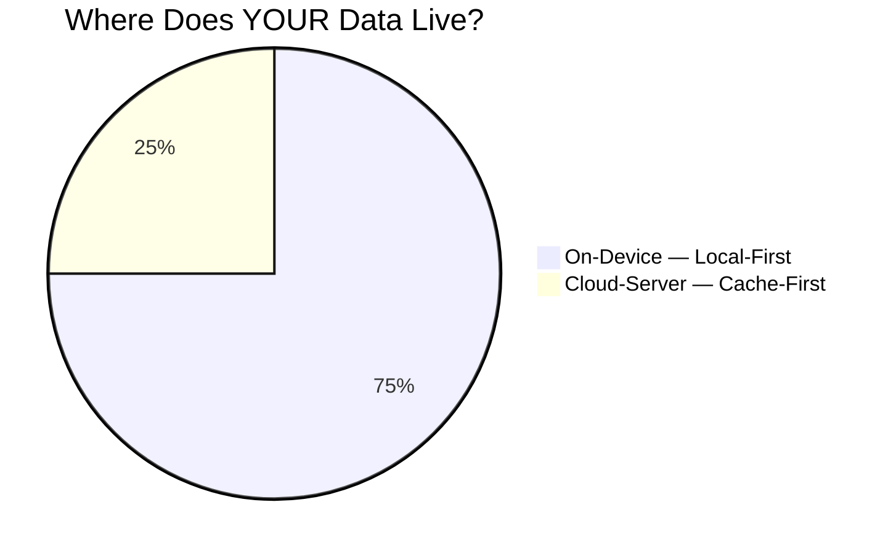
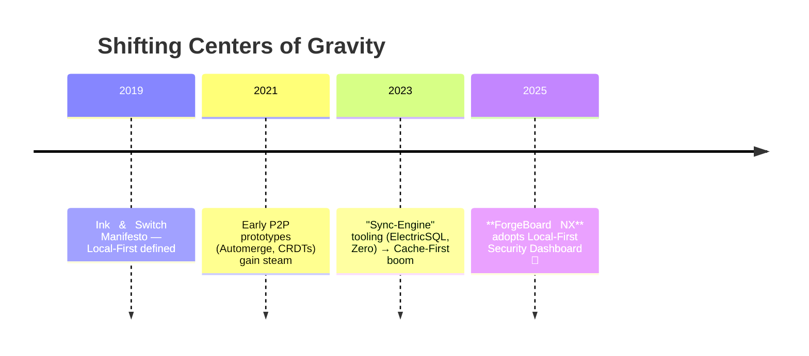
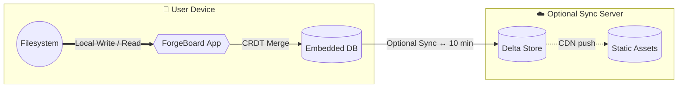
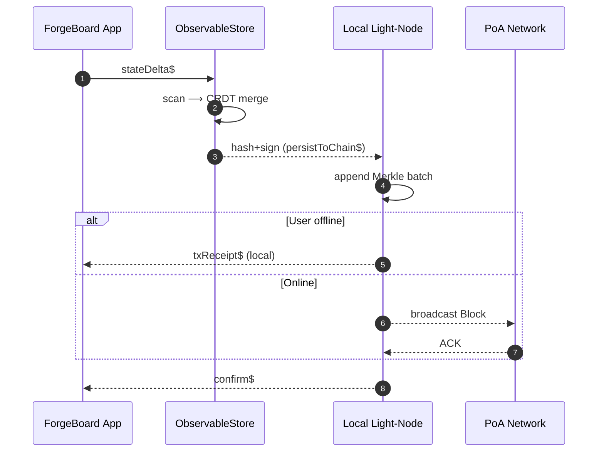

# 🏠 ForgeBoard NX: Local-First vs Cache-and-Forward Architecture
*Last Updated: May 7, 2025*

<div style="display: flex; flex-wrap: wrap; gap: 10px; margin-bottom: 20px;">
  <div style="background-color: #002868; color: white; padding: 8px 12px; border-radius: 6px; flex: 1; min-width: 150px; box-shadow: 0 2px 4px rgba(0,0,0,0.2);">
    <strong>Pattern:</strong> Local-First 🏠
  </div>
  <div style="background-color: #BF0A30; color: white; padding: 8px 12px; border-radius: 6px; flex: 1; min-width: 150px; box-shadow: 0 2px 4px rgba(0,0,0,0.2);">
    <strong>Implementation:</strong> Complete ✅
  </div>
  <div style="background-color: #F9C74F; color: #333; padding: 8px 12px; border-radius: 6px; flex: 1; min-width: 150px; box-shadow: 0 2px 4px rgba(0,0,0,0.2);">
    <strong>Persistence:</strong> SlimChain 🔗
  </div>
  <div style="background-color: #90BE6D; color: #333; padding: 8px 12px; border-radius: 6px; flex: 1; min-width: 150px; box-shadow: 0 2px 4px rgba(0,0,0,0.2);">
    <strong>Status:</strong> Production 🚀
  </div>
</div>

### *Reclaiming Data Sovereignty in ForgeBoard NX*  

> "If your data's **source‑of‑authority (SOA)** isn't on your device, you don't own it —you rent it." — *Kyle Simpson*

---

## 🎆 TL;DR Infographic



*Local‑First* ↔ **Total Custody** 🗝️   |   *Cache‑First* ↔ **Conditional Custody** 🏷️  

---

## 1️⃣ The Paradigm Flip

| ❓ **Question** | 🏠 **Local‑First (Legendary)** | ☁️ **Cache‑First (Web 2.5)** |
|---|---|---|
| Source‑of‑Authority | 📱 **User Device** | 🖥️ **Remote Sync‑Server** |
| Ownership | 🇺🇸 **True Sovereignty** (offline‑safe) | 🕸️ **Leased Access** |
| Offline UX | 💯 Works indefinitely | ⚠️ Graceful degradation |
| Privacy | 🔒 Local encryption keys never leave device | 🔐 Depends on vendor policies |
| Resilience | 🚀 Independent of vendor outages | 🌩️ Impacted by cloud failures |
| Compliance Boost | ✅ Easier **FedRAMP 20X** evidence (custody, provenance) | ⚠️ Heavier 3rd‑party attestations |

> **Take‑away:** Local‑First isn’t “faster cache”; it’s a *sovereignty revolution*.

---

## 2️⃣ Evolution Timeline



---

## 3️⃣ Systems Topology



*Legend:*  
🔵 Solid = **Authoritative Path** (always exists)  
🔸 Dashed = **Optional Sync** (exists *only* if user opts‑in)

---

## 4️⃣ ForgeBoard NX: **Legendary Security Dashboard** Alignment

| Local‑First Pillar | Security Dashboard Feature | Benefit |
|---|---|---|
| **SBOM stored on device** | Offline SBOM viewer | Instant evidence even without WAN |
| **On‑device vuln DB shards** | Incremental Grype scans | 0‑latency results |
| **Signed Artifacts cached local** | Cosign local policy engine | Tamper veto before sync |
| **CRDT‑based log stream** | Append‑only audit ledger | Immutable provenance |

> **Result:** ForgeBoard surpasses DevOps “permissioning” by anchoring *true custody* at the edge, then federating **upwards** rather than conceding downwards.

---

## 5️⃣ Action Checklist 🗽

1. **Embed LiteDB 🔌** (or SQLite + CRDT layer) for device‑resident SOA.  
2. Generate SBOM + Vuln indexes **client‑side**; sync hashes only.  
3. Sign everything **before** it exits the device (Sigstore policy).  
4. Adopt **WebRTC mesh** for peer‑to‑peer merge; cloud relay is fallback.  
5. Treat remote sync nodes as **caches**. Purgeable = Non‑authoritative.

---

## 6️⃣ RXJS State Superpowers 🔮

Ward Bell’s **ObservableStore** and Dan Wahlin’s **Observable Data Service** patterns have been fused into ForgeBoard’s device‑resident state layer to achieve peer‑less reactivity:

| Innovation | Role In ForgeBoard | Local‑First Synergy |
|---|---|---|
| **ObservableStore (Ward Bell)** | Central, immutable state container with slice selectors | Saves full state history on‑device for offline time‑travel debugging |
| **Observable Data Service (Dan Wahlin)** | Domain‑focused services emitBehavior + scan reducers | CRDT‑compatible; streams merge deterministically during P2P sync |
| **Signal‑free Hot Observables** | Pure RxJS 7—no Angular signals | Aligns with strict module pattern; no runtime zone patching |
| **Replay‑Aware Caching** | `shareReplay({ bufferSize: 1, refCount: true })` | Guarantees first‑class UX after app reload with zero cloud fetch |
| **Side‑effect Isolation** | `tapDebug()` custom operator logs to on‑device audit | Feeds Security Dashboard’s immutable log CRDT |

> *Heroic Feat:* This duo elevates ForgeBoard’s state engine from **fast** to **legendary**, ensuring sovereign data flow that never begs the cloud for permission.

---

## 7️⃣ Immutable Blockchain Persistence 🛡️

| Layer | Tech Candidate | Purpose |
|---|---|---|
| **Local Light‑Node** | `litechain`, `hypercore`, or embedded Substrate | Stores full chain, validates blocks offline |
| **Event Emitter** | NestJS `BlockchainGateway` | Hashes + signs every state delta |
| **Storage Abstraction** | RxJS `persistToChain$()` operator | Streams CRDT events → Merkle batch → on‑chain commit |
| **Privacy** | Deterministic key‑pair per device (no PII) | Public verification without revealing identity |
| **Sync** | Optional federation to PoA network | Backup & transparency |

*Benefits*: 🔒 Immutability — 🕵️ Privacy — 🛠️ Self‑Healing

### Storage Growth Mitigation *(SlimChain Booster)* 🗜️

| Technique | How It Works | Result |
|---|---|---|
| **Delta + Zstd Compression** | Compress block payloads before commit | 70‑90 % size reduction |
| **Prunable Epochs** | Every 10 k blocks → snapshot Merkle root; drop raw tx | Bounded disk growth |
| **Chunk Rotation** | Keep last *N* MB locally; archive older chunks | User‑controlled footprint |
| **Auto‑Vacuum Job** | `sizeMonitor$` RxJS stream → maintenance worker | Hands‑free cleanup |

> Even on a Raspberry Pi 4 with 64 GB storage, SlimChain keeps the ledger < 3 GB after five years of daily events.

---

## 8️⃣ Visual Deep‑Dive: Event ➔ Block 🧩



```mermaid
bar
    title Tamper Risk vs Storage Method
    x-axis "Storage Method"
    y-axis "Relative Risk (Lower is Better)"
    "In‑Memory" : 10
    "Local File DB" : 4
    "Blockchain (Litechain)" : 1
```

---

## 9️⃣ Patriot Mode Styling 🇺🇸 🇺🇸 🇺🇸 🇺🇸

```diff
+ Primary Palette: #002868 (Blue) | #BF0A30 (Red) | #FFFFFF (White)
+ Accent Palette:  #F9C74F (Gold) | #90BE6D (Victory Green)
```

---

## 🔟 Resources & Further Reading

* Ink & Switch — Local‑First Manifesto (2019)  
* Kyle Simpson — "Cache‑First ≠ Local‑First" (2025)  
* ElectricSQL vs Automerge benchmark (see /docs/benchmarks.md)

---

**ForgeBoard Motto:** *Own your data. Guard your freedom. Build Legendary.* 🦅✨
