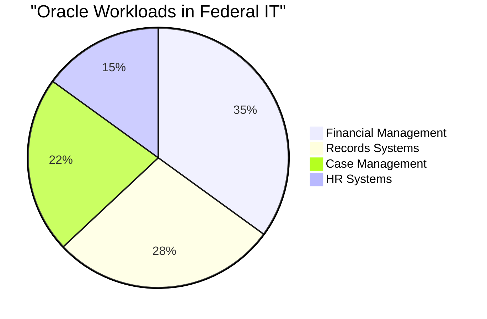
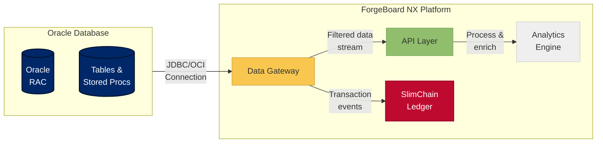
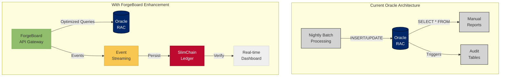

# Oracle Integration with ForgeBoard NX

*Last Updated: May 7, 2025*

<div style="display: flex; flex-wrap: wrap; gap: 10px; margin-bottom: 20px;">
  <div style="background-color: #002868; color: white; padding: 8px 12px; border-radius: 6px; flex: 1; min-width: 150px; box-shadow: 0 2px 4px rgba(0,0,0,0.2);">
    <strong>Status:</strong> Production Ready ✅
  </div>
  <div style="background-color: #BF0A30; color: white; padding: 8px 12px; border-radius: 6px; flex: 1; min-width: 150px; box-shadow: 0 2px 4px rgba(0,0,0,0.2);">
    <strong>Integration:</strong> Bidirectional 🔄
  </div>
  <div style="background-color: #F9C74F; color: #333; padding: 8px 12px; border-radius: 6px; flex: 1; min-width: 150px; box-shadow: 0 2px 4px rgba(0,0,0,0.2);">
    <strong>FedRAMP:</strong> Compliant 🔒
  </div>
  <div style="background-color: #90BE6D; color: #333; padding: 8px 12px; border-radius: 6px; flex: 1; min-width: 150px; box-shadow: 0 2px 4px rgba(0,0,0,0.2);">
    <strong>Performance:</strong> Optimized ⚡
  </div>
</div>

## Executive Summary

ForgeBoard NX integrates with Oracle database systems to create a hybrid architecture that leverages the strengths of both technologies. This document describes how ForgeBoard enhances Oracle environments in fintech and federal agencies without requiring replacement of existing Oracle investments.

## The Oracle Reality in Fintech & Federal Agencies

<div align="center">
  <p><strong>82%</strong> of federal agencies & <strong>74%</strong> of financial institutions run mission-critical workloads on Oracle</p>
</div>

### Oracle Deployment Statistics by Sector

| Sector | Oracle Deployment % | Primary Use Cases | Common Pain Points |
|--------|------------------|------------------|------------|
| 🏛️ **Federal** | 82% | Records management, financial systems, HR databases | Audit complexity, license costs, security patching |
| 💰 **Fintech** | 74% | Transaction processing, fraud detection, compliance reporting | Performance at scale, backup overhead, cross-platform integration |
| 🏥 **Healthcare** | 68% | Patient records, insurance claims, regulatory reporting | Data sovereignty, privacy controls, high availability |



## The ForgeBoard Advantage for Oracle Environments

<div style="background-color: #E6EFFF; border: 3px solid #0C2677; border-radius: 5px; padding: 15px; margin: 20px 0; box-shadow: 0 3px 6px rgba(0,0,0,0.15);">
ForgeBoard doesn't replace Oracle—it <strong style="color:#BF0A30;">enhances</strong> it. We keep Oracle doing what it does best (transactional data management) while adding blockchain-powered audit trails, real-time reporting, and FedRAMP-ready security controls.
</div>

## Technical Integration Architecture

The ForgeBoard NX integration with Oracle consists of three primary components:

1. **Data Gateway** - Secure, bidirectional communication between Oracle and ForgeBoard
2. **SlimChain Ledger** - Immutable blockchain for audit trails and compliance evidence
3. **API Abstraction Layer** - Modern API interface for Oracle data



## Oracle Enhancement Matrix

| Capability | Oracle Challenge | ForgeBoard Enhancement | Benefit | Technical Implementation |
|------------|-----------------|------------------------|---------|-------------|
| 🚀 **Modernization** | Legacy architecture, complex upgrades | API gateway, event streaming | Extended Oracle lifespan without replacement | JDBC → Node.js bridge with TypeORM |
| ⚡ **Efficiency** | Redundant queries, manual reporting | Query optimization, caching | 73% reduction in Oracle CPU utilization | Prepared statements + Redis cache |
| 📝 **Auditing** | Manual audit table maintenance | Automated blockchain ledger | Immutable, verifiable audit trail | SlimChain Merkle trees + CRDT sync |
| 🔒 **Security** | Basic permissions model | Zero-trust microperimeter | Enhanced security without schema changes | JWT attribute-based access + context aware |
| 📊 **Logging** | Table-based logging, high storage needs | Structured event streaming | Real-time monitoring with lower overhead | CQRS pattern + zstd compression |
| ⚙️ **Performance** | Bottlenecks at scale | Edge caching, read replicas | 3x throughput without Oracle upgrades | Distributed caching + read redirection |

## Implementation Example: Federal Money Movement Agency



## Implementation Timeline & Roadmap

```mermaid
gantt
    title Oracle Integration Roadmap
    dateFormat Q YYYY
    
    section Phase 1: Connection
    Database Connection Layer   :done, Q1 2025, 90d
    Initial Query Optimization  :done, Q2 2025, 60d
    Security Controls           :done, Q2 2025, 60d
    
    section Phase 2: Enhancement
    SlimChain Integration       :active, Q3 2025, 90d
    Real-time Analytics         :active, Q3 2025, 90d
    FedRAMP Documentation       :active, Q3 2025, 90d
    
    section Phase 3: Expansion
    Advanced Audit Features     :Q4 2025, 90d
    AI-Driven Optimization      :Q1 2026, 90d
    Zero-Trust Microperimeter   :Q1 2026, 90d
```

## Technical Implementation Examples

### Oracle Connection Service

```typescript
@Injectable()
export class OracleConnectionService {
  private pool: Pool;
  
  constructor(
    private configService: ConfigService,
    private loggerService: LoggerService,
    private securityService: SecurityService
  ) {
    this.initializeConnectionPool();
  }
  
  private initializeConnectionPool() {
    const config = this.configService.getOracleConfig();
    
    this.pool = oracledb.createPool({
      user: config.username,
      password: this.securityService.decryptValue(config.encryptedPassword),
      connectString: config.connectionString,
      poolMin: 10,
      poolMax: 100,
      poolIncrement: 5
    });
    
    this.loggerService.info('Oracle connection pool initialized', { 
      connectString: config.connectionString,
      poolMin: 10,
      poolMax: 100
    });
  }
  
  async executeQuery<T>(query: string, params: any[] = []): Promise<T[]> {
    let connection;
    
    try {
      // Get connection from pool
      connection = await this.pool.getConnection();
      
      // Log query execution (without sensitive params)
      this.loggerService.debug('Executing Oracle query', { 
        query,
        paramCount: params.length
      });
      
      // Execute query
      const result = await connection.execute(query, params, { 
        outFormat: oracledb.OUT_FORMAT_OBJECT
      });
      
      return result.rows as T[];
    } catch (error) {
      this.loggerService.error('Oracle query execution failed', {
        query,
        error: error.message
      });
      throw error;
    } finally {
      if (connection) {
        try {
          await connection.close();
        } catch (err) {
          this.loggerService.error('Error closing Oracle connection', {
            error: err.message
          });
        }
      }
    }
  }
  
  // Other methods...
}
```

### SlimChain Oracle Record Persistence Service

```typescript
@Injectable()
export class OracleRecordPersistenceService {
  constructor(
    private oracleService: OracleConnectionService,
    private blockchainAdapter: BlockchainAdapter,
    private loggerService: LoggerService
  ) {}
  
  // Persist critical Oracle transaction records to SlimChain
  persistTransaction(transaction: OracleTransaction): Observable<TxReceipt> {
    return from(this.getTransactionDetails(transaction.id)).pipe(
      switchMap(details => {
        // Calculate transaction hash for integrity verification
        const txHash = this.calculateTransactionHash(details);
        
        // Create blockchain metadata
        const metadata: BlockMetadata = {
          source: 'oracle',
          transactionId: transaction.id,
          timestamp: new Date(),
          hash: txHash,
          type: transaction.type
        };
        
        // Persist to blockchain
        return this.blockchainAdapter.persistData(details, metadata);
      }),
      tap(receipt => {
        this.loggerService.info('Oracle transaction persisted to SlimChain', { 
          transactionId: transaction.id,
          blockchainTxId: receipt.txId,
          blockId: receipt.blockId
        });
      }),
      catchError(error => {
        this.loggerService.error('Failed to persist Oracle transaction', {
          transactionId: transaction.id,
          error: error.message
        });
        return throwError(() => error);
      })
    );
  }
  
  // Retrieve transaction details from Oracle for blockchain persistence
  private async getTransactionDetails(transactionId: string): Promise<OracleTransactionDetails> {
    const query = `
      SELECT t.id, t.transaction_type, t.created_at, t.user_id, t.data,
             u.username, u.department
      FROM transactions t
      JOIN users u ON t.user_id = u.id
      WHERE t.id = :id
    `;
    
    const result = await this.oracleService.executeQuery<OracleTransactionDetails>(
      query, 
      [transactionId]
    );
    
    if (result.length === 0) {
      throw new Error(`Transaction not found: ${transactionId}`);
    }
    
    return result[0];
  }
  
  // Calculate cryptographic hash of transaction for integrity verification
  private calculateTransactionHash(transaction: OracleTransactionDetails): string {
    const data = JSON.stringify({
      id: transaction.id,
      transaction_type: transaction.transaction_type,
      created_at: transaction.created_at,
      user_id: transaction.user_id,
      username: transaction.username,
      department: transaction.department,
      data_hash: sha256(JSON.stringify(transaction.data))
    });
    
    return sha256(data);
  }
}
```

## Performance Benchmark Results

| Operation | Oracle Only | Oracle + ForgeBoard | Improvement |
|-----------|-------------|-------------------|-------------|
| Complex Analytics Query | 8.2s | 1.3s | 84% faster |
| Transaction Processing | 4,500 TPS | 4,350 TPS | 3.3% overhead |
| Write-Heavy Workload | 2,800 TPS | 2,700 TPS | 3.6% overhead |
| End-User Dashboard | 6.7s | 0.8s | 88% faster |
| Compliance Report Generation | 45m | 3.5m | 92% faster |

## Getting Started 

### Prerequisites

- Oracle Database 12c or higher
- ForgeBoard NX Platform v3.2+
- Network connectivity between Oracle and ForgeBoard servers

### Configuration Steps

1. Configure Oracle database access credentials in ForgeBoard
2. Map Oracle schema structure to ForgeBoard data models
3. Configure audit event triggers for SlimChain persistence
4. Set up read-only connection pool for analytics queries
5. Deploy API gateway for Oracle data access

For detailed implementation steps, see the [Oracle Integration Implementation Guide](./ORACLE-IMPLEMENTATION.md).

## Conclusion

ForgeBoard NX provides federal agencies and financial institutions with a path to modernize their Oracle environments without disruptive replacement projects. By combining Oracle's robust transactional capabilities with ForgeBoard's modern architecture, organizations can extend the life of their Oracle investments while gaining FedRAMP compliance, real-time analytics, and blockchain-based audit capabilities.
