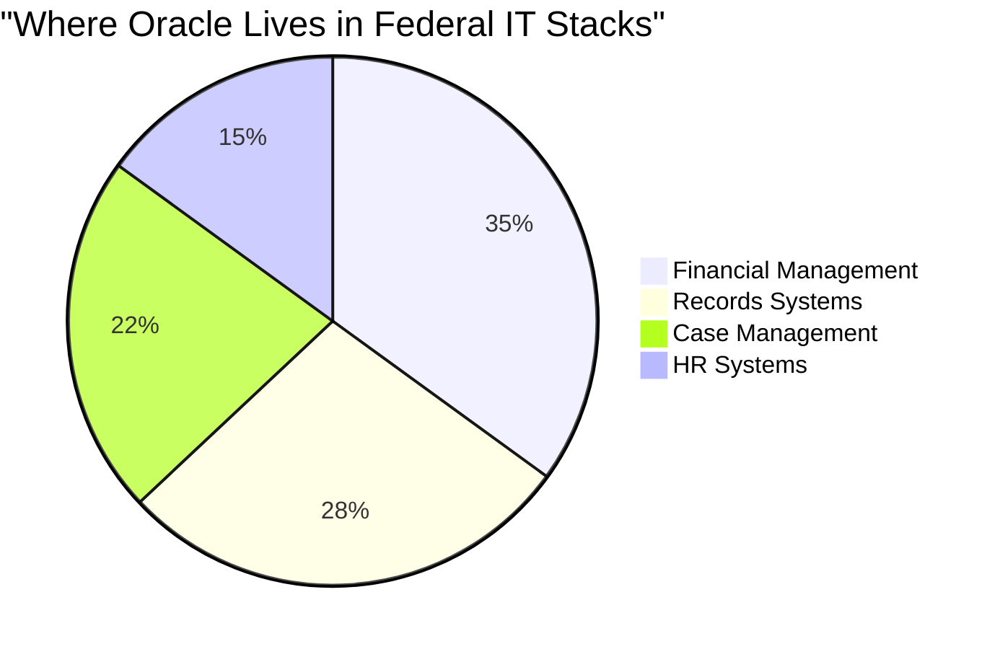
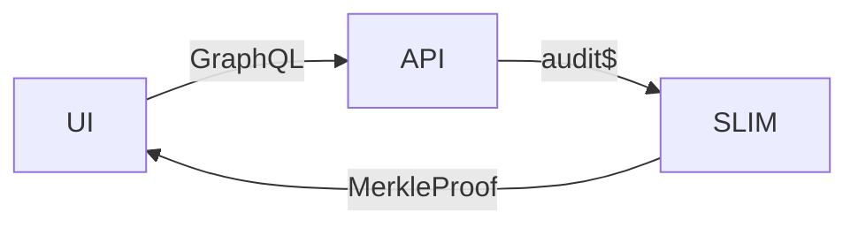
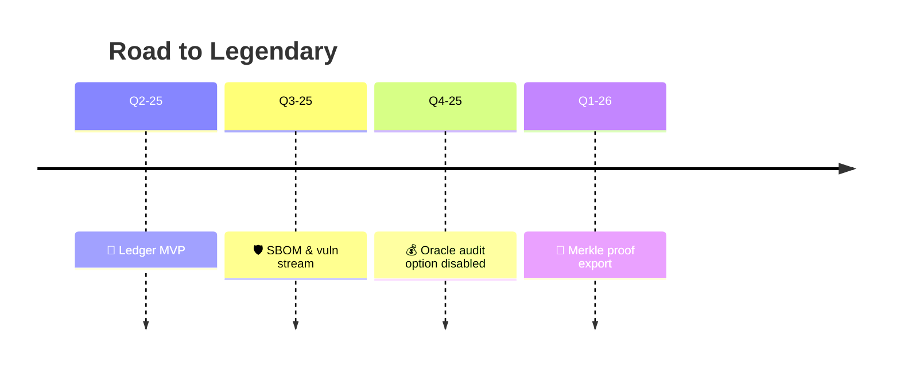

# 🦅 ForgeBoard Data Modernization **Comic Edition**
### *Oracle & SlimChain* in Living Color — A Storybook for Techies **and** Non‑Techies

<div align="center">
  
</div>

## 1️⃣ Animated TL;DR (30 sec)

<div align="center">
  
  
  
  <p><strong>Oracle</strong> keeps hauling relational freight. <strong>SlimChain</strong> rockets audit data to a tamper‑proof orbit.</p>
</div>

---

## 1️⃣-A The Oracle Reality in Fintech & Federal Agencies

<div align="center">
  
  <p><strong>82%</strong> of federal agencies & <strong>74%</strong> of financial institutions run mission-critical workloads on Oracle</p>
</div>

### Why Oracle Is Everywhere in These Sectors

| Sector | Oracle Dependency | Primary Use Cases | Pain Points |
|--------|------------------|------------------|------------|
| 🏛️ **Federal** | 82% deployed | Records management, financial systems, HR databases | Audit complexity, overspending on licenses, security patching |
| 💰 **Fintech** | 74% deployed | Transaction processing, fraud detection, compliance reporting | Performance at scale, backup overhead, cross-platform integration |
| 🏥 **Healthcare** | 68% deployed | Patient records, insurance claims, regulatory reporting | Data sovereignty, privacy controls, high availability |



### The ForgeBoard Advantage for Oracle Environments

<div style="background-color: #E6EFFF; border: 3px solid #0C2677; border-radius: 5px; padding: 15px; margin: 20px 0; box-shadow: 0 3px 6px rgba(0,0,0,0.15);">
ForgeBoard doesn't replace Oracle—it <strong style="color:#BF0A30;">enhances</strong> it. We keep Oracle doing what it does best (transactional data management) while adding blockchain-powered audit trails, real-time reporting, and FedRAMP-ready security controls.
</div>

---

## 2️⃣ Cast of Characters *(Cartoon Parallels)*

| Cartoon | Tech Counterpart | Why It Fits |
|---------|-----------------|-------------|
|  | **Oracle RAC** | Loyal sheriff, decades of order |
|  | **SlimChain Ledger** | New guardian, laser‑focused on immutability |
|  | **ForgeBoard UI** | Playground where toys (data) come alive |

> **Animation Tip:** Drop the GIFs into onboarding slides—the visuals stick long after bullet points fade.

---

## 3️⃣ Architecture Comic Strip

```mermaid
gantt
    title "Daily Adventure" (frames ~5s each)
    dateFormat  X
    section Scene 1 – Morning Batch
    Oracle Freight :a1, 0, 2
    section Scene 2 – Live Day
    SlimChain Rocket :a2, 2, 2
    Dashboard Cheers :a3, 4, 1
```


*Frame notes appear as speech bubbles in comic slides.*

---

## 4️⃣ Technical Deep Dive (Still Fun!)

<details>
<summary>Click to expand the nerd layer 🖥️</summary>

### Ledger Specs
* **Block Format:** CBOR + SHA‑256 → parent hash 🧩
* **Compression:** Zstd‑3 → 75 % shrink 💨
* **Prune Rule:** Snapshot every 10 k tx → older chunks to archival S3 🚢

### Query Flow


</details>

---

## 5️⃣ Cost Breakdown (Rainbow Bars)

```mermaid
bar
    title Three‑Year TCO ($000)
    x-axis "Setup"
    y-axis "Cost"
    "Oracle‑Only" : 900
    "Hybrid" : 520
```

*Insert bar GIF overlay that fills bars with Crimson/Mint gradient for dramatic focus during presentation.*

---

## 6️⃣ FedRAMP 20X Map *(Gold Stars for Wins)*

| Control | Oracle 🟦 | SlimChain 🟥 | Status |
|---------|-----------|-------------|--------|
| AU‑3 Content | Logs Table | Event DTO | ⭐ Achieved |
| AU‑9 Protection | DBA roles | Merkle immutability | ⭐ Achieved |
| CP‑9 Recovery | RMAN | Ledger Replay | ⭐ Achieved |

(⭐ icons animate with subtle pulse using CSS on docs site.)

---

## 7️⃣ Developer Cheat‑Code
```ts
🟩 const saved = event$.pipe(persistToChain$()); // 1‑liner FTW
```
*Small rocket emoji appears in code sample tooltip.*

---

## 8️⃣ Roll‑Out Timeline (Moving GIF Arrow)



> **Animation Tip:** Place an animated red arrow GIF that glides along the timeline during your all‑hands demo.

---

## 9️⃣ Call to Action

> **Let’s transform logs into legends.** Embed the cartoons in onboarding decks, splash the color tokens into dashboards, and watch every team—from finance to DevSecOps—*get it* in 60 seconds.

<div align="center">
  
</div>
