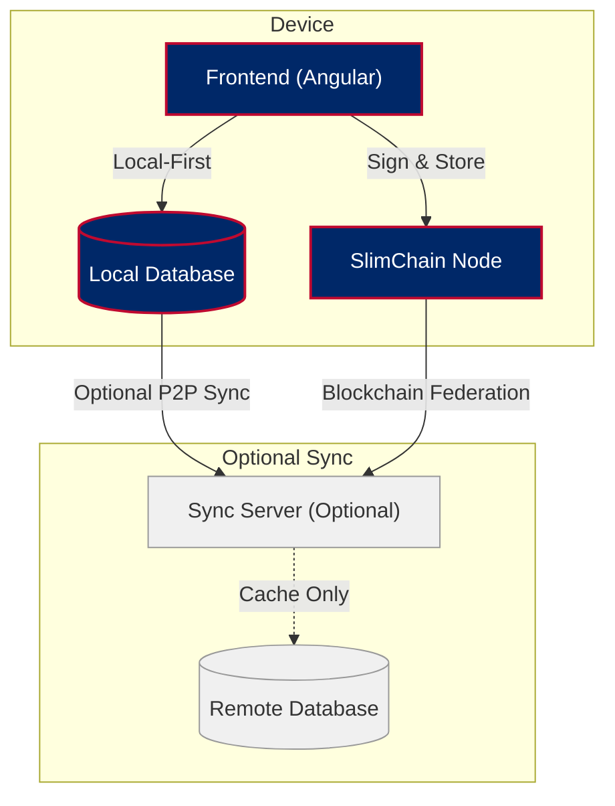

# ForgeBoard NX
*Last Updated: May 7, 2025*

A sovereign monitoring and management dashboard with Local-First data ownership and blockchain persistence.

## Features

- **Local-First Metrics Dashboard**: Monitor system performance metrics with live visualizations that work offline
- **Blockchain-Backed Kablan Board**: Kanban-style project management with tamper-proof workflow history
- **Sovereign Diagnostics**: System health monitoring with on-device data authority
- **Immutable Logging System**: Real-time log collection with blockchain-secured audit trail
- **On-Device Security Dashboard**: Local vulnerability scanning and FedRAMP 20X compliance tracking
- **Peer-to-Peer Synchronization**: Optional mesh network capability for team collaboration

## System Architecture



## Architecture Overview

ForgeBoard NX uses a revolutionary Local-First architecture with:

- **Frontend**: Angular 19+ with ObservableStore for local data authority
- **Local Storage**: Embedded database with CRDT-based merge capability
- **Blockchain Ledger**: SlimChain for immutable, tamper-proof record keeping
- **Communication**: WebRTC mesh for peer-to-peer sync, WebSockets as fallback
- **State Management**: RxJS hot observables with persistToChain operators
- **UI Design**: Patriotic blue/red theme with responsive blueprint layouts

## Core Modules

| Module | Description | Features |
|--------|-------------|----------|
| Metrics Dashboard | Sovereign system monitoring | Offline-capable metrics, local data sovereignty, P2P synchronization |
| Kablan Board | Immutable project management | Blockchain-backed tasks, tamper-proof history, CRDT-based collaboration |
| Diagnostics | Local-First health monitoring | On-device health analytics, air-gap compatible, signed evidence collection |
| Logger | Blockchain-secured logging | Immutable audit trail, cryptographically-verified entries, compliance-ready exports |
| Security Dashboard | On-device security center | Local vulnerability scanning, FedRAMP 20X compliance, blockchain attestation |

## Getting Started

1. Clone the repository
2. Install dependencies:
   ```
   npm install
   ```
3. Start the development server:
   ```
   npm run start:dev
   ```
4. Navigate to `http://localhost:4200/`

## Technical Features

- **Local-First Data Sovereignty**: True data ownership with on-device source of authority
- **SlimChain Ledger**: Compressed blockchain with efficient storage (≤512 MB) and pruning capabilities
- **CRDT-Based Synchronization**: Conflict-free replicated data types for seamless collaboration
- **WebRTC Mesh Network**: Peer-to-peer data sharing without central server dependency
- **Offline-First Operation**: Full functionality even without internet connectivity
- **Zero-Knowledge Cryptography**: Privacy-preserving data verification for FedRAMP 20X compliance
- **Deterministic Builds**: Reproducible, verifiable application assemblies with signed artifacts

## Documentation

- [API Documentation](./API-DOCUMENTATION.md)
- [Frontend-API Architecture](./FRONTEND-API-ARCHITECTURE.md)
- [Layout System](./LAYOUT.md)
- [Coding Standards](./CODING-STANDARDS.md)
- [Local-First vs Cache-First](./LOCAL-FIRST-VERSUS-CACHE.md)
- [Blockchain Persistence Architecture](./BLOCKCHAIN-PERSISTENT-ARCHITECTURE.md)

## Patriotic Design

ForgeBoard NX features a distinctive American-inspired color palette that embodies sovereignty and freedom:

- **Primary Colors**: #002868 (Blue), #BF0A30 (Red), #FFFFFF (White)
- **Accent Colors**: #F9C74F (Gold), #90BE6D (Victory Green)

*"Own your data. Guard your freedom. Build Legendary."* 🦅✨
