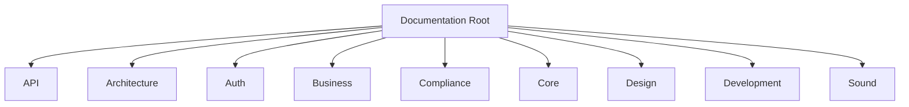
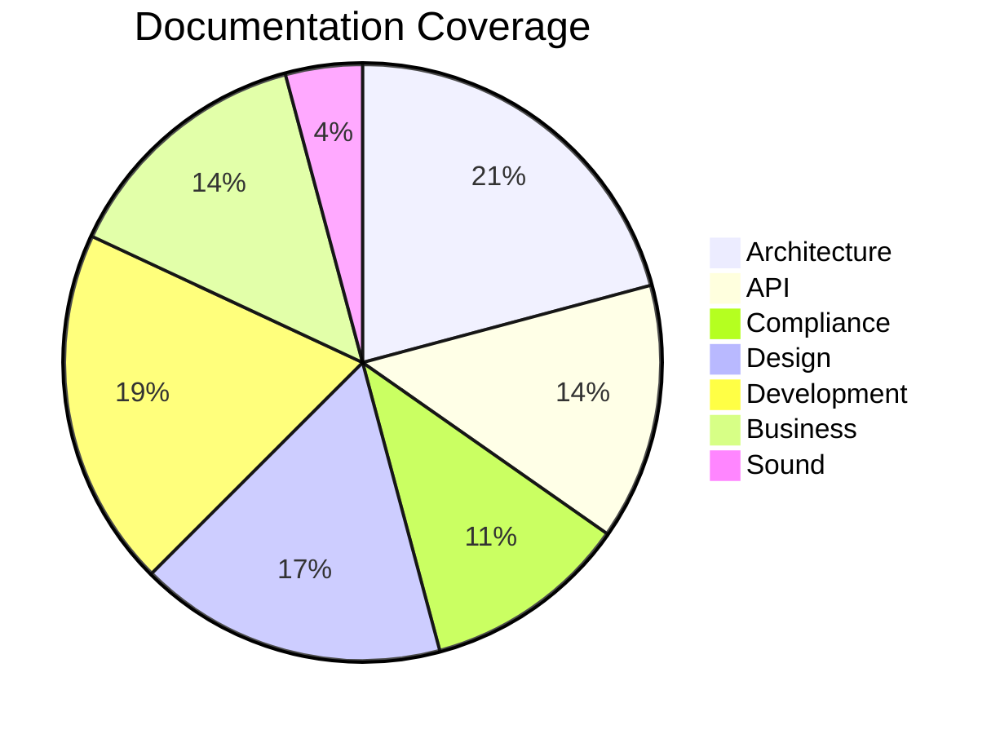

#  ForgeBoard Documentation Index

  

    <strong>Status:</strong> Living Docs ✓
  

  

    <strong>Coverage:</strong> Architecture, API, Compliance, UX, DevOps
  

  

    <strong>Visuals:</strong> Diagrams, Charts, Infographics
  

---

## 📚 Overview

Welcome to the ForgeBoard documentation hub! This directory is your gateway to all technical, compliance, design, and business knowledge for the ForgeBoard platform. Each subfolder below represents a major topic area, with rich Markdown guides, diagrams, and infographics. All docs follow the [Visual Standards](./VISUAL-STANDARDS.md) for clarity and consistency.

---

## 🗂️ Documentation Structure

```mermaid
graph TD;
    A[Documentation Root]
    A --> API[API]
    A --> Architecture[Architecture]
    A --> Auth[Auth]
    A --> Business[Business]
    A --> Compliance[Compliance]
    A --> Core[Core]
    A --> Design[Design]
    A --> Development[Development]
    A --> Sound[Sound]
```

---

## 📦 Subfolder & Topic Breakdown

### 1. **API**
- **API-DOCUMENTATION.md**: REST endpoints, WebSocket namespaces, usage examples.
- **type/**: (Type definitions for API payloads)

### 2. **Architecture**
- **ARCHITECTURE-GUIDE.md**: System and service architecture.
- **COMPREHENSIVE-SERVICE-ARCHITECTURE.md**: End-to-end service diagrams.
- **PROJECT-STATUS.md / PROJECT-STATUS-UPDATE.md**: Architecture status and updates.
- **STRONGLY-TYPED-SERVICE-ARCHITECTURE.md**: Type safety in service design.

### 3. **Auth**
- **AUTHENTICATION-AUTHORIZATION.md**: Authentication flows, RBAC, SSO, and security best practices.

### 4. **Business**
- **ADHERANCE.md**: FedRAMP adherence, infographics, and compliance diagrams.
- **AI-PER-REQUIRED-ENVIRONMENTS.md**: AI requirements for environments.
- **BLOCKCHAIN-PERSISTENT-ARCHITECTURE.md**: Blockchain integration.
- **BUSINESS.md**: Business model and value proposition.
- **COPILOT_MARKED_SETUP.md**: Docs build pipeline and Copilot prompting tips.
- **DOCUMENTATION-MIGRATION-SUMMARY.md**: Migration history.
- **ENVIRONMENT-CONFIGURATION.md**: Environment setup.
- **EXCEEDING-STANDARDS.md**: How ForgeBoard exceeds industry standards.
- **ForgeBoard-LLM-Setup.md**: LLM integration.
- **LAYOUT.md**: UI layout system, grid diagrams, and CSS architecture.
- **MOBILE-COMMS-PLAN.md**: Mobile reporting and comms plan.
- **nest_tensorflow_nx.md**: TensorFlow integration.
- **OSCAL-DEVELOPMENT.md / OSCAL-INTEGRATION.md**: OSCAL and FedRAMP automation.
- **PILLAR_MATRIX_DECONSTRUCTED.md**: Pillar-to-doc mapping.
- **PROJECT_ALIGNMENT_PLAN.md**: Project alignment and audit plan.
- **REV5.md**: NIST 800-53 Rev5 summary.
- **SECURITY_DASHBOARD.md**: Security dashboard overview.
- **SMALL-BUSINESS-BENEFITS.md / SMALL-BUSINESS-OPPORTUNITIES.md**: Business benefits and opportunities.

### 5. **Compliance**
- **COMPLIANCE-AND-CODING-STANDARDS.md**: Coding and compliance standards.

### 6. **Core**
- (Reserved for core system documentation)

### 7. **Design**
- **DRAG-AND-DROP-PATTERNS.md**: UI/UX drag-and-drop.
- **KANBAN-BOARD.md**: Kanban board design.
- **MASTER-DESIGN-GUIDE.md**: Master design principles.
- **VISUAL-STANDARDS.md**: Visual branding, document structure, and required infographics.
- **_TEMPLATE.md**: Markdown template for new docs.

### 8. **Development**
- **RXJS-BEST-PRACTICES.md**: RxJS usage.
- **SERVICE-INITIALIZATION-RECOMMENDATION.md**: Service startup patterns.
- **services/**: Service-specific guides.
- **shims/**: Browser shim guides.
- **TASKS-COMPLETION-REPORT.md**: Task tracking.
- **TEST-PATTERNS.md**: Testing standards and patterns.
- **MASTER-SERVICES-GUIDE.md**: Service architecture reference.
- **MASTER-BROWSER-SHIMS-GUIDE.md**: Browser shims reference.

### 9. **Sound**
- **ForgeBoard Data Provenance Management Dashboard.wav**: Audio documentation.
- **MASTER-SOUND-DOCUMENTATION.md**: Sound system overview.
- **SOUND-SYSTEM.md**: Sound system integration.

---

## 🖼️ Visual Standards & Infographics

- All docs use [VISUAL-STANDARDS.md](./design/VISUAL-STANDARDS.md) for headers, status cards, and infographics.
- Diagrams: Mermaid.js, ASCII, and SVG for architecture, workflow, and compliance.
- Example:

```mermaid
pie title Documentation Coverage
  "Architecture" : 15
  "API" : 10
  "Compliance" : 8
  "Design" : 12
  "Development" : 14
  "Business" : 10
  "Sound" : 3
```

---

## 📝 How to Contribute

1. Use the [documentation template](./design/_TEMPLATE.md) for new docs.
2. Add status cards and infographics as per [Visual Standards](./design/VISUAL-STANDARDS.md).
3. Place new files in the appropriate subfolder.
4. Link new docs here for discoverability.

---

ForgeBoard – Setting the standard for federal documentation excellence

*ForgeBoard — Own your data. Guard your freedom. Build Legendary.* 🦅✨
