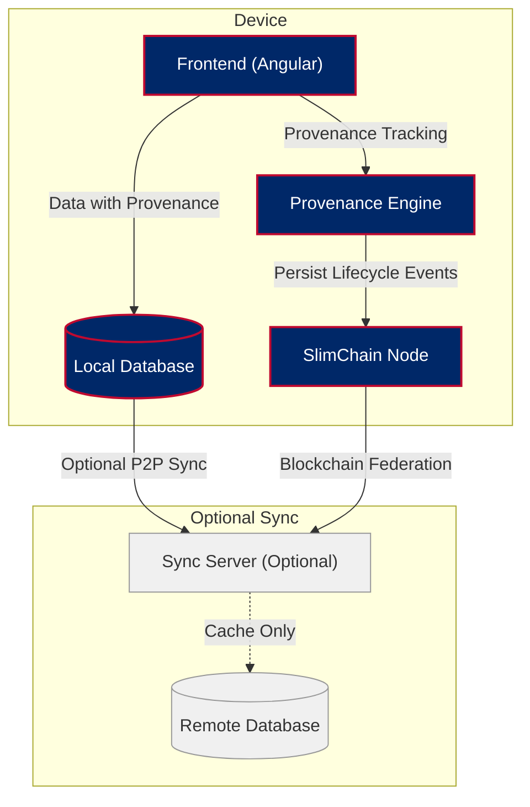

# ForgeBoard NX
*Last Updated: May 15, 2025*

A sovereign monitoring and management dashboard with Local-First data ownership, comprehensive data provenance tracking, and blockchain persistence.

## Features

- **Data Provenance Tracking**: Complete lifecycle tracking of all data from inception through disposal
- **Local-First Architecture**: Your device is the source of authority for all data
- **Blockchain Persistence**: Immutable, tamper-evident record of all changes
- **Real-Time Dashboards**: Live metrics, logs, and diagnostics
- **FedRAMP 20X Ready**: Built to exceed the latest federal security requirements

## System Architecture

ForgeBoard NX's architecture is built around maintaining complete data provenance:



## Architecture Overview

ForgeBoard NX uses a revolutionary Local-First architecture with comprehensive data provenance:

- **Frontend**: Angular 19+ with ProvenanceStore for complete data lifecycle tracking
- **Local Storage**: Embedded database with CRDT-based merge capability and provenance preservation
- **Blockchain Ledger**: SlimChain for immutable, tamper-proof provenance records
- **Communication**: WebRTC mesh for peer-to-peer sync with provenance verification, WebSockets as fallback
- **State Management**: RxJS hot observables with trackProvenance operators
- **UI Design**: Patriotic blue/red theme with responsive blueprint layouts and provenance visualization

## Core Modules

| Module | Description | Features |
|--------|-------------|----------|
| Metrics Dashboard | Sovereign system monitoring | Offline-capable metrics, local data sovereignty, P2P synchronization |
| Kablan Board | Immutable project management | Blockchain-backed tasks, tamper-proof history, CRDT-based collaboration |
| Diagnostics | Local-First health monitoring | On-device health analytics, air-gap compatible, signed evidence collection |
| Logger | Blockchain-secured logging | Immutable audit trail, cryptographically-verified entries, compliance-ready exports |
| Security Dashboard | On-device security center | Local vulnerability scanning, FedRAMP 20X compliance, blockchain attestation |

## Getting Started

1. Clone the repository
2. Install dependencies:
   ```
   npm install
   ```
3. Start the development server:
   ```
   npm run start:dev
   ```
4. Navigate to `http://localhost:4200/`

## Technical Features

- **Complete Data Provenance**: Tracking the entire lifecycle of data from inception through disposal
- **Local-First Data Sovereignty**: True data ownership with on-device source of authority
- **SlimChain Ledger**: Compressed blockchain with efficient storage (≤512 MB) and pruning capabilities
- **CRDT-Based Synchronization**: Conflict-free replicated data types for seamless collaboration
- **WebRTC Mesh Network**: Peer-to-peer data sharing without central server dependency
- **Offline-First Operation**: Full functionality even without internet connectivity
- **Zero-Knowledge Cryptography**: Privacy-preserving data verification for FedRAMP 20X compliance
- **Deterministic Builds**: Reproducible, verifiable application assemblies with signed artifacts

## Documentation

ForgeBoard NX's documentation is comprehensive and covers all aspects of its architecture:

- [**Local-First Data Provenance**](./LOCAL-FIRST-DATA-PROVENANCE.md) - Understanding complete data lifecycle tracking
- [Blockchain Persistent Architecture](./BLOCKCHAIN-PERSISTENT-ARCHITECTURE.md)
- [Frontend-API Architecture](./FRONTEND-API-ARCHITECTURE.md)
- [API Documentation](./API-DOCUMENTATION.md)
- [Local-First vs Cache-First Architecture](./LOCAL-FIRST-VERSUS-CACHE.md)
- [Coding Standards](./CODING-STANDARDS.md)
- [Exceeding Standards](./EXCEEDING-STANDARDS.md)

## Patriotic Design

ForgeBoard NX features a distinctive American-inspired color palette that embodies sovereignty and freedom:

- **Primary Colors**: #002868 (Blue), #BF0A30 (Red), #FFFFFF (White)
- **Accent Colors**: #F9C74F (Gold), #90BE6D (Victory Green)

*"Own your data. Guard your freedom. Build Legendary."* 🦅✨
