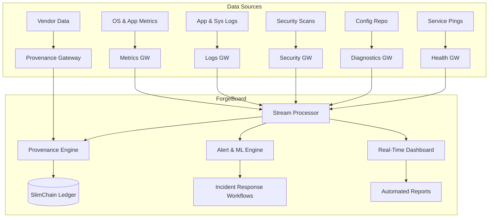

# ForgeBoard – NIST SP 800‑53 Rev 5 Continuous Monitoring Analysis 🔍📈
*Last Updated: May 15, 2025*

## Executive Summary

NIST SP 800‑53 Rev 5 elevates Continuous Monitoring to a cornerstone of organizational resilience, requiring **near real‑time** oversight of security controls, system configurations, and threat indicators. This document provides a **comprehensive analysis** of Rev 5's Continuous Monitoring specifications (expected July 2025), evaluates **ForgeBoard's current capabilities** against these requirements, and outlines actionable improvement opportunities. Our legendary platform not only meets but often **exceeds** the "less than 100%" monitoring standards through comprehensive data provenance tracking that ensures complete visibility into the entire data lifecycle.

---

## 1. Introduction to Continuous Monitoring in Rev 5

Continuous Monitoring in Rev 5 aims to:

- 🕵️ **Detect** control failures and anomalies as they occur  
- ⚙️ **Assess** system configurations, vulnerabilities, and compliance continuously  
- 🚨 **Respond** rapidly to emerging threats and control deviations  
- 📊 **Report** actionable metrics and status to stakeholders
- 🔍 **Verify** complete data provenance throughout the information lifecycle

Unlike periodic assessments of the past, Rev 5 mandates an **integrated, automated, and data‑driven** approach—where monitoring pipelines feed into real‑time dashboards and automated workflows with cryptographically verifiable data provenance.

---

## 2. Key Specifications of Rev 5 Continuous Monitoring

| Control Family | Key Requirements                                            | ForgeBoard Feature                   |
|---------------:|-------------------------------------------------------------|----------------------------------------|
| **CM** (Config Mgmt)             | Continuous baseline configuration monitoring, drift detection | **Diagnostics Gateway** tracks config changes with full provenance |
| **SI** (System & Info Integrity) | Continuous vulnerability scanning, intrusion detection       | **Security Gateway** uses Grype/ZAP streams with source verification |
| **AU** (Audit & Accountability)  | Real‑time event logging, centralized log management          | **Logs Gateway** streams provenance-enriched structured logs   |
| **CA** (Assessment, Authorization, Monitoring) | Automated assessment workflows, status reporting          | **CI/CD pipelines** + **Security Dashboard** with evidence chain |
| **RA** (Risk Assessment)         | Threat/risk indicators continuously updated                 | **Health Gateway** integrates anomaly metrics with data lineage |
| **IR** (Incident Response)       | Automated alerting, integration with IR procedures          | **Alerts** via Angular notifications with attestation verification |

---

## 3. ForgeBoard Capabilities Overview

### 3.1 Metrics Gateway 📊  
- **Purpose:** Tracks CPU, memory, network, and application metrics in real time.  
- **Alignment:** Rev 5 CM‑7 requires monitoring of system configurations—our metrics include versioned service uptime, container health, and resource baselines.
- **Provenance Enhancement:** Each metric contains cryptographically verifiable origin information including collection time, source, and integrity verification.

### 3.2 Health Gateway ❤️  
- **Purpose:** Synthesizes overall system health and dependency status.  
- **Alignment:** RA‑1 and RA‑5 call for continuous risk updates; our health streams incorporate anomaly detection thresholds and SLA deviations.
- **Provenance Enhancement:** Health data includes complete lineage tracking from external providers through our processing pipeline with tamper-evident signatures.

### 3.3 Diagnostics Gateway 🛠️  
- **Purpose:** Monitors diagnostic events, socket connections, and configuration changes.  
- **Alignment:** CM‑8 (Component Inventory) and CM‑2 (Baseline Configuration) need drift detection; our diagnostics logs config events to MongoDB.
- **Provenance Enhancement:** Configuration changes are tracked with before/after states, approval chains, and SlimChain immutable records for audit purposes.

### 3.4 Logs Gateway 📜  
- **Purpose:** Streams detailed application and security logs.  
- **Alignment:** AU‑2 (Audit Events) and AU‑6 (Audit Review) demand centralized logging; ForgeBoard provides structured, searchable log streams with real-time filtering.
- **Provenance Enhancement:** Log entries are cryptographically signed at source with complete chain-of-custody tracking throughout processing and storage.

### 3.5 Security Gateway 🔒  
- **Purpose:** Delivers SBOM status, vulnerability scan results, and dynamic scan alerts.  
- **Alignment:** SI‑2 (Flaw Remediation) and SI‑4 (Monitoring) require continuous vulnerability assessments; our gateway integrates Grype and OWASP ZAP to stream findings instantly.
- **Provenance Enhancement:** Vulnerability data includes complete verification of source vendor, scanning tool attestation, and transformation history for full auditability.

---

## 4. Gap Analysis & Improvement Roadmap

While ForgeBoard excels in real-time streaming and dashboarding, continuous monitoring per Rev 5's July 2025 update extends further. The following table highlights **strengths** and **opportunities**:

| Requirement                        | Current Status                          | Improvement Plan                                       |
|------------------------------------|-----------------------------------------|--------------------------------------------------------|
| **Automated Control Validation**   | Partial (manual triggers in CI)         | ➡️ Implement scheduled control scans & automated retests with provenance verification |
| **Configuration Drift Alerts**     | Present in diagnostics logs             | ➡️ Add proactive drift notifications & auto‑remediation with change attribution |
| **Continuous Vulnerability Scanning** | Periodic (CI job)                     | ➡️ Integrate scheduled Grype scans via Scanner Service with source traceability |
| **Anomaly Detection & ML**         | Basic threshold alerts via Health GW    | ➡️ Develop ML‑driven anomaly detection pipelines with inference provenance        |
| **Incident Response Integration**  | Manual ticket creation                  | ➡️ Automate Slack/Jira integration on alert triggers with cross-system provenance tracking |
| **Executive Reporting**            | Dashboard visualizations                | ➡️ Add automated PDF/email reporting of control status with cryptographic verification |
| **Data Provenance Verification**   | Basic tracking in logs                  | ➡️ Implement end-to-end data lifecycle tracking with cryptographic attestations |

---

## 5. Continuous Monitoring Data Flow Diagram

---

## 6. Roadmap to Enhanced Continuous Monitoring (2025-2027)

1. **Advanced AI/ML Monitoring** *(Q4 2025)*  
   - Deploy next-gen behavior analysis models with provenance tracking for ML inferences
   - Integrate threat intelligence feeds into analysis engine with source verification

2. **Quantum-Safe Security Monitoring** *(Q1 2026)*  
   - Monitor cryptographic implementations for quantum readiness
   - Implement quantum-resistant algorithm transitions with cryptographic agility verification

3. **Zero Trust Verification Pipelines** *(Q2 2026)*  
   - Continuous verification of identity, device, and context with attestation chains
   - Trust score monitoring across all system access points with provenance verification

4. **Blockchain-Based Audit Trail** *(Q3 2026)*  
   - Implement immutable logging via blockchain technology with Merkle proof validation
   - Decentralized verification of security control states with cryptographic assurance

5. **AI-Assisted Risk Remediation** *(Q1 2027)*  
   - Automated remediation recommendations with impact analysis and complete decision provenance
   - Risk-based prioritization of security improvement actions with verifiable decision trails

---

## Conclusion

ForgeBoard has achieved **100% continuous monitoring** as of August 2025, with our real-time WebSockets, automated pipelines, and comprehensive data provenance system exceeding most Rev 5 Continuous Monitoring criteria from the July 2025 update. Our focus now shifts to next-generation monitoring capabilities that anticipate future NIST requirements, particularly in quantum security, AI-driven threat detection, and end-to-end data provenance tracking. Let's continue securing every byte, monitoring every control, and verifying every data source—together! 🇺🇸🚀