# ForgeBoard NX: Comprehensive Security Architecture

This document provides detailed visualizations of the ForgeBoard NX security architecture, component interactions, and data flows.

## 1. Complete Security Architecture Overview

## 2. Security Data Flow Architecture

## 3. Zero Trust Security Model Implementation

## 4. Security Event Handling Workflow

## 5. FedRAMP Compliance Monitoring Process

```mermaid
flowchart TD
    %% Top-level process
    Start([Security Control Assessment]) --> MonitorSetup
    MonitorSetup[Set Up Continuous Monitoring] --> CollectEvidence
    CollectEvidence[Collect Evidence] --> AutomatedTests
    AutomatedTests[Run Automated Tests] --> ManualTests
    ManualTests[Perform Manual Assessments] --> AnalyzeResults
    AnalyzeResults[Analyze Results] --> GenerateReport
    GenerateReport[Generate FedRAMP Report] --> SubmitReport
    SubmitReport[Submit to Authorizing Official] --> Remediate
    Remediate[Remediate Issues] --> CollectEvidence

    %% Continuous monitoring subsystem
    subgraph "Automated Continuous Monitoring"
        direction TB
        CMConfig[Configure Monitoring Tools]
        CMSchedule[Set Monitoring Schedule]
        CMBaselines[Define Security Baselines]
        CMAlerting[Configure Alerting]

        CMConfig --> CMSchedule
        CMSchedule --> CMBaselines
        CMBaselines --> CMAlerting
    end

    %% Evidence collection subsystem
    subgraph "Evidence Collection System"
        direction TB
        ECSystem[System Logs]
        ECApplication[Application Logs]
        ECNetwork[Network Traffic]
        ECSecurity[Security Tool Reports]
        ECConfig[Configuration States]
        ECUser[User Activity]

        ECProcessor[Evidence Processor]
        ECRepository[(Evidence Repository)]

        ECSystem & ECApplication & ECNetwork & ECSecurity & ECConfig & ECUser --> ECProcessor
        ECProcessor --> ECRepository
    end

    %% Compliance testing subsystem
    subgraph "Control Testing Framework"
        direction TB
        CTScanner[Vulnerability Scanner]
        CTConfig[Configuration Checker]
        CTAccess[Access Control Validator]
        CTCrypto[Crypto Validator]
        CTAudit[Audit Log Verifier]

        CTEngine[Test Orchestration Engine]
        CTResults[(Test Results Database)]

        CTScanner & CTConfig & CTAccess & CTCrypto & CTAudit --> CTEngine
        CTEngine --> CTResults
    end

    %% Analysis subsystem
    subgraph "Compliance Analysis"
        direction TB
        CAControls[Control Requirements]
        CABaselines[Security Baselines]
        CAGaps[Gap Analysis]
        CARisk[Risk Assessment]

        CAEngine[Compliance Engine]
        CADashboard[Compliance Dashboard]

        CAControls & CABaselines --> CAEngine
        CAEngine --> CAGaps
        CAGaps --> CARisk
        CARisk & CAGaps --> CADashboard
    end

    %% Reporting subsystem
    subgraph "FedRAMP Reporting"
        direction TB
        FRTemplate[FedRAMP Templates]
        FROscal[OSCAL Generator]
        FREvidence[Evidence Packager]
        FRReviewer[Human Review]

        FREngine[Report Generator]
        FRPackage[FedRAMP Package]

        FRTemplate & FROscal --> FREngine
        FREvidence --> FREngine
        FREngine --> FRPackage
        FRPackage --> FRReviewer
        FRReviewer -->|Approve| FRFinal[Final Package]
    end

    %% Connect subsystems to main flow
    MonitorSetup --> CMConfig
    CollectEvidence --> ECProcessor
    AutomatedTests --> CTEngine
    AnalyzeResults --> CAEngine
    GenerateReport --> FREngine
    ECRepository --> CTEngine
    CTResults --> CAEngine
    CADashboard --> FREngine

    %% Styling
    classDef primary fill:#002868,stroke:#071442,color:#fff,stroke-width:2px;
    classDef secondary fill:#BF0A30,stroke:#7D100E,color:#fff,stroke-width:2px;
    classDef tertiary fill:#F9C74F,stroke:#FB8C00,color:#333,stroke-width:2px;
    classDef quaternary fill:#90BE6D,stroke:#43A047,color:#333,stroke-width:2px;

    class Start,MonitorSetup,CollectEvidence,AutomatedTests,ManualTests,AnalyzeResults,GenerateReport,SubmitReport,Remediate primary;
    class ECSystem,ECApplication,ECNetwork,ECSecurity,ECConfig,ECUser,ECProcessor,ECRepository secondary;
    class CTScanner,CTConfig,CTAccess,CTCrypto,CTAudit,CTEngine,CTResults tertiary;
    class CAControls,CABaselines,CAGaps,CARisk,CAEngine,CADashboard quaternary;
    class FRTemplate,FROscal,FREvidence,FRReviewer,FREngine,FRPackage,FRFinal primary;
```

## 6. Supply Chain Security Verification

These diagrams provide a comprehensive visualization of ForgeBoard's security architecture, components, interactions, and workflows. They demonstrate how security is integrated throughout the application lifecycle, from development to deployment and continuous monitoring.
