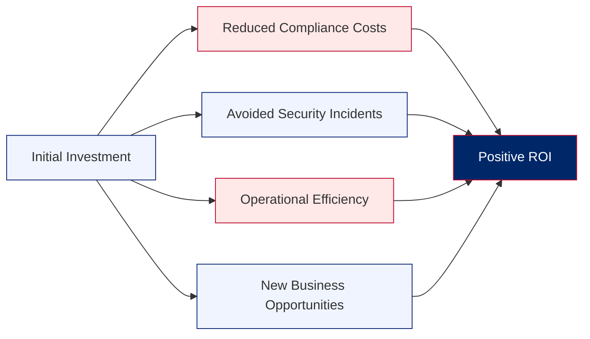

# 🏢 ForgeBoard NX: Small Business Solution Guide 🇺🇸
*Last Updated: 13MAY25*

  

    <strong>Focus:</strong> Small Business ROI 💰
  

  

    <strong>Security:</strong> Enterprise-Grade 🔒
  

  

    <strong>Pricing:</strong> Transparent & Affordable 📊
  

  

    <strong>Scale:</strong> Grows With Your Business 📈
  

ForgeBoard NX isn't just for government agencies and large enterprises. Our platform delivers enterprise-grade security, comprehensive federal compliance, and robust data management at prices small businesses can afford. This guide explains how small businesses can leverage ForgeBoard's federal-grade security architecture for both internal operations and federal contracting needs, while protecting critical data, meeting compliance requirements, and controlling costs.

## 1. Enterprise Security at Small Business Prices

ForgeBoard NX brings government-grade security to small businesses without the enterprise price tag:

<table style="border-collapse: collapse; width: 100%; border: 2px solid #0C2677; box-shadow: 0 2px 5px rgba(0,0,0,0.1);">
  <thead>
    <tr style="background-color: #0C2677; color: white;">
      <th style="border: 1px solid #071442; padding: 10px; font-weight: bold;">Feature</th>
      <th style="border: 1px solid #071442; padding: 10px; font-weight: bold;">Enterprise Cost</th>
      <th style="border: 1px solid #071442; padding: 10px; font-weight: bold;">ForgeBoard Value</th>
      <th style="border: 1px solid #071442; padding: 10px; font-weight: bold;">Small Business Benefit</th>
    </tr>
  </thead>
  <tbody>
    <tr style="background-color: #F0F4FF;">
      <td style="border: 1px solid #AAB6D3; padding: 10px;"><b>Full Data Provenance</b></td>
      <td style="border: 1px solid #AAB6D3; padding: 10px;">$50K+ specialized systems</td>
      <td style="border: 1px solid #AAB6D3; padding: 10px;">Included in base package</td>
      <td style="border: 1px solid #AAB6D3; padding: 10px;">Complete audit trails without enterprise costs</td>
    </tr>
    <tr style="background-color: #FFE8E8;">
      <td style="border: 1px solid #AAB6D3; padding: 10px;"><b>FedRAMP Compliance Tools</b></td>
      <td style="border: 1px solid #AAB6D3; padding: 10px;">$100K+ consulting fees</td>
      <td style="border: 1px solid #AAB6D3; padding: 10px;">Built-in compliance framework</td>
      <td style="border: 1px solid #AAB6D3; padding: 10px;">Win government contracts with minimal overhead</td>
    </tr>
    <tr style="background-color: #F0F4FF;">
      <td style="border: 1px solid #AAB6D3; padding: 10px;"><b>Real-time Monitoring</b></td>
      <td style="border: 1px solid #AAB6D3; padding: 10px;">$2K-5K monthly SaaS fees</td>
      <td style="border: 1px solid #AAB6D3; padding: 10px;">Self-hosted, no recurring fees</td>
      <td style="border: 1px solid #AAB6D3; padding: 10px;">Predictable costs, no vendor lock-in</td>
    </tr>
    <tr style="background-color: #FFE8E8;">
      <td style="border: 1px solid #AAB6D3; padding: 10px;"><b>Immutable Records</b></td>
      <td style="border: 1px solid #AAB6D3; padding: 10px;">Enterprise blockchain solutions</td>
      <td style="border: 1px solid #AAB6D3; padding: 10px;">SlimChain lightweight ledger</td>
      <td style="border: 1px solid #AAB6D3; padding: 10px;">Tamper-proof records without complex infrastructure</td>
    </tr>
  </tbody>
</table>

## 2. Small Business Use Cases

ForgeBoard NX adapts to the specific needs of small businesses across various industries:

### Financial Services & Accounting

* **Audit-Ready Operations**: Maintain immutable records of all financial transactions
* **Client Trust**: Demonstrate security measures exceeding industry requirements
* **Regulatory Compliance**: Streamline FINRA, SOX, and other financial compliance requirements

### Healthcare Providers

* **HIPAA Compliance**: Meet or exceed requirements for patient data protection
* **Patient Records**: Maintain secure, verifiable medical histories
* **Practice Management**: Monitor system health and security in real-time

### Government Contractors

* **FedRAMP Ready**: Position your business to win government contracts
* **Compliance Documentation**: Auto-generate required security documentation
* **Cost-Effective Security**: Meet federal standards without enterprise-scale budgets

### Technology Service Providers

* **Client Data Protection**: Ensure client data is securely managed with full provenance
* **Service Monitoring**: Real-time visibility into system health and performance
* **Incident Response**: Rapid detection and detailed forensics for any security events

## 3. Transparent & Affordable Pricing for Small Businesses

ForgeBoard NX offers predictable, transparent pricing designed for small business budgets, with federal-grade security that doesn't break the bank:

### Licensing Options

  

    <h3 style="color: #0C2677; margin-top: 0;">Starter</h3>
    
$2,499

    
One-time purchase

    

    <ul style="padding-left: 20px;">
      <li>Single server deployment</li>
      <li>Up to 5 monitored systems</li>
      <li>Basic data provenance</li>
      <li>1 year of updates</li>
      <li>Community support</li>
    </ul>
    
<strong>Perfect for:</strong> Small professional services firms

  

  

    <h3 style="color: #BF0A30; margin-top: 0;">Business</h3>
    
$4,999

    
One-time purchase

    

    <ul style="padding-left: 20px;">
      <li>Up to 3 server deployments</li>
      <li>Up to 20 monitored systems</li>
      <li>Full data provenance</li>
      <li>FedRAMP documentation toolkit</li>
      <li>2 years of updates</li>
      <li>Priority email support</li>
    </ul>
    
<strong>Perfect for:</strong> Growing SMBs and government contractors

  

  

    <h3 style="color: #002868; margin-top: 0;">Professional</h3>
    
$9,999

    
One-time purchase

    

    <ul style="padding-left: 20px;">
      <li>Unlimited deployments</li>
      <li>Unlimited monitored systems</li>
      <li>Advanced SlimChain federation</li>
      <li>Full compliance toolkit</li>
      <li>3 years of updates</li>
      <li>Phone & email support</li>
      <li>Custom integration services</li>
    </ul>
    
<strong>Perfect for:</strong> Established businesses with compliance requirements

  

## 4. Technical Benefits for Small IT Teams

ForgeBoard NX is designed for easy deployment and management by small IT teams:

### Simplified Deployment

* **Docker-Ready**: Deploy via Docker in minutes, not days
* **Lightweight Infrastructure**: Runs on modest hardware (4GB RAM minimum)
* **Self-Contained**: No complex dependencies or external services required

### Minimal Maintenance

* **Automated Health Monitoring**: Proactive alerts before issues impact users
* **Self-Diagnostics**: Built-in tools identify and solve common problems
* **Streamlined Updates**: Simple update process with rollback capability

### Intuitive Management

* **Modern Dashboard**: Clear, actionable metrics without information overload
* **Role-Based Access**: Easily manage team permissions without complex setups
* **Configuration Templates**: Pre-built configurations for common small business scenarios

## 5. Return on Investment

ForgeBoard NX delivers measurable ROI for small businesses:

### Typical Small Business ROI Timeline

* **First 3 Months**: System stabilization and operational baseline
* **3-6 Months**: Efficiency improvements and incident reduction
* **6-12 Months**: Full compliance implementation and documentation
* **12+ Months**: New business opportunities from enhanced capabilities

## 6. Getting Started

Ready to bring enterprise-grade security and federal compliance capabilities to your small business?

1. **Schedule a Demo**: See ForgeBoard NX in action with a live demonstration
2. **Assessment**: Free system assessment to determine optimal deployment options
3. **Pilot Program**: 30-day pilot program to validate benefits in your environment
4. **Implementation**: Guided setup and configuration for your specific business needs
5. **Training**: Comprehensive training for your team (virtual or on-site options)
6. **FedRAMP Readiness**: Optional consultation on leveraging ForgeBoard for federal contracts

Contact our Small Business Solutions team to begin your journey to enterprise-grade security at small business prices.

ForgeBoard NX – Enterprise Security Within Reach

*ForgeBoard NX — Own your data. Guard your freedom. Build Legendary.* 🦅✨
