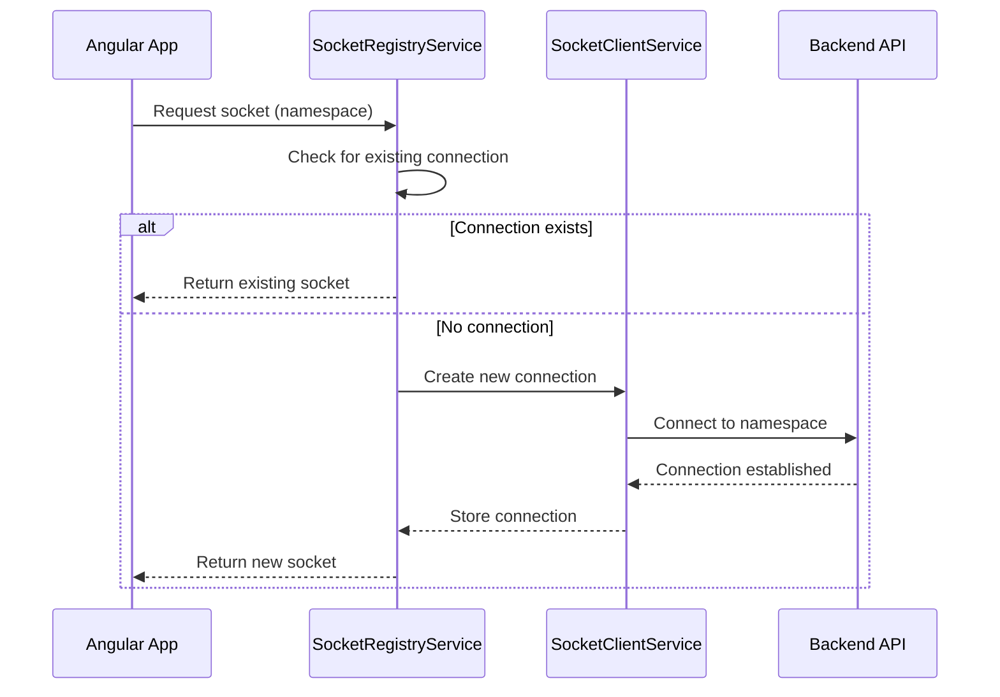

# ForgeBoard Socket Services Architecture

*Last Updated: August 15, 2025*

## Overview

ForgeBoard utilizes a structured Socket.IO service architecture to enable real-time communication between the client and server. This document outlines the initialization sequence, namespace configuration, and service activation patterns used throughout the application.

## Socket Service Initialization Types

ForgeBoard employs two primary methods of service initialization:

### 1. Initial Services (Loaded at Startup)

These services are initialized when the application loads, providing core functionality that must be available immediately.

| Service | Namespace | Purpose | Initialization |
|---------|-----------|---------|----------------|
| **Backend Status** | `/status` | Core system health monitoring | Immediate at app bootstrap |
| **Notifications** | `/notifications` | User alerts and system notices | Immediate at app bootstrap |
| **System Metrics** | `/metrics` | Basic performance telemetry | Immediate at app bootstrap |

### 2. Responsive Services (Loaded on Demand)

These services are initialized only when needed, conserving resources and bandwidth.

| Service | Namespace | Purpose | Initialization Trigger |
|---------|-----------|---------|------------------------|
| **Diagnostics** | `/diagnostics` | Detailed system diagnostics | When diagnostics panel is opened |
| **Authentication** | `/auth` | Token validation and auth flow | On login or token refresh |
| **Document Control** | `/documents` | Real-time document collaboration | When document workspace is opened |
| **Analytics** | `/analytics` | User behavior and performance metrics | When analytics views are accessed |

## Initialization Process



## Socket Namespace Connection Pattern

ForgeBoard uses a standardized pattern for connecting to socket namespaces:

```typescript
// CORRECT connection pattern
const baseUrl = environment.apiBaseUrl; // e.g. "http://localhost:3000"
const namespace = '/diagnostics';  // Note the leading slash

// Method 1: Include namespace in URL (RECOMMENDED)
const socketUrl = `${baseUrl}${namespace}`;
const socket = io(socketUrl, {
  path: '/socket.io',
  transports: ['websocket'],
  forceNew: true
});

// INCORRECT connection - namespace omitted from URL
// This will connect to the default namespace, not the diagnostics namespace!
const incorrectSocket = io(baseUrl, {
  path: '/socket.io',
  transports: ['websocket'],
  forceNew: true
});

// Method 2: Using the socket manager service
this.socketRegistry.getSocket(namespace);
```

## Service Registration Flow

1. **Service Registration**: Services register with the `SocketRegistryService` upon initialization
2. **Connection Tracking**: Registry maintains connection status and metadata
3. **Lifecycle Management**: Registry handles reconnection logic and cleanup
4. **Event Propagation**: Events are dispatched through service-specific observables

## Best Practices

1. **Always disconnect** sockets when components are destroyed
2. **Use the registry** instead of creating direct socket connections
3. **Listen for connection state** changes before emitting events
4. **Include proper error handling** for socket connection failures
5. **Log meaningful diagnostics** for connection issues

## Socket Namespace Implementation

When working with Socket.IO namespaces in ForgeBoard, it's important to properly implement the connection logic. There are several common patterns used across our services:

### Direct Connection (diagnostics.service.ts pattern)
```typescript
// API_URL is the base URL, e.g. "http://localhost:3000"
// NAMESPACE is the namespace string, e.g. "diagnostics"
const socketUrl = `${API_URL}/${NAMESPACE}`;
this.socket = io(socketUrl, { options });
```

### Using Socket Client Services
Our socket client services (modern-socket-client.service.ts, browser-socket-client.service.ts) use a buildUrl method:

```typescript
// Correct implementation in buildUrl method:
private buildUrl(namespace: string): string {
  const baseUrl = environment.apiBaseUrl || window.location.origin;
  
  // Ensure namespace starts with a /
  if (!namespace.startsWith('/')) {
    namespace = '/' + namespace;
  }
  
  // IMPORTANT: Return the complete URL with namespace
  return `${baseUrl}${namespace}`;
}
```

**WARNING:** Incorrect namespace handling is a common source of connection issues. Always ensure the namespace is properly appended to the base URL when establishing Socket.IO connections.

## Common Issues & Solutions

| Issue | Cause | Solution |
|-------|-------|----------|
| Connection Refused | Incorrect URL construction | Ensure proper separation of baseUrl and namespace |
| Socket Connected but No Events | Namespace not included in connection URL | Ensure namespace is appended to the base URL: `${baseUrl}${namespace}` |
| Duplicate Connections | Missing disconnection logic | Always disconnect in ngOnDestroy() |
| Event Not Received | Namespace mismatch | Verify namespace paths match exactly between client & server |
| Memory Leaks | Incomplete subscription cleanup | Use takeUntil pattern with destroy$ subject |

### Troubleshooting Namespace Connection Issues

If your socket connects but does not receive events or emit events to the server:

1. **Check your connection code**: The most common issue is connecting to the default namespace instead of the intended namespace
   ```typescript
   // INCORRECT ❌ - connects to default namespace
   this.socket = io(this.API_URL);
   
   // CORRECT ✅ - connects to specific namespace
   this.socket = io(`${this.API_URL}/${this.NAMESPACE}`);
   ```

2. **Verify server-side namespace registration**: Ensure the server has the namespace registered
   ```typescript
   // Server-side namespace registration example
   const diagnosticsNamespace = io.of('/diagnostics');
   ```

3. **Check browser network tab**: Look for connections to `/socket.io/?EIO=4&transport=websocket` and verify that the URL includes the correct namespace

## Health & Logger Services

These services should be configured to initialize at application startup to ensure system monitoring is continuous and uninterrupted. The logger service in particular should not be loaded on-demand as it may miss critical early application events.

```typescript
// Example of proper logger service initialization
@Injectable({
  providedIn: 'root'
})
export class LoggerService implements OnDestroy {
  constructor(private socketRegistry: SocketRegistryService) {
    // Initialize immediately upon service construction
    this.initializeSocket();
  }
}
```

## Security Considerations

All socket connections in ForgeBoard implement:

- Transport-layer encryption (TLS)
- Authentication via JWT tokens
- Namespace-specific access controls
- Rate limiting for event emissions
- Automatic disconnection after prolonged inactivity

---

*For more detailed information on socket implementation, refer to the API documentation and socket gateway source code.*
