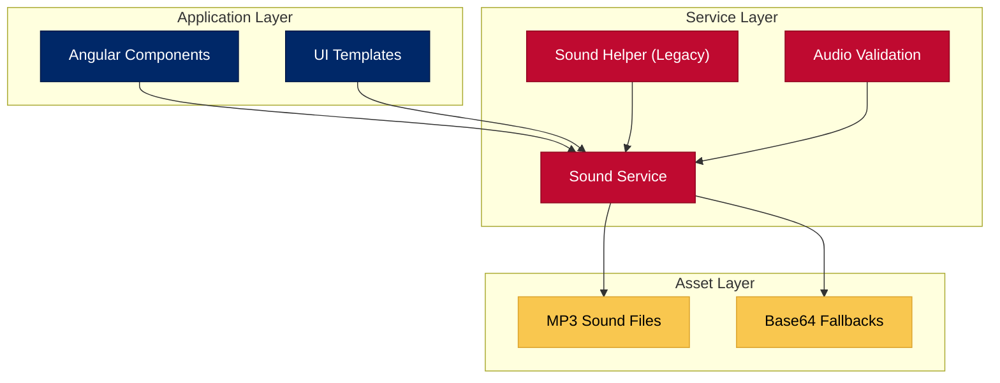

# <span style="color:#B22234; font-weight:bold; text-shadow: 0 0 1px rgba(0,0,0,0.2);">ForgeBoard NX</span> – <span style="color:#0C2677; font-weight:bold;">Sound System</span> 🔊
*Last Updated: May 13, 2025*

<div style="display: flex; flex-wrap: wrap; gap: 10px; margin-bottom: 20px;">
  <div style="background-color: #002868; color: white; padding: 8px 12px; border-radius: 6px; flex: 1; min-width: 150px; box-shadow: 0 2px 4px rgba(0,0,0,0.2);">
    <strong>Status:</strong> Active ✓
  </div>
  <div style="background-color: #BF0A30; color: white; padding: 8px 12px; border-radius: 6px; flex: 1; min-width: 150px; box-shadow: 0 2px 4px rgba(0,0,0,0.2);">
    <strong>Application:</strong> Frontend 🌐
  </div>
  <div style="background-color: #F9C74F; color: #333; padding: 8px 12px; border-radius: 6px; flex: 1; min-width: 150px; box-shadow: 0 2px 4px rgba(0,0,0,0.2);">
    <strong>Autoplay:</strong> User-triggered ✋
  </div>
  <div style="background-color: #90BE6D; color: #333; padding: 8px 12px; border-radius: 6px; flex: 1; min-width: 150px; box-shadow: 0 2px 4px rgba(0,0,0,0.2);">
    <strong>Fallbacks:</strong> Automated 🔄
  </div>
</div>

<div style="border-left: 5px solid #B22234; padding-left: 15px; margin: 20px 0; background-color: #F0F4FF; box-shadow: 0 2px 4px rgba(0,0,0,0.1);">
  The ForgeBoard Sound System provides typewriter-like interactive audio elements that enhance user experience while complying with modern browser autoplay policies. It handles validation, fallbacks, and playback management in a unified architecture.
</div>

## <span style="color:#0C2677; font-weight:bold;">1. System Architecture</span>

The Sound System consists of several integrated components:



## <span style="color:#0C2677; font-weight:bold;">2. Sound Files</span>

The system requires specific sound files located in `assets/sounds/typewriter/`:

<table style="border-collapse: collapse; width: 100%; border: 2px solid #0C2677; box-shadow: 0 2px 5px rgba(0,0,0,0.1);">
  <thead>
    <tr style="background-color: #0C2677; color: white;">
      <th style="border: 1px solid #071442; padding: 10px; font-weight: bold;">Filename</th>
      <th style="border: 1px solid #071442; padding: 10px; font-weight: bold;">Purpose</th>
      <th style="border: 1px solid #071442; padding: 10px; font-weight: bold;">Fallback</th>
    </tr>
  </thead>
  <tbody>
    <tr style="background-color: #F0F4FF;">
      <td style="border: 1px solid #AAB6D3; padding: 10px;"><b>keystrike.mp3</b></td>
      <td style="border: 1px solid #AAB6D3; padding: 10px;">
        Played when a character is typed during animations
      </td>
      <td style="border: 1px solid #AAB6D3; padding: 10px;">
        Silent MP3 created automatically
      </td>
    </tr>
    <tr style="background-color: #FFE8E8;">
      <td style="border: 1px solid #AAB6D3; padding: 10px;"><b>ding.mp3</b></td>
      <td style="border: 1px solid #AAB6D3; padding: 10px;">
        Played at the end of a typed line (terminal bell sound)
      </td>
      <td style="border: 1px solid #AAB6D3; padding: 10px;">
        Silent MP3 created automatically
      </td>
    </tr>
    <tr style="background-color: #F0F4FF;">
      <td style="border: 1px solid #AAB6D3; padding: 10px;"><b>return.mp3</b></td>
      <td style="border: 1px solid #AAB6D3; padding: 10px;">
        Played during carriage return actions
      </td>
      <td style="border: 1px solid #AAB6D3; padding: 10px;">
        Silent MP3 created automatically
      </td>
    </tr>
    <tr style="background-color: #FFE8E8;">
      <td style="border: 1px solid #AAB6D3; padding: 10px;"><b>ambient.mp3</b></td>
      <td style="border: 1px solid #AAB6D3; padding: 10px;">
        Optional background ambient sound
      </td>
      <td style="border: 1px solid #AAB6D3; padding: 10px;">
        Silent MP3 created automatically
      </td>
    </tr>
  </tbody>
</table>

## <span style="color:#0C2677; font-weight:bold;">3. Using the Sound Service</span>

### Initialization

Always initialize the sound system after a user interaction:

```typescript
// In a component that handles user interaction
@Component({...})
export class DashboardComponent {
  constructor(private soundService: SoundService) {}
  
  onUserInteraction(): void {
    // Initialize sounds after user click/interaction
    this.soundService.initialize().subscribe(
      success => console.log(`Sound system initialized: ${success}`)
    );
  }
}
```

### Playing Sounds

```typescript
// Play a sound with default volume
this.soundService.playSound(SoundType.KEYSTRIKE).subscribe();

// Play a sound with custom volume
this.soundService.playSound(SoundType.DING, 0.75).subscribe();
```

### Managing Sound Settings

```typescript
// Toggle sounds on/off
this.soundService.setEnabled(true);

// Adjust volume (0-1)
this.soundService.setVolume(0.5);

// Mute/unmute
this.soundService.setMuted(false);

// Get current settings
this.soundService.getSettings().subscribe(
  settings => console.log('Sound settings:', settings)
);
```

## <span style="color:#0C2677; font-weight:bold;">4. Validation and Fallbacks</span>

The Sound System automatically validates sound files and creates fallbacks when needed:

```mermaid
flowchart LR
    Start(["Initialize"]) --> CheckFiles{"Check Files\nExist?"}
    CheckFiles -->|Yes| LoadFiles["Load Sound Files"]
    CheckFiles -->|No| CreateFallback["Create Silent Fallbacks"]
    CreateFallback --> LoadFiles
    LoadFiles --> TestPlay{"Can\nAutoplay?"}
    TestPlay -->|Yes| Ready["System Ready"]
    TestPlay -->|No| WaitForUser["Wait For User\nInteraction"]
    WaitForUser --> Ready
    
    classDef start fill:#002868,stroke:#001845,color:white;
    classDef process fill:#F0F4FF,stroke:#AAB6D3,color:#333;
    classDef decision fill:#BF0A30,stroke:#8F061F,color:white;
    classDef end fill:#90BE6D,stroke:#6D9951,color:black;
    
    class Start start;
    class LoadFiles,CreateFallback,WaitForUser process;
    class CheckFiles,TestPlay decision;
    class Ready end;
```

## <span style="color:#0C2677; font-weight:bold;">5. Obtaining Sound Files</span>

You have two options for obtaining sound files:

<div style="display: flex; flex-wrap: wrap; justify-content: space-between; margin: 20px 0;">
  <div style="background-color: #002868; color: white; padding: 10px; margin: 5px; border-radius: 5px; width: 48%; text-align: center; font-weight: bold; box-shadow: 0 2px 4px rgba(0,0,0,0.2);">1. <b>Automatic Download</b><br><small>Run the download script to obtain typewiter sounds from Freesound.org</small></div>
  <div style="background-color: #BF0A30; color: white; padding: 10px; margin: 5px; border-radius: 5px; width: 48%; text-align: center; font-weight: bold; box-shadow: 0 2px 4px rgba(0,0,0,0.2);">2. <b>Manual Download</b><br><small>Create your own MP3 files and place them in the assets directory</small></div>
</div>

### Automatic Download

```bash
# Run from the project root
node src/assets/sounds/download-sounds.js
```

This requires a Freesound API key in your .env file: `FREESOUND_API_KEY=your_key_here`

## <span style="color:#0C2677; font-weight:bold;">6. Legacy Support</span>

For backward compatibility, the system includes legacy services that adapt to the new architecture:

- `AudioValidationService` - Legacy adapter for the new SoundService
- `SoundHelperService` - Legacy adapter for the new SoundService

These services maintain the same API as their predecessors but delegate to the unified SoundService.

## <span style="color:#0C2677; font-weight:bold;">7. Best Practices</span>

<table style="border-collapse: collapse; width: 100%; border: 2px solid #0C2677; box-shadow: 0 2px 5px rgba(0,0,0,0.1);">
  <thead>
    <tr style="background-color: #0C2677; color: white;">
      <th style="border: 1px solid #071442; padding: 10px; font-weight: bold;">Practice</th>
      <th style="border: 1px solid #071442; padding: 10px; font-weight: bold;">Implementation</th>
    </tr>
  </thead>
  <tbody>
    <tr style="background-color: #F0F4FF;">
      <td style="border: 1px solid #AAB6D3; padding: 10px;"><b>Initialize After User Interaction</b></td>
      <td style="border: 1px solid #AAB6D3; padding: 10px;">
        Always initialize the sound system after a user click or other interaction to comply with browser autoplay policies.
      </td>
    </tr>
    <tr style="background-color: #FFE8E8;">
      <td style="border: 1px solid #AAB6D3; padding: 10px;"><b>Handle Initialization Failures</b></td>
      <td style="border: 1px solid #AAB6D3; padding: 10px;">
        Subscribe to initialization observables and provide fallback behaviors for environments where sound is unavailable.
      </td>
    </tr>
    <tr style="background-color: #F0F4FF;">
      <td style="border: 1px solid #AAB6D3; padding: 10px;"><b>Respect User Preferences</b></td>
      <td style="border: 1px solid #AAB6D3; padding: 10px;">
        Always provide UI controls for users to mute sounds and adjust volume. Store these preferences.
      </td>
    </tr>
    <tr style="background-color: #FFE8E8;">
      <td style="border: 1px solid #AAB6D3; padding: 10px;"><b>Use Appropriate Volume Levels</b></td>
      <td style="border: 1px solid #AAB6D3; padding: 10px;">
        Keep sound effects at moderate volume levels (0.3-0.7) to avoid disrupting the user experience.
      </td>
    </tr>
  </tbody>
</table>

## <span style="color:#0C2677; font-weight:bold;">8. Testing</span>

The sound system includes E2E tests to verify functionality:

```bash
npx nx e2e forgeboard-frontend-e2e --test-file=sound-system.spec.ts
```

This test:
1. Checks for all required sound files
2. Creates fallbacks if needed
3. Verifies audio elements exist in the DOM
4. Updates database records of sound usage

<div style="text-align: center; margin: 30px 0; font-size: 20px; color: #0C2677; font-weight: bold; border-top: 2px solid #B22234; border-bottom: 2px solid #B22234; padding: 15px; background-color: #F8FAFF; box-shadow: 0 2px 4px rgba(0,0,0,0.08);">
ForgeBoard NX – Enhancing user experience through immersive audio
</div>

*ForgeBoard NX — Own your data. Guard your freedom. Build Legendary.* 🦅✨
