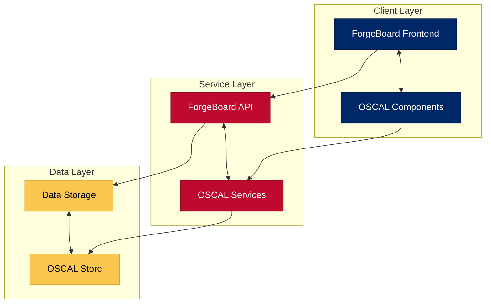
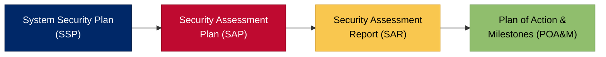
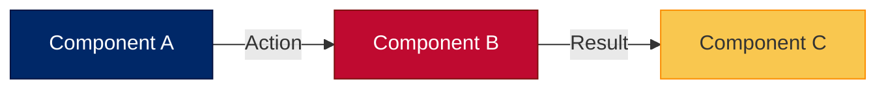

# 🎨 ForgeBoard NX: Visual Standards & Documentation Guide
*Last Updated: May 7, 2025*

<div style="display: flex; flex-wrap: wrap; gap: 10px; margin-bottom: 20px;">
  <div style="background-color: #002868; color: white; padding: 8px 12px; border-radius: 6px; flex: 1; min-width: 150px; box-shadow: 0 2px 4px rgba(0,0,0,0.2);">
    <strong>Status:</strong> Mandatory ✓
  </div>
  <div style="background-color: #BF0A30; color: white; padding: 8px 12px; border-radius: 6px; flex: 1; min-width: 150px; box-shadow: 0 2px 4px rgba(0,0,0,0.2);">
    <strong>Application:</strong> All Documentation 📄
  </div>
  <div style="background-color: #F9C74F; color: #333; padding: 8px 12px; border-radius: 6px; flex: 1; min-width: 150px; box-shadow: 0 2px 4px rgba(0,0,0,0.2);">
    <strong>Theme:</strong> Patriotic Colors 🇺🇸
  </div>
  <div style="background-color: #90BE6D; color: #333; padding: 8px 12px; border-radius: 6px; flex: 1; min-width: 150px; box-shadow: 0 2px 4px rgba(0,0,0,0.2);">
    <strong>Graphics:</strong> Required 📊
  </div>
</div>

## 1. Patriotic Color System

Our documentation follows a consistent, patriotic color palette that symbolizes ForgeBoard's commitment to data sovereignty and American values.

### Primary Colors

```css
:root {
  /* Primary Colors */
  --primary-blue: #002868;    /* Deep blue representing data sovereignty */
  --primary-red: #BF0A30;     /* Vibrant red for blockchain immutability */
  --primary-white: #FFFFFF;   /* Clean white for interface clarity */
  
  /* Accent Colors */
  --accent-gold: #F9C74F;     /* Gold for highlighting important actions */
  --accent-green: #90BE6D;    /* Victory green for success states */
  
  /* Status Colors */
  --status-success: var(--accent-green);
  --status-warning: var(--accent-gold);
  --status-error: var(--primary-red);
  --status-info: var(--primary-blue);
}
```

### Color Usage Guidelines

<table style="border-collapse: collapse; width: 100%; border: 2px solid #0C2677; box-shadow: 0 2px 5px rgba(0,0,0,0.1);">
  <thead>
    <tr style="background-color: #0C2677; color: white;">
      <th style="border: 1px solid #071442; padding: 10px; font-weight: bold;">Color</th>
      <th style="border: 1px solid #071442; padding: 10px; font-weight: bold;">Usage</th>
      <th style="border: 1px solid #071442; padding: 10px; font-weight: bold;">Example</th>
    </tr>
  </thead>
  <tbody>
    <tr style="background-color: #F0F4FF;">
      <td style="border: 1px solid #AAB6D3; padding: 10px;"><b>Deep Blue</b></td>
      <td style="border: 1px solid #AAB6D3; padding: 10px;">
        • Primary headers<br>
        • Section backgrounds<br>
        • Key metrics<br>
        • Smart components
      </td>
      <td style="border: 1px solid #AAB6D3; padding: 10px;">
        <div style="background-color: #002868; color: white; padding: 5px; text-align: center; border-radius: 4px;">Header Text</div>
      </td>
    </tr>
    <tr style="background-color: #FFE8E8;">
      <td style="border: 1px solid #AAB6D3; padding: 10px;"><b>Vibrant Red</b></td>
      <td style="border: 1px solid #AAB6D3; padding: 10px;">
        • Security elements<br>
        • Critical sections<br>
        • Blockchain components<br>
        • Warnings
      </td>
      <td style="border: 1px solid #AAB6D3; padding: 10px;">
        <div style="background-color: #BF0A30; color: white; padding: 5px; text-align: center; border-radius: 4px;">Security Notice</div>
      </td>
    </tr>
    <tr style="background-color: #F0F4FF;">
      <td style="border: 1px solid #AAB6D3; padding: 10px;"><b>White</b></td>
      <td style="border: 1px solid #AAB6D3; padding: 10px;">
        • Background content<br>
        • Container elements<br>
        • Text on dark backgrounds
      </td>
      <td style="border: 1px solid #AAB6D3; padding: 10px;">
        <div style="background-color: #FFFFFF; color: #002868; padding: 5px; text-align: center; border-radius: 4px; border: 1px solid #002868;">Content Panel</div>
      </td>
    </tr>
    <tr style="background-color: #FFE8E8;">
      <td style="border: 1px solid #AAB6D3; padding: 10px;"><b>Gold</b></td>
      <td style="border: 1px solid #AAB6D3; padding: 10px;">
        • Important highlights<br>
        • Metrics & statistics<br>
        • Secondary elements<br>
        • Caution notices
      </td>
      <td style="border: 1px solid #AAB6D3; padding: 10px;">
        <div style="background-color: #F9C74F; color: #333; padding: 5px; text-align: center; border-radius: 4px;">Important Note</div>
      </td>
    </tr>
    <tr style="background-color: #F0F4FF;">
      <td style="border: 1px solid #AAB6D3; padding: 10px;"><b>Green</b></td>
      <td style="border: 1px solid #AAB6D3; padding: 10px;">
        • Success messages<br>
        • Completion status<br>
        • Positive metrics<br>
        • Service status
      </td>
      <td style="border: 1px solid #AAB6D3; padding: 10px;">
        <div style="background-color: #90BE6D; color: #333; padding: 5px; text-align: center; border-radius: 4px;">Completed ✓</div>
      </td>
    </tr>
  </tbody>
</table>

## 2. Document Structure

All ForgeBoard documentation should follow this consistent structure:

### Header Format

```markdown
# <span style="color:#B22234; font-weight:bold; text-shadow: 0 0 1px rgba(0,0,0,0.2);">ForgeBoard NX</span> – <span style="color:#0C2677; font-weight:bold;">[Document Title]</span> [Emoji]
*Last Updated: [Date]*

<div style="display: flex; flex-wrap: wrap; gap: 10px; margin-bottom: 20px;">
  <!-- Status cards go here -->
</div>


```

### Status Cards

Every document should include 2-4 status cards showing relevant metrics, status, or key information:

```html
<div style="background-color: #002868; color: white; padding: 8px 12px; border-radius: 6px; flex: 1; min-width: 150px; box-shadow: 0 2px 4px rgba(0,0,0,0.2);">
  <strong>Label:</strong> Value ✓
</div>
```

### Introduction Block

```html
<div style="border-left: 5px solid #B22234; padding-left: 15px; margin: 20px 0; background-color: #F0F4FF; box-shadow: 0 2px 4px rgba(0,0,0,0.1);">
  Brief introduction paragraph explaining the document's purpose and significance.
</div>
```

### Section Headers

Use colored section headers to improve visual organization:

```markdown
## <span style="color:#B22234; font-weight:bold;">1. Red Section Title</span>
## <span style="color:#0C2677; font-weight:bold;">2. Blue Section Title</span>
## <span style="color:#FFFFFF; background-color:#B22234; padding: 2px 5px; font-weight: bold; box-shadow: 0 1px 3px rgba(0,0,0,0.2);">3. White on Red Section Title</span>
```

### Footer

End each document with a centered divider:

```html
<div style="text-align: center; margin: 30px 0; font-size: 20px; color: #0C2677; font-weight: bold; border-top: 2px solid #B22234; border-bottom: 2px solid #B22234; padding: 15px; background-color: #F8FAFF; box-shadow: 0 2px 4px rgba(0,0,0,0.08);">
ForgeBoard NX – [Short tagline related to document]
</div>
```

## 3. Required Graphical Elements

Every substantial document must include at least two types of visual elements:

### Modern Architecture Diagrams

Replace all ASCII art diagrams with Mermaid.js diagrams for better readability and visual appeal. ASCII art may appear accessible, but it's difficult to maintain and often renders inconsistently across platforms.

**❌ Not Acceptable - ASCII Art:**

```
┌───────────────────────┐      ┌────────────────────┐
│                       │      │                    │
│  ForgeBoard Frontend  │◄────►│  OSCAL Components  │
│                       │      │                    │
└───────────┬───────────┘      └────────────────────┘
            │                          ▲
            │                          │
            ▼                          │
```

**✅ Required - Mermaid Diagrams:**



### Visualizing Complex Relationships

Use Mermaid for visualizing workflow relationships:



### Mermaid Diagrams

Use Mermaid.js for flowcharts, sequence diagrams, gantt charts, and more:

```markdown

```

### Tables

Format tables with alternating row colors and themed headers:

```markdown
<table style="border-collapse: collapse; width: 100%; border: 2px solid #0C2677; box-shadow: 0 2px 5px rgba(0,0,0,0.1);">
  <thead>
    <tr style="background-color: #0C2677; color: white;">
      <th style="border: 1px solid #071442; padding: 10px; font-weight: bold;">Header 1</th>
      <th style="border: 1px solid #071442; padding: 10px; font-weight: bold;">Header 2</th>
    </tr>
  </thead>
  <tbody>
    <tr style="background-color: #F0F4FF;">
      <td style="border: 1px solid #AAB6D3; padding: 10px;">Row 1, Cell 1</td>
      <td style="border: 1px solid #AAB6D3; padding: 10px;">Row 1, Cell 2</td>
    </tr>
    <tr style="background-color: #FFE8E8;">
      <td style="border: 1px solid #AAB6D3; padding: 10px;">Row 2, Cell 1</td>
      <td style="border: 1px solid #AAB6D3; padding: 10px;">Row 2, Cell 2</td>
    </tr>
  </tbody>
</table>
```

## 4. Code Examples

Format code blocks with syntax highlighting and always include relevant comments:

```markdown
```typescript
// Example of the highly structured ForgeBoard NX pattern
@Injectable({
  providedIn: 'root'
})
export class SecurityService {
  // Using BehaviorSubject for state with current value
  private securityStateSubject = new BehaviorSubject<SecurityState>(initialState);
  public securityState$ = this.securityStateSubject.asObservable();
  
  // Always include proper error handling and logging
  verifyAccess(resource: string): Observable<boolean> {
    return this.http.get<AccessResponse>(`/api/access/${resource}`).pipe(
      map(response => response.granted),
      catchError(error => {
        this.loggerService.error('Access verification failed', error);
        return of(false); // Fail closed for security
      })
    );
  }
}
```
```

## 5. Badges and Shields

Include relevant badges at the top of each document:

```markdown


```

## 6. Slogan

End documents with our standard tagline:

```markdown
*ForgeBoard NX — Own your data. Guard your freedom. Build Legendary.* 🦅✨
```

## 7. Document Review Process

Each document undergoes mandatory review to ensure alignment with these standards:

1. **Technical Review**: Ensures technical accuracy of content
2. **Visual Standard Review**: Confirms compliance with this visual guide
3. **FedRAMP Alignment**: Checks compliance with FedRAMP requirements where applicable
4. **Accessibility Review**: Verifies that markup will render accessibly

## 8. Inclusive Documentation Standards

<div style="border-left: 5px solid #BF0A30; padding-left: 15px; margin: 20px 0; background-color: #F0F4FF; box-shadow: 0 2px 4px rgba(0,0,0,0.1);">
<span style="color:#0C2677; font-weight:bold; font-size: 110%;">Core Principle</span><br>
Every person reading our documentation has an investment in this project and has the right to understand these complex topics. We can achieve this together – None of us is as good as all of us.
</div>

### Accessibility and Inclusivity Guidelines

ForgeBoard documentation must be:

<table style="border-collapse: collapse; width: 100%; border: 2px solid #0C2677; box-shadow: 0 2px 5px rgba(0,0,0,0.1);">
  <thead>
    <tr style="background-color: #0C2677; color: white;">
      <th style="border: 1px solid #071442; padding: 10px; font-weight: bold;">Principle</th>
      <th style="border: 1px solid #071442; padding: 10px; font-weight: bold;">Implementation</th>
    </tr>
  </thead>
  <tbody>
    <tr style="background-color: #F0F4FF;">
      <td style="border: 1px solid #AAB6D3; padding: 10px;"><b>Accessible to All</b></td>
      <td style="border: 1px solid #AAB6D3; padding: 10px;">
        • Avoid jargon without explanation<br>
        • Provide glossary entries for complex terms<br>
        • Include visual aids for complex concepts<br>
        • Structure content with clear hierarchical organization
      </td>
    </tr>
    <tr style="background-color: #FFE8E8;">
      <td style="border: 1px solid #AAB6D3; padding: 10px;"><b>Respectful of Different Knowledge Levels</b></td>
      <td style="border: 1px solid #AAB6D3; padding: 10px;">
        • Layer information from basic to advanced<br>
        • Provide contextual links to foundational concepts<br>
        • Avoid assuming prior knowledge without references<br>
        • Include both high-level overviews and detailed explanations
      </td>
    </tr>
    <tr style="background-color: #F0F4FF;">
      <td style="border: 1px solid #AAB6D3; padding: 10px;"><b>Collaborative</b></td>
      <td style="border: 1px solid #AAB6D3; padding: 10px;">
        • Include contribution guidelines in documentation<br>
        • Acknowledge that understanding improves through diverse perspectives<br>
        • Encourage questions and feedback<br>
        • Regular peer review processes
      </td>
    </tr>
    <tr style="background-color: #FFE8E8;">
      <td style="border: 1px solid #AAB6D3; padding: 10px;"><b>Empowering</b></td>
      <td style="border: 1px solid #AAB6D3; padding: 10px;">
        • Focus on "why" not just "how"<br>
        • Provide learning paths for different roles<br>
        • Include examples that demonstrate practical application<br>
        • Celebrate incremental understanding
      </td>
    </tr>
  </tbody>
</table>

### Visual Literacy

Complex topics often require visual representations to be fully understood:

<div style="display: flex; flex-wrap: wrap; justify-content: space-between; margin: 20px 0;">
  <div style="background-color: #002868; color: white; padding: 10px; margin: 5px; border-radius: 5px; width: 23%; text-align: center; font-weight: bold; box-shadow: 0 2px 4px rgba(0,0,0,0.2);">1. <b>Start Simple</b><br><small>Begin with high-level concepts</small></div>
  <div style="background-color: #BF0A30; color: white; padding: 10px; margin: 5px; border-radius: 5px; width: 23%; text-align: center; font-weight: bold; box-shadow: 0 2px 4px rgba(0,0,0,0.2);">2. <b>Add Context</b><br><small>Show relationships</small></div>
  <div style="background-color: #F9C74F; color: #333; padding: 10px; margin: 5px; border-radius: 5px; width: 23%; text-align: center; font-weight: bold; box-shadow: 0 2px 4px rgba(0,0,0,0.2);">3. <b>Layer Detail</b><br><small>Progressive disclosure</small></div>
  <div style="background-color: #90BE6D; color: #333; padding: 10px; margin: 5px; border-radius: 5px; width: 23%; text-align: center; font-weight: bold; box-shadow: 0 2px 4px rgba(0,0,0,0.2);">4. <b>Provide Examples</b><br><small>Real-world application</small></div>
</div>

## Summary

Our stringent documentation standards ensure that ForgeBoard NX presents a consistent, professional, and patriotic image that reflects our commitment to data sovereignty and security. These standards aren't optional—they're an essential part of our mission to deliver secure, compliant, and visually distinctive documentation that stands out in the federal space.

<div style="text-align: center; margin: 30px 0; font-size: 20px; color: #0C2677; font-weight: bold; border-top: 2px solid #B22234; border-bottom: 2px solid #B22234; padding: 15px; background-color: #F8FAFF; box-shadow: 0 2px 4px rgba(0,0,0,0.08);">
ForgeBoard NX – Setting the standard for federal documentation excellence
</div>

*ForgeBoard NX — Own your data. Guard your freedom. Build Legendary.* 🦅✨
