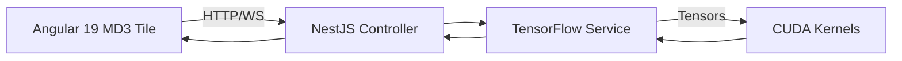

<!-- @Copilot
Project: True North Insights / ForgeBoard NX monorepo
Stack: Angular 19 + Material Design 3 front‑end · NestJS backend · Node 18 LTS
ML Runtime: TensorFlow (tfjs‑node + tfjs‑node‑gpu) · CUDA 12.9
Goal: Provide dev & prod GPU/CPU deployment guide with patriotic‑styled docs.
Render with Marked.
-->

# 🛠️ Accelerating NestJS with TensorFlow GPU

> **Workspace context:** NX 20.x · Node 18.19 LTS · Fedora 40 host (prod) & Windows 11 CUDA dev box (RTX).  
> **Theme:** Patriotic, vibrant, data‑driven.  All charts follow the ForgeBoard documentation style.

---

## 🚩 Deployment Strategies at a Glance

| Option | Host | Package | Speed | Complexity | When to use |
|--------|------|---------|-------|------------|-------------|
| **CPU‑only (fallback)** | Existing Fedora x86 DigitalOcean droplet | `@tensorflow/tfjs-node` | 🐢 | ★☆☆ | Low traffic, simplest FedRAMP paperwork |
| **DO GPU droplet** | `gpu-rtx4000-ada-8gb` (or bigger) | `@tensorflow/tfjs-node-gpu` | ⚡⚡⚡ | ★★☆ | Medium/high TPS, keep everything in DO |
| **Hybrid micro‑service** | Fedora API + separate GPU node (DO or on‑prem) | Both pkgs as needed | ⚡⚡ | ★★★ | Bursty loads, FedRAMP on‑prem GPU |

---

### 🏗️ Step‑by‑Step (choose your path)

#### 1  Prerequisites (dev *and* GPU prod)

```bash
# Windows dev box (already done)
CUDA 12.9 Toolkit + Driver
VS2022 Build Tools + Python 3.12

# Fedora GPU droplet
sudo dnf install nvidia-driver --enablerepo=rpmfusion-nonfree
sudo rpm -i cuda-repo-fedora40-12-9-local.rpm
sudo dnf -y install cuda-runtime-12-9 nvidia-container-toolkit
```

#### 2  Package install

```bash
pnpm add -w @tensorflow/tfjs-node          # CPU build
pnpm add -w @tensorflow/tfjs-node-gpu      # GPU build
```

#### 3  Runtime selection

```ts
// apps/backend/src/gpu/tf.provider.ts
function loadTF() {
  try {
    if (process.env.USE_GPU === 'true') {
      console.log('⚡ TensorFlow GPU enabled');
      return require('@tensorflow/tfjs-node-gpu');
    }
  } catch { /* fall back */ }
  console.log('🐢 Using CPU TensorFlow');
  return require('@tensorflow/tfjs-node');
}
```

*Set `USE_GPU=true` in dev or GPU hosts; leave unset on CPU hosts.*

#### 4  Dockerfile for GPU droplet

```dockerfile
FROM nvidia/cuda:12.9.0-base-ubi8
WORKDIR /app
COPY package*.json ./
RUN npm ci --omit=dev
COPY . .
ENV USE_GPU=true
CMD ["node","dist/main.js"]
```

Launch with: `docker run --gpus all -p 3000:3000 tni/nest-gpu-api`

---

## ✋ Five Concrete Use Cases

| # | Use Case | NestJS Scope | Front‑End Impact |
|---|----------|--------------|------------------|
| 1 | **Real‑time Product Recommendations** | `GET /recommendations` → matrix‑factorization model | MD3 carousel refresh |
| 2 | **Blockchain Fraud Detection** | LSTM anomaly model on `/tx-monitor` WebSocket | Red snackbar & logger entry |
| 3 | **Predictive Metrics** | GRU time‑series forecast on `/metrics/predict` | Line chart with forecast band |
| 4 | **LLM LoRA Fine‑Tune** | `POST /ai/finetune` job runner | Progress bar, then code‑completion |
| 5 | **Image Quality Control** | MobileNet‑V3 label checker `/vision/label-scan` | PASS/FAIL badge, re‑queue failed |

---

## 📊 GPU Demand Snapshot


*LLM fine‑tune is the hog; others are mid‑range.*

---

## 🗂️ Directory Layout Snippet

```text
apps/backend/src/gpu/
  tf.provider.ts
  use-cases/
    recommendations.service.ts
    fraud.service.ts
    metrics.service.ts
    finetune.service.ts
    vision.service.ts
```

---

## 🔄 Request → GPU → Angular Flow



---

## 📋 Next Steps

1. **Merge this module** into `apps/backend` and run the smoke test.  
2. **Parameterize** batch sizes & model paths in Nx environment files.  
3. **FedRAMP docs** – list `nvidia-driver`, `cuda-runtime` RPMs in OSCAL.  
4. **Load‑test** `/metrics/predict` with k6 on both CPU and GPU hosts to pick the best cost/perf mix.

> **Freedom through code, transparency through TensorFlow.** 🇺🇸

---

**© 2025 True North Insights · “We are legendary.”**
