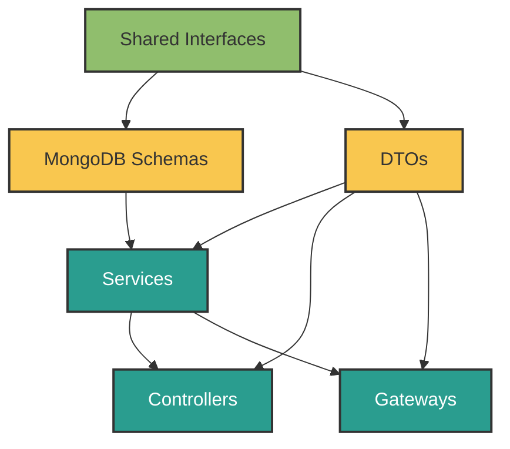

# ForgeBoard: Architecture Guide

*Last Updated: May 19, 2025*

  

    <strong>Category:</strong> Core Architecture
  

  

    <strong>Status:</strong> Production Ready
  

---

## Overview

ForgeBoard's architecture is designed for security, scalability, and maintainability. It leverages a strongly-typed, event-driven, and modular approach, with clear boundaries between services, gateways, controllers, and data models. The system is built to meet federal compliance standards and modern enterprise needs.

## Key Principles
- **Type-First Development**: All data structures and contracts are defined in shared interface libraries.
- **Domain Boundaries**: Each feature has its own interfaces, DTOs, and schemas.
- **Unidirectional Data Flow**: Prevents circular dependencies and infinite loops.
- **Separation of Concerns**: Each component has a single responsibility.
- **Event-Driven Communication**: Services communicate via events, not direct calls.
- **Security by Design**: All layers are designed with security and compliance in mind.

## Architecture Diagram

## Implementation Patterns
- **Shared Interfaces**: Define all data contracts in a shared library.
- **MongoDB Schemas**: Implement interfaces in schemas for data validation.
- **DTOs**: Use for input validation and API contracts.
- **Services**: Handle business logic and data access, return observables.
- **Gateways**: Manage real-time communication (WebSockets).
- **Controllers**: Expose REST APIs.

## Best Practices
- Use RxJS for all async flows.
- Enforce linting and code reviews.
- Document all public APIs and modules.
- Use event-based communication for loose coupling.
- Always validate and sanitize input.

## Related Documents
- [Comprehensive Service Architecture](COMPREHENSIVE-SERVICE-ARCHITECTURE.md)
- [Frontend-API Architecture](../FRONTEND-API-ARCHITECTURE.md)
- [Gateway Architecture](../GATEWAY-ARCHITECTURE.md)
- [Database Guide](../DATABASE.md)

---

*This document combines all core architecture requirements and patterns for ForgeBoard. For details, see the referenced files in this directory and subdirectories. All previous top-level architecture files have been merged here for clarity and maintainability.*
