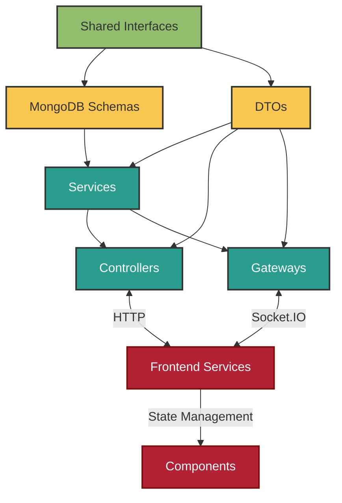
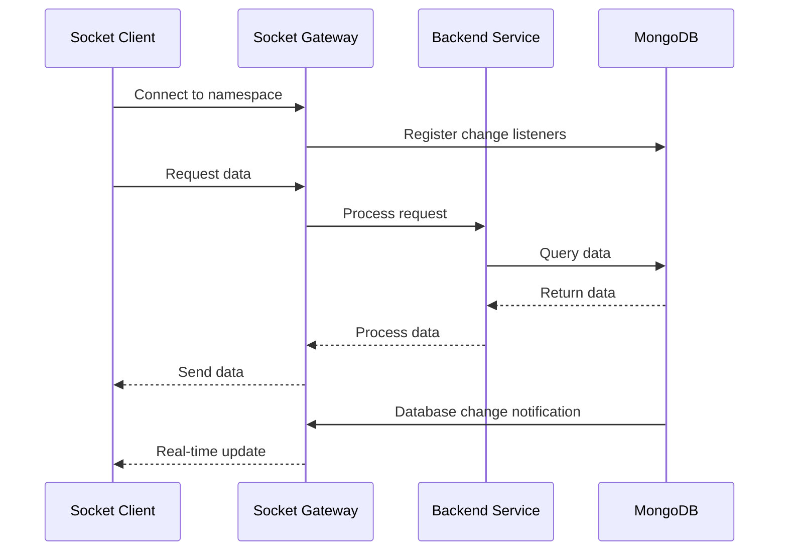

#  ForgeBoard: Comprehensive Service Architecture Guide

<div style="background: linear-gradient(90deg, #002868 0%, #BF0A30 100%); height: 8px; margin-bottom: 20px;"></div>

*A product of True North Insights, a division of True North*

*Last Updated: May 19, 2025*

<div style="display: flex; flex-wrap: wrap; gap: 10px; margin-bottom: 20px;">
  <div style="background-color: #002868; color: white; padding: 8px 12px; border-radius: 6px; flex: 1; min-width: 150px; box-shadow: 0 2px 4px rgba(0,0,0,0.2);">
    <strong>Category:</strong> Architecture Pattern
  </div>
  <div style="background-color: #BF0A30; color: white; padding: 8px 12px; border-radius: 6px; flex: 1; min-width: 150px; box-shadow: 0 2px 4px rgba(0,0,0,0.2);">
    <strong>Status:</strong> Production Ready
  </div>
  <div style="background-color: #F9C74F; color: #333; padding: 8px 12px; border-radius: 6px; flex: 1; min-width: 150px; box-shadow: 0 2px 4px rgba(0,0,0,0.2);">
    <strong>Complexity:</strong> Medium
  </div>
  <div style="background-color: #90BE6D; color: #333; padding: 8px 12px; border-radius: 6px; flex: 1; min-width: 150px; box-shadow: 0 2px 4px rgba(0,0,0,0.2);">
    <strong>FedRAMP:</strong> Compliant
  </div>
</div>

<div style="border-left: 5px solid #B22234; padding-left: 15px; margin: 20px 0; background-color: #F0F4FF; box-shadow: 0 2px 4px rgba(0,0,0,0.1);">
This comprehensive guide outlines the strongly-typed architecture patterns for implementing services, gateways, controllers, and reactive programming in the ForgeBoard ecosystem. These patterns ensure type safety across the entire application stack, provide efficient real-time communication, prevent common pitfalls like infinite loops, and promote loose coupling between system components.
</div>

## 📋 Table of Contents

1. [Architecture Overview](#architecture-overview)
2. [Type-First Development Approach](#type-first-development-approach)
3. [Socket Service Architecture](#socket-service-architecture)
   - [Socket Service Initialization Types](#socket-service-initialization-types)
   - [Initialization Process](#initialization-process)
   - [Socket Namespace Connection Pattern](#socket-namespace-connection-pattern)
   - [Service Registration Flow](#service-registration-flow)
4. [Component Implementation Guide](#component-implementation-guide)
   - [Shared Interfaces](#shared-interfaces)
   - [MongoDB Schemas](#mongodb-schemas)
   - [DTOs (Data Transfer Objects)](#dtos-data-transfer-objects)
   - [Services Implementation](#services-implementation)
   - [Gateways Implementation](#gateways-implementation)
   - [Controllers Implementation](#controllers-implementation)
5. [RxJS & Reactive Programming Best Practices](#rxjs--reactive-programming-best-practices)
   - [Common Anti-Patterns to Avoid](#common-anti-patterns-to-avoid)
   - [Best Practices for Service-Gateway-Controller Architecture](#best-practices-for-service-gateway-controller-architecture)
   - [Data Flow Patterns](#data-flow-patterns)
   - [Performance Optimization](#performance-optimization)
   - [Memory Management](#memory-management)
6. [Prevention of Infinite Loops](#prevention-of-infinite-loops)
7. [Security Considerations](#security-considerations)
8. [Database Integration](#database-integration)
9. [Common Issues & Solutions](#common-issues--solutions)
10. [Testing Strategy](#testing-strategy)
11. [Implementation Examples](#implementation-examples)

## Architecture Overview

The ForgeBoard architecture is built on several key principles that ensure type safety, performance, and maintainability:

1. **Type-First Development**: All data structures and communication contracts are defined in shared interface libraries.
2. **Clear Domain Boundaries**: Each feature has well-defined domains with their own interfaces, DTOs, and schemas.
3. **Unidirectional Data Flow**: Data flows in one direction to prevent circular dependencies and infinite loops.
4. **Separation of Concerns**: Each component has a single responsibility within the system.
5. **Reactive Programming**: The system uses RxJS to handle asynchronous operations and event streams efficiently.
6. **Real-Time Communication**: Socket.IO is used for real-time, bidirectional communication between client and server.



## Type-First Development Approach

The foundation of this architecture is the "Type-First" development approach:

1. **Define Shared Interfaces**: Create domain-specific interfaces in the shared library that define the structure and behavior of all data.
2. **Generate Type Definitions**: Ensure these interfaces are properly exported from the shared libraries.
3. **Reference Instead of Redefine**: Always import types from shared libraries; never redefine them locally.

### Benefits:

- **Single Source of Truth**: Types are defined once and used everywhere
- **Type Safety**: TypeScript compiler catches inconsistencies early
- **IDE Support**: Excellent tooling support with autocomplete and error detection
- **Documentation**: Types serve as self-documenting code

## Socket Service Architecture

ForgeBoard utilizes a structured Socket.IO service architecture to enable real-time communication between the client and server.

## 🔌 Socket.IO Architecture & Troubleshooting (Unified Guide)

> **Note:** All socket service patterns, namespace usage, and troubleshooting are now documented in this section. For legacy or minor socket docs, see this file.

### Socket Service Initialization Types

ForgeBoard employs two primary methods of service initialization:

| Service | Namespace | Purpose | Initialization |
|---------|-----------|---------|----------------|
| **Backend Status** | `/status` | Core system health monitoring | Immediate at app bootstrap |
| **Notifications** | `/notifications` | User alerts and system notices | Immediate at app bootstrap |
| **System Metrics** | `/metrics` | Basic performance telemetry | Immediate at app bootstrap |
| **Diagnostics** | `/diagnostics` | Detailed system diagnostics | On demand |
| **Authentication** | `/auth` | Token validation and auth flow | On login or token refresh |
| **Document Control** | `/documents` | Real-time document collaboration | On workspace open |
| **Analytics** | `/analytics` | User behavior and performance metrics | On analytics view |

### Initialization & Connection Patterns

- Use the `SocketRegistryService` to manage all socket connections.
- Always append the namespace to the base URL: `${baseUrl}${namespace}`.
- Disconnect sockets in `ngOnDestroy` to avoid leaks.
- Listen for connection state changes before emitting events.
- Use proper error handling and log diagnostics for connection issues.

#### Example (Angular):
```typescript
const socketUrl = `${environment.apiBaseUrl}/diagnostics`;
const socket = io(socketUrl, { path: '/socket.io', transports: ['websocket'], forceNew: true });
```

#### Example (Service):
```typescript
@Injectable({ providedIn: 'root' })
export class LoggerService implements OnDestroy {
  constructor(private socketRegistry: SocketRegistryService) {
    this.initializeSocket();
  }
  ngOnDestroy() { this.socketRegistry.disconnectAll(); }
}
```

### Common Issues & Solutions

| Issue | Cause | Solution |
|-------|-------|----------|
| Connection Refused | Incorrect URL construction | Ensure proper separation of baseUrl and namespace |
| Socket Connected but No Events | Namespace not included in connection URL | Ensure namespace is appended |
| Duplicate Connections | Missing disconnection logic | Always disconnect in ngOnDestroy() |
| Event Not Received | Namespace mismatch | Verify namespace paths match exactly |
| Memory Leaks | Incomplete subscription cleanup | Use takeUntil pattern |

#### Troubleshooting Example
```typescript
// INCORRECT ❌
this.socket = io(this.API_URL);
// CORRECT ✅
this.socket = io(`${this.API_URL}/${this.NAMESPACE}`);
```

#### Server-Side Example
```typescript
@WebSocketGateway({ namespace: '/your-namespace', path: '/socket.io', cors: { origin: '*', methods: ['GET', 'POST'] } })
export class YourGateway implements OnGatewayConnection {
  handleConnection(client: Socket) {
    console.log(`Client connected: ${client.id}`);
  }
}
```

### Client Service Design
- Use `SocketClientFactoryService` to get the right client for your context.
- Prefer `ModernSocketClientService` for RxJS integration.

### Reference
- For more, see the RxJS & Reactive Programming Best Practices section in this document.

## Component Implementation Guide

### Shared Interfaces

All interfaces should be defined in the shared library and properly exported:

```typescript
// Example from @forge-board/shared/api-interfaces
export interface MetricsData {
  id: string;
  timestamp: string;
  cpu: number;
  memory: number;
  disk: number;
  network: number;
}

export interface MetricsFilter {
  startDate?: string;
  endDate?: string;
  minCpu?: number;
  maxCpu?: number;
  // ... other filtering options
}

export interface MetricsQueryResponse {
  data: MetricsData[];
  totalCount: number;
  filtered: boolean;
  timestamp: string;
}
```

### MongoDB Schemas

MongoDB schemas should be derived from shared interfaces:

```typescript
import { Prop, Schema, SchemaFactory } from '@nestjs/mongoose';
import { Document } from 'mongoose';
import { MetricsData } from '@forge-board/shared/api-interfaces';

export type MetricsDocument = Metrics & Document;

@Schema({
  timestamps: true,
  toJSON: {
    transform: (_, ret) => {
      delete ret._id;
      delete ret.__v;
      return ret;
    },
  }
})
export class Metrics implements MetricsData {
  @Prop({ required: true })
  id: string;
  
  @Prop({ required: true })
  timestamp: string;
  
  @Prop({ required: true })
  cpu: number;
  
  @Prop({ required: true })
  memory: number;
  
  @Prop({ required: true })
  disk: number;
  
  @Prop({ required: true })
  network: number;
}

export const MetricsSchema = SchemaFactory.createForClass(Metrics);
```

### DTOs (Data Transfer Objects)

DTOs ensure validation and type safety for incoming data:

```typescript
import { IsString, IsNumber, IsISO8601, Min, Max } from 'class-validator';
import { ApiProperty } from '@nestjs/swagger';
import { MetricsData } from '@forge-board/shared/api-interfaces';

export class CreateMetricsDto implements Partial<MetricsData> {
  @ApiProperty({ description: 'CPU usage percentage' })
  @IsNumber()
  @Min(0)
  @Max(100)
  cpu: number;

  @ApiProperty({ description: 'Memory usage percentage' })
  @IsNumber()
  @Min(0)
  @Max(100)
  memory: number;

  @ApiProperty({ description: 'Disk usage percentage' })
  @IsNumber()
  @Min(0)
  @Max(100)
  disk: number;

  @ApiProperty({ description: 'Network usage percentage' })
  @IsNumber()
  @Min(0)
  @Max(100)
  network: number;
}
```

### Services Implementation

Services handle business logic and data access:

```typescript
@Injectable()
export class MetricsService {
  constructor(
    @InjectModel(Metrics.name) private metricsModel: Model<MetricsDocument>
  ) {}

  createMetrics(dto: CreateMetricsDto): Observable<MetricsData> {
    const metrics: MetricsData = {
      id: uuidv4(),
      timestamp: new Date().toISOString(),
      ...dto
    };
    
    const newMetrics = new this.metricsModel(metrics);
    return from(newMetrics.save()).pipe(
      map(doc => doc.toJSON() as MetricsData)
    );
  }

  getMetrics(filter?: MetricsFilter): Observable<MetricsQueryResponse> {
    // Build query based on filter
    const query = this.buildQuery(filter);
    
    // Execute query
    return from(this.metricsModel.find(query).exec()).pipe(
      map(docs => ({
        data: docs.map(doc => doc.toJSON() as MetricsData),
        totalCount: docs.length,
        filtered: !!filter && Object.keys(filter).length > 0,
        timestamp: new Date().toISOString()
      }))
    );
  }

  private buildQuery(filter?: MetricsFilter): Record<string, any> {
    if (!filter) return {};
    
    const query: Record<string, any> = {};
    
    // Add date range filter
    if (filter.startDate || filter.endDate) {
      query.timestamp = {};
      if (filter.startDate) {
        query.timestamp.$gte = filter.startDate;
      }
      if (filter.endDate) {
        query.timestamp.$lte = filter.endDate;
      }
    }
    
    // Add other filters
    if (filter.minCpu !== undefined) query.cpu = { $gte: filter.minCpu };
    if (filter.maxCpu !== undefined) query.cpu = { ...query.cpu, $lte: filter.maxCpu };
    
    return query;
  }
}
```

### Gateways Implementation

Gateways handle real-time communication with WebSockets:

```typescript
@WebSocketGateway({
  namespace: '/metrics',
  cors: {
    origin: '*',
    methods: ['GET', 'POST']
  }
})
export class MetricsGateway {
  @WebSocketServer() server: Server;
  
  constructor(private readonly metricsService: MetricsService) {}
  
  @UseGuards(WsJwtGuard)
  @SubscribeMessage('submit-metrics')
  handleSubmitMetrics(
    @ConnectedSocket() client: Socket,
    @MessageBody() data: CreateMetricsDto
  ): Observable<SocketStatusUpdate<MetricsData>> {
    return this.metricsService.createMetrics(data).pipe(
      tap(metrics => {
        // Broadcast to all clients except sender
        client.broadcast.emit('metrics-update', {
          status: 'success',
          data: metrics,
          timestamp: new Date().toISOString()
        });
      }),
      map(metrics => ({
        status: 'success',
        data: metrics,
        timestamp: new Date().toISOString()
      }))
    );
  }
  
  @SubscribeMessage('get-metrics')
  handleGetMetrics(
    @MessageBody() filter?: MetricsFilter
  ): Observable<SocketStatusUpdate<MetricsQueryResponse>> {
    return this.metricsService.getMetrics(filter).pipe(
      map(response => ({
        status: 'success',
        data: response,
        timestamp: new Date().toISOString()
      }))
    );
  }
}
```

### Controllers Implementation

Controllers handle REST API endpoints:

```typescript
@ApiTags('metrics')
@Controller('api/metrics')
export class MetricsController {
  constructor(private readonly metricsService: MetricsService) {}
  
  @Post()
  @UseGuards(JwtAuthGuard)
  @ApiOperation({ summary: 'Submit new metrics data' })
  @ApiResponse({ 
    status: 201, 
    description: 'The metrics have been successfully created.',
    type: MetricsData 
  })
  createMetrics(@Body() createMetricsDto: CreateMetricsDto): Observable<MetricsData> {
    return this.metricsService.createMetrics(createMetricsDto);
  }
  
  @Get()
  @ApiOperation({ summary: 'Get metrics data with optional filtering' })
  @ApiResponse({
    status: 200,
    description: 'Returns filtered metrics data',
    type: MetricsQueryResponse
  })
  getMetrics(@Query() filter: MetricsFilterDto): Observable<MetricsQueryResponse> {
    return this.metricsService.getMetrics(filter);
  }
}
```

## RxJS & Reactive Programming Best Practices

This section outlines the best practices for managing reactive data streams in ForgeBoard applications. We've established these patterns to ensure consistency, type safety, and reliable data flow while preventing common pitfalls.

### Common Anti-Patterns to Avoid

#### 1. Infinite Loops with Subjects

```typescript
// PROBLEMATIC: Creating an infinite loop
@Injectable()
export class ProblematicService {
  private dataSubject = new BehaviorSubject<Data[]>([]);
  public data$ = this.dataSubject.asObservable();
  
  constructor() {
    // DANGER! This creates an infinite loop!
    this.data$.subscribe(data => {
      const processed = this.processData(data);
      this.dataSubject.next(processed); // Triggers another emission!
    });
  }
}
```

#### 2. Promise-Based API with Subjects

```typescript
// AVOID: Converting Subjects to Promises
@Injectable()
export class PromiseBasedService {
  private dataSubject = new BehaviorSubject<string[]>([]);
  
  // PROBLEMATIC: Loses the benefits of reactive streams
  async getData(): Promise<string[]> {
    return this.dataSubject.toPromise(); // Converts to Promise
  }
  
  // PROBLEMATIC: Mixing Promise and Subject paradigms
  async addData(item: string): Promise<void> {
    const current = await this.dataSubject.toPromise();
    this.dataSubject.next([...current, item]);
  }
}
```

### Best Practices for Service-Gateway-Controller Architecture

#### Data Flow Patterns

```typescript
// RECOMMENDED: Clear separation using NgRx
@Injectable()
export class LogService {
  constructor(private store: Store) {}
  
  // Dispatch actions instead of directly updating subjects
  addLog(entry: LogEntry): void {
    this.store.dispatch(LogActions.addLog({ entry }));
  }
  
  // Select from store instead of exposing subjects
  getLogs(): Observable<LogEntry[]> {
    return this.store.select(selectLogs);
  }
}
```

#### Isolating Service Responsibilities

```typescript
// RECOMMENDED: Interface-based service isolation
@Injectable()
export class BackendService implements OnDestroy {
  private destroy$ = new Subject<void>();
  
  constructor(
    private socketClient: SocketClientService,
    private store: Store
  ) {
    // Connect socket data to store without creating loops
    this.socketClient.listen<LogEntry[]>('logs:update')
      .pipe(
        takeUntil(this.destroy$),
        // Avoid processing that might cause loops
        filter(logs => logs.length > 0)
      )
      .subscribe(logs => {
        this.store.dispatch(LogActions.logsReceived({ logs }));
      });
  }
  
  ngOnDestroy(): void {
    this.destroy$.next();
    this.destroy$.complete();
  }
}
```

### Performance Optimization

#### Memory Management with Finite Stream Buffering

```typescript
// RECOMMENDED: Control buffer sizes
@Injectable()
export class OptimizedLogService implements OnDestroy {
  private readonly MAX_LOGS = 1000;
  private destroy$ = new Subject<void>();
  
  constructor(private store: Store) {
    // Auto-prune logs when they exceed the buffer size
    this.store.select(selectLogs).pipe(
      takeUntil(this.destroy$),
      filter(logs => logs.length > this.MAX_LOGS),
      map(logs => logs.slice(-this.MAX_LOGS))
    ).subscribe(prunedLogs => {
      this.store.dispatch(LogActions.setLogs({ logs: prunedLogs }));
    });
  }
  
  ngOnDestroy(): void {
    this.destroy$.next();
    this.destroy$.complete();
  }
}
```

#### Optimizing Selectors

```typescript
// RECOMMENDED: Memoized selectors
export const selectFilteredLogs = createSelector(
  selectLogs,
  selectFilter,
  (logs, filter) => {
    if (!filter) return logs;
    
    return logs.filter(log => {
      // Filter implementation
      if (filter.level && log.level !== filter.level) return false;
      if (filter.service && log.source !== filter.service) return false;
      // More filtering logic
      return true;
    });
  }
);
```

## Prevention of Infinite Loops

To prevent infinite loops in reactive programming:

1. **Avoid Circular Dependencies**: Services should not have circular imports
2. **Use Distinct/DistinctUntilChanged**: Filter out duplicate values 
3. **Implement Guards**: Add conditions to prevent re-emission of the same event
4. **Use Debounce/Throttle**: Limit rapid-fire events
5. **Track Emission State**: Keep track of what has been emitted to prevent re-emission

Example:

```typescript
@Injectable()
export class MetricsGatewayService {
  private lastEmission = new Map<string, unknown>();
  
  emitMetricsUpdate(metrics: MetricsData): void {
    // Create stable hash of the metrics to compare
    const hash = JSON.stringify(metrics);
    
    // Check if this exact data was recently emitted
    if (this.lastEmission.get('metrics-update') !== hash) {
      this.lastEmission.set('metrics-update', hash);
      this.server.emit('metrics-update', {
        status: 'success',
        data: metrics,
        timestamp: new Date().toISOString()
      });
    }
  }
}
```

## Security Considerations

All socket connections in ForgeBoard implement:

- **Transport-layer encryption (TLS)**: All communication is encrypted using TLS
- **Authentication via JWT tokens**: JWT tokens are verified on each connection
- **Namespace-specific access controls**: Each namespace has its own access control rules
- **Rate limiting for event emissions**: Prevents abuse and DoS attacks
- **Automatic disconnection after prolonged inactivity**: Reduces unused connections

### Example JWT Guard for WebSocket

```typescript
@Injectable()
export class WsJwtGuard implements CanActivate {
  constructor(private authService: AuthService) {}

  async canActivate(context: ExecutionContext): Promise<boolean> {
    const client = context.switchToWs().getClient();
    const token = this.extractTokenFromClient(client);

    if (!token) {
      return false;
    }

    try {
      const user = await this.authService.verifyJwt(token);
      client.user = user;
      return true;
    } catch (e) {
      return false;
    }
  }

  private extractTokenFromClient(client: Socket): string | null {
    const auth = client.handshake.auth;
    return auth?.token || null;
  }
}
```

## Database Integration

ForgeBoard's socket services integrate with MongoDB for data persistence and real-time updates:

### MongoDB Connection

Socket gateways access MongoDB through Mongoose models, providing real-time data updates when database changes occur:



## Common Issues & Solutions

| Issue | Cause | Solution |
|-------|-------|----------|
| Connection Refused | Incorrect URL construction | Ensure proper separation of baseUrl and namespace |
| Socket Connected but No Events | Namespace not included in connection URL | Ensure namespace is appended to the base URL: `${baseUrl}${namespace}` |
| Duplicate Connections | Missing disconnection logic | Always disconnect in ngOnDestroy() |
| Event Not Received | Namespace mismatch | Verify namespace paths match exactly between client & server |
| Memory Leaks | Incomplete subscription cleanup | Use takeUntil pattern with destroy$ subject |
| Infinite Loops | Re-emitting received events without guards | Implement event duplication detection |
| Performance Issues | Excessive emissions/data size | Use throttling, debouncing, and pagination |

### Common Socket.IO Connection Issues

Error message: `WebSocket connection failed: Connection closed before receiving a handshake response`

Potential causes:
- Socket.IO path mismatch between client and server
- CORS issues
- Transport configuration mismatch

#### Solutions:

1. **Path Configuration**:
   ```typescript
   @WebSocketGateway({
     namespace: '/your-namespace',
     path: '/socket.io', // This must match client
     cors: {
       origin: '*', // For development
       methods: ['GET', 'POST']
     }
   })
   ```

2. **Transport Configuration**:
   ```typescript
   const options = {
     path: '/socket.io',
     transports: ['websocket', 'polling'], // Enable both
     autoConnect: true
   };
   ```

3. **Checking Connection Code**:
   ```typescript
   // INCORRECT ❌ - connects to default namespace
   this.socket = io(this.API_URL);
   
   // CORRECT ✅ - connects to specific namespace
   this.socket = io(`${this.API_URL}/${this.NAMESPACE}`);
   ```

## Testing Strategy

Each component should have its own unit tests:

1. **Schema Tests**: Validate document creation and validation
   ```typescript
   describe('MetricSchema', () => {
     it('should create a valid metric document', () => {
       const metric = {
         id: '123',
         timestamp: new Date().toISOString(),
         cpu: 50,
         memory: 60,
         disk: 70,
         network: 30
       };
       
       const model = new MetricModel(metric);
       expect(model.id).toBe(metric.id);
       expect(model.cpu).toBe(metric.cpu);
     });
   });
   ```

2. **Service Tests**: Mock the database and test business logic
   ```typescript
   describe('MetricsService', () => {
     let service: MetricsService;
     let model: Model<MetricDocument>;
     
     beforeEach(async () => {
       // Setup test module with mock model
       const module = await Test.createTestingModule({
         providers: [
           MetricsService,
           {
             provide: getModelToken(MetricModel.name),
             useValue: {
               find: jest.fn(),
               save: jest.fn(),
               exec: jest.fn()
             }
           }
         ]
       }).compile();
       
       service = module.get<MetricsService>(MetricsService);
       model = module.get<Model<MetricDocument>>(getModelToken(MetricModel.name));
     });
     
     it('should create a new metric', done => {
       // Test implementation
     });
   });
   ```

3. **Gateway Tests**: Mock socket.io clients and verify event handling
4. **Controller Tests**: Use NestJS testing utilities to verify HTTP endpoints
5. **Integration Tests**: Test the full flow from HTTP request through to database operation
6. **Reactive Code Tests**: Verify proper handling of observables and subjects

## Implementation Examples

See the [Metrics Module](../../app/metrics) for a complete implementation of this architecture pattern.

## Key Principles Summary

1. **Interface First**: Define all data structures in shared interface libraries
2. **Schema Driven**: MongoDB schemas implement shared interfaces
3. **DTO Validation**: Use class-validator for input validation
4. **Observable Services**: Services return RxJS Observables for async operations
5. **Event-Based Communication**: Use events for cross-service communication
6. **Unidirectional Data Flow**: Data flows in one direction to prevent loops
7. **Clean Separation**: Each component has a single responsibility
8. **Proper Socket Handling**: Follow namespace standardization and connection patterns
9. **Memory Management**: Always implement cleanup logic for subscriptions and connections
10. **Type Safety Everywhere**: Leverage TypeScript's type system throughout the application

By following these patterns, you'll build strongly-typed, maintainable applications with clear boundaries between components, preventing common issues like type inconsistency, infinite loops, and tight coupling.

---

<div style="background-color: #F5F5F5; padding: 15px; border-radius: 6px; margin-top: 30px; border-top: 3px solid #BF0A30;">
  <div style="display: flex; justify-content: space-between; flex-wrap: wrap;">
    <div>
      <strong>ForgeBoard NX</strong><br>
      A product of True North Insights<br>
      &copy; 2025 True North. All rights reserved.
    </div>
    <div>
      <strong>Contact:</strong><br>
      <a href="mailto:support@truenorthinsights.com">support@truenorthinsights.com</a><br>
      <a href="https://www.truenorthinsights.com">www.truenorthinsights.com</a>
    </div>
  </div>
</div>
