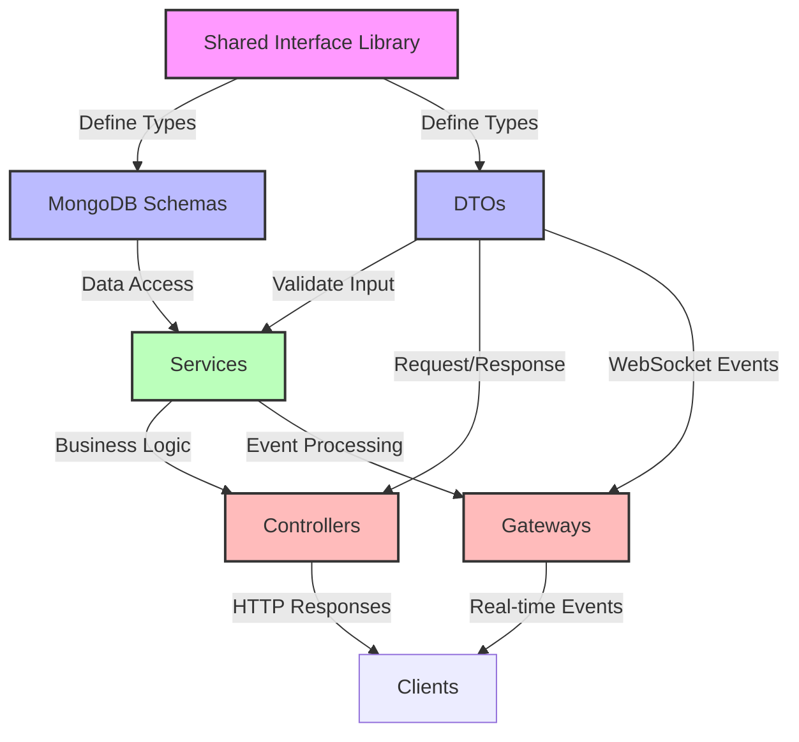

# 🚀 FORGE BOARD PROJECT STATUS UPDATE 🚀

*A product of True North Insights, a division of True North*

*Last Updated: May 19, 2025*

  

    <strong>Category:</strong> Architecture Documentation
  

  

    <strong>Status:</strong> Updated
  

  

    <strong>Implementation:</strong> Strongly Typed Architecture
  

  

    <strong>Action:</strong> Documentation Enhancement
  

This document provides a status update on documentation and architectural enhancements to the ForgeBoard project, focusing on the implementation of the Strongly Typed Service-Gateway-Controller pattern with MongoDB Schema integration.

## Completed Tasks

### 1. Documentation Enhancements

- ✅ Created `strongly-typed-service-pattern.md` - Complete reference for implementing the strongly typed pattern
- ✅ Updated `rxjs-best-practices.md` - Enhanced with more details on preventing infinite loops
- ✅ Enhanced architectural documentation with mermaid diagrams for better visualization
- ✅ Added comprehensive code examples for interface-first design pattern

### 2. Type System Improvements

- ✅ Implemented Shared Interface → MongoDB Schema → DTOs pattern in documentation
- ✅ Fixed LoggerService implementation by properly extending SharedLoggerService
- ✅ Documented proper RxJS patterns to prevent infinite loops between services and gateways
- ✅ Created test examples for MongoDB schema testing with shared interfaces

### 3. Data Flow Improvements

- ✅ Documented loose coupling strategies with event-based communication
- ✅ Added guidance for avoiding tight coupling between services
- ✅ Provided examples of unidirectional data flow to prevent circular dependencies
- ✅ Created documentation for caching strategies to improve performance

## Architecture Pattern Overview

## Key Principles Implemented

The new Strongly Typed Service-Gateway-Controller pattern documentation includes:

1. **Interface-First Design**: All data structures defined in shared interface libraries
2. **MongoDB Schema Integration**: Schemas implement shared interfaces for type consistency
3. **DTO Validation**: Input validation using class-validator decorators
4. **Loose Coupling**: Services communicate through events, not direct references
5. **RxJS Best Practices**: Preventing infinite loops and managing subscriptions
6. **Unidirectional Data Flow**: Clear pathways to prevent circular dependencies
7. **Proper Testing Strategies**: Unit, integration, and E2E testing approaches

## Next Steps

The following tasks should be considered for future implementation:

1. Create ESLint rules to enforce the Strongly Typed pattern
2. Add code generation templates for creating new modules following the pattern
3. Implement automated validation of interfaces and schemas alignment
4. Create developer training materials for onboarding to this architecture

## Documentation Location

The new Strongly Typed Service-Gateway-Controller pattern documentation is available at:
`forgeboard-frontend/src/assets/documentation/strongly-typed-service-pattern.md`

This comprehensive guide includes:
- Architecture overviews
- Implementation guides with code examples
- Problem solutions with anti-pattern examples
- Testing strategies
- Performance considerations
- Common patterns for different entity types

## Conclusion

The ForgeBoard architecture documentation is now enhanced with clear guidance on implementing a strongly typed service-gateway-controller pattern that ensures type safety, prevents common issues like infinite loops, and maintains loose coupling between components. This update aligns with our commitment to maintainable, testable, and scalable code that meets federal security requirements.

---

  

    <strong>ForgeBoard</strong> | A product of True North Insights | <a href="BUSINESS.md">About True North</a>
  

  

    
© 2025 True North. All rights reserved.

    

      <a href="TERMS.md" style="margin-right: 10px;">Terms of Service</a>
      <a href="SECURITY_POLICY.md" style="margin-right: 10px;">Security</a>
      <a href="CONTACT.md">Contact</a>
    

  

