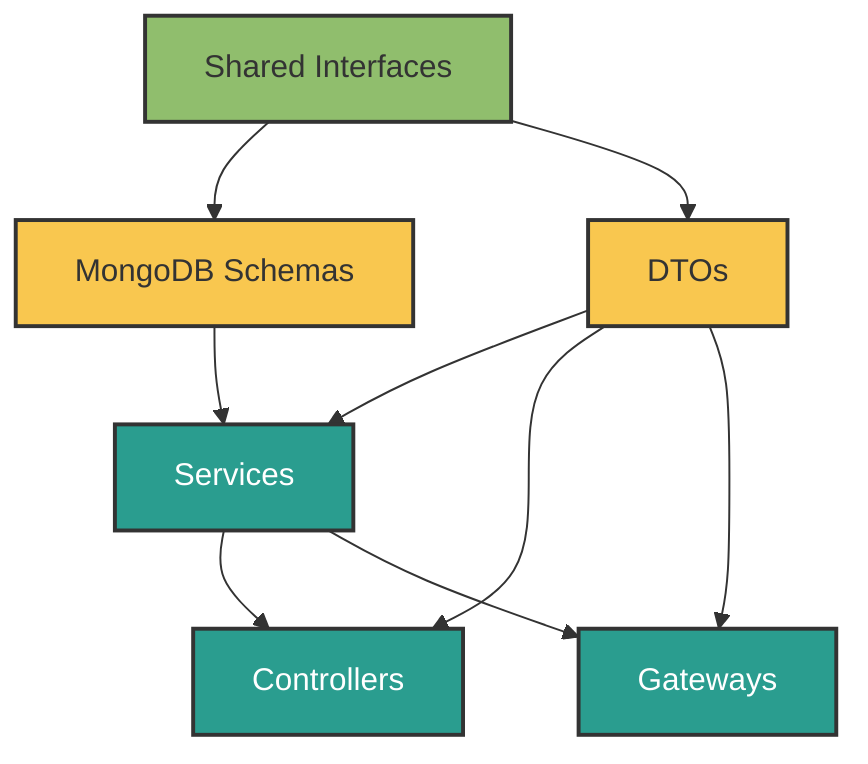

# 🧩 ForgeBoard: Strongly-Typed Service-Gateway-Controller Architecture

> **Note:** This document has been merged into the [Comprehensive Service Architecture Guide](./COMPREHENSIVE-SERVICE-ARCHITECTURE.md). Please refer to that document for the most up-to-date information on the Strongly-Typed Service-Gateway-Controller Architecture in ForgeBoard.

<div style="background: linear-gradient(90deg, #002868 0%, #BF0A30 100%); height: 8px; margin-bottom: 20px;"></div>

*A product of True North Insights, a division of True North*

*Last Updated: May 19, 2025*

<div style="display: flex; flex-wrap: wrap; gap: 10px; margin-bottom: 20px;">
  <div style="background-color: #002868; color: white; padding: 8px 12px; border-radius: 6px; flex: 1; min-width: 150px; box-shadow: 0 2px 4px rgba(0,0,0,0.2);">
    <strong>Category:</strong> Architecture Pattern
  </div>
  <div style="background-color: #BF0A30; color: white; padding: 8px 12px; border-radius: 6px; flex: 1; min-width: 150px; box-shadow: 0 2px 4px rgba(0,0,0,0.2);">
    <strong>Status:</strong> Recommended
  </div>
  <div style="background-color: #F9C74F; color: #333; padding: 8px 12px; border-radius: 6px; flex: 1; min-width: 150px; box-shadow: 0 2px 4px rgba(0,0,0,0.2);">
    <strong>Complexity:</strong> Medium
  </div>
  <div style="background-color: #90BE6D; color: #333; padding: 8px 12px; border-radius: 6px; flex: 1; min-width: 150px; box-shadow: 0 2px 4px rgba(0,0,0,0.2);">
    <strong>FedRAMP:</strong> Compliant
  </div>
</div>

<div style="border-left: 5px solid #B22234; padding-left: 15px; margin: 20px 0; background-color: #F0F4FF; box-shadow: 0 2px 4px rgba(0,0,0,0.1);">
This document outlines the recommended strongly-typed architecture pattern for implementing service, gateway, and controller components in the ForgeBoard ecosystem. This pattern ensures type safety across the entire request/response cycle, prevents infinite loops, and promotes loose coupling between system components.
</div>

## 📋 Table of Contents

1. [Architecture Overview](#architecture-overview)
2. [Type-First Development Approach](#type-first-development-approach)
3. [Component Implementation Guide](#component-implementation-guide)
   - [Shared Interfaces](#shared-interfaces)
   - [MongoDB Schemas](#mongodb-schemas)
   - [DTOs (Data Transfer Objects)](#dtos-data-transfer-objects)
   - [Services Implementation](#services-implementation)
   - [Gateways Implementation](#gateways-implementation)
   - [Controllers Implementation](#controllers-implementation)
4. [RxJS Best Practices](#rxjs-best-practices)
5. [Prevention of Infinite Loops](#prevention-of-infinite-loops)
6. [Testing Strategy](#testing-strategy)
7. [Implementation Example](#implementation-example)

## Architecture Overview

The ForgeBoard Strongly-Typed Service-Gateway-Controller Architecture is built on these key principles:

1. **Type-First Development**: All data structures and communication contracts are defined in shared interface libraries.
2. **Clear Domain Boundaries**: Each feature has well-defined domains with their own interfaces, DTOs, and schemas.
3. **Unidirectional Data Flow**: Data flows in one direction to prevent circular dependencies and infinite loops.
4. **Separation of Concerns**: Each component has a single responsibility within the system.



## Type-First Development Approach

The foundation of this architecture is the "Type-First" development approach:

1. **Define Shared Interfaces**: Create domain-specific interfaces in the shared library that define the structure and behavior of all data.
2. **Generate Type Definitions**: Ensure these interfaces are properly exported from the shared libraries.
3. **Reference Instead of Redefine**: Always import types from shared libraries; never redefine them locally.

### Benefits:

- **Single Source of Truth**: Types are defined once and used everywhere
- **Type Safety**: TypeScript compiler catches inconsistencies early
- **IDE Support**: Excellent tooling support with autocomplete and error detection
- **Documentation**: Types serve as self-documenting code

## Component Implementation Guide

### Shared Interfaces

All interfaces should be defined in the shared library and properly exported:

```typescript
// Example from @forge-board/shared/api-interfaces
export interface MetricsData {
  id: string;
  timestamp: string;
  cpu: number;
  memory: number;
  disk: number;
  network: number;
}

export interface MetricsFilter {
  startDate?: string;
  endDate?: string;
  minCpu?: number;
  maxCpu?: number;
  // ... other filtering options
}

export interface MetricsQueryResponse {
  data: MetricsData[];
  totalCount: number;
  filtered: boolean;
  timestamp: string;
}
```

### MongoDB Schemas

MongoDB schemas should be derived from shared interfaces:

```typescript
import { Prop, Schema, SchemaFactory } from '@nestjs/mongoose';
import { Document } from 'mongoose';
import { MetricsData } from '@forge-board/shared/api-interfaces';

export type MetricsDocument = Metrics & Document;

@Schema({
  timestamps: true,
  toJSON: {
    transform: (_, ret) => {
      delete ret._id;
      delete ret.__v;
      return ret;
    },
  }
})
export class Metrics implements MetricsData {
  @Prop({ required: true })
  id: string;
  
  @Prop({ required: true })
  timestamp: string;
  
  @Prop({ required: true })
  cpu: number;
  
  @Prop({ required: true })
  memory: number;
  
  @Prop({ required: true })
  disk: number;
  
  @Prop({ required: true })
  network: number;
}

export const MetricsSchema = SchemaFactory.createForClass(Metrics);
```

### DTOs (Data Transfer Objects)

DTOs ensure validation and type safety for incoming data:

```typescript
import { IsString, IsNumber, IsISO8601, Min, Max } from 'class-validator';
import { ApiProperty } from '@nestjs/swagger';
import { MetricsData } from '@forge-board/shared/api-interfaces';

export class CreateMetricsDto implements Partial<MetricsData> {
  @ApiProperty({ description: 'CPU usage percentage' })
  @IsNumber()
  @Min(0)
  @Max(100)
  cpu: number;

  @ApiProperty({ description: 'Memory usage percentage' })
  @IsNumber()
  @Min(0)
  @Max(100)
  memory: number;

  @ApiProperty({ description: 'Disk usage percentage' })
  @IsNumber()
  @Min(0)
  @Max(100)
  disk: number;

  @ApiProperty({ description: 'Network usage percentage' })
  @IsNumber()
  @Min(0)
  @Max(100)
  network: number;
}

export class MetricsFilterDto {
  @ApiProperty({ required: false })
  @IsISO8601()
  @IsString()
  startDate?: string;

  @ApiProperty({ required: false })
  @IsISO8601()
  @IsString()
  endDate?: string;
}
```

### Services Implementation

Services handle business logic and data access:

```typescript
import { Injectable } from '@nestjs/common';
import { InjectModel } from '@nestjs/mongoose';
import { Model } from 'mongoose';
import { Observable, from, of } from 'rxjs';
import { map } from 'rxjs/operators';
import { v4 as uuidv4 } from 'uuid';
import { 
  MetricsData, 
  MetricsFilter,
  MetricsQueryResponse 
} from '@forge-board/shared/api-interfaces';
import { Metrics, MetricsDocument } from './schemas/metrics.schema';
import { CreateMetricsDto } from './dto/metrics.dto';

@Injectable()
export class MetricsService {
  constructor(
    @InjectModel(Metrics.name) private metricsModel: Model<MetricsDocument>
  ) {}

  createMetrics(dto: CreateMetricsDto): Observable<MetricsData> {
    const metrics: MetricsData = {
      id: uuidv4(),
      timestamp: new Date().toISOString(),
      ...dto
    };
    
    const newMetrics = new this.metricsModel(metrics);
    return from(newMetrics.save()).pipe(
      map(doc => doc.toJSON() as MetricsData)
    );
  }

  getMetrics(filter?: MetricsFilter): Observable<MetricsQueryResponse> {
    // Build query based on filter
    const query = this.buildQuery(filter);
    
    // Execute query
    return from(this.metricsModel.find(query).exec()).pipe(
      map(docs => ({
        data: docs.map(doc => doc.toJSON() as MetricsData),
        totalCount: docs.length,
        filtered: !!filter && Object.keys(filter).length > 0,
        timestamp: new Date().toISOString()
      }))
    );
  }

  private buildQuery(filter?: MetricsFilter): Record<string, any> {
    if (!filter) return {};
    
    const query: Record<string, any> = {};
    
    // Add date range filter
    if (filter.startDate || filter.endDate) {
      query.timestamp = {};
      if (filter.startDate) {
        query.timestamp.$gte = filter.startDate;
      }
      if (filter.endDate) {
        query.timestamp.$lte = filter.endDate;
      }
    }
    
    // Add other filters
    if (filter.minCpu !== undefined) query.cpu = { $gte: filter.minCpu };
    if (filter.maxCpu !== undefined) query.cpu = { ...query.cpu, $lte: filter.maxCpu };
    
    return query;
  }
}
```

### Gateways Implementation

Gateways handle real-time communication with WebSockets:

```typescript
import { 
  WebSocketGateway, 
  WebSocketServer, 
  SubscribeMessage, 
  MessageBody,
  ConnectedSocket
} from '@nestjs/websockets';
import { Server, Socket } from 'socket.io';
import { UseGuards } from '@nestjs/common';
import { Observable } from 'rxjs';
import { tap } from 'rxjs/operators';
import { WsJwtGuard } from '../auth/guards/ws-jwt.guard';
import { MetricsService } from './metrics.service';
import { 
  MetricsData,
  MetricsFilter,
  MetricsQueryResponse,
  SocketStatusUpdate 
} from '@forge-board/shared/api-interfaces';
import { CreateMetricsDto } from './dto/metrics.dto';

@WebSocketGateway({
  namespace: '/metrics',
  cors: {
    origin: '*',
    methods: ['GET', 'POST']
  }
})
export class MetricsGateway {
  @WebSocketServer() server: Server;
  
  constructor(private readonly metricsService: MetricsService) {}
  
  @UseGuards(WsJwtGuard)
  @SubscribeMessage('submit-metrics')
  handleSubmitMetrics(
    @ConnectedSocket() client: Socket,
    @MessageBody() data: CreateMetricsDto
  ): Observable<SocketStatusUpdate<MetricsData>> {
    return this.metricsService.createMetrics(data).pipe(
      tap(metrics => {
        // Broadcast to all clients except sender
        client.broadcast.emit('metrics-update', {
          status: 'success',
          data: metrics,
          timestamp: new Date().toISOString()
        });
      }),
      map(metrics => ({
        status: 'success',
        data: metrics,
        timestamp: new Date().toISOString()
      }))
    );
  }
  
  @SubscribeMessage('get-metrics')
  handleGetMetrics(
    @MessageBody() filter?: MetricsFilter
  ): Observable<SocketStatusUpdate<MetricsQueryResponse>> {
    return this.metricsService.getMetrics(filter).pipe(
      map(response => ({
        status: 'success',
        data: response,
        timestamp: new Date().toISOString()
      }))
    );
  }
}
```

### Controllers Implementation

Controllers handle REST API endpoints:

```typescript
import { 
  Controller, 
  Get, 
  Post, 
  Body, 
  Query, 
  UseGuards 
} from '@nestjs/common';
import { 
  ApiTags, 
  ApiOperation, 
  ApiResponse, 
  ApiQuery 
} from '@nestjs/swagger';
import { Observable } from 'rxjs';
import { JwtAuthGuard } from '../auth/guards/jwt-auth.guard';
import { MetricsService } from './metrics.service';
import { 
  MetricsData, 
  MetricsQueryResponse 
} from '@forge-board/shared/api-interfaces';
import { CreateMetricsDto, MetricsFilterDto } from './dto/metrics.dto';

@ApiTags('metrics')
@Controller('api/metrics')
export class MetricsController {
  constructor(private readonly metricsService: MetricsService) {}
  
  @Post()
  @UseGuards(JwtAuthGuard)
  @ApiOperation({ summary: 'Submit new metrics data' })
  @ApiResponse({ 
    status: 201, 
    description: 'The metrics have been successfully created.',
    type: MetricsData 
  })
  createMetrics(@Body() createMetricsDto: CreateMetricsDto): Observable<MetricsData> {
    return this.metricsService.createMetrics(createMetricsDto);
  }
  
  @Get()
  @ApiOperation({ summary: 'Get metrics data with optional filtering' })
  @ApiResponse({
    status: 200,
    description: 'Returns filtered metrics data',
    type: MetricsQueryResponse
  })
  getMetrics(@Query() filter: MetricsFilterDto): Observable<MetricsQueryResponse> {
    return this.metricsService.getMetrics(filter);
  }
}
```

## RxJS Best Practices

To avoid potential issues with RxJS streams:

1. **Prefer Cold Observables**: Use `of()` and `from()` instead of subjects when possible
2. **Complete Your Streams**: Ensure observables complete to prevent memory leaks
3. **Unsubscribe When Done**: Always unsubscribe from subscriptions in lifecycle hooks
4. **Use Appropriate Operators**:
   - `switchMap` for cancelling previous requests
   - `mergeMap` for parallel execution
   - `concatMap` for sequential execution

Example of proper unsubscription:

```typescript
@Component({...})
export class MetricsComponent implements OnInit, OnDestroy {
  private destroy$ = new Subject<void>();
  
  ngOnInit() {
    this.metricsService.getMetrics()
      .pipe(takeUntil(this.destroy$))
      .subscribe(metrics => {
        // Process metrics
      });
  }
  
  ngOnDestroy() {
    this.destroy$.next();
    this.destroy$.complete();
  }
}
```

## Prevention of Infinite Loops

To prevent infinite loops in reactive programming:

1. **Avoid Circular Dependencies**: Services should not have circular imports
2. **Use Distinct/DistinctUntilChanged**: Filter out duplicate values 
3. **Implement Guards**: Add conditions to prevent re-emission of the same event
4. **Use Debounce/Throttle**: Limit rapid-fire events
5. **Track Emission State**: Keep track of what has been emitted to prevent re-emission

Example:

```typescript
@Injectable()
export class MetricsGatewayService {
  private lastEmission = new Map<string, unknown>();
  
  emitMetricsUpdate(metrics: MetricsData): void {
    // Create stable hash of the metrics to compare
    const hash = JSON.stringify(metrics);
    
    // Check if this exact data was recently emitted
    if (this.lastEmission.get('metrics-update') !== hash) {
      this.lastEmission.set('metrics-update', hash);
      this.server.emit('metrics-update', {
        status: 'success',
        data: metrics,
        timestamp: new Date().toISOString()
      });
    }
  }
}
```

## Testing Strategy

Each component should have its own unit tests:

1. **Schema Tests**: Validate document creation and validation
2. **DTO Tests**: Verify validation rules work correctly
3. **Service Tests**: Mock the database and test business logic
4. **Gateway Tests**: Mock socket.io clients and verify event handling
5. **Controller Tests**: Use NestJS testing utilities to verify HTTP endpoints
6. **Integration Tests**: Test the full flow from HTTP request through to database operation

## Implementation Example

See the [Metrics Module](../../app/metrics) for a complete implementation of this architecture pattern.

---

<div style="text-align: center; margin-top: 30px; font-style: italic; color: #666;">
ForgeBoard: Defended by Design
</div>
