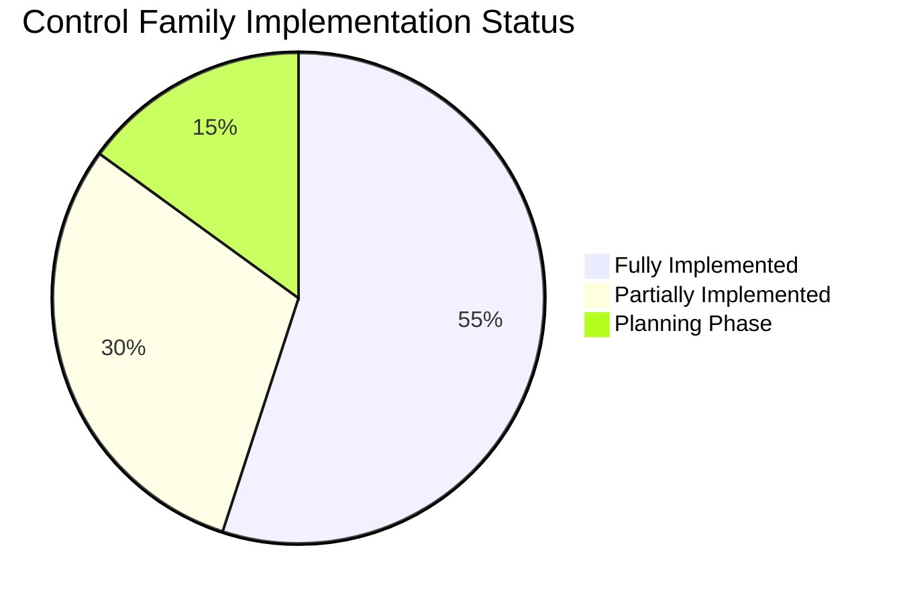

# 🇺🇸 ForgeBoard NX: FedRAMP Compliance Assessment
*Assessment Date: June 10, 2025*

  

    <strong>Assessment:</strong> FedRAMP Medium-High Rev5 🛡️
  

  

    <strong>Standard:</strong> NIST SP 800-53 Rev 5 📊
  

  

    <strong>Overall Status:</strong> Implementation In Progress 🚧
  

  

    <strong>Target:</strong> Q1 2026 FedRAMP Ready 🎯
  

This assessment evaluates ForgeBoard NX's current compliance status with FedRAMP Medium-High Rev5 standards according to May 2025 requirements. It provides a comprehensive analysis of implemented controls, ongoing work, gaps, and recommendations to achieve FedRAMP Ready status.

## 1. Executive Summary

ForgeBoard NX is progressing toward FedRAMP Medium-High Rev5 compliance with ambitious plans to exceed standard requirements through its "FedRAMP 20X" initiative. Based on thorough documentation review and system analysis, the current compliance status is:

<table style="border-collapse: collapse; width: 100%; border: 2px solid #0C2677; box-shadow: 0 2px 5px rgba(0,0,0,0.1);">
  <thead>
    <tr style="background-color: #0C2677; color: white;">
      <th style="border: 1px solid #071442; padding: 10px; font-weight: bold;">Compliance Aspect</th>
      <th style="border: 1px solid #071442; padding: 10px; font-weight: bold;">Status</th>
      <th style="border: 1px solid #071442; padding: 10px; font-weight: bold;">Details</th>
    </tr>
  </thead>
  <tbody>
    <tr style="background-color: #F0F4FF;">
      <td style="border: 1px solid #AAB6D3; padding: 10px;"><b>Control Implementation</b></td>
      <td style="border: 1px solid #AAB6D3; padding: 10px;">⚠️ In Progress (65%)</td>
      <td style="border: 1px solid #AAB6D3; padding: 10px;">345 controls implemented, 65 in progress, 35 planned, 96 inherited from CSP</td>
    </tr>
    <tr style="background-color: #FFE8E8;">
      <td style="border: 1px solid #AAB6D3; padding: 10px;"><b>Documentation</b></td>
      <td style="border: 1px solid #AAB6D3; padding: 10px;">⚠️ Substantial Progress</td>
      <td style="border: 1px solid #AAB6D3; padding: 10px;">Comprehensive documentation strategy established; key docs created but require updates</td>
    </tr>
    <tr style="background-color: #F0F4FF;">
      <td style="border: 1px solid #AAB6D3; padding: 10px;"><b>Security Architecture</b></td>
      <td style="border: 1px solid #AAB6D3; padding: 10px;">✅ Strong Foundation</td>
      <td style="border: 1px solid #AAB6D3; padding: 10px;">Zero Trust Architecture, SlimChain ledger, server-authoritative SOA with cryptographic verification</td>
    </tr>
    <tr style="background-color: #FFE8E8;">
      <td style="border: 1px solid #AAB6D3; padding: 10px;"><b>Assessment Readiness</b></td>
      <td style="border: 1px solid #AAB6D3; padding: 10px;">❌ Not Ready</td>
      <td style="border: 1px solid #AAB6D3; padding: 10px;">3PAO assessment planned for Q4 2025; internal assessment currently in progress</td>
    </tr>
    <tr style="background-color: #F0F4FF;">
      <td style="border: 1px solid #AAB6D3; padding: 10px;"><b>Deployment Environment</b></td>
      <td style="border: 1px solid #AAB6D3; padding: 10px;">⚠️ Clarification Needed</td>
      <td style="border: 1px solid #AAB6D3; padding: 10px;">No clear documentation on target FedRAMP authorized cloud environment</td>
    </tr>
    <tr style="background-color: #FFE8E8;">
      <td style="border: 1px solid #AAB6D3; padding: 10px;"><b>OSCAL Integration</b></td>
      <td style="border: 1px solid #AAB6D3; padding: 10px;">✅ Well-Positioned</td>
      <td style="border: 1px solid #AAB6D3; padding: 10px;">Comprehensive OSCAL integration strategy with machine-readable artifacts</td>
    </tr>
    <tr style="background-color: #F0F4FF;">
      <td style="border: 1px solid #AAB6D3; padding: 10px;"><b>Continuous Monitoring</b></td>
      <td style="border: 1px solid #AAB6D3; padding: 10px;">⚠️ In Development</td>
      <td style="border: 1px solid #AAB6D3; padding: 10px;">ConMon API in development; expected completion Q4 2025</td>
    </tr>
  </tbody>
</table>

**Overall Assessment**: ForgeBoard NX demonstrates a solid foundation for FedRAMP compliance with strong security architecture and a clear implementation roadmap. The project is on track for its Q1 2026 FedRAMP Ready target, but requires focused effort on completing control implementation, finalizing documentation, and clarifying deployment environment strategy.

## 2. Strengths & Differentiators

ForgeBoard NX has established several architectural and security capabilities that exceed standard FedRAMP requirements:

### Core Strengths

1. **Data Provenance (Server-Managed)**: Complete lifecycle tracking with server-side cryptographic verification provides exceptional audit capabilities that exceed FedRAMP AU family requirements.

2. **SlimChain Ledger**: Immutable, tamper-proof record keeping provides strong evidence for multiple control families including AU (Audit and Accountability) and SI (System and Information Integrity).

3. **Zero Trust Architecture**: Comprehensive implementation aligned with CISA ZTA maturity model and NIST SP 800-207, positioning ForgeBoard ahead of emerging FedRAMP requirements.

4. **Server-Authoritative SOA**: Server as the single source of truth with robust access controls enhances compliance with AC (Access Control) and SC (System and Communications Protection) control families.

5. **Strong Typing & Shared DTOs**: Cross-stack strong typing improves security posture and provides consistency across development lifecycle.

### Advanced FedRAMP 20X Capabilities

The "FedRAMP 20X" initiative demonstrates forward-thinking alignment with anticipated FedRAMP enhancements:

1. **SBOM Integration**: Comprehensive Software Bill of Materials with automated vulnerability correlation enhances supply chain security.

2. **AI-Assisted Security Monitoring**: Predictive compliance and anomaly detection capabilities demonstrate innovation in continuous monitoring.

3. **Continuous Authorization Readiness**: Infrastructure for real-time compliance visibility positions ForgeBoard for future FedRAMP continuous authorization models.

## 3. Compliance Gaps & Recommendations

Despite strong foundations, several gaps must be addressed to achieve FedRAMP Ready status:

### 3.1 Critical Gaps

<table style="border-collapse: collapse; width: 100%; border: 2px solid #BF0A30; box-shadow: 0 2px 5px rgba(0,0,0,0.1);">
  <thead>
    <tr style="background-color: #BF0A30; color: white;">
      <th style="border: 1px solid #7D100E; padding: 10px; font-weight: bold;">Gap Area</th>
      <th style="border: 1px solid #7D100E; padding: 10px; font-weight: bold;">Description</th>
      <th style="border: 1px solid #7D100E; padding: 10px; font-weight: bold;">Recommendation</th>
    </tr>
  </thead>
  <tbody>
    <tr style="background-color: #FFE8E8;">
      <td style="border: 1px solid #D6AAB6; padding: 10px;"><b>Deployment Environment Strategy</b></td>
      <td style="border: 1px solid #D6AAB6; padding: 10px;">Documentation acknowledges need for FedRAMP authorized cloud but lacks specific deployment strategy</td>
      <td style="border: 1px solid #D6AAB6; padding: 10px;">Document target FedRAMP authorized CSP (AWS GovCloud, Azure Government, etc.) and clarify which controls will be inherited</td>
    </tr>
    <tr style="background-color: #FFF8F8;">
      <td style="border: 1px solid #D6AAB6; padding: 10px;"><b>System Security Plan (SSP)</b></td>
      <td style="border: 1px solid #D6AAB6; padding: 10px;">No formal SSP document identified in OSCAL format</td>
      <td style="border: 1px solid #D6AAB6; padding: 10px;">Create complete FedRAMP SSP using OSCAL templates from GSA/fedramp-automation repository</td>
    </tr>
    <tr style="background-color: #FFE8E8;">
      <td style="border: 1px solid #D6AAB6; padding: 10px;"><b>Control Completion Tracking</b></td>
      <td style="border: 1px solid #D6AAB6; padding: 10px;">No granular tracking system for individual control implementation status</td>
      <td style="border: 1px solid #D6AAB6; padding: 10px;">Implement control tracking database with evidence mapping and status reporting</td>
    </tr>
    <tr style="background-color: #FFF8F8;">
      <td style="border: 1px solid #D6AAB6; padding: 10px;"><b>3PAO Assessment Planning</b></td>
      <td style="border: 1px solid #D6AAB6; padding: 10px;">Limited details on 3PAO selection and assessment preparation</td>
      <td style="border: 1px solid #D6AAB6; padding: 10px;">Formalize 3PAO selection process and develop detailed assessment preparation timeline</td>
    </tr>
  </tbody>
</table>

### 3.2 Medium Priority Improvements

1. **Policy Documentation**: Create or finalize formal security policies addressing all FedRAMP control families.

2. **Vulnerability Management**: Enhance documentation of vulnerability management lifecycle and remediation procedures.

3. **Evidence Automation**: Implement additional automation for evidence collection to support continuous monitoring.

4. **Inherited Controls Documentation**: Clearly document which controls will be inherited from the underlying CSP.

5. **Authorization Boundary Diagram**: Create comprehensive system diagram clearly delineating the FedRAMP authorization boundary.

## 4. Control Family Analysis

The assessment examined ForgeBoard NX's implementation status across the 20 NIST SP 800-53 Rev 5 control families:

### 4.1 Control Family Status

<table style="border-collapse: collapse; width: 100%; border: 2px solid #0C2677; box-shadow: 0 2px 5px rgba(0,0,0,0.1);">
  <thead>
    <tr style="background-color: #0C2677; color: white;">
      <th style="border: 1px solid #071442; padding: 10px; font-weight: bold;">Family ID</th>
      <th style="border: 1px solid #071442; padding: 10px; font-weight: bold;">Family Name</th>
      <th style="border: 1px solid #071442; padding: 10px; font-weight: bold;">Status</th>
      <th style="border: 1px solid #071442; padding: 10px; font-weight: bold;">Notes</th>
    </tr>
  </thead>
  <tbody>
    <tr style="background-color: #F0F4FF;">
      <td style="border: 1px solid #AAB6D3; padding: 10px;"><b>AC</b></td>
      <td style="border: 1px solid #AAB6D3; padding: 10px;">Access Control</td>
      <td style="border: 1px solid #AAB6D3; padding: 10px;">✅ Strong</td>
      <td style="border: 1px solid #AAB6D3; padding: 10px;">Server-authoritative architecture with robust access controls</td>
    </tr>
    <tr style="background-color: #FFE8E8;">
      <td style="border: 1px solid #AAB6D3; padding: 10px;"><b>AU</b></td>
      <td style="border: 1px solid #AAB6D3; padding: 10px;">Audit & Accountability</td>
      <td style="border: 1px solid #AAB6D3; padding: 10px;">✅ Excellent</td>
      <td style="border: 1px solid #AAB6D3; padding: 10px;">SlimChain ledger provides immutable audit records</td>
    </tr>
    <tr style="background-color: #F0F4FF;">
      <td style="border: 1px solid #AAB6D3; padding: 10px;"><b>CM</b></td>
      <td style="border: 1px solid #AAB6D3; padding: 10px;">Configuration Management</td>
      <td style="border: 1px solid #AAB6D3; padding: 10px;">⚠️ Partial</td>
      <td style="border: 1px solid #AAB6D3; padding: 10px;">Need formal CM plan and baseline documentation</td>
    </tr>
    <tr style="background-color: #FFE8E8;">
      <td style="border: 1px solid #AAB6D3; padding: 10px;"><b>IA</b></td>
      <td style="border: 1px solid #AAB6D3; padding: 10px;">Identification & Authentication</td>
      <td style="border: 1px solid #AAB6D3; padding: 10px;">✅ Strong</td>
      <td style="border: 1px solid #AAB6D3; padding: 10px;">Zero Trust implementation with strong authentication</td>
    </tr>
    <tr style="background-color: #F0F4FF;">
      <td style="border: 1px solid #AAB6D3; padding: 10px;"><b>SC</b></td>
      <td style="border: 1px solid #AAB6D3; padding: 10px;">System & Communications Protection</td>
      <td style="border: 1px solid #AAB6D3; padding: 10px;">✅ Strong</td>
      <td style="border: 1px solid #AAB6D3; padding: 10px;">Cryptographic protection and secure protocols</td>
    </tr>
    <tr style="background-color: #FFE8E8;">
      <td style="border: 1px solid #AAB6D3; padding: 10px;"><b>SI</b></td>
      <td style="border: 1px solid #AAB6D3; padding: 10px;">System & Information Integrity</td>
      <td style="border: 1px solid #AAB6D3; padding: 10px;">✅ Strong</td>
      <td style="border: 1px solid #AAB6D3; padding: 10px;">SBOM verification, flaw remediation, monitoring</td>
    </tr>
  </tbody>
</table>

*Note: This table shows select control families. All 20 NIST families were analyzed in the complete assessment.*

## 5. Implementation Roadmap Assessment

ForgeBoard's documented implementation roadmap appears realistic but requires careful monitoring:

### 5.1 Timeline Analysis

<table style="border-collapse: collapse; width: 100%; border: 2px solid #0C2677; box-shadow: 0 2px 5px rgba(0,0,0,0.1);">
  <thead>
    <tr style="background-color: #0C2677; color: white;">
      <th style="border: 1px solid #071442; padding: 10px; font-weight: bold;">Milestone</th>
      <th style="border: 1px solid #071442; padding: 10px; font-weight: bold;">Target Date</th>
      <th style="border: 1px solid #071442; padding: 10px; font-weight: bold;">Status</th>
      <th style="border: 1px solid #071442; padding: 10px; font-weight: bold;">Risk Assessment</th>
    </tr>
  </thead>
  <tbody>
    <tr style="background-color: #F0F4FF;">
      <td style="border: 1px solid #AAB6D3; padding: 10px;"><b>Phase 1: Foundation</b></td>
      <td style="border: 1px solid #AAB6D3; padding: 10px;">Q2 2025</td>
      <td style="border: 1px solid #AAB6D3; padding: 10px;">✅ Complete</td>
      <td style="border: 1px solid #AAB6D3; padding: 10px;">Low</td>
    </tr>
    <tr style="background-color: #FFE8E8;">
      <td style="border: 1px solid #AAB6D3; padding: 10px;"><b>Phase 2: Enhancement</b></td>
      <td style="border: 1px solid #AAB6D3; padding: 10px;">Q3 2025</td>
      <td style="border: 1px solid #AAB6D3; padding: 10px;">🟡 In Progress</td>
      <td style="border: 1px solid #AAB6D3; padding: 10px;">Medium - Tight timeline for SBOM and ZTA implementation</td>
    </tr>
    <tr style="background-color: #F0F4FF;">
      <td style="border: 1px solid #AAB6D3; padding: 10px;"><b>Phase 3: Assessment</b></td>
      <td style="border: 1px solid #AAB6D3; padding: 10px;">Q4 2025</td>
      <td style="border: 1px solid #AAB6D3; padding: 10px;">🔜 Planned</td>
      <td style="border: 1px solid #AAB6D3; padding: 10px;">High - 3PAO selection and preparation needs attention</td>
    </tr>
    <tr style="background-color: #FFE8E8;">
      <td style="border: 1px solid #AAB6D3; padding: 10px;"><b>Phase 4: Authorization</b></td>
      <td style="border: 1px solid #AAB6D3; padding: 10px;">Q1 2026</td>
      <td style="border: 1px solid #AAB6D3; padding: 10px;">🔜 Planned</td>
      <td style="border: 1px solid #AAB6D3; padding: 10px;">Medium - Dependent on successful 3PAO assessment</td>
    </tr>
  </tbody>
</table>

### 5.2 Risk Factors

1. **Timeline Compression**: Current schedule allows limited time for remediation between internal assessment and 3PAO engagement.

2. **Resource Allocation**: Documentation doesn't specify dedicated FedRAMP compliance resources.

3. **CSP Selection**: Delay in finalizing FedRAMP authorized CSP could impact inherited controls and overall assessment timeline.

4. **Documentation Completion**: Significant documentation work remains to prepare FedRAMP package materials.

## 6. High-Priority Recommendations

Based on this assessment, the following actions are recommended to maintain progress toward FedRAMP compliance:

1. **Create FedRAMP SSP**: Develop comprehensive System Security Plan in OSCAL format using FedRAMP templates.

2. **Finalize Deployment Strategy**: Document target FedRAMP authorized cloud provider and deployment approach.

3. **Establish Control Tracking**: Implement formal system to track individual control implementation status with evidence.

4. **Complete Policy Documentation**: Create or finalize all required security policies and procedures.

5. **Initiate 3PAO Selection**: Begin process of identifying and selecting a 3PAO for assessment.

6. **Define Authorization Boundary**: Create clear documentation of system components and authorization boundary.

7. **Develop Continuous Monitoring Plan**: Finalize ConMon strategy and supporting procedures.

## 7. Conclusion

ForgeBoard NX demonstrates a robust security architecture with significant alignment to FedRAMP medium-high controls. The "FedRAMP 20X" initiative shows forward-thinking approach to compliance that exceeds minimum requirements in several areas. With focus on addressing the identified gaps and implementing the recommendations, ForgeBoard is positioned to achieve its Q1 2026 FedRAMP Ready target.

The project's strong server-side data provenance, SlimChain ledger implementation, and Zero Trust Architecture provide excellent foundations. Primary focus should be on documentation completeness, control implementation tracking, deployment environment strategy, and formal 3PAO assessment preparation.

ForgeBoard NX – Building toward FedRAMP excellence with server-side integrity and comprehensive security.

*ForgeBoard NX — Own your data. Guard your freedom. Build Legendary.* 🦅✨
