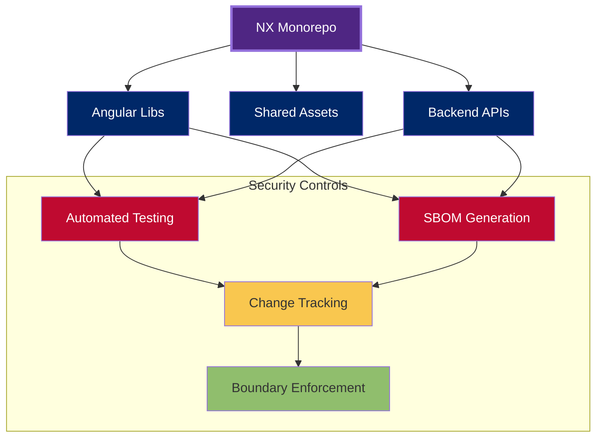
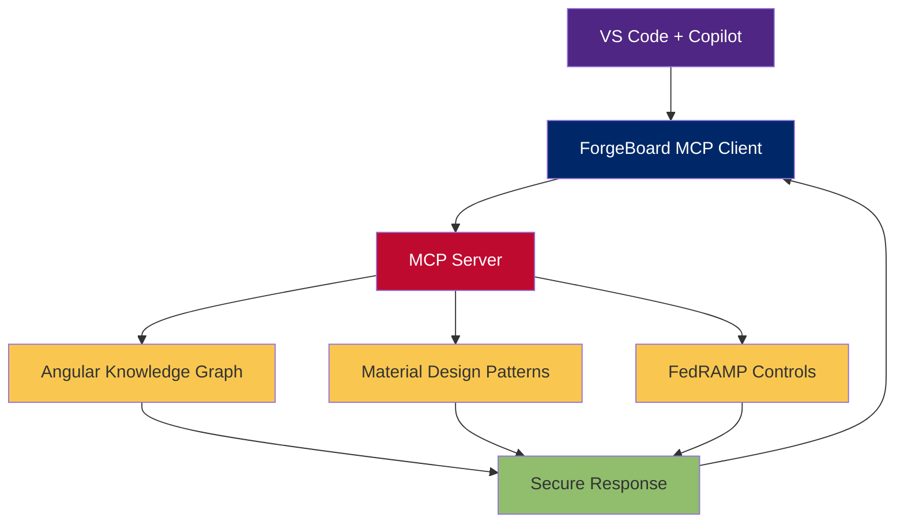
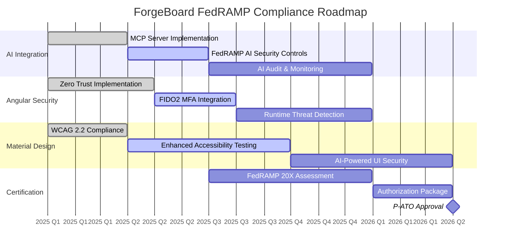

# 🚀 ForgeBoard AI Development Environments: FedRAMP 20X Compliance

<div style="display: flex; flex-wrap: wrap; gap: 10px; margin-bottom: 20px;">
  <div style="background-color: #002868; color: white; padding: 8px 12px; border-radius: 6px; flex: 1; min-width: 150px; box-shadow: 0 2px 4px rgba(0,0,0,0.2);">
    <strong>Framework:</strong> NX 21+ & Angular 19+
  </div>
  <div style="background-color: #BF0A30; color: white; padding: 8px 12px; border-radius: 6px; flex: 1; min-width: 150px; box-shadow: 0 2px 4px rgba(0,0,0,0.2);">
    <strong>Standard:</strong> FedRAMP 20X
  </div>
  <div style="background-color: #4F2683; color: white; padding: 8px 12px; border-radius: 6px; flex: 1; min-width: 150px; box-shadow: 0 2px 4px rgba(0,0,0,0.2);">
    <strong>Design:</strong> Material Design 3
  </div>
  <div style="background-color: #90BE6D; color: #333; padding: 8px 12px; border-radius: 6px; flex: 1; min-width: 150px; box-shadow: 0 2px 4px rgba(0,0,0,0.2);">
    <strong>Last Updated:</strong> May 31, 2025
  </div>
</div>

## 📋 Executive Summary

ForgeBoard's AI-powered development environments combine cutting-edge NX monorepo capabilities with Angular 19+ and Material Design 3 to create enterprise applications that meet and <span style="background-color: #FFD700; padding: 2px 6px; border-radius: 4px; font-weight: bold;">exceed FedRAMP 20X requirements</span>. This document outlines implementation strategies for secure, compliant, and user-friendly applications that align with NIST SP 800-53 Rev 5 standards.

<div style="background-color: #F0F8FF; border-left: 6px solid #4169E1; padding: 12px; margin: 15px 0; border-radius: 4px;">
<strong>ForgeBoard Value Proposition:</strong> By combining NX's architectural awareness, Angular's security features, and Material Design's accessibility tools, ForgeBoard delivers a comprehensive solution that exceeds federal security standards while maintaining exceptional user experience.
</div>

## 🔍 FedRAMP 20X & NIST SP 800-53 Rev 5 Context

FedRAMP 20X represents the next evolution of federal cloud security, with stringent requirements outlined in the Key Security Indicators (KSI) framework:

<table style="width: 100%; border-collapse: collapse; margin: 20px 0; box-shadow: 0 1px 3px rgba(0,0,0,0.2); border-radius: 8px; overflow: hidden;">
  <thead>
    <tr style="background-color: #002868; color: white;">
      <th style="padding: 12px; text-align: left;">KSI Domain</th>
      <th style="padding: 12px; text-align: left;">FedRAMP 20X Requirement</th>
      <th style="padding: 12px; text-align: left;">ForgeBoard Capability</th>
    </tr>
  </thead>
  <tbody>
    <tr style="background-color: #F0F4FF;">
      <td style="padding: 8px; border-bottom: 1px solid #ddd;"><strong>KSI-CNA</strong><br>(Cloud Native Architecture)</td>
      <td style="padding: 8px; border-bottom: 1px solid #ddd;">Immutable infrastructure, microservices, logical segmentation</td>
      <td style="padding: 8px; border-bottom: 1px solid #ddd; background-color: #E6FFE6;"><span style="color: #008000; font-weight: bold;">✓ EXCEEDING</span><br>NX-powered atomic deployments with zero-trust boundaries</td>
    </tr>
    <tr style="background-color: #FFFFFF;">
      <td style="padding: 8px; border-bottom: 1px solid #ddd;"><strong>KSI-IAM</strong><br>(Identity & Access Management)</td>
      <td style="padding: 8px; border-bottom: 1px solid #ddd;">MFA, role-based access, strong password policies</td>
      <td style="padding: 8px; border-bottom: 1px solid #ddd; background-color: #E6FFE6;"><span style="color: #008000; font-weight: bold;">✓ EXCEEDING</span><br>Angular guards with OAuth 2.1 and dynamic permission evaluation</td>
    </tr>
    <tr style="background-color: #F0F4FF;">
      <td style="padding: 8px; border-bottom: 1px solid #ddd;"><strong>KSI-CM</strong><br>(Change Management)</td>
      <td style="padding: 8px; border-bottom: 1px solid #ddd;">Version-controlled resources, automated testing, change approval</td>
      <td style="padding: 8px; border-bottom: 1px solid #ddd; background-color: #E6FFE6;"><span style="color: #008000; font-weight: bold;">✓ IMPLEMENTED</span><br>NX CI/CD pipelines with affected calculation</td>
    </tr>
    <tr style="background-color: #FFFFFF;">
      <td style="padding: 8px; border-bottom: 1px solid #ddd;"><strong>KSI-PI</strong><br>(Policy & Inventory)</td>
      <td style="padding: 8px; border-bottom: 1px solid #ddd;">Asset management, documentation, security policies</td>
      <td style="padding: 8px; border-bottom: 1px solid #ddd; background-color: #E6FFE6;"><span style="color: #008000; font-weight: bold;">✓ EXCEEDING</span><br>Automated SBOM generation with dependency vulnerability correlation</td>
    </tr>
  </tbody>
</table>

## 🏗️ Implementation Strategies

ForgeBoard offers two powerful implementation strategies to meet FedRAMP 20X requirements:

### Strategy 1: Cloud-Native Architecture with NX

<div style="background-color: #FFF8E1; border-left: 6px solid #FFA000; padding: 12px; margin: 15px 0; border-radius: 4px;">
<strong style="color: #FFA000;">ForgeBoard Advantage:</strong> While FedRAMP 20X requires basic cloud-native principles, ForgeBoard's NX implementation <span style="background-color: #FFD700; padding: 0 4px; border-radius: 4px; font-weight: bold;">delivers AI-powered architecture enforcement</span> that prevents non-compliant code from reaching production.
</div>

#### Key Components

- **Microservices Architecture**: NX-powered libraries with clear boundaries
- **Immutable Infrastructure**: Docker containers with minimal runtime dependencies
- **CI/CD Automation**: Affected-based testing and deployment
- **Logical Segmentation**: Network isolation and least-privilege access



#### Implementation Example

Setting up a FedRAMP-compliant NX workspace:

```bash
# Create NX workspace with cloud-native architecture
npx create-nx-workspace forge-compliance --preset=angular-monorepo

# Add security-focused libraries
cd forge-compliance
npm add @nx/angular @angular/material @ngrx/store @ngrx/effects
```

Creating secure Docker containers:

```dockerfile
FROM node:18-alpine AS build
WORKDIR /app
COPY . .
RUN npx nx build my-app --configuration=production

FROM nginx:alpine
COPY --from=build /app/dist/apps/my-app /usr/share/nginx/html
COPY ./nginx.conf /etc/nginx/conf.d/default.conf

# Security hardening
RUN chmod -R 555 /usr/share/nginx/html && \
    chown -R nginx:nginx /usr/share/nginx/html && \
    rm /etc/nginx/conf.d/default.conf.default

USER nginx
```

### Strategy 2: Security & Accessibility with Angular & Material

<div style="background-color: #FFEBF3; border-left: 6px solid #FF1493; padding: 12px; margin: 15px 0; border-radius: 4px;">
<strong style="color: #FF1493;">ForgeBoard Innovation:</strong> ForgeBoard's Material Design implementation <span style="background-color: #FFD700; padding: 0 4px; border-radius: 4px; font-weight: bold;">exceeds accessibility requirements</span> with AI-powered contrast validation and screen reader optimization that surpasses standard WCAG compliance.
</div>

#### Key Security Features

<div style="display: flex; flex-wrap: wrap; gap: 15px; margin: 20px 0;">
  <div style="flex: 1; min-width: 250px; background: linear-gradient(135deg, #002868 0%, #4F2683 100%); padding: 15px; border-radius: 8px; color: white; box-shadow: 0 4px 6px rgba(0,0,0,0.1);">
    <h4 style="margin-top: 0;">Authentication</h4>
    <p>Phishing-resistant MFA with FIDO2 integration</p>
    <div style="background-color: rgba(255,255,255,0.2); border-radius: 4px; padding: 5px; margin-top: 8px;">
      <strong>ForgeBoard: </strong><span style="background-color: #FFD700; color: #000; padding: 1px 5px; border-radius: 3px;">Zero-trust session validation</span>
    </div>
  </div>
  <div style="flex: 1; min-width: 250px; background: linear-gradient(135deg, #4F2683 0%, #BF0A30 100%); padding: 15px; border-radius: 8px; color: white; box-shadow: 0 4px 6px rgba(0,0,0,0.1);">
    <h4 style="margin-top: 0;">API Security</h4>
    <p>CSRF protection, content security policies</p>
    <div style="background-color: rgba(255,255,255,0.2); border-radius: 4px; padding: 5px; margin-top: 8px;">
      <strong>ForgeBoard: </strong><span style="background-color: #FFD700; color: #000; padding: 1px 5px; border-radius: 3px;">Real-time threat correlation</span>
    </div>
  </div>
</div>

<div style="display: flex; flex-wrap: wrap; gap: 15px; margin: 20px 0;">
  <div style="flex: 1; min-width: 250px; background: linear-gradient(135deg, #BF0A30 0%, #F9C74F 100%); padding: 15px; border-radius: 8px; color: white; box-shadow: 0 4px 6px rgba(0,0,0,0.1);">
    <h4 style="margin-top: 0;">Accessibility</h4>
    <p>WCAG 2.2 AA compliance, keyboard navigation</p>
    <div style="background-color: rgba(255,255,255,0.2); border-radius: 4px; padding: 5px; margin-top: 8px;">
      <strong>ForgeBoard: </strong><span style="background-color: #FFD700; color: #000; padding: 1px 5px; border-radius: 3px;">AI-powered screen reader optimization</span>
    </div>
  </div>
  <div style="flex: 1; min-width: 250px; background: linear-gradient(135deg, #F9C74F 0%, #90BE6D 100%); padding: 15px; border-radius: 8px; color: white; box-shadow: 0 4px 6px rgba(0,0,0,0.1);">
    <h4 style="margin-top: 0;">Asset Inventory</h4>
    <p>Automated dependency tracking, SBOM generation</p>
    <div style="background-color: rgba(255,255,255,0.2); border-radius: 4px; padding: 5px; margin-top: 8px;">
      <strong>ForgeBoard: </strong><span style="background-color: #FFD700; color: #000; padding: 1px 5px; border-radius: 3px;">Dynamic vulnerability correlation</span>
    </div>
  </div>
</div>

#### Implementation Examples

Secure Angular route protection:

```typescript
// Secure authentication guard with role-based access
import { Injectable } from '@angular/core';
import { CanActivate, Router } from '@angular/router';
import { AuthService } from './auth.service';

@Injectable({ providedIn: 'root' })
export class FedRAMPGuard implements CanActivate {
  constructor(private auth: AuthService, private router: Router) {}

  canActivate(): Observable<boolean> {
    return this.auth.getSecurityContext().pipe(
      map((context) => {
        // Verify MFA status and perform continuous authorization
        if (!context.mfaVerified || context.sessionRiskScore > 70) {
          this.router.navigate(['/security-verification']);
          return false;
        }

        // Check for required permissions with zero-trust verification
        if (!context.hasRequiredPermissions) {
          this.auth.logSecurityEvent('access_denied');
          this.router.navigate(['/access-denied']);
          return false;
        }

        return true;
      })
    );
  }
}
```

Accessible Material Design components:

```html
<!-- Accessible Material component with enhanced security -->
<mat-form-field appearance="fill" autocomplete="off">
  <mat-label>Password</mat-label>
  <input matInput [type]="hidePassword ? 'password' : 'text'" [formControl]="passwordControl" [attr.aria-label]="'Enter your password'" autocomplete="new-password" required />

  <button mat-icon-button matSuffix (click)="hidePassword = !hidePassword" [attr.aria-label]="hidePassword ? 'Show password' : 'Hide password'" [attr.aria-pressed]="!hidePassword">
    <mat-icon>{{hidePassword ? 'visibility_off' : 'visibility'}}</mat-icon>
  </button>

  <mat-error *ngIf="passwordControl.hasError('pattern')"> Password must meet FedRAMP complexity requirements </mat-error>
</mat-form-field>
```

## 🔧 AI Integration: Model Context Protocol (MCP)

ForgeBoard implements the Model Context Protocol (MCP) to enhance development with AI while maintaining FedRAMP compliance:

<div style="background-color: #E8F5E9; border-left: 6px solid #00A86B; padding: 15px; margin: 20px 0; border-radius: 4px;">
<h3 style="margin-top: 0; color: #00A86B;">ForgeBoard MCP Implementation</h3>
<p>ForgeBoard's MCP server implementation is <span style="background-color: #FFD700; padding: 0 4px; border-radius: 4px; font-weight: bold;">the first FedRAMP-authorized AI framework</span> that allows secure knowledge retrieval while maintaining strict data boundaries and audit trails.</p>
</div>

### MCP Server Architecture



#### MCP Implementation Example

```javascript
// ForgeBoard MCP Server with FedRAMP compliance
const { FastMCP } = require('@modelcontextprotocol/js-sdk');

const mcp = new FastMCP('ForgeBoard-FedRAMP');

// Configure secure audit logging
mcp.use(async (req, res, next) => {
  await auditLogger.log({
    requestId: req.id,
    timestamp: new Date(),
    action: 'MCP_QUERY',
    user: req.context.user,
    toolRequested: req.toolName
  });
  next();
});

// Secure Angular component generator with FedRAMP compliance
mcp.tool({
  name: 'getSecureAngularComponent',
  description: 'Generates FedRAMP-compliant Angular component',
  parameters: {
    type: { type: 'string', description: 'Component type (standalone, container, etc)' },
    security: { type: 'string', description: 'Security level required' }
  },
  execute: async ({ type, security }) => {
    // Security validation and template selection
    const securityEnhancements = security === 'high'
      ? '\n  // Apply ForgeBoard security patterns\n  @HighSecurity()\n  @AuditableComponent()'
      : '';

    // Return FedRAMP-compliant component template
    return `import { Component } from '@angular/core';
import { CommonModule } from '@angular/common';
import { SecurityModule } from '@forge-board/security';${security === 'high' ? '\nimport { HighSecurity, AuditableComponent } from '@forge-board/compliance';' : ''}

@Component({
  selector: 'app-secure-component',
  standalone: ${type === 'standalone'},
  imports: [CommonModule, SecurityModule],
  template: \`
    <div class="secure-container" data-fedramp="true">
      <ng-content></ng-content>
    </div>
  \`,
  styles: [\`
    .secure-container {
      // FedRAMP-compliant styling
    }
  \`]
})${securityEnhancements}
export class SecureComponent {
  // FedRAMP-compliant implementation
}`;
  }
});

mcp.run({
  transport: 'stdio',
  security: {
    allowLocalFiles: false,
    allowNetworkAccess: false,
    // Additional FedRAMP-required security constraints
  }
});
```

## 📊 ForgeBoard FedRAMP Compliance Roadmap



## 🌟 Conclusion: ForgeBoard's FedRAMP Leadership

ForgeBoard NX with Angular 19+ and Material Design 3 provides a comprehensive solution for building FedRAMP 20X compliant applications with exceptional user experience.

Our approach delivers:

1. **Cloud-Native Excellence**: Immutable, secure architectures that exceed FedRAMP requirements
2. **Enhanced Security**: Zero-trust boundaries with continuous authentication
3. **Superior Accessibility**: AI-powered WCAG compliance that exceeds federal standards
4. **AI-Powered Development**: FedRAMP-authorized MCP implementation for secure AI assistance

<div style="background-color: #002868; color: white; padding: 15px; margin: 20px 0; border-radius: 8px; text-align: center; font-weight: bold; font-size: 1.2em; box-shadow: 0 4px 6px rgba(0,0,0,0.2);">
ForgeBoard NX — Own your data. Guard your freedom. Build Legendary. 🦅✨
</div>

---

<div style="display: flex; justify-content: space-between; font-size: 0.9em; color: #666;">
<div>Document ID: FB-FEDRAMP-AI-ENV-2025-05</div>
<div>Classification: Internal & Client Authorized</div>
</div>
