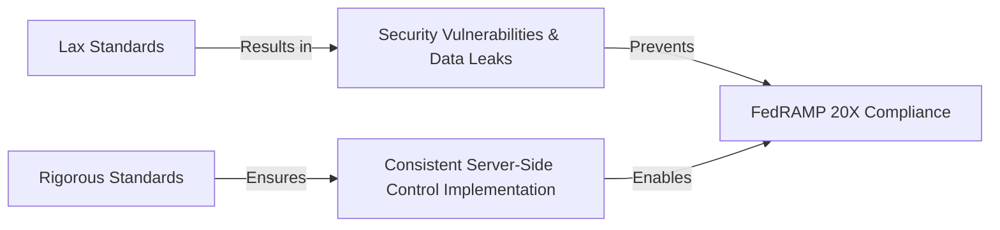

# ForgeBoard NX: The Philosophy Behind Our Rigorous Coding Standards

*Last Updated: May 7, 2025*

<div style="display: flex; flex-wrap: wrap; gap: 10px; margin-bottom: 20px;">
  <div style="background-color: #002868; color: white; padding: 8px 12px; border-radius: 6px; flex: 1; min-width: 150px; box-shadow: 0 2px 4px rgba(0,0,0,0.2);">
    <strong>Standards:</strong> Non-Negotiable ✓
  </div>
  <div style="background-color: #BF0A30; color: white; padding: 8px 12px; border-radius: 6px; flex: 1; min-width: 150px; box-shadow: 0 2px 4px rgba(0,0,0,0.2);">
    <strong>Compliance:</strong> FedRAMP 20X 🔒
  </div>
  <div style="background-color: #F9C74F; color: #333; padding: 8px 12px; border-radius: 6px; flex: 1; min-width: 150px; box-shadow: 0 2px 4px rgba(0,0,0,0.2);">
    <strong>Architecture:</strong> Server-Authoritative 🛡️
  </div>
  <div style="background-color: #90BE6D; color: #333; padding: 8px 12px; border-radius: 6px; flex: 1; min-width: 150px; box-shadow: 0 2px 4px rgba(0,0,0,0.2);">
    <strong>Purpose:</strong> Data Integrity & Security 🛡️
  </div>
</div>

## Why Our Coding Standards Are Necessarily Rigorous

At first glance, ForgeBoard NX's coding standards may appear unusually strict or "draconian." However, these standards aren't arbitrary restrictions—they are the essential foundation that enables us to meet our extraordinary commitments to **server-managed data integrity**, **security compliance (FedRAMP 20X)**, and **robust server-authoritative architecture**.

### 1. FedRAMP 20X Compliance Demands Precision



ForgeBoard operates in environments where compliance isn't optional—it's mandatory. The FedRAMP 20X framework (released July 2025) introduces the most stringent security requirements yet for federal cloud systems:

- Our coding patterns must create **verifiable server-side security controls** that map directly to NIST SP 800-53 Rev 5 requirements.
- The **server-managed blockchain-based auditing** requires specific persistence patterns that ensure data integrity and non-repudiation.
- **SBOM (Software Bill of Materials)** generation for server components demands consistent, traceable code structures.
- **Zero Trust Architecture** principles must be embedded in every data access pattern, authenticated and authorized by the server.

These aren't merely "best practices"—they're legal requirements with potential penalties for non-compliance.

### 2. Robust Server-Authoritative Architecture Requires Discipline

<div style="border-left: 5px solid #BF0A30; padding-left: 15px; margin: 20px 0; background-color: #F0F4FF; box-shadow: 0 2px 4px rgba(0,0,0,0.1);">
ForgeBoard NX implements a <b>server-authoritative architecture</b> where the server is the ultimate source of truth and control for all data. This model ensures data integrity, consistent application of business rules, and centralized security enforcement, which requires rigorously consistent patterns.
</div>

Our server-authoritative approach delivers critical benefits:

- Centralized data ownership and control.
- Consistent application of security policies.
- Reliable data synchronization and conflict resolution managed by the server.
- Cryptographically verifiable audit trails maintained on the server.

However, these benefits come with architectural constraints that cannot be compromised:

- **Server-Side State Management**: Enforcing immutable state management on the server prevents data corruption and ensures reliable history.
- **Controlled Data Exposure**: Clients receive data only through authorized API endpoints, ensuring policies are enforced.
- **Secure Communication Protocols**: Our connection strategies must follow explicit patterns to maintain security during client-server interactions.
- **Server-Side Blockchain Persistence**: Data integrity depends on consistent hashing and signing patterns managed by the server.

### 3. Security at the Core, Not as an Afterthought

```mermaid
flowchart TD
  subgraph Traditional [Traditional Development]
    direction TB
    TD1[Write Feature Code] --> TD2[Basic Testing]
    TD2 --> TD3[Security Review]
    TD3 -->|"Find Issues"| TD4[Rework Code]
    TD4 --> TD5[Deploy with Compromises]
  end
  
  subgraph ForgeBoard [ForgeBoard Development]
    direction TB
    FB1[Server-Side Security Patterns First] --> FB2[Feature Implementation]
    FB2 --> FB3[Automated Security Validation (Server & Client)]
    FB3 -->|"Pass"| FB4[Verified Deployment]
    FB3 -->|"Fail"| FB1
  end

  classDef traditional fill:#FFEBEE,stroke:#C62828,stroke-width:2px;
  classDef forgeboard fill:#E8F5E9,stroke:#2E7D32,stroke-width:2px;
  
  class TD1,TD2,TD3,TD4,TD5 traditional;
  class FB1,FB2,FB3,FB4 forgeboard;
```

In ForgeBoard NX, security isn't a layer added later—it's the fundamental architecture, centered around server control:

- **Shared DTOs**: Our strict typing system means data validation happens consistently, with the server as the final arbiter.
- **RxJS Patterns**: Required cleanup and error handling in client-server communication prevents issues.
- **Server-Side Persistence Operators**: Standardized blockchain operations on the server ensure tamper-evident audit trails.
- **Presentation Components**: UI patterns that separate smart vs. dumb components prevent accidental client-side data manipulation that could bypass server controls.

### 4. Maintainability at Scale Requires Consistency

ForgeBoard NX is designed for large, distributed teams working on critical infrastructure. The rigid standards create an environment where:

- New developers can quickly understand server-side code patterns regardless of which team wrote them.
- Automated testing can rely on consistent API contracts and server behaviors.
- Security scanning tools can validate compliance across the entire server codebase.
- Cross-team collaboration works seamlessly due to well-defined server interfaces.

### 5. Our Patriotic Mission and Visual Identity

<table style="border-collapse: collapse; width: 100%; border: 2px solid #0C2677; box-shadow: 0 2px 5px rgba(0,0,0,0.1);">
  <thead>
    <tr style="background-color: #0C2677; color: white;">
      <th style="border: 1px solid #071442; padding: 10px; font-weight: bold;">Color</th>
      <th style="border: 1px solid #071442; padding: 10px; font-weight: bold;">Hex Code</th>
      <th style="border: 1px solid #071442; padding: 10px; font-weight: bold;">Represents</th>
    </tr>
  </thead>
  <tbody>
    <tr style="background-color: #F0F4FF;">
      <td style="border: 1px solid #AAB6D3; padding: 10px;"><b>Deep Blue</b></td>
      <td style="border: 1px solid #AAB6D3; padding: 10px; font-family: monospace;">#002868</td>
      <td style="border: 1px solid #AAB6D3; padding: 10px;">Data sovereignty, trust, and stability</td>
    </tr>
    <tr style="background-color: #FFE8E8;">
      <td style="border: 1px solid #AAB6D3; padding: 10px;"><b>Vibrant Red</b></td>
      <td style="border: 1px solid #AAB6D3; padding: 10px; font-family: monospace;">#BF0A30</td>
      <td style="border: 1px solid #AAB6D3; padding: 10px;">Strength, security, and immutable blockchain</td>
    </tr>
    <tr style="background-color: #F0F4FF;">
      <td style="border: 1px solid #AAB6D3; padding: 10px;"><b>Clean White</b></td>
      <td style="border: 1px solid #AAB6D3; padding: 10px; font-family: monospace;">#FFFFFF</td>
      <td style="border: 1px solid #AAB6D3; padding: 10px;">Transparency, clarity, and integrity</td>
    </tr>
    <tr style="background-color: #FFE8E8;">
      <td style="border: 1px solid #AAB6D3; padding: 10px;"><b>Gold Accent</b></td>
      <td style="border: 1px solid #AAB6D3; padding: 10px; font-family: monospace;">#F9C74F</td>
      <td style="border: 1px solid #AAB6D3; padding: 10px;">Value, excellence, and highlighted actions</td>
    </tr>
    <tr style="background-color: #F0F4FF;">
      <td style="border: 1px solid #AAB6D3; padding: 10px;"><b>Victory Green</b></td>
      <td style="border: 1px solid #AAB6D3; padding: 10px; font-family: monospace;">#90BE6D</td>
      <td style="border: 1px solid #AAB6D3; padding: 10px;">Success, achievement, and positive status</td>
    </tr>
  </tbody>
</table>

Our patriotic color scheme isn't just aesthetic—it reflects our mission to restore data sovereignty to American enterprises and government agencies. Our visual identity reinforces this mission across all UI elements, documentation, and code comments.

## Embracing the Standards

Rather than viewing these standards as restrictions, we encourage developers to see them as the framework that enables ForgeBoard NX to deliver its revolutionary capabilities. When you follow these patterns, you're not just writing code—you're:

- Ensuring FedRAMP 20X compliance for critical systems
- Protecting sensitive government data from unauthorized access
- Delivering true data sovereignty to organizations
- Building a system that respects user freedom and privacy
- Contributing to a more secure, sovereign digital infrastructure

## Tools to Help You Succeed

We provide comprehensive tooling to help developers meet these standards:

- **ESLint Rules**: Custom rules that enforce security patterns automatically
- **Code Generators**: NX generators that scaffold components following our patterns
- **CI/CD Validation**: Pipeline checks that prevent non-compliant code from merging
- **Documentation**: Extensive examples and explanations of each pattern
- **Pair Programming**: Regular sessions with security architects

## Conclusion

Our coding standards aren't rigid for rigidity's sake—they're precise because the mission demands precision. When federal systems, sensitive data, and data integrity are at stake, "good enough" simply isn't good enough. 

These standards are the foundation that allows ForgeBoard NX to deliver its revolutionary promise: a fully-compliant, server-authoritative, cryptographically secure platform that ensures data integrity and controlled access.

*ForgeBoard NX — Secure Data, Server-Guarded. Build Legendary.* 🦅✨

