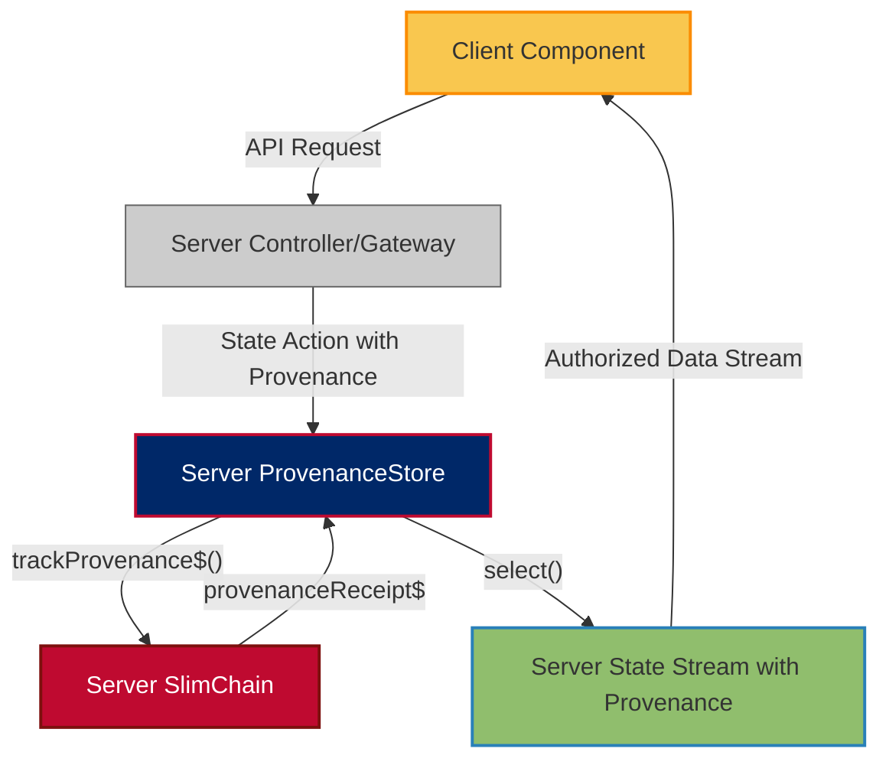
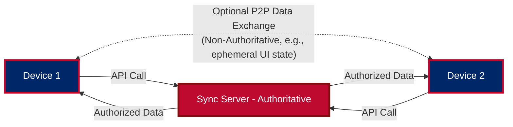
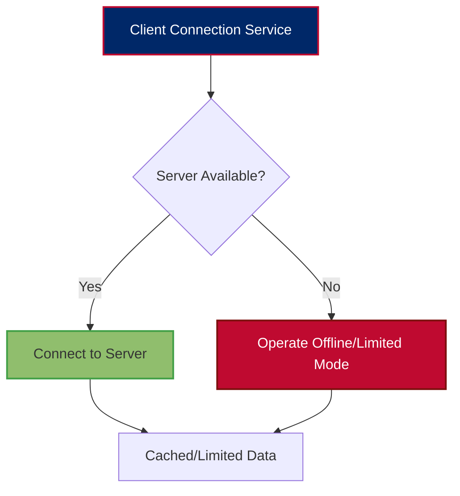
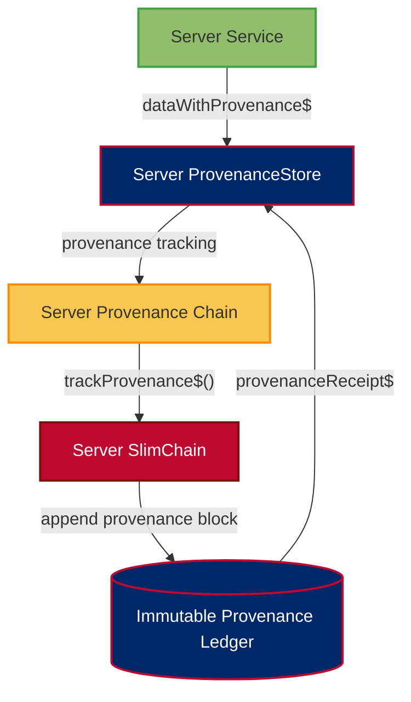
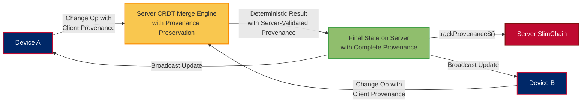
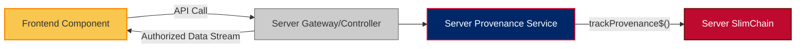

# 👨‍💻 ForgeBoard NX Coding Standards

*Last Updated: May 15, 2025*

<div style="display: flex; flex-wrap: wrap; gap: 10px; margin-bottom: 20px;">
  <div style="background-color: #002868; color: white; padding: 8px 12px; border-radius: 6px; flex: 1; min-width: 150px; box-shadow: 0 2px 4px rgba(0,0,0,0.2);">
    <strong>Code:</strong> TypeScript ✨
  </div>
  <div style="background-color: #BF0A30; color: white; padding: 8px 12px; border-radius: 6px; flex: 1; min-width: 150px; box-shadow: 0 2px 4px rgba(0,0,0,0.2);">
    <strong>Architecture:</strong> Server-Authoritative 🛡️
  </div>
  <div style="background-color: #F9C74F; color: #333; padding: 8px 12px; border-radius: 6px; flex: 1; min-width: 150px; box-shadow: 0 2px 4px rgba(0,0,0,0.2);">
    <strong>Standard:</strong> SonarQube A+ 🥇
  </div>
  <div style="background-color: #90BE6D; color: #333; padding: 8px 12px; border-radius: 6px; flex: 1; min-width: 150px; box-shadow: 0 2px 4px rgba(0,0,0,0.2);">
    <strong>Data Provenance:</strong> Server-Managed & Complete 🔄
  </div>
</div>

## Data Provenance Patterns (Server-Managed)

### Complete Lifecycle Tracking (Server-Side)

```mermaid
flowchart TD
  Origin[Data Origin Point (Server Input/Event)]:::inception --> Query[Server-Side Query/Processing]
  Query --> Response[Data Response Generation (Server)]
  Response --> Verify[Data Verification (Server)]
  Verify --> Store[Data Storage (Server DB & SlimChain)]
  Store --> Process[Further Data Processing (Server)]
  Process --> ClientExposure[Authorized Exposure to Client]
  ClientExposure --> Dispose[Verified Disposal (Server-Side)]
  
  classDef inception fill:#002868,stroke:#071442,color:#fff,stroke-width:2px;
  classDef disposal fill:#BF0A30,stroke:#7D100E,color:#fff,stroke-width:2px;
```

- **Data Provenance Principle**: Every data element must have a complete, verifiable lifecycle, managed by the server.
- **Lifecycle Transitions**: All state changes must include server-managed provenance metadata.
- **Verification Requirements**: Every data transition must be cryptographically verifiable on the server.
- **Attribution**: All data operations must have clear, non-repudiable attribution, logged by the server.

### Required Provenance Operators (Server-Side Focus)

- **`trackProvenance()` (Server Method)**: Capture complete data provenance for all server-side data operations.
- **`verifyProvenance()` (Server Method)**: Verify the integrity of provenance chains stored on the server.
- **`transitionStage()` (Server Method)**: Move data to next lifecycle stage with appropriate metadata on the server.
- **`generateProvenanceReport()` (Server Method)**: Create audit-ready provenance documentation from server records.

## Server-Authoritative Architecture

### Server-Side ProvenanceStore & Data Authority



- **Server-Authoritative Principle**: The server is the single source of authority (SOA) for all data and its provenance.
- **Store Pattern (Server-Side)**: Use a server-side ProvenanceStore for immutable state with complete provenance history.
- **Blockchain Integration (Server-Side)**: Persist provenance chains to SlimChain on the server for verification.
- **Provenance Requirements**: All state transitions must include complete server-managed provenance metadata.

---

## WebRTC Mesh & Fallback Patterns (If P2P is for data exchange, not authority)

### Data Flow: Server-Relay First or P2P for non-authoritative data



- **Server Authoritative**: All authoritative data and state changes are managed by the server.
- **Optional P2P**: WebRTC might be used for direct client-to-client communication for ephemeral data or specific features, but not for authoritative state changes without server validation.
- **Offline Operation**: Client operates in a read-only or limited mode if offline, syncing with the server when connectivity is restored.

### Server-Centric Connection Strategy



---

## Blockchain Persistence Patterns (Server-Side)

### SlimChain Integration for Provenance (Server-Managed)



### Required Provenance Operators (Server-Side)

- **`trackProvenance$()`**: Capture and verify data origin, transitions, and handling on the server.
- **`verifyProvenanceChain$()`**: Verify complete data lineage against server-side blockchain records.
- **`provenanceMerkleProof$()`**: Generate cryptographic proof for provenance validation from server data.
- **`provenanceRetention$()`**: Apply configurable retention policies with disposal verification on server-stored provenance.

### Storage Efficiency Guidelines (Server-Side)

1. **Provenance Delta Compression**: Only store provenance transitions, not full state, on the server.
2. **Pruning Strategy**: Implement configurable lifecycle-based pruning on server-side provenance.
3. **Zstd Compression**: Apply level 3 compression to all server-side provenance data.
4. **Retention Policies**: Define and enforce retention policies for server-stored provenance.

---

## CRDT Synchronization Patterns (Server-Mediated)

### Conflict Resolution with Server-Managed Provenance Preservation



### Required CRDT Types

| Data Type | CRDT Implementation | Use Case |
|-----------|---------------------|----------|
| Text | Yjs Text | Collaborative text fields |
| Maps | Yjs Map | Object properties, settings |
| Arrays | Yjs Array | Lists, collections |
| Counters | Yjs Number | Metrics, statistics |
| Custom | Custom CRDT | Domain-specific types |

---

## RxJS Guidelines

- Always clean up subscriptions (`ngOnDestroy`, `takeUntil`).
- Use `catchError`, `retry`, and `finalize` for robust error handling.
- Prefer `BehaviorSubject` for state with a current value, `Subject` for event streams.

---

## CSS/SCSS Standards

- **BEM-inspired naming** for all classes.
- **Color variables** for consistency and theme support.
- **Mobile-first** responsive design.

---

## Testing Guidelines

- **Component tests**: Use Angular TestBed, mock services, and DOM queries.
- **Service tests**: Use HttpClientTestingModule, test Observables and error handling.
- **E2E tests**: Use Playwright or Cypress for real user flows.

---

## Documentation & Git Workflow

- All public classes, interfaces, and services must have JSDoc comments.
- Use clear, descriptive commit messages:
  - `feat(scope): Add new feature`
  - `fix(scope): Fix bug`
  - `docs(scope): Update documentation`
- Branch naming: `feature/`, `bugfix/`, `chore/` prefixes.

---

## Summary Diagram: Data Provenance Flow (Server-Authoritative)



---

For more details, see our comprehensive documentation:
- [Server-Side Data Provenance](./SERVER-SIDE-DATA-PROVENANCE.md) (New or Updated Doc Needed)
- [Blockchain Persistence Architecture](./BLOCKCHAIN-PERSISTENT-ARCHITECTURE.md) (Ensure server-focus)
- [API Documentation](./API-DOCUMENTATION.md)
- [Frontend-API Architecture](./FRONTEND-API-ARCHITECTURE.md)

*ForgeBoard NX — Secure Data, Server-Guarded. Build Legendary.* 🦅✨
